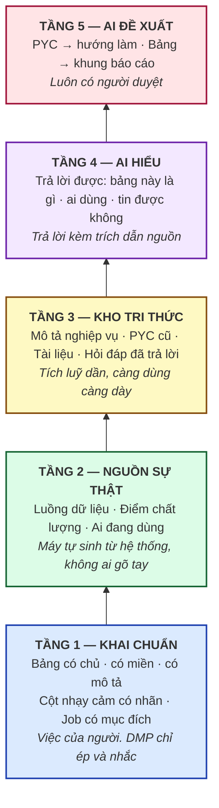
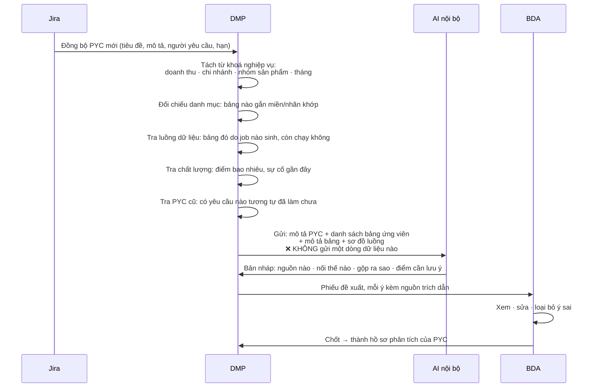
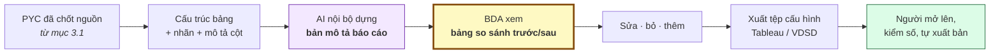
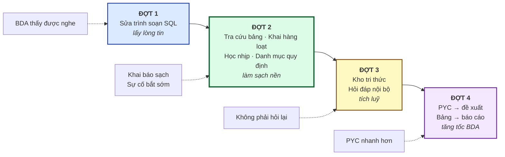

# DMP — AI làm được gì, không nên làm gì, và bắt đầu từ đâu

> **Ngày lập:** 13/08/2026 · **Người lập:** Khôi (BA) · **Trạng thái:** bản thảo để trao đổi nội bộ
>
> Tài liệu này trả lời bốn câu đang vướng:
> 1. Tính năng AI nào **nâng cấp được** trên SQLWF, tính năng nào **không nên làm**?
> 2. Ràng buộc *"AI không được đọc dữ liệu thật"* thì còn làm được gì?
> 3. Thứ tự làm — **bắt đầu từ đâu** để không rơi vào cảnh làm một năm mới thấy kết quả?
> 4. Tool **BDAI** của team BDA có gì, đưa lên SQLWF thì hơn ở chỗ nào?
>
> Ba tài liệu liên quan: [Kiến trúc chốt 27 menu](DMP-Kien-truc-CHOT.md) · [Đặc tả chức năng](DMP-Dac-ta-Chuc-nang-v1.md) · [Danh mục 43 tính năng](DMP-Danh-muc-Tinh-nang-De-xuat.md)

---

## Phần 0 — Ba phát hiện khi đọc lại mã nguồn

Trước khi bàn nên làm gì, ba sự thật này thay đổi cách đặt vấn đề.

### ⭐ Phát hiện 1 — SQLWF **đã có** kênh AI nội bộ đang chạy

Không phải bắt đầu từ số không. Trong mã nguồn đã có sẵn:

| Thành phần | Vai trò |
|---|---|
| `TuningRabbitConfig` | Hàng đợi `sqlwf.sql.tuning.request.queue` gửi yêu cầu sang **AI service**, sàn `sqlwf.sql.tuning.notification.exchange` nhận kết quả về |
| `CommandInfo` | Gói tin gửi đi: `requestId` · `username` · `ip` · `command` · **`content`** |
| `TuningResult` | Gói tin nhận về: `identifiedIssues` · `optimalContent` · `optimizedSql` · `description` · `duration` |
| `TuningStatus` | `NONE → PROCESSING → TUNED_PENDING_APPLY → CLOSED` (+ `FAILED` / `CANCELLED`) |
| `StepsUpdateSource` | Ghi rõ bản sửa đến từ `USER` hay `AI_TUNING` |
| Màn `job-tuning-review` · `job-tuning-confirm` · `sql-tuning-confirm` | Người xem đề xuất của AI → so sánh → chấp nhận hoặc bỏ |

**Ý nghĩa lớn nhất:** gói tin gửi sang AI chỉ có **một trường nội dung** là `content` — chứa **câu SQL / cấu trúc job**. Không có trường nào chứa dòng dữ liệu, giá trị cột, hay bản ghi khách hàng. Nghĩa là nguyên tắc *"AI đọc mã, không đọc dữ liệu"* **đã được hiện thực hoá sẵn trong giao thức**, không phải điều ta mới nghĩ ra.

Và trạng thái `TUNED_PENDING_APPLY` cộng ba màn review/confirm cho thấy khung *"AI đề xuất → người duyệt → mới áp dụng"* **đã dựng xong**. Mọi tính năng AI mới trong tài liệu này **dùng lại đúng khung đó**, chỉ đổi nội dung bên trong.

> Đây là luận điểm mạnh nhất khi trình bày: *"Chúng ta không xin xây một hệ thống AI. Chúng ta xin mở rộng một kênh AI đã chạy, theo đúng ràng buộc an toàn nó đang tuân thủ."*

### ⭐ Phát hiện 2 — Phản hồi của BDA về trình soạn SQL là **lỗi có thật, nằm ở dòng code cụ thể**

Không phải cảm nhận. Chi tiết ở [Phần 4](#phần-4--trình-soạn-sql-đối-chiếu-phản-hồi-bda-với-mã-nguồn). Tóm tắt: gợi ý cột hiện gom **toàn bộ cột của mọi bảng** trong file vào một danh sách phẳng, và **không hề có khái niệm bí danh (alias)**. Chạy đoạn bôi đen thì **không có đường nào** trong mã để làm việc đó.

### ⭐ Phát hiện 3 — BDAI **nhúng ngữ nghĩa cục bộ**, nhưng **gửi SQL nội bộ lên AI đám mây**

BDAI tính vector tìm kiếm ngay trên máy, không tải mô hình, không gửi đi đâu (`src/embed.js`). Nhưng bước cuối — gọi AI trả lời — đi thẳng tới `api.openai.com` / `api.anthropic.com` / `generativelanguage.googleapis.com` bằng **API key cá nhân của từng người** (`bg/ai-api.js`).

Nghĩa là: **SQL job nội bộ đang rời khỏi nhà mỗi ngày, bằng tài khoản cá nhân, không ai log lại.** Rủi ro này lớn hơn hẳn cái file PDF anh đang lo. Chi tiết ở [Phần 5](#phần-5--bdai-có-gì-và-đưa-lên-sqlwf-thì-hơn-ở-đâu).

---

## Phần 1 — Nguyên tắc: AI được nhìn thấy gì

Đây là phần phải chốt **trước tiên**, vì mọi tính năng phía sau đều bị nó chi phối. Nếu không viết rõ ra, mỗi người hiểu một kiểu và sẽ có người vô tình gửi dữ liệu thật đi.

### Bốn loại thông tin — phân biệt cho rõ

Chỗ hay nhầm là gộp chung "dữ liệu" thành một khối. Thực ra có bốn loại rất khác nhau về mức nhạy cảm:

| | Loại | Ví dụ | Gửi cho AI? |
|---|---|---|---|
| **A** | **Dữ liệu thật** — giá trị nằm trong ô | `Nguyễn Văn A`, `0912345678`, `số dư 15.400.000` | ❌ **Tuyệt đối không.** Không sample, không 5 dòng đầu, không "chỉ để AI đoán kiểu cột" |
| **B** | **Số đo về dữ liệu** — con số mô tả, không phải nội dung | *bảng có 2,4 triệu dòng · cột `sdt` rỗng 3% · ngày mới nhất 12/08* | ✅ Được. Đây là con số **về** dữ liệu, không phải dữ liệu. Nhưng phần lớn tính năng dùng loại này **không cần AI** — xem [3.4](#34--học-nhịp-bảng-không-phải-ai-đây-là-thống-kê) |
| **C** | **Siêu dữ liệu** — tên bảng, tên cột, mô tả, nhãn, đầu mối, miền | `bi.doi_soat_giao_dich_A`, cột `ma_kh`, miền *Khách hàng* | ⚠️ Được, **nhưng chỉ với AI nội bộ**. Tên cột lộ nghiệp vụ; danh mục bảng lộ cấu trúc hệ thống |
| **D** | **Mã lệnh** — SQL, cấu hình job, sơ đồ luồng | `SELECT ... FROM ... JOIN ...` | ⚠️ Được, **chỉ AI nội bộ**. Đây chính là thứ kênh tuning đang gửi hôm nay |

### Quy tắc viết thành câu

> **1.** AI đọc **cách dữ liệu được tạo ra** (mã lệnh, luồng, mô tả), **không đọc dữ liệu được tạo ra**.
>
> **2.** Loại **C** và **D** chỉ đi tới **AI nội bộ trong mạng công ty**. Không API key cá nhân, không dịch vụ đám mây.
>
> **3.** Mọi đề xuất của AI phải **đi qua người duyệt** trước khi có hiệu lực. Không có đường tắt nào cho AI tự sửa job, tự chạy, tự cấp quyền.
>
> **4.** Mỗi lần gọi AI phải **ghi nhật ký**: ai gọi · lúc nào · gửi cái gì · nhận về gì. Không ghi được thì không cho gọi.

Ba nguyên tắc đầu **kênh tuning hiện tại đã tuân thủ**. Nguyên tắc 4 cần bổ sung — hiện `CommandInfo` có `username` và `ip` nhưng chưa có màn tra cứu nhật ký gọi AI.

### Vì sao "tắt sampling" phải nói thành lời

Gần như **mọi công cụ trên thị trường** (Atlan, Alation, Collibra, DQLabs…) mặc định **lấy mẫu dữ liệu thật** rồi đưa cho AI để tự sinh mô tả cột, tự đoán cột nhạy cảm. Đó là tính năng bán chạy nhất của họ.

Với ta, đó là **điều cấm**. Cho nên khi so sánh với sản phẩm thị trường, phải nói rõ ngay từ đầu:

> *"Ta cố tình bỏ tính năng sinh mô tả tự động từ dữ liệu mẫu. Đổi lại ta lấy ngữ nghĩa từ mã lệnh và từ khai báo của người dùng — chậm hơn nhưng không đánh đổi dữ liệu khách hàng."*

Nói trước thì đó là **lựa chọn có chủ đích**. Không nói, để sếp phát hiện ra sau, thì đó là **thiếu sót**.

---

## Phần 2 — Trả lời thẳng: cái nào được, cái nào không

### 2.1 Câu hỏi cụ thể — "upload PDF quy định rồi AI đề xuất"

**Anh lo đúng.** Nhưng rủi ro không nằm ở chỗ *"nó là file PDF"*. Nó nằm ở hai chỗ khác:

**Rủi ro 1 — tài liệu rời khỏi nhà.** Quy định nội bộ (quy chế bảo mật, phân cấp phê duyệt, danh mục dữ liệu mật) là tài liệu lưu hành nội bộ. Đẩy lên AI đám mây là gửi ra ngoài. Nếu AI nằm trong mạng nội bộ thì rủi ro này về gần bằng không.

**Rủi ro 2 — cái này nghiêm trọng hơn và ít người để ý: *không truy vết được*.**

Giả sử AI đọc PDF rồi đề xuất *"cột `so_cccd` nên áp mức che PD_SENSITIVE"*. Sáu tháng sau kiểm toán hỏi: *"căn cứ vào đâu?"*

- Nếu căn cứ là **AI tóm tắt từ PDF** → không trả lời được. AI không chỉ ra được điều nào, khoản nào. Và bản tóm tắt hôm nay khác bản tóm tắt tháng sau.
- Nếu căn cứ là **một dòng trong bảng quy định đã khai** → trả lời được ngay: *"Điều 7 khoản 2 Quy định 123/QĐ-VDS ngày 10/03/2026, người khai: chị Phương, ngày khai 15/03/2026."*

**Cho nên đề xuất làm khác đi — và cách khác này tốt hơn cả về nghiệp vụ:**

```
❌ Cách hay bị nghĩ tới:
   PDF quy định → AI đọc → AI đề xuất chính sách → áp

✅ Cách nên làm:
   PDF quy định → NGƯỜI đọc (Ban Pháp chế / Quản trị dữ liệu)
                → khai vào menu "Danh mục quy định" của DMP:
                     • Số hiệu văn bản, ngày ban hành, hiệu lực
                     • Điều / khoản
                     • Yêu cầu: "dữ liệu định danh cá nhân phải che khi hiển thị"
                     • Áp cho: nhãn PD_SENSITIVE
                → AI đọc BẢNG QUY ĐỊNH ĐÃ KHAI (chữ có cấu trúc, không phải PDF)
                → đối chiếu với 412 cột nhạy cảm đang có
                → chỉ ra: "144 cột gắn PD_SENSITIVE, trong đó 31 cột chưa có
                   chính sách che nào — vi phạm Điều 7 khoản 2"
                → người duyệt từng dòng
```

Khai bảng quy định là việc làm **một lần cho mỗi văn bản**, mất chừng nửa ngày. Đổi lại được ba thứ mà cách upload PDF không có:

1. **Truy vết được tới điều khoản** — trả lời được kiểm toán.
2. **Tài liệu không rời khỏi nhà** — AI chỉ thấy dòng luật đã khai, không thấy toàn văn.
3. **Máy kiểm tra được liên tục** — mỗi khi có cột mới gắn nhãn `PD_SENSITIVE`, hệ thống tự đối chiếu ngay, không chờ ai upload lại PDF.

> **Chốt:** không phải *"không được upload PDF"*. Mà là *"upload PDF là cách kém hơn"* — kể cả khi bảo mật cho phép.

### 2.2 Bảng phân loại toàn bộ

#### 🟢 Làm được ngay — không đụng tới dữ liệu thật

| # | Tính năng | Vì sao an toàn | Ghi ở |
|---|---|---|---|
| 1 | Trợ lý trong trình soạn SQL (gợi ý cột theo bí danh, chạy đoạn bôi đen, lịch sử ngay bên cạnh) | Thuần giao diện. Không gọi AI. Không đụng dữ liệu | [Phần 4](#phần-4--trình-soạn-sql-đối-chiếu-phản-hồi-bda-với-mã-nguồn) |
| 2 | Học nhịp bảng để tự cảnh báo | Chỉ đếm số và ghi vào bảng nội bộ. **Không có AI trong tính năng này** | [3.4](#34--học-nhịp-bảng-không-phải-ai-đây-là-thống-kê) |
| 3 | Tra cứu bảng 360° (một bảng — sinh ra từ job nào, ai dùng, chất lượng ra sao) | Ghép dữ liệu đã có sẵn trong hệ thống | [3.2](#32--tra-cứu-bảng-360-trả-lời-câu-hỏi-hay-gặp-nhất-trên-nhóm-chat) |
| 4 | Danh mục quy định + đối chiếu tuân thủ | Người khai luật, máy đối chiếu | [2.1](#21-câu-hỏi-cụ-thể--upload-pdf-quy-định-rồi-ai-đề-xuất) |
| 5 | Nhật ký gọi AI | Bổ sung cho `CommandInfo` đã có `username`/`ip` | [Phần 1](#phần-1--nguyên-tắc-ai-được-nhìn-thấy-gì) |

#### 🟡 Làm được, nhưng có điều kiện

| # | Tính năng | Điều kiện bắt buộc |
|---|---|---|
| 6 | Hỏi đáp nghiệp vụ về bảng/job | **AI nội bộ.** Chỉ đưa siêu dữ liệu + mã lệnh. Câu trả lời phải kèm nguồn trích dẫn — không dẫn được nguồn thì trả lời *"chưa có thông tin"* | [3.2](#32--tra-cứu-bảng-360-trả-lời-câu-hỏi-hay-gặp-nhất-trên-nhóm-chat) |
| 7 | Đồng bộ PYC từ Jira → đề xuất hướng làm | Phụ thuộc **chất lượng khai báo**. Metadata bẩn thì đề xuất sai. Bắt buộc có bước người duyệt | [3.1](#31--pyc-trên-jira--đề-xuất-hướng-làm) |
| 8 | Sinh khung báo cáo cho Tableau / VDSD | Chỉ sinh **định nghĩa** (chọn trường nào, gộp theo gì). **Không** truy vấn dữ liệu, **không** tự xuất bản | [3.3](#33--từ-bảng-tới-báo-cáo-tableau--vdsd) |
| 9 | Mở rộng AI tuning sang gợi ý viết SQL | Dùng lại kênh tuning. Bắt buộc qua màn review/diff đã có | [3.5](#35--trợ-lý-viết-sql-mở-rộng-kênh-tuning-đã-có) |

#### 🔴 Không nên làm — hoặc chưa phải lúc

| # | Tính năng | Vì sao không |
|---|---|---|
| 10 | AI đọc **dữ liệu mẫu** để tự sinh mô tả cột / tự đoán cột nhạy cảm | Vi phạm nguyên tắc gốc. Đây là tính năng mọi tool thị trường có — ta **cố tình bỏ**, và phải nói rõ là cố tình |
| 11 | Upload nguyên văn tài liệu nội bộ (quy định, hợp đồng, SRS) lên AI đám mây | Tài liệu rời khỏi nhà + không truy vết được tới điều khoản. Thay bằng [2.1](#21-câu-hỏi-cụ-thể--upload-pdf-quy-định-rồi-ai-đề-xuất) |
| 12 | AI tự sửa job / tự chạy / tự cấp quyền không người duyệt | Job sai chạy trên dữ liệu thật là sự cố thật. Khung `TUNED_PENDING_APPLY` đã có sẵn — đừng bỏ qua nó |
| 13 | Hỏi đáp bằng lời trên **dữ liệu thật** (*"doanh thu tháng này bao nhiêu"* → AI sinh SQL → trả số) | Cần giải xong bài toán phân quyền theo dòng/cột trước. Sai một lần là lộ số. Để giai đoạn sau |
| 14 | AI tự xuất bản báo cáo lên Tableau / VDSD | Báo cáo sai lan ra toàn công ty. Sinh bản nháp thì được, xuất bản thì không |
| 15 | Dùng API key cá nhân gọi AI đám mây (cách BDAI đang chạy) | Không kiểm soát được, không ghi nhật ký được. **Cần thay bằng kênh nội bộ** | 

---

## Phần 3 — Cách nghĩ: xây từ dưới lên

### 3.0 Bậc thang năm tầng

Anh nói đúng cách rồi: *làm chuẩn từ những cái nhỏ → nguồn sự thật → AI dựa vào đó → kho tri thức → hiểu nghiệp vụ job → đề xuất cách làm.* Đây là hình dung của cách nghĩ đó.



**Nguyên tắc quan trọng nhất của bậc thang này:**

> **Mỗi tầng phải có giá trị dùng được ngay, không chờ tầng trên.**

Đây là chỗ hầu hết dự án nền tảng dữ liệu chết. Người ta bán câu chuyện tầng 5, xin ngân sách cho tầng 5, rồi bỏ mười tháng làm tầng 1 và 2 — trong mười tháng đó không ai thấy gì, và dự án bị cắt ở tháng thứ bảy.

Cách tránh: **mỗi tầng tự nó đã đáng tiền.**

| Tầng | Giá trị dùng được ngay, kể cả nếu dừng ở đây |
|---|---|
| 1 | Có người chịu trách nhiệm cho từng bảng. Riêng việc này đã xử lý **7.578 bảng không đầu mối** |
| 2 | Nhìn thấy đổi một bảng thì hỏng những gì. Riêng việc này đã tránh được sự cố |
| 3 | Người mới không phải hỏi lại từ đầu. Tiết kiệm thời gian người cũ |
| 4 | Câu hỏi trên nhóm chat được trả lời trong 30 giây thay vì nửa ngày |
| 5 | BDA làm PYC nhanh hơn |

**Và điều ngược lại cũng đúng — cần nói thẳng với sếp:**

> **Không có tầng 1 và 2 thì tầng 4 và 5 sẽ nói bậy.**
>
> AI đề xuất *"dùng bảng `bi.kh_360`"* — trong khi bảng đó đã ngừng nạp từ tháng 3. AI không biết, vì không ai khai. Đề xuất trông rất thuyết phục và hoàn toàn sai. Loại sai này nguy hiểm hơn không có AI, vì nó **có vẻ đáng tin**.

Hiện trạng đối chiếu: **7.578 bảng chưa có đầu mối** · **4.334 bảng chưa gán miền (38%)** · **214 bảng đích chưa khai** · **186 job chết 90 ngày vẫn nằm trong danh sách**. Đó là mức độ "bẩn" của tầng 1 hôm nay.

---

### 3.1 — PYC trên Jira → đề xuất hướng làm

#### Bài toán

Chị Phương (BDA) nhận PYC trên Jira: *"Xây báo cáo doanh thu theo chi nhánh, theo tháng, tách theo nhóm sản phẩm, so sánh cùng kỳ năm trước."*

Việc chị làm sau đó, gần như lặp lại y hệt mỗi lần:

| Bước | Mất bao lâu | Làm gì |
|---|---|---|
| 1 | 1–2 ngày | Tìm xem doanh thu nằm ở bảng nào. Hỏi trên nhóm chat. Đợi |
| 2 | nửa ngày | Có 3–4 bảng cùng tên na ná. Không rõ cái nào là bản dùng chính thức |
| 3 | nửa ngày | Tìm xem đã ai làm báo cáo tương tự chưa — thường là có, nhưng không biết ở đâu |
| 4 | 1 ngày | Kiểm tra bảng đó có tin được không: còn nạp không, chất lượng ra sao |
| 5 | | Mới bắt đầu viết SQL |

**Bốn ngày đầu không tạo ra gì cả. Toàn là đi tìm.** Và bốn ngày đó lặp lại với mọi PYC, với mọi BDA.

#### Luồng đề xuất



#### Bản đề xuất trông như thế nào

Không phải một đoạn văn AI viết. Là **một phiếu có cấu trúc, mỗi dòng dẫn được về nguồn** — vì thứ BDA cần là *dấu vết để tự kiểm*, không phải một bài văn hay:

> **Phiếu đề xuất — PYC-2026-0842 · Báo cáo doanh thu theo chi nhánh**
>
> **Nguồn dữ liệu đề xuất**
>
> | Bảng | Vì sao chọn | Sức khoẻ | Độ tin |
> |---|---|---|---|
> | `bi.doanh_thu_chi_nhanh_thang` | Miền *Tài chính*, có cột `chi_nhanh` + `thang`, mô tả khớp | 🟢 92đ · nạp đều 08:15 hằng ngày · 0 sự cố 30 ngày | **Cao** |
> | `dw.fact_revenue_daily` | Cùng miền, chi tiết theo ngày — cần gộp thêm | 🟡 74đ · 2 sự cố tháng trước | Trung bình |
> | ~~`bi.kh_360_revenue`~~ | Tên khớp nhưng **job sinh ra nó đã dừng từ 12/03/2026** | 🔴 Ngừng nạp | **Không dùng** |
>
> **Đã có ai làm tương tự chưa?** — Có. PYC-2025-1187 *"Doanh thu theo vùng"* (anh Tuấn, 09/2025) dùng chính `bi.doanh_thu_chi_nhanh_thang`. → [Xem SQL cũ]
>
> **Cần lưu ý**
> - Cột `ma_chi_nhanh` ở hai bảng dùng **hai bộ mã khác nhau** — có bảng ánh xạ tại `dim.chi_nhanh_mapping`
> - Yêu cầu *"so sánh cùng kỳ"* cần dữ liệu từ 01/2025. Bảng đề xuất chỉ lưu 18 tháng → **đủ, nhưng sát mép**
> - Cột `doanh_thu` gắn nhãn `PD_BASIC` → báo cáo phát hành ngoài phòng ban cần xin duyệt
>
> **Đầu ra dự kiến** — bảng `bi.rpt_doanh_thu_cn_thang` · các trường: `thang`, `ma_chi_nhanh`, `nhom_san_pham`, `doanh_thu`, `doanh_thu_cung_ky`, `tang_truong_pct`
>
> `⚠️ Bản nháp do máy dựng từ khai báo hiện có. BDA phải kiểm trước khi dùng.`

#### Giá trị

Bốn ngày đi tìm rút xuống còn **nửa ngày kiểm lại**. Và cái dòng gạch ngang `bi.kh_360_revenue` — **đó mới là giá trị lớn nhất**: nó chặn được lỗi mà một BDA mới vào chắc chắn sẽ mắc.

#### Điều kiện — nói thẳng, không giấu

Tính năng này **chỉ tốt bằng đúng chất lượng khai báo**. Với hiện trạng 38% bảng chưa gán miền, đề xuất sẽ bỏ sót nhiều. Cho nên:

- Không đưa ra dùng toàn công ty ngay. **Chạy thử trên 2–3 miền đã khai sạch trước.**
- Mỗi dòng đề xuất bắt buộc kèm nguồn. Không dẫn được nguồn thì không hiện.
- Có nút *"đề xuất này sai"* — phản hồi đó chính là dữ liệu để cải thiện.

> **Và đây là chỗ nên nói với sếp:** *tính năng này biến việc khai metadata từ nghĩa vụ thành quyền lợi.* Hôm nay khai xong không ai thấy gì nên không ai khai. Khi khai xong thì PYC của chính mình được đề xuất nguồn tự động — thì mới có động lực. **Đây là cách duy nhất tôi thấy để 4.334 bảng kia được gán miền.**

---

### 3.2 — Tra cứu bảng 360°: trả lời câu hỏi hay gặp nhất trên nhóm chat

#### Bài toán

Câu hỏi lặp đi lặp lại trên nhóm chat:

> *"Anh chị nào biết bảng `bi.doi_soat_giao_dich_A` này nghiệp vụ là gì không ạ?"*
> *"Bảng này job nào sinh ra thế?"*
> *"Số này có tin được không, em thấy chênh với bên kia?"*
> *"Báo cáo nào đang dùng bảng này? Em muốn sửa cột."*

Mỗi câu như thế tiêu tốn: **người hỏi chờ** (nửa buổi tới một ngày) + **người trả lời bị cắt ngang** (10–20 phút) + **câu trả lời trôi mất** (tuần sau người khác hỏi lại y hệt).

Nhân với 11.482 bảng và số người trong nhóm — đây là khoản lãng phí lớn nhất mà không ai đo.

#### Bước 1 — Trang tra cứu (chưa cần AI)

Trước khi bàn tới AI, **80% các câu trên trả lời được bằng ghép dữ liệu đã có trong hệ thống**. Một trang, sáu khối:

| Khối | Nội dung | Lấy từ đâu |
|---|---|---|
| **Danh tính** | Tên · miền · chủ sở hữu · mô tả · phân loại mật | Danh mục bảng |
| **Nguồn gốc** | Job nào sinh ra · bước nào · lần chạy gần nhất · đọc từ bảng nào | Luồng dữ liệu (đã có) |
| **Ai đang dùng** | Job hạ nguồn · báo cáo · người truy vấn nhiều nhất 30 ngày | Luồng + lịch sử truy vấn |
| **Sức khoẻ** | Điểm chất lượng · luật đang áp · sự cố gần đây · nhịp nạp | Chất lượng dữ liệu |
| **Cấu trúc** | Danh sách cột · nhãn nhạy cảm · **lịch sử đổi cấu trúc** | Danh mục + nhật ký |
| **Tri thức** | Hỏi đáp cũ về bảng này · tài liệu liên quan · PYC từng dùng | Kho tri thức |

**Riêng trang này đã đáng làm**, kể cả không bao giờ gắn AI vào. Nó thay thế phần lớn câu hỏi trên nhóm.

#### Bước 2 — Hỏi đáp bằng lời (có AI, nội bộ)

Khi trang trên đã có, thêm ô hỏi. AI trả lời **chỉ dựa trên nội dung trang đó**, không dựa trên kiến thức chung.

> **Hỏi:** *"Bảng này dùng để làm gì, có tin được không?"*
>
> **Trả lời:**
> Bảng đối soát giao dịch kênh A, do job `JOB_DOISOAT_A` sinh mỗi ngày 06:15, đọc từ `raw.txn_channel_a` và `dim.merchant`. `[Nguồn: luồng dữ liệu]`
>
> Về độ tin cậy: điểm chất lượng **68/100** — thấp hơn mức 80 của miền. Ba mươi ngày qua có **2 sự cố** đều là *thiếu dữ liệu buổi sáng*, lần gần nhất 09/08. `[Nguồn: sự cố chất lượng]`
>
> Có **4 báo cáo** đang dùng bảng này, trong đó *Báo cáo đối soát ngày* gửi Ban Tài chính hằng ngày. `[Nguồn: luồng hạ nguồn]`
>
> ⚠️ Bảng chưa có mô tả nghiệp vụ do người khai — phần giải thích trên **suy ra từ mã lệnh của job**, chưa được ai xác nhận. `[Chưa khai]`

Ba điểm thiết kế quan trọng:

1. **Mọi câu đều dẫn nguồn.** Không dẫn được thì không nói.
2. **Nói rõ chỗ mình không biết.** Dòng cuối quan trọng hơn cả — nó vừa trung thực, vừa **nhắc khéo người có trách nhiệm vào khai**.
3. **Câu trả lời được lưu lại.** Người sau hỏi lại thì có ngay, và câu đó thành một phần kho tri thức.

#### Bước 3 — Vòng lặp làm giàu

Đây là chỗ tính năng này khác hẳn một chatbot thường:

```
Người hỏi → AI trả lời + tự nhận chỗ chưa biết
          → gửi lời nhắc cho đầu mối bảng: "có người hỏi X, anh/chị bổ sung giúp"
          → đầu mối bổ sung (2 phút, vì đã có câu hỏi cụ thể)
          → lần sau trả lời tốt hơn
```

Hôm nay không ai chịu khai mô tả cho 11.482 bảng — vì nó là **việc trừu tượng, không có deadline, không ai đọc**. Nhưng *"có người đang cần biết bảng của anh dùng làm gì"* thì là **việc cụ thể, mất hai phút**. Cùng một việc, đóng gói khác đi thì làm được.

---

### 3.3 — Từ bảng tới báo cáo (Tableau / VDSD)

#### Bài toán

Sau khi chốt nguồn dữ liệu, BDA còn phải dựng báo cáo. Trên Tableau hoặc VDSD, việc đó là: kéo trường vào hàng, kéo trường vào cột, đặt phép gộp, đặt bộ lọc, đặt định dạng, làm bộ lọc theo tháng, làm cột so sánh cùng kỳ… Phần lớn là **thao tác lặp**, và mọi báo cáo cùng loại đều lặp gần giống nhau.

#### Đề xuất — và ranh giới phải rất rõ

**Làm:** sinh **bản mô tả báo cáo** — chọn bảng nào, trường nào ra hàng, trường nào ra cột, gộp theo phép gì, lọc gì, biểu đồ loại nào. Đây là **văn bản mô tả cấu trúc**, không phải dữ liệu.

**Không làm:** truy vấn dữ liệu thật, tự đẩy lên Tableau, tự xuất bản, tự chia sẻ.



#### Về bảng so sánh trước/sau mà anh nhắc tới

**Cái này SQLWF đã có sẵn khung.** Trong mã nguồn:

- Màn `sql-history/sql-diff-view` — so sánh hai phiên bản SQL
- Màn `job-tuning-review` → `job-tuning-confirm` — xem đề xuất của AI rồi mới chấp nhận
- Trạng thái `TUNED_PENDING_APPLY` — đề xuất nằm chờ, chưa có hiệu lực
- Trường `StepsUpdateSource` — ghi rõ bản này do `USER` hay `AI_TUNING` sửa

Nghĩa là **quy trình "AI đề xuất → người so sánh → duyệt → mới áp dụng" đã dựng xong và đang chạy** cho tính năng tối ưu SQL. Mọi tính năng AI mới chỉ cần **đổ nội dung khác vào đúng cái khung đó**.

> Đây là điểm nên nhấn mạnh: ta **không xin xây quy trình duyệt AI**. Quy trình đó đã có, đã được nghiệm thu, đã có người dùng. Ta xin **mở rộng phạm vi của nó**.

#### Giá trị và giới hạn — nói trước

Báo cáo dạng phổ biến (bảng tổng hợp theo thời gian và một chiều phân loại) thì bản nháp dùng được khoảng **60–70%** — BDA sửa nốt phần còn lại.

Báo cáo có logic nghiệp vụ đặc thù (quy tắc phân bổ, điều kiện loại trừ, cách tính riêng của phòng ban) thì AI **không đoán được**, và cũng **không nên đoán**. Với loại này, giá trị nằm ở việc dựng sẵn phần khung — vẫn tiết kiệm được thao tác lặp.

**Nên đặt kỳ vọng đúng ngay từ đầu:** *"rút ngắn phần lặp lại, không thay thế phần suy nghĩ"*. Hứa quá thì lần đầu dùng sẽ thất vọng và không ai quay lại.

---

### 3.4 — "Học nhịp bảng": không phải AI, đây là thống kê

Anh hỏi rất đúng chỗ: *"học ở đây là như nào, có ghi lại vào đâu không, có FE BE gì không, chả lẽ vứt hết thông tin cho AI đám mây?"*

**Trả lời ngắn: không có AI nào trong tính năng này cả. Không có gì rời khỏi hệ thống. Đây là phép đếm và phép trung bình, lưu trong một bảng của DMP.**

Tôi đã dùng chữ *"học"* ở tài liệu trước và đó là **cách diễn đạt gây hiểu nhầm**. Xin nói lại cho rõ.

#### "Học" ở đây là gì

Mỗi ngày, sau khi một bảng được nạp xong, hệ thống ghi lại **năm con số**:

| Con số | Ví dụ ngày 12/08 |
|---|---|
| Số dòng nạp thêm | `2.847.221` |
| Giờ nạp xong | `08:14` |
| Tỷ lệ rỗng của từng cột | `sdt: 3,1%` · `email: 22,4%` · `ma_kh: 0%` |
| Số cột hiện có | `47` |
| Job nguồn chạy thành công không | `Có` |

Làm liên tục 30 ngày thì có 30 dòng như vậy. Từ 30 dòng đó tính ra **khoảng bình thường**:

> Bảng `bi.doi_soat_giao_dich_A`, tính trên 30 ngày:
> - Số dòng: thường **2,7 – 3,1 triệu** (trung bình 2,85tr)
> - Giờ xong: thường **08:05 – 08:25**
> - Cột `sdt` rỗng: thường **2,8% – 3,4%**
> - Số cột: **47** (không đổi suốt 30 ngày)

Ngày 13/08 bảng về **1,2 triệu dòng** → nằm ngoài khoảng → **báo động**.

**Toàn bộ phép tính chỉ có: đếm, cộng, chia, so sánh.** Không có mô hình, không có AI, không gọi ra ngoài.

#### Ghi vào đâu — có FE, có BE

Có. Đây là tính năng phần mềm bình thường:

**Phía sau (BE):**

| Thành phần | Việc |
|---|---|
| Tiến trình chạy định kỳ | Sau mỗi lần nạp, tính 5 con số và ghi 1 dòng |
| Bảng `dq_table_profile_daily` | Lưu nhật ký ngày — mỗi bảng mỗi ngày một dòng |
| Bảng `dq_table_baseline` | Lưu khoảng bình thường — mỗi bảng một dòng, tính lại hằng tuần |
| Bộ so sánh | Đối chiếu hôm nay với khoảng bình thường, lệch thì sinh sự cố |

**Phía giao diện (FE):** thêm một tab trong màn chi tiết bảng:

> **Tab "Nhịp bảng"**
> - Biểu đồ số dòng 30 ngày, có tô dải bình thường, chấm đỏ ngày lệch
> - Biểu đồ giờ nạp xong 30 ngày
> - Bảng tỷ lệ rỗng theo cột, cột nào đang lệch thì tô
> - Khối *"Khoảng bình thường hiện tại"* — có nút **Chỉnh tay** (xem dưới)
> - Danh sách cảnh báo đã sinh từ nhịp này

#### Năm nhóm tín hiệu — giải thích lại cho dễ

| Nhóm | Máy nhìn gì | Ví dụ báo |
|---|---|---|
| **Độ tươi** | Hôm nay có dữ liệu mới chưa | *"09:30 rồi mà chưa có dữ liệu ngày 13/08. Mọi khi 08:14 là xong."* |
| **Khối lượng** | Số dòng có bất thường không | *"Về 1,2tr dòng, mọi khi 2,7–3,1tr. Hụt 58%."* |
| **Cấu trúc** | Cột có thêm/mất không | *"Cột `ma_don_vi` biến mất. 30 ngày trước vẫn có."* |
| **Phân bố** | Tỷ lệ rỗng có nhảy không | *"Cột `sdt` rỗng 31%, mọi khi 3%."* |
| **Quan hệ luồng** | Bảng thượng nguồn có sao không | *"Bảng nguồn `raw.txn_channel_a` chưa về. Bảng này sắp thiếu theo."* |

Nhóm cuối là nhóm khác biệt nhất: nó **báo trước khi hỏng**, dựa vào sơ đồ luồng đã có. Bốn nhóm kia báo sau khi hỏng.

#### Vì sao cách này hơn khai luật tay

Hiện trạng: **11.482 bảng, chỉ 64 bảng có luật kiểm (0,6%)**.

Không phải vì không ai muốn. Vì để khai một luật, người ta phải **biết trước ngưỡng đúng là bao nhiêu** — mà chính họ cũng không biết. *"Bảng này mỗi ngày về bao nhiêu dòng thì gọi là bình thường?"* — hỏi đầu mối, câu trả lời thật lòng thường là *"anh cũng không rõ, chắc vài triệu"*.

Học nhịp **đảo ngược chuyện đó**: máy quan sát 30 ngày rồi **nói cho người biết** ngưỡng là bao nhiêu. Người chỉ việc xác nhận hoặc chỉnh.

Từ **0,6%** lên **gần 100% bảng có giám sát**, mà không ai phải khai gì.

#### Ba giới hạn — phải nói trước

1. **Cần 30 ngày mới dùng được.** Bảng mới tạo thì chưa có nhịp. → Bảng mới vẫn khai tay hoặc chờ đủ ngày.
2. **Nếu 30 ngày đó vốn đã sai thì học phải cái sai.** Bảng nào đang hỏng sẵn thì máy coi hỏng là bình thường. → Cần nút **chỉnh tay khoảng bình thường**, và đầu mối xác nhận lần đầu.
3. **Bảng có tính mùa vụ sẽ báo nhầm.** Cuối tháng, ngày lễ, chiến dịch. → Có lịch *"ngày đặc biệt"* để loại trừ, và cho phép so cùng kỳ tuần trước thay vì ngày trước.

Ba giới hạn này nên **viết vào tài liệu ngay từ đầu**. Không viết thì tuần đầu chạy sẽ có một loạt cảnh báo nhầm, người dùng mất tin, và tính năng chết.

> **Chốt lại cho anh yên tâm:** tính năng này **không gửi gì ra ngoài, không dùng AI**. Nó chỉ đếm dòng và ghi vào một bảng của DMP. Các con số đó là **số đo về dữ liệu** (loại B ở [Phần 1](#phần-1--nguyên-tắc-ai-được-nhìn-thấy-gì)), không phải nội dung dữ liệu.

---

### 3.5 — Trợ lý viết SQL: mở rộng kênh tuning đã có

Anh hỏi *"có tính năng AI nào hay ở chỗ viết câu lệnh không"*. Có, và đây là chỗ **rẻ nhất** vì hạ tầng đã sẵn.

Kênh tuning hôm nay làm: nhận SQL → trả về `identifiedIssues` + `optimizedSql` + `description`. Đúng một việc: **tối ưu câu lệnh đã viết xong**.

Mở rộng thêm ba việc, dùng **chung một kênh, chung một khung duyệt**:

| Việc mới | Người dùng thấy gì | An toàn vì |
|---|---|---|
| **Giải thích câu lệnh** | Bôi đen một đoạn SQL rối → *"Đoạn này lấy giao dịch 30 ngày gần nhất, nối với danh mục điểm bán để lấy tên, loại bỏ giao dịch huỷ, rồi gộp doanh thu theo chi nhánh và tháng."* | Chỉ đọc mã |
| **Soát trước khi chạy** | Trước khi bấm chạy: *"Câu này quét toàn bộ `raw.txn` (2,1 tỷ dòng) vì thiếu điều kiện phân vùng. Thêm `WHERE ngay >= ...` sẽ giảm 98%."* | Chỉ đọc mã + số dòng ước tính |
| **Gợi ý bảng theo ý định** | Gõ chú thích `-- lấy doanh thu theo chi nhánh tháng này` → gợi ý bảng + khung câu lệnh từ danh mục | Chỉ đọc siêu dữ liệu |

Cả ba đều **chỉ đọc mã lệnh và siêu dữ liệu**, đúng đường mà `CommandInfo.content` đang đi hôm nay. Không thêm loại thông tin mới nào.

Việc thứ hai — **soát trước khi chạy** — theo tôi là cái đáng làm nhất. Nó chặn được thiệt hại **trước khi xảy ra**, thay vì tối ưu sau khi đã chạy chậm. Một câu quét nhầm 2,1 tỷ dòng làm nghẽn cụm tính toán ảnh hưởng tất cả mọi người.

---

## Phần 4 — Trình soạn SQL: đối chiếu phản hồi BDA với mã nguồn

Anh nói *"mấy cái này nhỏ, chưa phải cái để đề xuất"*. Đúng là nhỏ về công sức. Nhưng tôi đề nghị **vẫn đưa vào, và đưa lên đầu**, vì ba lý do:

1. **Đây là chỗ BDA chạm vào hàng ngày.** Sửa xong là cảm nhận được ngay, không cần giải thích.
2. **Nó mua được lòng tin cho phần sau.** Đề xuất một nền tảng dữ liệu lớn thì trừu tượng. Sửa được đúng cái anh BDA vừa kêu thì cụ thể — và người ta sẽ tin phần trừu tượng hơn.
3. **Rẻ.** Toàn bộ mục này nằm trong một tệp, không đụng phía sau, không đụng dữ liệu.

Tôi đã đọc mã. Mọi phản hồi đều **đúng**, và chỉ được ra dòng cụ thể.

### 4.1 — "Gõ `c.` mà vẫn hiện một đống trường"

**Phản hồi:** *"anh muốn c chấm thì ra trường của bảng đó thôi, nhưng nó vẫn hiện một đống"*

**Đúng. Đây là lỗi thiết kế, không phải cảm giác.**

Tại `sql-editor.component.ts` dòng 429, bộ gợi ý cột làm thế này:

```
1. Lấy TOÀN BỘ nội dung trình soạn: editor.getValue()
2. Tìm mọi tên bảng xuất hiện trong đó
3. Gọi API lấy cột của TẤT CẢ các bảng đó
4. Đổ HẾT vào MỘT danh sách phẳng
5. callback(null, suggestions)
```

Hai chỗ hỏng:

**Hỏng 1 — không có khái niệm bí danh.** Hàm `detectTableNames` (`sql-editor.component.ts` dòng 527) chỉ khớp đúng hai mẫu: `${TÊN_BẢNG}` và ``parquet.`đường/dẫn` ``. Nó **không hề đọc mệnh đề `FROM ... AS c`**. Cho nên hệ thống **không biết `c` là gì**. Gõ `c.` với nó chỉ là gõ một ký tự bất kỳ.

**Hỏng 2 — không dùng tiền tố.** Hàm nhận tham số `prefix` nhưng **không dùng tới**. Nó trả về nguyên danh sách, để mặc thư viện tự lọc. Với ba bảng mỗi bảng 40–60 cột thì đó là **150+ dòng gợi ý**, không có thứ tự ưu tiên, không ghi rõ cột nào của bảng nào.

**Hỏng 3 — bị tắt ở gần hết mọi màn.** Cờ `allowSuggestColumn` mặc định `false` (`sql-editor.component.ts` dòng 55). Tìm toàn bộ giao diện, **chỉ đúng một màn bật nó**: `sql-history-config`. Màn soạn bước job (`job-step.component.ts`) thậm chí **không nạp bộ gợi ý cột nào cả** — chỉ có từ khoá, hằng, hàm, kiểu dữ liệu.

> Nghĩa là: ở màn BDA soạn job hàng ngày, **hiện không có gợi ý cột.** Anh BDA đang phàn nàn về màn *có* gợi ý — màn *không có* thì chưa ai kêu vì đã quen chịu.

**Cần sửa:**

| Việc | Nội dung |
|---|---|
| Đọc bí danh | Phân tích `FROM <bảng> [AS] <bí danh>` và `JOIN <bảng> [AS] <bí danh>` → lập bản đồ bí danh → bảng |
| Lọc theo ngữ cảnh | Con trỏ đứng sau `c.` → **chỉ trả cột của bảng mà `c` trỏ tới** |
| Ghi rõ nguồn | Mỗi dòng gợi ý hiện *tên cột · kiểu · tên bảng* |
| Bật ở mọi màn soạn | Đưa `allowSuggestColumn` về mặc định bật; bổ sung bộ gợi ý cột cho `job-step` |
| Xếp thứ tự | Cột khoá và cột hay dùng lên trên, thay vì thứ tự bảng trả về |

### 4.2 — "Bôi đen rồi chạy thì nó chạy hết"

**Phản hồi:** *"ở tool khác bôi đen xong Ctrl+Enter nó chỉ chạy câu bôi đen thôi. Ở đây nó chạy hết à?"*

**Đúng. Hiện không có đường nào để chạy đoạn bôi đen.**

Tại `sql-editor.component.ts` dòng 176:

> Lệnh gắn với `Ctrl+Enter` phát đi sự kiện chạy SQL **mà không truyền tham số nào**. Bên nhận vì thế không có cách nào biết người dùng đang bôi đen đoạn nào.

Sự kiện phát đi **không mang tham số**. Bên nhận không có cách nào biết người dùng đang bôi đen gì. Và hàm `getRawQuery()` (`sql-editor.component.ts` dòng 313) trả về `getValue()` — **toàn bộ nội dung**.

Tìm cả tệp: **không có chỗ nào gọi `getSelectedText()`.**

**Cần sửa** — đây là thay đổi nhỏ nhất trong cả tài liệu này:

> Sửa: lấy vùng văn bản đang được chọn trong trình soạn; nếu có thì truyền kèm khi phát sự kiện, nếu không thì giữ nguyên hành vi cũ là chạy toàn bộ nội dung.

Cộng thêm hai việc giao diện:
- Khi có bôi đen, nút chạy đổi chữ thành **"Chạy đoạn đã chọn"** — để người dùng biết mình sắp chạy cái gì
- Nếu con trỏ đứng trong một câu (không bôi đen), `Ctrl+Enter` chạy **câu đang đứng** — tách theo dấu `;`. Đây là cách các công cụ khác làm, và là điều BDA đang so sánh ngầm

### 4.3 — Lịch sử truy vấn

**Phản hồi:** *"lịch sử query — biết chỗ nào nó hiện không?"* → *"con kia không có"*

**Thực ra có — nhưng ở sai chỗ.** Trong hệ thống có tới **ba** màn lịch sử: `query-history` · `sql-query-history` · `sql-history`.

Vấn đề là chúng là **màn riêng**. Muốn xem câu hôm qua thì phải rời khỏi chỗ đang viết, sang màn khác, tìm, chép, quay lại. Giữa chừng mất mạch.

Đây cũng đúng là loại trùng lặp mà [tài liệu rà soát](DMP-Ra-soat-Logic-Luong-va-Trung-lap.md) đã nêu: **ba màn cho một nhu cầu**.

**Cần sửa:**
- Một **ngăn bên cạnh trình soạn** (kéo ra/thu vào), hiện 50 câu gần nhất của chính người đó
- Mỗi dòng: giờ chạy · trạng thái · thời gian chạy · 100 ký tự đầu
- Bấm một cái → chèn vào trình soạn. Bấm hai cái → mở đầy đủ
- Có ô tìm trong lịch sử, có đánh dấu sao câu hay dùng
- Ba màn riêng gộp còn một, giữ cho nhu cầu tra cứu và kiểm toán

### 4.4 — Chú thích khối `Ctrl+Shift+/`

**Phản hồi:** *"quick comment thì có rồi, nhưng comment kiểu Ctrl+Shift+ như bên Spark ấy"*

Đây là **chú thích khối** `/* ... */`, khác với `--` từng dòng. Trong mã hiện không có lệnh nào đăng ký cho việc này. Sửa bằng cách đăng ký thêm một lệnh — vài dòng.

### 4.5 — Hai lỗi BDA chưa kêu nhưng sẽ kêu

Đọc mã thấy thêm hai chỗ:

**a) Tự định dạng lại khi rời chuột.** Tại `sql-editor.component.ts` dòng 172, mỗi lần trình soạn mất tiêu điểm là **toàn bộ SQL bị định dạng lại và nạp lại**. Cách xuống dòng, thụt lề, chú thích của người viết bị thay bằng khuôn của máy. Con trỏ có được đưa về nhưng khi số dòng đổi thì nó nhảy sai chỗ.

Với một câu ngắn thì không sao. Với một bước job dài 300 dòng thì rất khó chịu — **và có thể làm người ta ngại bấm ra ngoài**.

→ **Nên bỏ tự định dạng khi rời chuột.** Thay bằng nút *"Định dạng"* và phím tắt, để người dùng chủ động.

**b) Trình soạn cao cố định 100 dòng.** `minLines: 100` ở cả hai nơi. Câu ba dòng vẫn chiếm một màn hình. Câu 400 dòng vẫn phải cuộn trong khung.

→ Cho co giãn theo nội dung, có nút kéo, và có chế độ toàn màn hình.

### 4.6 — Tóm tắt mục 4

| # | Việc | Công sức | Nằm ở |
|---|---|---|---|
| 1 | Chạy đoạn bôi đen | **Rất nhỏ** | `sql-editor.component.ts:176` |
| 2 | Chú thích khối `Ctrl+Shift+/` | **Rất nhỏ** | cùng tệp |
| 3 | Bỏ tự định dạng khi rời chuột | **Rất nhỏ** | `:172` |
| 4 | Trình soạn co giãn | Nhỏ | `:77` |
| 5 | Bật gợi ý cột ở mọi màn soạn | Nhỏ | `:55` + `job-step.component.ts:167` |
| 6 | **Gợi ý cột theo bí danh** | **Vừa** | `:421–549` — viết lại |
| 7 | Ngăn lịch sử cạnh trình soạn | Vừa | màn mới + gộp 3 màn cũ |

**Việc 1–5 gộp lại chưa tới một ngày công.** Đề nghị làm ngay, không chờ đề án.

---

## Phần 5 — BDAI: có gì, và đưa lên SQLWF thì hơn ở đâu

### 5.1 BDAI hiện làm được gì

Tôi đã đọc toàn bộ mã (5.898 dòng). Đây là một tool **được làm tốt** — không phải đồ chơi.

| Nhóm | Nội dung |
|---|---|
| **Hình thức** | Tiện ích mở rộng Chrome, ngăn bên; nút mở lại ở rìa trang |
| **Thêm nguồn** | Job theo địa chỉ (tự lấy phiếu đăng nhập), nhiều job cùng lúc, tìm và thêm trang Confluence |
| **Hiểu job** | Tách job thành: *tóm tắt · sơ đồ khung · luồng · nguồn-đích · đồ thị phụ thuộc · chuỗi lỗi lan truyền · từng bước · lịch sử chạy* |
| **Chọn ngữ cảnh** | Job nhỏ → đưa **đầy đủ** mọi bước; job lớn → sơ đồ khung + bước được hỏi + **toàn bộ chuỗi thượng nguồn** + phần liên quan nhất |
| **Nhận biết câu hỏi lỗi** | Thấy từ *lỗi · rỗng · tại sao · fail* → tự chèn thêm đồ thị phụ thuộc và chuỗi lỗi lan truyền |
| **Tóm tắt sẵn** | 5 nút: Toàn bộ · Thông tin job · Lỗi · Tối ưu · Cảnh báo khi chạy |
| **Nhắc lệnh sửa được** | `system_prompt.md` — người dùng tự sửa |
| **Lưu trữ** | IndexedDB trên máy; xuất hội thoại ra Markdown |

**Hai chỗ làm rất khéo, đáng học:**

1. **Nhúng ngữ nghĩa chạy cục bộ** (`src/embed.js`) — vector 384 chiều tính bằng băm từ vựng ngay trên máy. Không tải mô hình, chạy được cả khi mất mạng, **và không gửi gì đi**. Người làm đã cố ý chọn thế.

2. **Truy ngược thượng nguồn khi hỏi lỗi** (`rag.js`, dòng 518–544) — hỏi về một bảng thì nó không chỉ đưa bước sinh ra bảng đó, mà **lần ngược toàn bộ chuỗi phía trên**. Đây đúng là cách một người có kinh nghiệm đi tìm nguyên nhân. Ý tưởng này nên bê nguyên sang DMP.

### 5.2 Sáu giới hạn khi dùng ở quy mô công ty

Không phải chê tool. Đây là **giới hạn của hình thức tiện ích trên máy cá nhân**, không phải giới hạn của người làm.

| # | Giới hạn | Hệ quả |
|---|---|---|
| **1** | **SQL nội bộ gửi lên AI đám mây bằng API key cá nhân** (`bg/ai-api.js`) | Mã lệnh rời khỏi nhà. Không ai log, không ai biết ai gửi gì. **Rủi ro lớn hơn hẳn file PDF** |
| **2** | Chỉ biết thứ người dùng tự thêm vào | Không có toàn cảnh 1.842 job. Không biết job mình đang xem có phải bản đang chạy thật không |
| **3** | Không biết bảng có **tồn tại thật** không, chất lượng ra sao, ai là đầu mối | Trả lời hay về mã lệnh, nhưng không nói được *"bảng này chết từ tháng 3"* |
| **4** | Luồng dữ liệu **suy ra bằng biểu thức khớp mẫu trên SQL** (`extractTables`) | Mỗi máy một bản suy luận. Không ai đối chiếu được. SQL viết lạ là sai |
| **5** | **Tri thức không tích luỹ** | Chị A hỏi xong, câu trả lời nằm trong IndexedDB máy chị A. Anh B hỏi lại từ đầu, tốn lại một lượt gọi AI |
| **6** | Cài từng máy, phiên bản lệch | Sửa nhắc lệnh cho một người, người khác không có |

### 5.3 Đưa lên SQLWF thì hơn ở đâu

Không phải "chép BDAI vào SQLWF". Là **giữ ý tưởng, đổi chỗ đứng**:

| Điểm | BDAI hôm nay | Trên DMP |
|---|---|---|
| **AI** | Đám mây, key cá nhân | **Kênh nội bộ đã có** (`sqlwf.sql.tuning.*`), một cửa, ghi nhật ký |
| **Nguồn hiểu biết** | Job người dùng tự thêm | **Toàn bộ 1.842 job**, luôn là bản đang chạy |
| **Luồng dữ liệu** | Đoán từ SQL bằng khớp mẫu | **Lấy từ hệ thống** — cùng một bản cho mọi người |
| **Ngữ cảnh** | Mã lệnh + tài liệu | Mã lệnh + tài liệu **+ chất lượng + đầu mối + nhãn nhạy cảm + sự cố** |
| **Tri thức** | IndexedDB từng máy | **Kho chung** — hỏi một lần, cả công ty dùng |
| **Kiểm soát** | Không có | Nhật ký ai hỏi gì, chặn được theo quyền |
| **Cài đặt** | Từng máy | Vào web là có |

**Ba thứ nên bê nguyên từ BDAI:**

1. Cách **tách job thành nhiều lát cắt** (tóm tắt / sơ đồ khung / luồng / phụ thuộc / từng bước) — đã chứng minh là chạy tốt.
2. Cách **truy ngược thượng nguồn khi hỏi lỗi** — rất đúng nghiệp vụ.
3. **Nhúng ngữ nghĩa cục bộ** — hợp với ràng buộc bảo mật của ta.

**Một thứ phải đổi:** bước gọi AI, chuyển từ đám mây sang kênh nội bộ.

> **Cách nói với sếp:** *"Team BDA đã tự làm một tool và nó chạy được — đó là bằng chứng nhu cầu này có thật, không phải ta tưởng tượng. Vấn đề là nó đang gửi SQL nội bộ ra ngoài bằng tài khoản cá nhân. Ta đưa nó lên hệ thống thì vừa an toàn hơn, vừa mạnh hơn vì có thêm dữ liệu mà tool cá nhân không thể có."*
>
> Đây là cách trình bày **không đụng chạm ai**: công nhận việc đã làm, chỉ ra rủi ro thật, và đề xuất đường đi tiếp.

---

## Phần 6 — Bắt đầu từ đâu

Anh nói *"nhiều quá không biết bắt đầu từ đâu"*. Đây là thứ tự tôi đề nghị, và **lý do của thứ tự đó**.

### Nguyên tắc xếp thứ tự

> **Mỗi đợt phải kết thúc bằng một thứ đưa cho người dùng được. Không có đợt nào chỉ có hạ tầng.**

Và: **làm cái người ta đang kêu trước, làm cái mình cho là quan trọng sau.** Không phải vì cái đang kêu quan trọng hơn — mà vì làm nó xong thì mới có ai nghe mình nói tiếp.

### Đợt 1 — Sửa cái đang kêu *(nhỏ nhất, hiệu ứng nhanh nhất)*

| Làm gì | Vì sao trước |
|---|---|
| Chạy đoạn bôi đen · chú thích khối · bỏ tự định dạng · trình soạn co giãn | Chưa tới một ngày công. BDA cảm nhận ngay |
| Gợi ý cột theo bí danh, bật ở mọi màn soạn | Cái BDA kêu nhiều nhất |
| Ngăn lịch sử cạnh trình soạn, gộp ba màn còn một | Vừa sửa lỗi dùng, vừa giảm được một menu |

**Kết thúc đợt 1:** BDA thấy hệ thống có người nghe. Đó là vốn để đi tiếp.

### Đợt 2 — Nền móng *(tầng 1 + 2)*

| Làm gì | Vì sao |
|---|---|
| Tra cứu bảng 360° — chưa cần AI | Trả lời 80% câu hỏi trên nhóm chat bằng dữ liệu đã có |
| Thao tác hàng loạt cho khai báo | 4.334 bảng chưa gán miền — khai từng cái là **36 ngày công**, không ai bắt đầu |
| Học nhịp bảng | Từ 0,6% lên gần 100% bảng có giám sát, không ai phải khai |
| Danh mục quy định + đối chiếu tuân thủ | Nền cho phần chính sách, và **thay cho ý tưởng upload PDF** |

**Kết thúc đợt 2:** khai báo bắt đầu sạch, sự cố được bắt sớm. **Đây là đợt quyết định** — không xong đợt này thì đợt 4 sẽ nói bậy.

### Đợt 3 — Tri thức *(tầng 3)*

| Làm gì |
|---|
| Kho tri thức: mô tả nghiệp vụ · PYC cũ · tài liệu · hỏi đáp đã trả lời |
| Vòng lặp làm giàu: có người hỏi → nhắc đầu mối bổ sung → lần sau tốt hơn |
| Chuyển BDAI thành tính năng trên hệ thống, đổi sang kênh AI nội bộ |

**Kết thúc đợt 3:** hỏi đáp về job/bảng làm được ngay trên hệ thống, an toàn, và câu trả lời tích luỹ lại.

### Đợt 4 — Đề xuất *(tầng 4 + 5)*

| Làm gì |
|---|
| PYC Jira → đề xuất hướng làm *(chạy thử 2–3 miền đã sạch trước)* |
| Từ bảng → khung báo cáo Tableau / VDSD, có bảng so sánh trước/sau |
| Mở rộng kênh tuning: giải thích câu lệnh · soát trước khi chạy · gợi ý bảng theo ý định |

### Hình dung cả lộ trình



### Cái bẫy phải tránh

> **Đừng trình bày theo thứ tự ngược lại.**
>
> Rất dễ mở đầu bằng *"chúng ta sẽ có AI đọc PYC và tự đề xuất giải pháp"* — vì nghe hay nhất. Nhưng khi bị hỏi *"bao giờ có?"* thì câu trả lời thật là *"sau khi khai sạch 4.334 bảng"*, và lúc đó bài trình bày sập.
>
> Nên mở đầu bằng **cái sửa được trong tuần này**, rồi mới dẫn tới cái xa. Cái xa lúc đó thành *"đích đến"*, không phải *"lời hứa"*.

---

## Phần 7 — Nếu chỉ được nói một slide

> ### DMP — AI, nhưng không đánh đổi dữ liệu
>
> **Ràng buộc chúng tôi tự đặt ra**
> AI đọc **cách dữ liệu được tạo ra** — mã lệnh, luồng, mô tả.
> AI **không** đọc dữ liệu được tạo ra. Không lấy mẫu. Không ngoại lệ.
>
> **Chúng tôi cố tình bỏ một tính năng mà mọi sản phẩm thị trường đều có:** tự sinh mô tả cột từ dữ liệu mẫu. Đổi lại, ngữ nghĩa lấy từ mã lệnh và từ khai báo của người dùng.
>
> ---
>
> **Không phải bắt đầu từ số không**
> SQLWF đã có kênh AI nội bộ đang chạy, đã có quy trình *AI đề xuất → người duyệt → mới áp dụng*. Chúng tôi **mở rộng cái đã có**, không xây mới.
>
> ---
>
> **Cách đi — bốn đợt, mỗi đợt có kết quả riêng**
>
> | Đợt | Làm | Người dùng nhận được |
> |---|---|---|
> | 1 | Sửa trình soạn SQL | BDA bớt vướng ngay trong tuần |
> | 2 | Khai sạch · học nhịp bảng · tra cứu bảng | Giám sát từ **0,6% → gần 100%** bảng |
> | 3 | Kho tri thức · hỏi đáp nội bộ | Không phải hỏi lại trên nhóm chat |
> | 4 | PYC → đề xuất · bảng → báo cáo | Bốn ngày đi tìm còn nửa ngày kiểm |
>
> ---
>
> **Điều thành thật nhất**
> Đợt 4 là thứ hấp dẫn nhất, nhưng **nó chỉ đúng khi đợt 2 xong**. Hôm nay 38% bảng chưa gán miền — AI đề xuất trên nền đó sẽ nói bậy một cách rất thuyết phục.
> **Chúng tôi xin làm nền trước.**

---

## Phụ lục — Các câu hỏi còn treo

| # | Câu hỏi | Cần hỏi ai |
|---|---|---|
| A1 | AI service phía sau `sqlwf.sql.tuning.request.queue` là **tự xây hay mua**? Đặt trong mạng nội bộ hay gọi ra ngoài? | Team hạ tầng |
| A2 | Nếu là mô hình đám mây có hợp đồng, **điều khoản dữ liệu** ra sao? Có cam kết không dùng để huấn luyện không? | Pháp chế + hạ tầng |
| A3 | Jira có API cho phép đồng bộ PYC không? Trường nào là *mô tả nghiệp vụ*? | Team quản trị Jira |
| A4 | VDSD có định dạng nhập cấu hình báo cáo không? Tableau thì dùng `.twb` hay API? | Chủ quản VDSD |
| A5 | Có bao nhiêu % job đang bật `enableDataLineage`? Nếu thấp thì luồng dữ liệu chưa đủ tin để làm nền cho đợt 4 | Team vận hành |
| A6 | Ai đứng ra khai **danh mục quy định** — Ban Pháp chế hay Quản trị dữ liệu? | Lãnh đạo |
| A7 | Team BDA có sẵn sàng chuyển BDAI thành tính năng trên hệ thống không? Nên rủ tham gia từ đầu | Trưởng nhóm BDA |

---

*Tài liệu lập ngày 13/08/2026. Mọi tham chiếu mã nguồn được đối chiếu trực tiếp với bản làm việc tại thời điểm lập, không lấy từ trí nhớ.*
