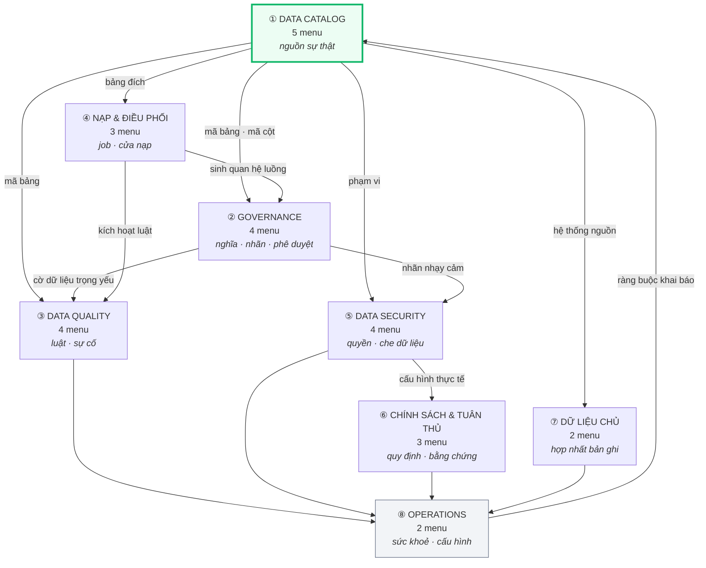
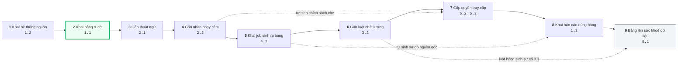
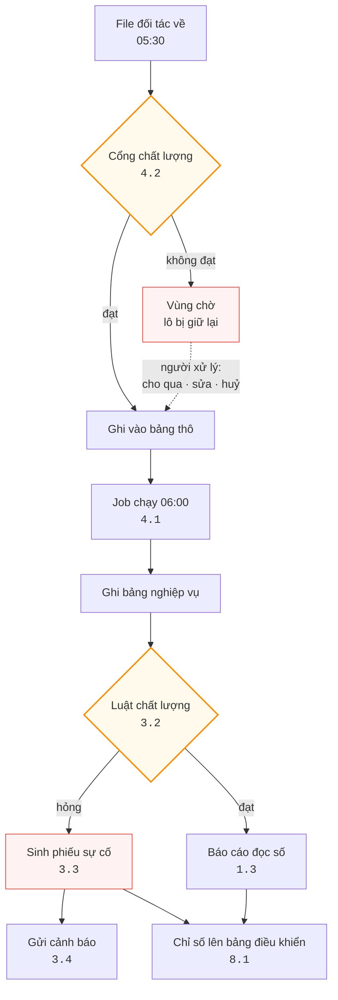
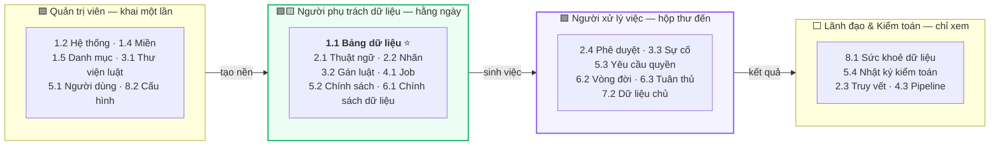
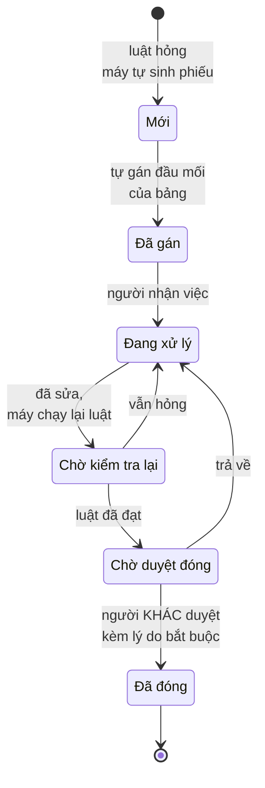
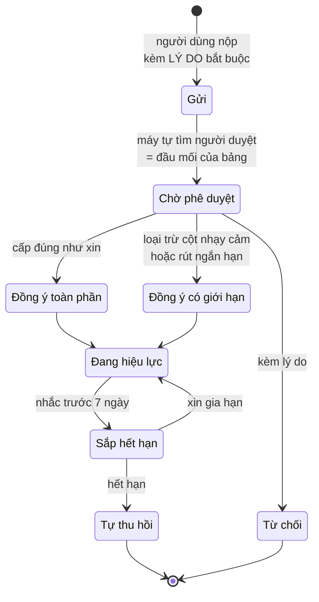
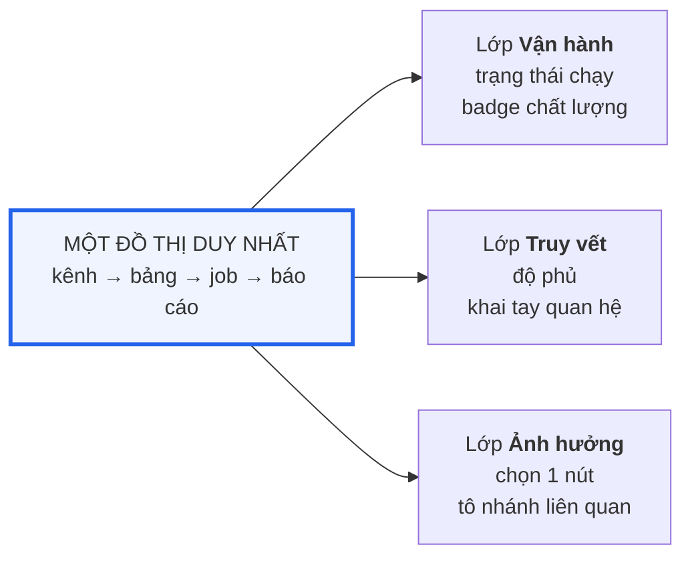

# DMP — Đặc tả chức năng

### Từ tổng quan tới từng tab: 8 module · 27 menu · các tab bên trong

| | |
|---|---|
| **Phiên bản** | **v1.0** |
| **Ngày** | **10/08/2026** |
| **Phạm vi** | Toàn bộ 8 module · 27 menu · các tab bên trong từng menu |
| **Sơ đồ** | **9 sơ đồ** — 8 ở Phần 0 *(bối cảnh → chi tiết)* + 1 ở Phần D — xếp từ bối cảnh xuống chi tiết. Xem trên **GitHub** hoặc **VS Code `Ctrl+Shift+V`** |
| **Khớp với** | Demo nhánh `rut-gon-27-menu` — repo `dataquality`, commit `caf1c6c` |
| **Nguồn cấu trúc** | ⭐ **Trích thẳng từ mã nguồn demo**, không mô tả theo trí nhớ |
| **Thay cho** | Là tài liệu **duy nhất** cần đọc để hiểu tool có gì. Các tài liệu DMP khác chỉ còn giá trị tham khảo lịch sử |

> 📌 **Tài liệu này mô tả ĐÚNG những gì demo đang có.** Nếu bấm vào demo thấy khác tài liệu, đó là lỗi — báo lại để sửa.

---

## Cách đọc tài liệu

<details open>
<summary><b>Ba cột Input · Chức năng · Output — nghĩa là gì</b></summary>

Mỗi menu được mô tả bằng ba câu hỏi:

| Cột | Trả lời câu hỏi | Ví dụ |
|---|---|---|
| **Input ←** | Menu này **cần menu nào khai trước**? Không có nó thì ô chọn ở đây trống | Khai bảng cần có *Hệ thống* và *Miền* trước |
| **Chức năng** | Màn này **làm được gì** — khai gì, xem gì, quyết định gì | Khai bảng · khai cột · gắn thuật ngữ |
| **Output →** | Khai xong thì **menu nào dùng lại**, dùng để làm gì | Mã bảng → dùng ở gán luật, khai job, chính sách quyền |

**Năm nhóm vai trò** — quyết định anh/chị phải làm gì với menu đó:

| Nhóm | Nghĩa | Số menu |
|:---:|---|:---:|
| 🟦 | **Nền móng** — khai một lần lúc thiết lập | 7 |
| 🟩 | **Trung tâm** — mở hằng ngày | 1 |
| 🟨 | **Khai khi phát sinh** — có đối tượng mới thì mới vào | 13 |
| 🟪 | **Hàng chờ việc** — hệ thống đẩy việc tới, người xử lý | 5 |
| ⬜ | **Chỉ để xem** — không khai gì | 1 |

> ⭐ **Người dùng thường ngày chỉ chạm 🟩 và 🟪 — tức 6 menu.** Phần còn lại là việc của quản trị viên hoặc màn báo cáo.

</details>

---

## Phần 0 — Sơ đồ: từ bối cảnh xuống chi tiết

> 📌 **Đọc phần này trước.** Tám sơ đồ xếp từ **xa nhất** *(DMP nằm ở đâu)* tới **gần nhất** *(một sự cố đi qua những trạng thái nào)*.
> Xem đúng trên **GitHub** hoặc **VS Code — `Ctrl+Shift+V`**; trình soạn thảo text thường chỉ thấy mã nguồn sơ đồ.

```mermaid
flowchart LR
  subgraph NG["HỆ THỐNG NGUỒN"]
    direction TB
    N1["CRM"]
    N2["Tính cước"]
    N3["Hợp đồng"]
    N4["File đối tác<br/>qua SFTP"]
  end

  subgraph DMP["DMP — NỀN TẢNG QUẢN TRỊ DỮ LIỆU"]
    direction TB
    A["① Danh mục<br/>bảng · hệ thống · báo cáo"]
    B["③ Chất lượng<br/>luật · sự cố"]
    C["⑤⑥ Bảo mật &amp; Tuân thủ<br/>quyền · che · bằng chứng"]
    D["⑦ Dữ liệu chủ<br/>một khách hàng một bản ghi"]
  end

  subgraph ND["NGƯỜI DÙNG"]
    direction TB
    U1["Người phân tích<br/>tra cứu · xin quyền"]
    U2["Lãnh đạo<br/>xem sức khoẻ dữ liệu"]
    U3["Đoàn kiểm tra<br/>đòi bằng chứng tuân thủ"]
  end

  NG -->|"④ nạp dữ liệu<br/>có cổng chặn"| DMP
  DMP --> ND

  style DMP fill:#EFF4FF,stroke:#2563EB,stroke-width:2px
  style NG fill:#F8FAFC,stroke:#94A3B8
  style ND fill:#F0FDF4,stroke:#16A34A
```

<details open>
<summary><b>① BỐI CẢNH — DMP nằm ở đâu trong hệ sinh thái</b></summary>



**Đọc sơ đồ này ra điều gì**

| | |
|---|---|
| DMP **không thay thế** hệ thống nguồn | CRM vẫn là CRM. DMP chỉ **đọc**, không ghi ngược |
| DMP **đứng giữa** dữ liệu và người dùng | Mọi đường ra đều đi qua lớp quyền và che dữ liệu |
| Ba nhóm người dùng, **ba câu hỏi khác nhau** | *"dữ liệu này ở đâu"* · *"đang khoẻ hay yếu"* · *"chứng minh tuân thủ đi"* |

</details>

<details open>
<summary><b>② TÁM MODULE — cái nào nuôi cái nào</b></summary>



> ⭐ **Module ① là trung tâm** — bảy module còn lại đều lấy mã bảng, mã cột từ đó. Hỏng ① thì cả hệ thống mù.
>
> ⭐ **Module ⑧ vừa ở đầu vừa ở cuối** — đầu vì nó đặt ràng buộc khai báo, cuối vì nó đọc lại kết quả mọi module.

</details>

<details open>
<summary><b>③ ⭐ VÒNG ĐỜI MỘT BẢNG DỮ LIỆU — kịch bản chính, đi qua menu nào</b></summary>

> Đây là sơ đồ **quan trọng nhất để trình bày**. Nó trả lời câu *"dùng tool này thì làm gì trước làm gì sau"*.



**Ba đường nét đứt là ba chỗ hệ thống tự làm — người không phải khai lại**

| Từ | Tới | Hệ thống tự làm gì |
|---|---|---|
| Gắn nhãn `2.2` | Chính sách `5.2` | Cột mang nhãn nhạy cảm **tự có chính sách che**, không khai từng cột |
| Khai job `4.1` | Truy vết `2.3` · Báo cáo `1.3` | **Tự dò quan hệ luồng dữ liệu** từ câu SQL của job |
| Gán luật `3.2` | Sự cố `3.3` | Luật hỏng **tự sinh phiếu, tự gán người, có hạn xử lý** |

> 🔴 **Bỏ bước nào thì mất gì:** bỏ bước 4 → 412 cột nhạy cảm hiện nguyên giá trị · bỏ bước 5 → sơ đồ nguồn gốc trống · bỏ bước 8 → truy vết dừng ở bảng, không biết báo cáo nào bị ảnh hưởng.

</details>

<details open>
<summary><b>④ LUỒNG CHẠY HẰNG NGÀY — không ai bấm gì, máy tự làm</b></summary>



> ⭐ **Hai hình thoi là hai cổng kiểm.** Cổng thứ nhất chặn **trước khi ghi** — dữ liệu xấu không vào được bảng. Cổng thứ hai kiểm **sau khi ghi** — bắt lỗi logic mà cổng đầu không thấy.
>
> 🔴 **Job chạy thành công vẫn có thể sinh số sai.** Đó là lý do phải có cổng thứ hai, và là lý do màn `4.3` phủ badge chất lượng lên sơ đồ pipeline.

```mermaid
flowchart LR
  P1["<b>Đợt 1</b><br/>5.1 Người dùng<br/>8.2 Cấu hình"]
  P2["<b>Đợt 2</b><br/>1.4 Miền<br/>1.2 Hệ thống<br/>1.5 Danh mục"]
  P3["<b>Đợt 3</b><br/>1.1 Bảng dữ liệu"]
  P4["<b>Đợt 4</b><br/>2.1 Thuật ngữ<br/>2.2 Nhãn"]
  P5["<b>Đợt 5</b><br/>3.1 → 3.2 Luật"]
  P6["<b>Đợt 6</b><br/>4.1 Job<br/>4.2 Cửa nạp"]
  P7["<b>Đợt 7</b><br/>5.2 Chính sách<br/>5.3 Yêu cầu quyền"]
  P8["<b>Đợt 8</b><br/>6.1 → 6.2 → 6.3<br/>Tuân thủ"]
  P9["<b>Đợt 9</b><br/>7.1 → 7.2<br/>Dữ liệu chủ"]
  P10["<b>Đợt 10</b><br/>1.3 Báo cáo<br/>8.1 Sức khoẻ"]

  P1 --> P2 --> P3 --> P4 --> P5 --> P6 --> P7 --> P8 --> P9 --> P10

  style P3 fill:#ECFDF3,stroke:#12B76A,stroke-width:3px
```

</details>

<details open>
<summary><b>⑤ THỨ TỰ KHAI BÁO — menu nào phải xong trước</b></summary>



> ⭐ **Đợt 3 là nút thắt.** Không có danh mục bảng thì bảy đợt sau **không có gì để gắn vào**.
>
> 💡 Ba việc **không cần lập trình** nhưng quyết định tool chạy được hay không: gán miền cho bảng chưa có miền · gán đầu mối cho bảng chưa có người phụ trách · bật công tắc quét nguồn gốc cho toàn bộ job cũ.

</details>

<details open>
<summary><b>⑥ AI LÀM GÌ — 5 nhóm vai trò chạm vào menu nào</b></summary>



> ⭐ **Người dùng thường ngày chỉ chạm 🟩 và 🟪 — khoảng 6 menu.** Bày 27 mục ngang hàng làm ai cũng tưởng phải học cả 27.

</details>

<details open>
<summary><b>⑦ CHI TIẾT — hai vòng đời có trạng thái</b></summary>

**Sự cố chất lượng — menu `3.3`**



> ⭐ **Hai chốt chặn quan trọng:** *Chờ kiểm tra lại* là **máy** xác nhận đã hết lỗi. *Chờ duyệt đóng* là **người khác** xác nhận — người xử lý **không được tự đóng** phiếu của mình.
>
> 🔴 Lý do đóng **bắt buộc chọn**, trong đó có *"Cảnh báo sai — luật đặt chưa đúng"*. Thống kê lý do này cho ra **tỷ lệ báo động giả** ở `8.1` — vượt 25% thì người dùng tắt thông báo và cả module ③ thành vô dụng.

**Yêu cầu cấp quyền — menu `5.3`**



> ⭐ **Không có nhánh "vô thời hạn".** Mọi quyền cấp mới đều đi tới *Tự thu hồi* nếu không xin gia hạn — quyền bỏ quên **tự biến mất**, không cần ai đi dọn.

</details>

---

## Phần A — Tổng quan 8 module

<details open>
<summary><b>Bảng tổng quan — module nào giải bài toán gì</b></summary>

| Module | Số menu | Giải bài toán gì | Không có thì hậu quả |
|---|:---:|---|---|
| **① DATA CATALOG** | 5 | **Nguồn sự thật** — mọi bảng, hệ thống, báo cáo được khai ở một chỗ | Không ai biết công ty có dữ liệu gì, ai chịu trách nhiệm |
| **② GOVERNANCE** | 4 | **Thống nhất cách hiểu và quy trình** — thuật ngữ, nhãn, truy vết, phê duyệt | Mỗi người hiểu một kiểu; sửa metadata không ai duyệt |
| **③ DATA QUALITY** | 4 | **Phát hiện dữ liệu sai trước khi người dùng phát hiện** | Báo cáo sai mà không ai biết |
| **④ NẠP & ĐIỀU PHỐI** | 3 | **Đưa dữ liệu vào và chạy job** — có chặn dữ liệu xấu tại cửa | Dữ liệu xấu ghi vào bảng rồi mới phát hiện |
| **⑤ DATA SECURITY** | 4 | **Ai đọc được dòng nào, cột nào** — che dữ liệu, lọc theo dòng | 412 cột nhạy cảm hiện nguyên số CCCD cho mọi người |
| **⑥ CHÍNH SÁCH & TUÂN THỦ** | 3 | **Quy định được số hoá và chứng minh được** | Kiểm toán hỏi *"chứng minh đi"* thì mất 2 tuần gom tay |
| **⑦ DỮ LIỆU CHỦ (MDM)** | 2 | **Một khách hàng chỉ có một bản ghi đúng** | Báo cáo đếm 3 khách hàng cho 1 người thật |
| **⑧ OPERATIONS** | 2 | **Bức tranh toàn cảnh và cấu hình chung** | Không biết quản trị dữ liệu đang tiến tới đâu |

**Luồng chạy giữa các module**

```
①  Khai danh mục         →  ②  Gắn nghĩa & nhãn      →  ③  Kiểm chất lượng
   bảng · hệ thống            thuật ngữ · nhãn            luật · sự cố
   báo cáo · miền                    ↓                          ↓
        ↓                     ⑤  Chính sách truy cập      ⑥  Tuân thủ
   ④  Nạp & chạy job            che · lọc dòng              đánh giá · bằng chứng
        ↓                                                          ↓
   ⑦  Hợp nhất dữ liệu chủ  ─────────────────────────→  ⑧  Sức khoẻ dữ liệu
```

</details>

---

## Phần B — Chi tiết 27 menu

<details open>
<summary><b>① DATA CATALOG — 5 menu</b></summary>

### 1.1 Bảng dữ liệu 🟩 ⭐ `/catalog/tables`

**Trung tâm của cả tool.** Đây là menu người dùng mở nhiều nhất, và là nơi 5 module còn lại lấy mã bảng, mã cột.

| | |
|---|---|
| **Mô tả** | Đây là **sổ đăng ký của mọi bảng dữ liệu trong công ty**. Khi đội kỹ thuật tạo ra một bảng mới, người phụ trách vào đây khai: bảng chứa gì · thuộc nghiệp vụ nào · ai chịu trách nhiệm · cột nào nhạy cảm · bao lâu cập nhật một lần. Khai xong thì bảng mới **“tồn tại” với cả hệ thống** — mới gán được luật chất lượng, mới cấp được quyền, mới hiện trên sơ đồ luồng dữ liệu. Bảng nào chưa khai thì với DMP coi như không có, dù dữ liệu vẫn chạy.<br><br>**Tại màn này người dùng có thể:** tìm bảng theo tên hoặc theo mô tả nghiệp vụ · xem bảng có bao nhiêu dòng, cập nhật lúc nào, điểm chất lượng bao nhiêu · mở chi tiết để xem từng cột, xem bảng lấy dữ liệu từ đâu và ai đang dùng · chọn nhiều bảng để gom thành nhóm cấp quyền một lần. |
| **Input ←** | **1.2** Hệ thống *(bảng thuộc hệ thống nào)* · **1.4** Miền · **5.1** Người dùng *(chọn đầu mối)* · **8.2** Cấu hình *(chuẩn đặt tên, mức quan trọng)* |
| **Chức năng** | Khai bảng · khai cột · gắn thuật ngữ · gắn nhãn nhạy cảm · xem chất lượng · xem nguồn gốc · xem quyền · xem lịch sử |
| **Output →** | ⭐ **Nuôi toàn bộ**: mã bảng dùng ở **3.2** *(gán luật)*, **4.1** *(bảng đích job)*, **5.2** *(chính sách quyền)*, **2.3** *(truy vết)*, **1.3** *(bảng nguồn của báo cáo)*, **6.2** *(vòng đời)* |

**Sáu tab trong màn chi tiết bảng**

| Tab | Chức năng | Lấy dữ liệu từ |
|---|---|---|
| **Tổng quan** | Mô tả nghiệp vụ · mức quan trọng · đầu mối · độ tươi · số dòng | Khai tay ở màn này |
| **Cột** ⭐ | Danh sách cột + thuật ngữ + nhãn + **chỉ số đo** *(tỷ lệ rỗng, số giá trị phân biệt, phân bố giá trị, lịch sử quét)* | Khai tay · **2.1** thuật ngữ · **2.2** nhãn · chỉ số do hệ thống quét |
| **Chất lượng** | Luật đang chạy trên bảng này + kết quả + xu hướng | **3.2** |
| **Nguồn gốc** | Sơ đồ bảng này lấy từ đâu, chảy đi đâu + phân tích ảnh hưởng | **4.1** job · **2.3** khai tay |
| **Quyền** | Ai đọc được bảng này, cột nào bị che | **5.2** |
| **Lịch sử** | Thay đổi metadata: giá trị cũ → giá trị mới · người sửa · IP | Hệ thống tự ghi |

> ⭐ **Tab Cột gộp menu cũ 3.3 Phân tích dữ liệu.** Nguyên tắc **NT3 — đo một nơi, hiện nhiều nơi**: hệ thống chỉ quét một lần, tab này đọc lại kết quả, không đo lần thứ hai.

**Chức năng khác trên màn danh sách:** nút **Tạo nhóm bảng** *(gộp menu cũ 1.6 — chọn nhiều bảng rồi gom thành gói để cấp quyền một lần)* · **Nạp từ file** · **Xuất**

---

### 1.2 Hệ thống & Nguồn dữ liệu 🟦 `/catalog/systems`

| | |
|---|---|
| **Mô tả** | Trước khi khai bảng thì phải biết **bảng đó nằm ở hệ thống nào**. Màn này khai danh sách hệ thống đang tạo ra hoặc lưu trữ dữ liệu — CRM, tính cước, kho dữ liệu, hệ thống hợp đồng — kèm mục đích, công nghệ, đơn vị quản lý và ai là đầu mối kỹ thuật. Đây là việc **làm một lần lúc thiết lập**, sau đó gần như không đụng lại.<br><br>Tab **Kênh trao đổi** khai đường dữ liệu chạy **giữa hai hệ thống** — cả chiều nhận về lẫn **chiều gửi ra ngoài**. Chiều gửi đi là chỗ dễ lộ dữ liệu nhất mà thường không ai quản, nên bắt buộc phải khai kèm mục đích và căn cứ.<br><br>**Tại màn này người dùng có thể:** thêm hệ thống mới · xem hệ thống nào đang cấp dữ liệu cho những bảng nào · xem danh sách kênh trao đổi và cách xác thực của từng kênh. |
| **Input ←** | **5.1** Người dùng *(chọn người sở hữu, đầu mối kỹ thuật)* · **7.1** Đơn vị tổ chức |
| **Chức năng** | Khai hệ thống đang có dữ liệu *(CRM, tính cước, kho dữ liệu…)* — mục đích, công nghệ, đơn vị quản lý, môi trường, trạng thái |
| **Output →** | Ô chọn *Hệ thống* ở **1.1** · nút đầu của chuỗi truy vết **2.3** · kết nối nguồn ở **4.2** |

**Hai tab**

| Tab | Chức năng | Ghi chú |
|---|---|---|
| **Hệ thống** | Danh sách hệ thống, chi tiết từng hệ thống | |
| **Kênh trao đổi** | Đường dữ liệu **giữa hai hệ thống** — cả chiều nhận về và **chiều gửi đi** | ⭐ Gộp menu cũ 1.4. Kênh là *quan hệ giữa hai hệ thống*, không đứng riêng được |

> ⚠️ **Chiều gửi đi là điểm rủi ro lộ dữ liệu.** Menu *Cửa nạp* ở ④ chỉ quản chiều **vào**; dữ liệu gửi ra ngoài phải khai ở tab này và có căn cứ ở **6.2**.

---

### 1.3 Báo cáo & Chỉ tiêu 🟨 `/catalog/reports`

| | |
|---|---|
| **Mô tả** | Báo cáo là **đầu ra cuối cùng** mà lãnh đạo nhìn vào. Màn này khai: báo cáo phục vụ mục đích gì · ai dùng · gồm những chỉ tiêu nào · mỗi chỉ tiêu tính bằng công thức gì · lấy số từ bảng nào · cam kết có số lúc mấy giờ.<br><br>Khai xong thì được một thứ rất giá trị: **khi một bảng hỏng, hệ thống chỉ ra ngay báo cáo nào đang đọc phải số sai** và ai cần được báo. Không khai báo cáo thì chuỗi truy vết dừng lại ở bảng, và mọi phân tích ảnh hưởng chỉ là phỏng đoán.<br><br>**Tại màn này người dùng có thể:** khai báo cáo và chỉ tiêu · tra một chỉ tiêu được tính thế nào · xem báo cáo đang lấy số từ những bảng nào. |
| **Input ←** | **1.1** Bảng *(bảng kết quả đầu ra và bảng nguồn)* · **2.1** Thuật ngữ *(định nghĩa chỉ tiêu)* |
| **Chức năng** | Khai báo cáo · khai chỉ tiêu · công thức tính · điều kiện lấy dữ liệu · đối tượng sử dụng · thời gian cam kết sẵn sàng |
| **Output →** | ⭐ **Mắt xích cuối của truy vết 2.3** — không có báo cáo thì truy vết dừng ở bảng, phân tích ảnh hưởng thành phỏng đoán. Chip *"bảng báo cáo"* ở **1.1** |

**Hai tab:** Báo cáo · Chỉ tiêu *(một báo cáo chứa nhiều chỉ tiêu)*

> 💡 **Vì sao báo cáo phải là đối tượng riêng, không gộp vào bảng:** báo cáo có 8 nhóm thông tin mà bảng không có chỗ lưu — mục đích sử dụng, công thức từng chỉ tiêu, đối tượng dùng, lượt xem thực tế… Và **không phải báo cáo nào cũng có bảng kết quả** *(công cụ BI truy vấn thẳng nhiều bảng)*.

---

### 1.4 Miền dữ liệu 🟦 `/catalog/domains`

| | |
|---|---|
| **Mô tả** | Dữ liệu công ty quá nhiều để quản lý theo từng bảng, nên phải **chia thành các miền nghiệp vụ** — Kinh doanh, Tài chính, Khách hàng, Vận hành — và **mỗi miền có một người chịu trách nhiệm**. Đây là cách trả lời câu *“bảng này hỏng thì gọi ai”* mà không cần biết từng bảng.<br><br>Miền còn là **phạm vi để cấp quyền theo gói**: cấp cho cả ban Kinh doanh quyền đọc miền Kinh doanh, thay vì cấp từng bảng một.<br><br>**Tại màn này người dùng có thể:** khai cây miền nhiều cấp · gán người chịu trách nhiệm · xem mỗi miền đang có bao nhiêu bảng và tình trạng ra sao. |
| **Input ←** | **5.1** Người dùng *(người chịu trách nhiệm miền)* |
| **Chức năng** | Chia dữ liệu công ty thành các miền nghiệp vụ theo cây phân cấp, mỗi miền có người chịu trách nhiệm |
| **Output →** | Ô *Miền* ở **1.1** · phạm vi chính sách quyền ở **5.2** · bảng *Theo miền* ở **8.1** |

> ⚠️ Hiện **38% số bảng chưa gán miền** — nhóm bảng này không ai chịu trách nhiệm và **chính sách theo miền không với tới**.

---

### 1.5 Danh mục tham chiếu 🟦 `/catalog/refdata`

| | |
|---|---|
| **Mô tả** | Đây là nơi khai **các bảng mã dùng chung** cho cả công ty — tỉnh/thành, loại hợp đồng, mã đối tác, nhóm cước. Mục đích là để mọi nơi dùng **cùng một bộ giá trị**, tránh chỗ ghi *“Hà Nội”* chỗ ghi *“HN”* chỗ ghi *“01”*.<br><br>Khai xong thì hai chỗ dùng lại ngay: ô nhập của cột trong bảng **chỉ cho chọn giá trị hợp lệ**, và luật chất lượng có thể kiểm *“mã đối tác này có thật không”*.<br><br>**Tại màn này người dùng có thể:** tạo danh mục mới và định nghĩa các trường của nó · thêm/sửa bản ghi · **gửi thay đổi đi phê duyệt** trước khi có hiệu lực · so sánh hai phiên bản để biết ai đổi gì. |
| **Input ←** | — *(không phụ thuộc menu nào)* |
| **Chức năng** | Khai bảng mã dùng chung: tỉnh/thành, loại hợp đồng, mã đối tác… |
| **Output →** | **Tập giá trị hợp lệ** của cột ở **1.1** · luật *tồn tại trong danh mục* ở **3.2** |

**Năm tab trong màn chi tiết**

| Tab | Chức năng |
|---|---|
| **Dữ liệu** | Các bản ghi trong danh mục |
| **Định nghĩa trường** | Danh mục gồm những trường gì, kiểu gì, bắt buộc không |
| **Phiên bản** | Lịch sử thay đổi, so sánh hai phiên bản |
| **Chờ duyệt** | Bản ghi mới chờ phê duyệt trước khi có hiệu lực |
| **Nhật ký** | Ai sửa gì, lúc nào |

</details>

<details open>
<summary><b>② GOVERNANCE — 4 menu</b></summary>

### 2.1 Từ điển nghiệp vụ 🟨 `/governance/glossary`

| | |
|---|---|
| **Mô tả** | Cùng một khái niệm nhưng **mỗi phòng gọi một kiểu** — chỗ gọi *doanh thu*, chỗ gọi *revenue*, chỗ gọi *tiền về*; và quan trọng hơn, **mỗi người hiểu một nghĩa khác nhau**. Màn này khai định nghĩa chuẩn cho từng khái niệm nghiệp vụ, kèm các cách gọi khác, rồi **gắn khái niệm đó vào cột dữ liệu thật**.<br><br>Gắn xong thì người dùng gõ *“doanh thu”* ở ô tìm kiếm là ra đúng những cột chứa doanh thu, **kể cả cột đặt tên là `tong_tien` hay `revenue`**. Khái niệm nào đánh dấu **trọng yếu** thì mọi cột mang nó **bắt buộc phải có luật chất lượng**.<br><br>**Tại màn này người dùng có thể:** khai thuật ngữ và định nghĩa · gắn vào cột · xem thuật ngữ nào chưa gắn vào cột nào *(tức là đang vô dụng)*. |
| **Input ←** | **5.1** Người dùng *(chủ sở hữu, người phụ trách, người duyệt)* |
| **Chức năng** | Khai thuật ngữ · bí danh · định nghĩa · **đánh cờ CDE** *(dữ liệu trọng yếu)* · gắn thuật ngữ vào cột thật |
| **Output →** | Ô *Thuật ngữ* ở tab Cột của **1.1** · ⭐ cờ **CDE** bắt buộc cột phải có luật ở **3.2** · đưa thuật ngữ vào **chỉ mục tìm kiếm** |

> 🔴 **Chỉ số sống còn của menu này là "số cột đã gắn".** Thuật ngữ gắn 0 cột chỉ là chữ nằm trong sổ — không giúp gì cho việc tìm dữ liệu.

---

### 2.2 Phân loại & Nhãn 🟨 `/governance/classification`

| | |
|---|---|
| **Mô tả** | Đây là nơi **đánh dấu dữ liệu nào nhạy cảm**, để chính sách bảo mật **tự áp mà không phải khai tay từng cột**. Đánh dấu một lần, mọi cột mang nhãn đó tự có chính sách che — kể cả cột được gắn nhãn sau này.<br><br>Có **hai trục độc lập, dùng cho hai việc khác nhau**: *nhãn dữ liệu nhạy cảm* gắn cho **cột** *(số điện thoại, căn cước, số tài khoản)* và dùng để viết chính sách **che dữ liệu**; *mức phân loại bảo mật* gắn cho **bảng và báo cáo** *(Công khai · Nội bộ · Mật · Hạn chế)* và dùng để viết chính sách **hạn chế tải xuống**.<br><br>**Tại màn này người dùng có thể:** khai cây nhãn · xác nhận nhãn hệ thống gợi ý cho cột · xem một nhãn đang áp cho bao nhiêu cột và kéo theo chính sách gì. |
| **Input ←** | **1.1** Bảng và cột *(để gắn nhãn vào)* |
| **Chức năng** | Khai cây nhãn · xác nhận nhãn cho cột · khai mức phân loại bảo mật cho bảng |
| **Output →** | ⭐ **Tự sinh chính sách che ở 5.2** · chính sách hạn chế tải xuống · phạm vi chính sách ở **6.1** |

**Hai tab — ⭐ hai trục ĐỘC LẬP, đây là chỗ hay nhầm nhất**

| Tab | Gán cho | Dùng để viết chính sách gì |
|---|---|---|
| **Trục 2 — Nhãn dữ liệu nhạy cảm** | **Cột** *(số ĐT, CCCD, số tài khoản)* | **Che dữ liệu** |
| **Trục 1 — Mức phân loại bảo mật** | **Bảng · báo cáo** *(Công khai · Nội bộ · Mật · Hạn chế)* | **Hạn chế tải xuống** |

> ⚠️ **Viết chính sách sai trục thì không sửa lại được** khi đã áp lên 412 cột và đồng bộ sang hệ thống phân quyền.

---

### 2.3 Truy vết luồng dữ liệu ⬜ `/governance/lineage`

| | |
|---|---|
| **Mô tả** | Trả lời câu **“dữ liệu này từ đâu ra, và chảy đi đâu”**. Phần lớn quan hệ được **máy tự dò** từ câu SQL của job — job đọc bảng nào, ghi ra bảng nào, hệ thống tự nối lại thành bản đồ.<br><br>Nhưng máy không dò được hết: báo cáo dựng bằng công cụ BI thì không có câu SQL để đọc, nên **đoạn cuối của chuỗi hay bị đứt** — đúng đoạn quan trọng nhất. Vì vậy màn này cho **khai tay** phần máy bỏ sót.<br><br>**Tại màn này người dùng có thể:** xem bản đồ toàn cảnh · khai tay quan hệ còn thiếu · chọn một bảng rồi hỏi *“sửa bảng này thì hỏng những gì”* · xem toàn hệ thống đã truy vết được bao nhiêu phần trăm. |
| **Input ←** | **4.1** Job *(máy tự dò từ câu SQL)* · **4.2** Cửa nạp · khai tay phần máy không dò được |
| **Chức năng** | Xem bản đồ dữ liệu chạy từ đâu tới đâu · khai tay quan hệ mà máy không dò được · phân tích ảnh hưởng |
| **Output →** | Chỉ số **độ phủ truy vết** ở **8.1** · tab *Nguồn gốc* của **1.1** |

**Ba tab**

| Tab | Chức năng |
|---|---|
| **Bản đồ luồng dữ liệu** | Sơ đồ toàn cảnh: kênh → bảng thô → job → bảng nghiệp vụ → báo cáo |
| **Quan hệ đã khai báo** | ⭐ Khai tay quan hệ mà máy không dò được *(ví dụ công cụ BI không xuất được truy vết)* |
| **Phân tích ảnh hưởng** | Chọn một bảng → liệt kê mọi thứ hỏng theo nếu bảng đó sai |

> 💡 **Vì sao phải cho khai tay:** bộ dò đọc câu SQL của job, nhưng báo cáo dựng bằng công cụ BI thì không có SQL để đọc. Không khai tay thì chuỗi truy vết **đứt ở đoạn cuối** — đúng đoạn quan trọng nhất.

---

### 2.4 Phê duyệt & Phiên bản 🟪 `/governance/approvals`

| | |
|---|---|
| **Mô tả** | Sửa định nghĩa một khái niệm hay đổi mô tả một bảng **không phải việc ai thích sửa thì sửa** — phải có người duyệt. Màn này là **hộp thư “chờ tôi duyệt” dùng chung cho mọi loại hồ sơ**, thay vì mỗi menu một chỗ chờ riêng khiến người duyệt phải đi lùng.<br><br>Người duyệt mở một màn là thấy hết việc của mình, xem được **thay đổi cụ thể là gì** *(giá trị cũ so với giá trị mới)*, rồi bấm duyệt hoặc trả về kèm lý do.<br><br>**Tại màn này người dùng có thể:** xem hồ sơ đang chờ mình duyệt · so sánh hai phiên bản · duyệt hoặc trả về · tra lịch sử ai đã duyệt thay đổi nào. |
| **Input ←** | **5.1** Người dùng *(ai được duyệt)* · mọi menu có hồ sơ chờ duyệt |
| **Chức năng** | Hộp thư *"chờ tôi duyệt"* dùng chung cho **mọi loại metadata** — duyệt, trả về, xem lịch sử phiên bản, so sánh hai phiên bản |
| **Output →** | Trạng thái phê duyệt của mọi đối tượng · lịch sử để trả lời *"ai duyệt thay đổi nào"* |

**Ba tab:** Đang chờ phê duyệt · **Chờ tôi duyệt** · Lịch sử phê duyệt

> ⭐ **Một hàng chờ dùng chung, không rải mỗi menu một chỗ.** Người duyệt mở một màn là thấy hết việc của mình.

</details>

<details open>
<summary><b>③ DATA QUALITY — 4 menu</b></summary>

### 3.1 Thư viện luật 🟦 `/quality/rules`

| | |
|---|---|
| **Mô tả** | Đây là **kho khuôn kiểm tra dùng chung** — khai một lần rồi dùng lại cho mọi bảng. Ví dụ khuôn *“cột không được rỗng”*, *“giá trị phải nằm trong khoảng”*, *“mã phải có trong danh mục”*.<br><br>Cần phân biệt rõ với menu tiếp theo: đây là **khuôn**, khai một lần; còn **gán khuôn đó cho cột nào, ngưỡng bao nhiêu** thì làm ở `3.2`. Một khuôn *“đúng định dạng”* có thể gán cho hàng chục cột với biểu thức khác nhau.<br><br>**Tại màn này người dùng có thể:** xem danh sách các loại kiểm tra có sẵn · tạo loại mới nếu nghiệp vụ đặc thù · xem loại nào đang được dùng nhiều, loại nào chưa ai dùng. |
| **Input ←** | — |
| **Chức năng** | Khai **mẫu** loại kiểm tra dùng chung — mã kỹ thuật, chiều chất lượng, tham số phải khai, ngưỡng mặc định |
| **Output →** | Danh sách chọn khi **gán luật ở 3.2** và khi khai **cổng chất lượng ở 4.2** |

> ⭐ **Phân biệt loại kiểm tra và luật đang chạy:** 3.1 là **khuôn**, khai một lần *(ví dụ "đúng định dạng")*. 3.2 là **lần gán cụ thể** *(cột `so_dien_thoai` phải khớp biểu thức này)*. Một khuôn gán được cho hàng chục cột.

---

### 3.2 Luật & Kết quả 🟨 `/quality/board`

| | |
|---|---|
| **Mô tả** | Đây là nơi **quyết định bảng nào được kiểm cái gì**. Người phụ trách chọn bảng hoặc cột, chọn loại kiểm tra từ thư viện, đặt ngưỡng chấp nhận được, chọn chạy theo lịch hay **chạy ngay sau khi job ghi xong**, và chọn **hành động khi phát hiện vi phạm**.<br><br>Sau khi khai xong thì **không ai phải bấm gì nữa** — hệ thống tự chạy theo lịch, tự chấm điểm chất lượng cho bảng, và tự sinh việc khi có vi phạm.<br><br>**Tại màn này người dùng có thể:** gán luật cho bảng hoặc cột · đặt ngưỡng riêng · xem bảng điều khiển toàn hệ thống bảng nào đang tốt bảng nào đang hỏng · xem bảng nào **chưa có luật nào** — đây là con số quan trọng nhất vì điểm chất lượng chỉ tính trên phần đã kiểm. |
| **Input ←** | **1.1** Bảng và cột · **3.1** Loại kiểm tra · **2.1** cờ CDE *(cột CDE bắt buộc có luật)* |
| **Chức năng** | Gán luật vào bảng/cột · đặt ngưỡng · chọn lịch chạy hoặc **chạy theo sự kiện** · chọn **hành động khi luật hỏng** · xem bảng điều khiển điểm chất lượng |
| **Output →** | Điểm chất lượng của bảng *(hiện ở tab Chất lượng của 1.1)* · ⭐ **sinh phiếu sự cố ở 3.3** · chỉ số ở **8.1** |

**Năm hành động khi luật hỏng** — chọn được nhiều cùng lúc

| Hành động | Nghĩa |
|---|---|
| Gửi cảnh báo | Báo cho đầu mối qua kênh khai ở 3.4 |
| **Tạo phiếu sự cố** | Sinh phiếu ở **3.3**, tự gán người, có hạn xử lý |
| Tạo phiếu Jira | Đẩy sang hệ thống theo dõi công việc |
| **Chặn job hạ nguồn** | ⚠️ Mạnh — dừng dây chuyền, chỉ bật cho nhánh quan trọng |
| **Giữ lô ở vùng chờ** | Áp cho luật kiểm tại cửa nạp *(4.2)* |

**Ngưỡng có 4 cấp, cấp dưới đè cấp trên**

`① Ngưỡng của lần gán này (3.2) → ② Ngưỡng theo mức quan trọng của bảng (8.2) → ③ Ngưỡng mặc định của loại luật (3.1) → ④ Tham số toàn cục (8.2)`

---

### 3.3 Sự cố chất lượng 🟪 `/quality/incidents`

| | |
|---|---|
| **Mô tả** | Khi người dùng khai luật xong ở `3.2` và luật **tự động chạy theo lịch hoặc chạy ngay sau khi job ghi dữ liệu**, nếu hệ thống bắt được trường hợp vi phạm thì nó **tự tạo ra một phiếu xử lý**, **tự gán cho đầu mối phụ trách bảng đó**, đặt hạn xử lý theo mức quan trọng của bảng, và **gửi thông báo cho người chịu trách nhiệm** qua kênh đã khai ở `3.4`. Không ai phải ngồi canh, cũng không ai phải nhớ giao việc cho ai.<br><br>Màn này là **hộp thư việc cần làm** của người phụ trách dữ liệu. Phiếu đi qua các trạng thái: mới sinh → đã gán người → đang xử lý → **máy chạy lại luật để xác nhận đã hết lỗi** → chờ người khác duyệt đóng → đóng.<br><br>**Tại màn này người dùng có thể:** xem phiếu đang chờ mình · nhận việc · ghi nguyên nhân và cách xử lý · yêu cầu máy kiểm tra lại · **đóng phiếu kèm lý do bắt buộc chọn**. Điểm cần nhớ: **người xử lý không được tự đóng phiếu của mình** — phải có người thứ hai xác nhận, tránh việc đóng cho xong. |
| **Input ←** | **3.2** *(luật hỏng sinh phiếu)* · **4.2** *(lô bị chặn ở cửa nạp)* · **1.1** *(đầu mối để gán việc)* |
| **Chức năng** | Xử lý phiếu **tự sinh, tự gán** — đổi trạng thái, ghi nguyên nhân, bình luận, đóng phiếu kèm **lý do bắt buộc** |
| **Output →** | Chỉ số *sự cố đang mở* và ⭐ **tỷ lệ báo động giả** ở **8.1** |

> ⭐ **Nguyên tắc 4 mắt:** người xử lý **không được tự đóng** phiếu của mình — phải chuyển sang *Chờ duyệt đóng* để người khác đóng.
>
> ⭐ **Lý do đóng bắt buộc chọn**, trong đó có *"Cảnh báo sai — luật đặt chưa đúng"*. Thống kê lý do này cho ra **tỷ lệ báo động giả** — vượt 25% thì người dùng tắt thông báo và cả module ③ thành vô dụng.

---

### 3.4 Cảnh báo 🟨 `/quality/alerts`

| | |
|---|---|
| **Mô tả** | Phát hiện được lỗi mà **không ai biết thì cũng như không**. Màn này khai **ai nhận thông báo gì, qua kênh nào, gửi theo chế độ nào** — gửi ngay, gom nhiều lỗi thành một lần, hay tổng hợp cuối ngày.<br><br>Điểm quan trọng: **khai người nhận theo VAI TRÒ, không gõ tên người** — ví dụ *“đầu mối kỹ thuật của bảng”*. Khi đổi người phụ trách ở `1.1` thì thông báo **tự đi đúng chỗ**, không phải sửa lại hàng chục quy tắc. Gõ tên cứng thì người nghỉ việc là thông báo rơi vào hư không mà hệ thống vẫn báo *“đã gửi”*.<br><br>**Tại màn này người dùng có thể:** khai quy tắc gửi · cấu hình kênh email, Telegram, tin nhắn, tạo phiếu · **gửi thử** · xem kênh nào đang gửi thất bại nhiều. |
| **Input ←** | **1.1** đầu mối · **1.4** miền · **5.1** nhóm người dùng |
| **Chức năng** | Khai quy tắc gửi thông báo và cấu hình kênh gửi |
| **Output →** | Gửi thông báo tới đầu mối — dùng bởi **3.2**, **3.3**, **4.1** |

**Hai tab**

| Tab | Chức năng |
|---|---|
| **Quy tắc cảnh báo** | Điều kiện nào thì gửi, gửi cho ai, chế độ gửi *(ngay · gom lô · tổng hợp ngày · tổng hợp tuần)* |
| **Kênh gửi** | Email · Telegram · SMS · tạo phiếu — ⭐ **ba menu khác dùng lại**, không menu nào khai kênh riêng |

> ⭐ **Khai người nhận theo VAI TRÒ, không gõ tên người.** Ví dụ *"đầu mối kỹ thuật của bảng"* — đổi người phụ trách ở 1.1 thì cảnh báo tự đi đúng chỗ.

</details>

<details open>
<summary><b>④ NẠP & ĐIỀU PHỐI — 3 menu</b></summary>

### 4.1 Luồng xử lý (Job) 🟨 `/orchestration/jobs`

| | |
|---|---|
| **Mô tả** | Đây là nơi **xây dựng luồng xử lý dữ liệu** — thứ mà đội kỹ thuật gọi là *job*. Một job gồm nhiều bước SQL nối tiếp hoặc chạy song song: bước đọc dữ liệu thô, bước làm sạch, bước đối chiếu, bước cuối ghi ra bảng đích.<br><br>Hai thông tin khai ở đây **quyết định chất lượng dữ liệu của cả hệ thống**: **bảng đích bắt buộc chọn từ danh mục** *(không cho gõ tay, để bảng nào cũng có người phụ trách)*, và **công tắc quét nguồn gốc mặc định bật** *(để sơ đồ luồng dữ liệu không bị trống)*.<br><br>**Tại màn này người dùng có thể:** tạo job · thêm bước và viết SQL cho từng bước · xem sơ đồ phụ thuộc giữa các bước · đặt lịch chạy và **giờ cam kết có số** · xem lịch sử các lần chạy và hỏng ở bước nào · so sánh phiên bản.<br><br>*Lưu ý: sơ đồ bước ở đây là **chỉ để xem** — nó vẽ lại từ trường “bước cha” mà người dùng khai, chưa có kéo thả.* |
| **Input ←** | **1.1** Bảng *(⭐ bảng đích bắt buộc chọn từ danh mục, không gõ tay)* · **3.4** kênh cảnh báo |
| **Chức năng** | Khai job nhiều bước SQL có phụ thuộc · bảng đích · lịch chạy · **giờ cam kết** · **công tắc quét nguồn gốc** |
| **Output →** | ⭐ **Tự sinh quan hệ luồng dữ liệu cho 2.3 và tab Nguồn gốc của 1.1** · kích hoạt luật chất lượng theo sự kiện · sơ đồ ở **4.3** |

**Ba tab trong màn chi tiết job**

| Tab | Chức năng |
|---|---|
| **Bước xử lý** | Sơ đồ phụ thuộc giữa các bước + câu SQL từng bước |
| **Lần chạy & Lịch** | Lịch sử chạy, thời gian từng bước, **kết quả chất lượng sau khi chạy** |
| **Phiên bản** | Lịch sử phiên bản, so sánh, xử lý khi hai người cùng sửa |

> 🔴 **Hai ràng buộc quyết định chất lượng dữ liệu của cả hệ thống:**
> ① **Bảng đích phải có trong danh mục 1.1** — nếu không, bảng đó không người phụ trách, không luật chất lượng, không lên được sơ đồ
> ② **Công tắc quét nguồn gốc mặc định BẬT** — job không bật thì tab *Nguồn gốc* của bảng đích trống

---

### 4.2 Cửa nạp dữ liệu 🟨 `/ingestion/templates`

| | |
|---|---|
| **Mô tả** | Đây là **cửa vào của dữ liệu** — mọi đường dữ liệu đi vào hệ thống đều khai ở đây, dù là file đối tác gửi qua SFTP, đồng bộ từ cơ sở dữ liệu khác, hay người dùng tự tải lên.<br><br>Điểm khác biệt lớn nhất là **cổng chất lượng**: luật kiểm chạy **trên dữ liệu ở vùng chờ, TRƯỚC khi ghi vào bảng**. Nếu không đạt thì tuỳ mức độ mà chặn cả lô, tách riêng dòng lỗi, hay chỉ cảnh báo. Khác hẳn luật ở `3.2` — luật đó chạy **sau khi đã ghi**, lúc phát hiện thì báo cáo đã đọc phải số sai và phải xoá dữ liệu nạp lại.<br><br>**Tại màn này người dùng có thể:** khai mẫu nạp · khai luật kiểm tại cửa và mức xử lý · xem lịch sử các lần nạp · **xử lý lô đang bị giữ ở vùng chờ** — cho qua kèm lý do, chỉ ghi phần đúng, nạp lại file đã sửa, hoặc huỷ lô. |
| **Input ←** | **1.2** Kênh trao đổi · **1.1** Bảng đích · **3.1** Loại kiểm tra *(cho cổng chất lượng)* |
| **Chức năng** | Khai mẫu nạp · ánh xạ trường · ⭐ **cổng chất lượng** *(luật kiểm trước khi ghi)* · xử lý lô bị giữ ở vùng chờ |
| **Output →** | Dữ liệu vào bảng · lô lỗi vào **vùng chờ** · sinh sự cố ở **3.3** · độ tươi hiện ở **1.1** |

**Ba mức xử lý khi dữ liệu không đạt tại cửa**

| Mức | Hệ thống làm gì | Dùng khi |
|---|---|---|
| 🛑 **Chặn cả lô** | Không ghi dòng nào, cả lô vào vùng chờ, mở sự cố | Lỗi cho thấy **cả tệp sai** |
| ⚠️ **Tách dòng lỗi** | Dòng đúng vẫn ghi, dòng sai để riêng | Lỗi **rải rác vài dòng** |
| 🔔 **Chỉ cảnh báo** | Ghi hết, gửi thông báo | Nghi ngờ nhưng chưa chắc sai |

> ⭐ **Chặn tại cửa rẻ hơn dọn dẹp phía sau.** Luật ở 3.2 chạy **sau khi đã ghi** — lúc phát hiện thì báo cáo đã đọc phải số sai.

---

### 4.3 Theo dõi & Pipeline ⬜ `/orchestration/monitor`

| | |
|---|---|
| **Mô tả** | Đây là **màn của ca trực**. Nó trả lời hai câu trong cùng một chỗ: *“sáng nay cái gì đang chạy, cái gì hỏng”* và *“cái hỏng đó lan tới báo cáo nào”*.<br><br>Điểm đáng chú ý nhất: sơ đồ **phủ badge chất lượng lên từng bảng**, nên nhìn thấy ngay một tình huống mà các công cụ theo dõi thường bỏ sót — **job chạy thành công nhưng dữ liệu vẫn sai**. Job xanh, bảng đỏ. Nếu chỉ theo dõi trạng thái chạy thì tưởng mọi thứ bình thường.<br><br>**Tại màn này người dùng có thể:** xem danh sách tác vụ và kết quả lần chạy gần nhất · xem sơ đồ dữ liệu chảy từ cửa nạp tới báo cáo · lần theo nhánh đang hỏng để biết ai cần được báo. Đây là màn **chỉ để xem**, không khai gì. |
| **Input ←** | **4.1** Job · **4.2** Cửa nạp · **3.2** kết quả chất lượng |
| **Chức năng** | Xem tác vụ nào đang chạy, hỏng ở bước nào · **sơ đồ pipeline phủ badge chất lượng** lên từng nút |
| **Output →** | *(chỉ đọc)* — chỉ số ở **8.1** |

> ⭐ **Câu hỏi màn này trả lời:** *"Bảng này hỏng thì báo cáo nào đang đọc phải số sai?"*
>
> Job chạy **thành công** vẫn có thể sinh ra **số sai** — đó là lý do trạng thái chạy và trạng thái chất lượng phải nằm **trên cùng một sơ đồ**.

</details>

<details open>
<summary><b>⑤ DATA SECURITY — 4 menu</b></summary>

### 5.1 Người dùng & Nhóm 🟦 `/security/users`

| | |
|---|---|
| **Mô tả** | Quản lý **tài khoản, nhóm và vai trò** — nền móng cho mọi thứ liên quan tới con người trong hệ thống. Danh sách người dùng thường được đồng bộ từ hệ thống quản lý tài khoản của công ty, việc ở đây là **gán vai trò**.<br><br>Có **năm vai trò với trách nhiệm không chồng nhau**: người sở hữu dữ liệu *(phê duyệt)* · đầu mối nghiệp vụ *(cập nhật ý nghĩa)* · đầu mối kỹ thuật *(cập nhật cấu trúc, job)* · đơn vị vận hành *(quản người dùng, thu hồi quyền)* · người sử dụng *(tra cứu, xin quyền)*. Nhờ vậy mọi ô chọn người trên hệ thống **tự lọc đúng vai trò**, và không hiện người đã nghỉ việc.<br><br>**Cần phân biệt:** menu này quản **quyền vào MENU** — mở được màn nào. Còn **đọc được dòng nào, cột nào** thì do `5.2` quyết định. Mở được màn *Bảng dữ liệu* không có nghĩa là đọc được mọi bảng trong đó. |
| **Input ←** | Đồng bộ từ hệ thống quản lý tài khoản |
| **Chức năng** | Quản tài khoản · nhóm · **gán 5 vai trò** · ma trận quyền vào **MENU** |
| **Output →** | ⭐ **Mọi ô chọn người trên toàn hệ thống** — và ô chọn tự lọc theo vai trò |

**Hai tab:** Người dùng · Nhóm & Quyền menu

**Năm vai trò — trách nhiệm không chồng nhau**

| Vai trò | Quyết định gì | Không làm gì |
|---|---|---|
| **Người sở hữu dữ liệu** | Phê duyệt định nghĩa · phê duyệt cấp quyền | Không cập nhật nội dung |
| **Đầu mối nghiệp vụ** | Cập nhật mô tả, thuật ngữ, quy tắc | Không phê duyệt |
| **Đầu mối kỹ thuật** | Cập nhật cấu trúc, nguồn, job | Không phê duyệt |
| **Đơn vị vận hành** | Quản người dùng, kết nối, thu hồi quyền | Không quyết định nội dung |
| **Người sử dụng** | Tra cứu, xin quyền, phản hồi | Không sửa gì |

> ⚠️ **Phân biệt quyền MENU và quyền DỮ LIỆU.** Menu này quản *"mở được màn nào"*. **5.2** quản *"đọc được dòng nào, cột nào"*. Mở được màn *Bảng dữ liệu* không có nghĩa đọc được mọi bảng trong đó.

---

### 5.2 Chính sách truy cập 🟨 `/security/policies`

| | |
|---|---|
| **Mô tả** | Đây là nơi quyết định **ai đọc được dữ liệu gì** — không phải mở được màn nào, mà là **thấy được dòng nào, cột nào**.<br><br>Có bốn loại chính sách. **Quyền dữ liệu**: được xem hay được ghi, phạm vi là một bảng hay cả miền. **Che dữ liệu**: cột nhạy cảm hiện thế nào với từng nhóm — hiện bốn số cuối, băm không đảo ngược được, hay trả về rỗng. **Lọc theo dòng**: mỗi người chỉ thấy dòng thuộc phạm vi của mình, ví dụ nhân viên chi nhánh Hà Nội chỉ thấy giao dịch Hà Nội. **Hạn chế tải xuống** theo mức mật của bảng.<br><br>Điểm mạnh nhất là **chính sách theo nhãn**: khai một lần cho nhãn *dữ liệu nhạy cảm*, áp cho mọi cột mang nhãn đó và **cả cột được gắn nhãn sau này** — không phải nhớ quay lại khai.<br><br>**Tại màn này người dùng có thể:** khai và sửa chính sách · xem thử một người cụ thể sẽ nhìn thấy dữ liệu ra sao · tra một người đang có những quyền gì và quyền nào lâu không dùng. |
| **Input ←** | **1.1** Bảng và cột · **2.2** Nhãn và mức phân loại · **5.1** Người dùng và nhóm · **5.3** *(yêu cầu đã duyệt sinh chính sách)* |
| **Chức năng** | Khai chính sách trên **dữ liệu** — theo bảng, theo miền, hoặc **theo nhãn** |
| **Output →** | Quyết định cho phép / từ chối ở cổng truy vấn · bằng chứng cho **6.3** |

**Sáu tab**

| Tab | Chức năng |
|---|---|
| **Quyền dữ liệu** | Ai được xem / ghi / xoá, phạm vi bảng · nhóm bảng · miền · thư mục |
| **Che dữ liệu** | ⭐ Cột nhạy cảm hiện thế nào với từng nhóm — 8 kiểu che |
| **Lọc theo dòng** | ⭐ Mỗi người chỉ thấy dòng thuộc phạm vi của mình |
| **Hạn chế tải xuống** | Theo **mức phân loại** *(trục 1)* — khác với che theo nhãn *(trục 2)* |
| **Chính sách theo nhãn** | ⭐ Khai một lần, áp cho **mọi cột mang nhãn**, kể cả cột gắn nhãn sau này |
| **Báo cáo quyền** | *(gộp menu cũ 5.5)* Một người đang có quyền gì · quyền nào không dùng · truy cập bất thường |

> ⭐ **Che dữ liệu làm ở tầng viết lại câu truy vấn, không phải tầng giao diện.** Che trên màn hình thì xuất Excel hoặc gọi API là ra giá trị gốc.

---

### 5.3 Yêu cầu cấp quyền 🟪 `/security/requests`

| | |
|---|---|
| **Mô tả** | Trước đây xin quyền truy cập làm qua chat hoặc email — **không ai biết ai đã cấp, căn cứ vào đâu, và bao giờ hết hạn**. Màn này biến việc đó thành một quy trình có dấu vết.<br><br>Người cần dữ liệu vào đây nộp yêu cầu, **bắt buộc ghi lý do** *(lý do kiểu “cần cho công việc” sẽ bị từ chối)* và **chọn thời hạn — không có tuỳ chọn vô thời hạn**. Hệ thống **tự tìm người duyệt** là đầu mối phụ trách bảng đó, người xin không phải đi hỏi ai duyệt.<br><br>Người duyệt có **ba lựa chọn**, không chỉ đồng ý hay từ chối: đồng ý toàn phần · **đồng ý có giới hạn** *(loại trừ cột nhạy cảm hoặc rút ngắn thời hạn)* · từ chối kèm lý do. Duyệt xong thì quyền **có hiệu lực ngay**, được nhắc trước khi hết hạn, và **tự thu hồi nếu không xin gia hạn** — quyền bỏ quên tự biến mất, không cần ai đi dọn. |
| **Input ←** | **5.1** Người dùng · **1.1** Bảng *(để biết ai là người duyệt)* |
| **Chức năng** | Nộp yêu cầu xin quyền có **lý do bắt buộc** và **thời hạn** · người phụ trách bảng duyệt |
| **Output →** | ⭐ **Sinh chính sách ở 5.2 kèm mã yêu cầu** — truy được lý do cấp · ghi vào nhật ký **5.4** |

**Ba mức quyết định của người duyệt** — không chỉ có Đồng ý / Từ chối

| Mức | Nghĩa |
|---|---|
| **Đồng ý toàn phần** | Cấp đúng như xin |
| ⭐ **Đồng ý có giới hạn** | Cấp nhưng loại trừ cột nhạy cảm, hoặc rút ngắn thời hạn |
| **Từ chối** | Kèm lý do |

> ⭐ **Không có tuỳ chọn "vô thời hạn".** Hết hạn mà còn cần thì xin gia hạn một cú bấm; đổi lại quyền bỏ quên **tự biến mất**.

---

### 5.4 Nhật ký kiểm toán ⬜ `/security/audit`

| | |
|---|---|
| **Mô tả** | Ghi lại **ai đã truy cập dữ liệu gì, lúc nào, từ máy nào**. Hệ thống tự ghi, không ai khai và **không ai sửa được** — kể cả quản trị viên.<br><br>Điểm khác biệt so với nhật ký thông thường là cột **“chính sách nào quyết định”**. Đoàn kiểm tra không hỏi *“ai đã làm gì”* — cái đó nhật ký nào cũng có. Họ hỏi *“vì sao người này xem được cột căn cước”* hoặc *“vì sao người kia bị chặn”*. Ghi thẳng chính sách đã áp vào từng dòng thì **mỗi dòng tự giải thích được chính nó**.<br><br>**Tại màn này người dùng có thể:** tra theo người, theo bảng, theo khoảng thời gian · lọc riêng các lượt truy cập cột nhạy cảm · xem ai xuất dữ liệu vượt ngưỡng bất thường. Đây cũng là **nguồn bằng chứng** cho kỳ đánh giá tuân thủ ở `6.3`. |
| **Input ←** | Hệ thống tự ghi — không ai khai, không ai sửa được |
| **Chức năng** | Xem ai truy cập gì, lúc nào, từ đâu, ⭐ **chính sách nào quyết định** cho phép hay chặn |
| **Output →** | ⭐ **Bằng chứng cho 6.3** · chỉ số truy cập bất thường |

> ⭐ **Cột *"chính sách nào quyết định"* là thứ phân biệt nhật ký này với nhật ký thường.** Kiểm toán không hỏi *"ai đã làm gì"* — họ hỏi *"vì sao người này xem được cột này"*.

</details>

<details open>
<summary><b>⑥ CHÍNH SÁCH & TUÂN THỦ — 3 menu</b></summary>

### 6.1 Chính sách dữ liệu 🟨 `/compliance/policies`

| | |
|---|---|
| **Mô tả** | Công ty đã có quy định về dữ liệu — nghị định bảo vệ dữ liệu cá nhân, quy chế nội bộ, quyết định phân cấp truy cập. Nhưng chúng nằm trong **file Word trên máy ai đó**, hệ thống không biết đến sự tồn tại của chúng, và không ai trả lời được *“bảng này đang chịu những quy định nào”*.<br><br>Màn này **số hoá quy định**: nội dung, đơn vị ban hành, số hiệu văn bản, ngày hiệu lực, và quan trọng nhất là **phạm vi áp dụng** — chọn theo miền, theo nhãn, hay theo mức phân loại. Chọn phạm vi xong thì hệ thống **tự tính ra quy định này đang áp cho bao nhiêu bảng, bao nhiêu cột**.<br><br>**Cần phân biệt với `5.2`**: menu này là **quy định** *(“số căn cước chỉ được hiển thị cho bộ phận nghiệp vụ trực tiếp”)*, còn `5.2` là **cấu hình kỹ thuật thực tế** *(cột nào, nhóm nào, che kiểu gì)*. Có quy định mà không có cấu hình thì là **nói một đằng làm một nẻo** — và `6.3` chính là nơi đối chiếu hai cái. |
| **Input ←** | **2.2** Nhãn và mức phân loại *(để chọn phạm vi áp dụng)* · **1.4** Miền |
| **Chức năng** | Số hoá **quy định** — nội dung, đơn vị ban hành, số hiệu văn bản, ngày hiệu lực, phiên bản, ⭐ **phạm vi áp dụng**, và **yêu cầu kiểm soát đo được** |
| **Output →** | ⭐ Mỗi yêu cầu kiểm soát thành **một mục kiểm ở 6.3** · căn cứ cho **6.2** · hiện ở tab của **1.1** |

> ⭐ **Phân biệt với 5.2 — chỗ dễ nhầm nhất:**
> **6.1 là QUY ĐỊNH** *("Số CCCD chỉ hiển thị cho bộ phận nghiệp vụ trực tiếp")*
> **5.2 là CẤU HÌNH KỸ THUẬT** *(`so_cccd` · nhóm X · che NULL)*
> Có quy định mà không có cấu hình → **nói một đằng làm một nẻo**. **6.3 là nơi so hai cái.**

---

### 6.2 Vòng đời & Lưu trữ 🟪 `/compliance/lifecycle`

| | |
|---|---|
| **Mô tả** | Dữ liệu trong hệ thống **chỉ có sinh ra mà không có mất đi** — không bảng nào có ngày hết hạn. Hậu quả kép: dữ liệu cũ vẫn nằm trên vùng lưu trữ đắt tiền vì *“lỡ có ai cần”*, và **giữ dữ liệu cá nhân quá thời hạn cần thiết là vi phạm quy định** — điều nhiều đơn vị bỏ sót.<br><br>Màn này khai **dữ liệu sống bao lâu**: bao lâu còn dùng thường xuyên, bao lâu thì chuyển sang lưu trữ giá rẻ, khi nào được xoá, và **căn cứ vào quy định nào** *(trỏ về `6.1`, không tự nghĩ ra thời hạn)*.<br><br>Tab **Chia sẻ bên thứ ba** là **danh bạ dữ liệu đi ra khỏi công ty** — gửi cho ai, mục đích gì, phạm vi nào, đến bao giờ, ai duyệt. Hết hạn thì kênh gửi tự ngắt.<br><br>**Điểm quan trọng: hệ thống không bao giờ tự xoá dữ liệu.** Đến hạn thì đưa vào hàng chờ và gửi cảnh báo, người có thẩm quyền bấm duyệt mới xoá. |
| **Input ←** | **1.1** Bảng · **6.1** Chính sách *(căn cứ đặt thời hạn)* |
| **Chức năng** | Khai dữ liệu sống bao lâu, khi nào chuyển lưu kho, khi nào được xoá · quản việc chia sẻ dữ liệu ra ngoài |
| **Output →** | Hàng chờ *"đến hạn xử lý"* · ngắt kênh gửi ở **1.2** khi hết hạn chia sẻ · ghi nhật ký **5.4** |

**Hai tab**

| Tab | Chức năng |
|---|---|
| **Quy tắc vòng đời dữ liệu** | Thời gian sử dụng · thời gian lưu trữ · điều kiện xoá · người phê duyệt xoá |
| **Chia sẻ bên thứ ba** | ⭐ Danh bạ dữ liệu đi ra ngoài — bên nhận, **mục đích**, phạm vi, **thời hạn**, căn cứ pháp lý |

> 🔴 **Hệ thống không bao giờ tự xoá dữ liệu.** Đến hạn thì vào hàng chờ và gửi cảnh báo, người có thẩm quyền duyệt mới xoá.
>
> ⚠️ Giữ dữ liệu cá nhân **quá thời hạn cần thiết** là vi phạm — đây là điều nhiều đơn vị bỏ sót.

---

### 6.3 Đánh giá tuân thủ 🟪 `/compliance/assessments`

| | |
|---|---|
| **Mô tả** | Khi đoàn kiểm tra hỏi *“chứng minh là đơn vị đang làm đúng quy định đi”*, hiện phải **đi gom bằng chứng từ năm chỗ khác nhau trong khoảng hai tuần**, và kết quả phụ thuộc người gom nhớ được bao nhiêu.<br><br>Màn này chạy **kỳ đánh giá theo danh mục kiểm**, mỗi mục kiểm gắn với một yêu cầu trong quy định ở `6.1`. Điểm mạnh nhất: **phần lớn mục kiểm máy tự chấm** bằng dữ liệu đã có sẵn — ví dụ *“100% cột nhạy cảm phải có chính sách che”* thì hệ thống đối chiếu `2.2` với `5.2` và trả lời ngay. Người chỉ còn làm tay vài mục liên quan tới giấy tờ và con người.<br><br>Mục nào **không đạt** thì mở một **kế hoạch khắc phục có người phụ trách cụ thể và có hạn**. Cuối kỳ, bấm một nút **xuất trọn bộ hồ sơ bằng chứng** — gộp quy định, kết quả đánh giá, kế hoạch khắc phục, nhật ký phân quyền, nhật ký truy cập, kết quả kiểm tra chất lượng. |
| **Input ←** | **6.1** *(mục kiểm)* · **5.2 · 5.4 · 1.1 · 2.2 · 3.2 · 6.2** *(số liệu chấm tự động)* |
| **Chức năng** | Chạy kỳ đánh giá theo danh mục kiểm · ghi phát hiện chưa đạt · mở kế hoạch khắc phục có người và có hạn · **xuất hồ sơ bằng chứng** |
| **Output →** | Điểm tuân thủ ở **8.1** · hồ sơ trả lời kiểm toán |

**Hai tab:** Kỳ đánh giá · Kế hoạch khắc phục

**⭐ Mục kiểm chấm tự động — tính năng mạnh nhất của module ⑥**

| Mục kiểm | Hệ thống lấy số ở đâu |
|---|---|
| 100% cột nhạy cảm có chính sách che | Đối chiếu **2.2** với **5.2** |
| 100% quyền cấp mới có thời hạn | **5.2** cột *Thời hạn* |
| Không còn tài khoản đã nghỉ việc giữ quyền | **5.1** đối chiếu **5.2** |
| Bảng quan trọng đều có người phụ trách | **1.1** |

> ⭐ Vì các module ① → ⑤ đã ghi đủ dữ liệu, **phần lớn mục kiểm chấm được bằng máy**. Người chỉ còn làm tay vài mục về giấy tờ và con người. Việc đánh giá tuân thủ chuyển từ *một đợt hai tuần* thành *một màn hình*.

</details>

<details open>
<summary><b>⑦ DỮ LIỆU CHỦ (MDM) — 2 menu</b></summary>

> **Bài toán:** cùng một khách hàng tồn tại ở nhiều hệ thống với mã khác nhau, tên viết khác nhau → **báo cáo đếm 3 khách hàng cho 1 người thật**.
>
> ⭐ **Khác với 1.5 Danh mục tham chiếu:** danh mục tham chiếu có **một nguồn duy nhất**, khai đúng một lần là xong. Dữ liệu chủ do **nhiều hệ thống cùng sinh ra**, nên phải liên tục đối soát và hợp nhất.

### 7.1 Mô hình dữ liệu chủ 🟨 `/mdm/models`

| | |
|---|---|
| **Mô tả** | Cùng một khách hàng đang tồn tại ở nhiều hệ thống với mã khác nhau, tên viết khác nhau, số điện thoại định dạng khác nhau — nên **báo cáo đếm ra ba khách hàng cho một người thật**. Trước khi xử lý được chuyện đó thì phải định nghĩa **thế nào là một bản ghi đúng**.<br><br>Màn này khai: một *Khách hàng chuẩn* gồm những trường gì · **trường nào dùng để nhận ra hai bản ghi là một** *(căn cước, mã số thuế, số điện thoại)* · quy tắc chuẩn hoá *(bỏ dấu, chuẩn số điện thoại về cùng định dạng)*.<br><br>Điểm cần nhớ: **thứ tự ưu tiên nguồn khai theo TỪNG TRƯỜNG**, không phải theo cả bản ghi. Tin CRM về địa chỉ nhưng tin hệ thống tính cước về số điện thoại. Khai theo cả bản ghi thì lấy luôn cả số điện thoại cũ của CRM. |
| **Input ←** | **1.1** Bảng · **1.2** Hệ thống nguồn · **2.1** Thuật ngữ |
| **Chức năng** | Định nghĩa *"một Khách hàng chuẩn gồm trường gì"* · **khoá so khớp** · quy tắc chuẩn hoá · ⭐ **thứ tự ưu tiên nguồn theo từng thuộc tính** |
| **Output →** | Cơ sở tính điểm giống nhau ở **7.2** · quy tắc chọn giá trị khi hợp nhất |

> ⭐ **Ưu tiên nguồn khai theo TỪNG thuộc tính, không theo cả bản ghi.** Tin CRM về địa chỉ nhưng tin hệ thống tính cước về số điện thoại. Khai theo cả bản ghi thì lấy luôn cả số điện thoại cũ.

---

### 7.2 Dữ liệu chủ 🟪 `/mdm/records`

| | |
|---|---|
| **Mô tả** | Đây là **dây chuyền ba bước** để đi từ nhiều bản ghi rời rạc về một bản ghi đúng duy nhất.<br><br>**Bước 1 — Bản ghi nguồn:** gom bản ghi từ các hệ thống về, chuẩn hoá theo quy tắc ở `7.1`, nhưng **giữ nguyên giá trị gốc**. DMP chỉ **đọc** từ hệ thống nguồn, không bao giờ ghi ngược — muốn sửa dữ liệu CRM thì phải vào CRM mà sửa.<br><br>**Bước 2 — Nghi ngờ trùng:** máy so khớp và đưa ra danh sách cặp nghi ngờ kèm **điểm giống nhau**, nhưng **máy KHÔNG tự hợp nhất**. Người xem hai bản ghi đặt cạnh nhau, chọn giữ giá trị nào cho từng trường, rồi quyết định gộp hay không. Lý do không tự động: gộp nhầm hai khách hàng thật là sự cố nghiêm trọng và **rất khó gỡ**, còn bỏ sót một cặp trùng thì sửa sau vẫn được.<br><br>**Bước 3 — Bản ghi chuẩn:** bản ghi đúng duy nhất, có **liên kết ngược** về mọi mã ở hệ thống nguồn *(vì các hệ thống cũ vẫn dùng mã cũ của chúng)*, và tab **Kênh phân phối** để phát mã chuẩn ngược lại cho các hệ thống dùng. |
| **Input ←** | **7.1** Mô hình · **4.2** Cửa nạp *(đường đưa bản ghi về)* · **3.2** *(chấm chất lượng bản ghi)* |
| **Chức năng** | Ba bước của một dây chuyền — xem bản ghi nguồn, quyết định cặp trùng, quản bản ghi chuẩn |
| **Output →** | ⭐ **Mã chuẩn mà mọi hệ thống phải dùng** · phát ngược cho hệ thống khác |

**Ba tab — có dải trạng thái ba bước ở đầu màn, bấm được**

| Tab | Chức năng | Ghi chú |
|---|---|---|
| **1 · Bản ghi nguồn** | Xem cùng một khách hàng đang nằm ở những hệ thống nào, giá trị gốc và sau chuẩn hoá | 🔴 **DMP chỉ ĐỌC từ hệ thống nguồn, không ghi ngược** |
| **2 · Nghi ngờ trùng** | ⭐ Máy đưa danh sách nghi ngờ kèm **điểm giống nhau**, người xem từng cặp rồi quyết định | 🔴 **Máy KHÔNG tự hợp nhất** |
| **3 · Bản ghi chuẩn** | Bản ghi đúng duy nhất + **liên kết ngược** về mọi mã nguồn · tab con **Kênh phân phối** | ⭐ Phải **tách được** bản đã gộp nhầm |

> 🔴 **Vì sao máy không tự hợp nhất:** gộp nhầm hai khách hàng thật là sự cố nghiêm trọng và **rất khó gỡ** vì hệ thống hạ nguồn đã dùng mã chuẩn mới. Bỏ sót một cặp trùng thì sửa sau vẫn được. **Hai loại sai này không cân bằng nhau.**
>
> ⭐ **Lựa chọn *"Không phải trùng"* phải ghi nhớ được** — nếu không, mỗi lần chạy lại hiện đúng cặp ấy, người dùng sẽ bỏ mặc cả hàng chờ. Đây là lỗi làm chết nhiều dự án dữ liệu chủ.

</details>

<details open>
<summary><b>⑧ OPERATIONS — 2 menu</b></summary>

### 8.1 Sức khoẻ dữ liệu ⬜ `/operations/health`

| | |
|---|---|
| **Mô tả** | Đây là **màn dành cho lãnh đạo** — không khai gì, chỉ đọc lại số liệu mà bảy module kia sinh ra.<br><br>Nó trả lời câu *“dữ liệu công ty đang khoẻ hay yếu, và việc quản trị dữ liệu đã đi tới đâu”* bằng các chỉ số: bao nhiêu phần trăm bảng có người phụ trách · bao nhiêu bảng đang được kiểm chất lượng · bao nhiêu cột nhạy cảm đã được che · tiến độ theo từng giai đoạn.<br><br>**Nguyên tắc trình bày quan trọng: điểm chất lượng luôn hiện KÈM tỷ lệ bảng đang được kiểm.** Đọc điểm cao mà không đọc *“chỉ tính trên một phần nhỏ số bảng”* là **hiểu sai tình hình** — tách hai con số ra hai chỗ khác nhau là tạo cảm giác an toàn giả.<br><br>Màn này chỉ đúng khi **các module kia được dùng thật**, nên nó nằm ở cuối lộ trình. |
| **Input ←** | ⭐ **Cả 7 module còn lại** — menu này không khai gì |
| **Chức năng** | Màn cho lãnh đạo — điểm chất lượng, độ phủ quản trị, bảng ưu tiên cải thiện, tiến độ theo giai đoạn |
| **Output →** | *(chỉ đọc)* |

**Ba tab:** Tổng quan · Theo miền dữ liệu · Tiến độ theo giai đoạn

> ⭐ **Điểm chất lượng luôn hiện KÈM tỷ lệ bảng đang được kiểm.** Đọc điểm cao mà không đọc *"chỉ tính trên 0,6% số bảng"* là **hiểu sai tình hình** — tách hai con số ra hai chỗ là tạo cảm giác an toàn giả.
>
> ⭐ Màn này chỉ đúng khi **các module kia được dùng thật** — đó là lý do nó nằm cuối lộ trình.

---

### 8.2 Cấu hình hệ thống 🟦 `/operations/settings`

| | |
|---|---|
| **Mô tả** | Nơi khai **các thiết lập dùng chung cho cả hệ thống** — làm một lần lúc dựng, sau đó hiếm khi đụng lại.<br><br>Gồm: **kết nối tới hệ thống nguồn** *(máy chủ, cổng, cách xác thực)* · **định nghĩa mức quan trọng của bảng** *(mức nào bắt buộc phải có gì)* · **chuẩn đặt tên** *(biểu thức kiểm tên bảng, tên cột, tên job)* · **tham số chung** *(ngưỡng cảnh báo, thời gian lưu nhật ký, chu kỳ rà soát quyền)* · và tab tra cứu **bộ tiêu chuẩn thông tin mô tả**.<br><br>**Điểm dễ bỏ sót:** menu này nằm ở module cuối nhưng **hai mục *định nghĩa mức quan trọng* và *chuẩn đặt tên* phải khai SỚM** — vì chúng là điều kiện chặn ngay khi khai bảng ở `1.1`. Không có chúng thì mức quan trọng chỉ là cái nhãn ghi cho đẹp, không ràng buộc gì. |
| **Input ←** | — |
| **Chức năng** | Kết nối nguồn · định nghĩa mức quan trọng · chuẩn đặt tên · tham số chung · tra cứu bộ tiêu chuẩn trường thông tin |
| **Output →** | Toàn hệ thống — đặc biệt là **ràng buộc khi khai bảng ở 1.1** |

**Năm tab**

| Tab | Chức năng |
|---|---|
| **Kết nối nguồn** | Máy chủ, cổng, xác thực — dùng bởi **4.2** |
| **Định nghĩa mức quan trọng** | ⭐ Mức nào bắt buộc có gì — biến mức quan trọng từ **nhãn** thành **ràng buộc thật** ở 1.1 |
| **Chuẩn đặt tên** | Biểu thức kiểm tên bảng, tên cột, tên job — kiểm ngay lúc tạo ở 1.1 |
| **Tham số hệ thống** | Ngưỡng cảnh báo, thời gian lưu nhật ký, chu kỳ rà soát quyền |
| **Tiêu chuẩn thông tin mô tả** | *(gộp menu cũ 2.5)* Tra cứu mọi trường: giá trị từ đâu ra, khai xong dùng ở đâu |

> ⭐ **Hai tab *Định nghĩa mức quan trọng* và *Chuẩn đặt tên* phải khai SỚM**, dù menu nằm ở module cuối — vì chúng là **điều kiện chặn khi khai bảng ở 1.1**.

</details>

---

## Phần C — Thứ tự khai báo

<details open>
<summary><b>Menu nào phải khai trước — chuỗi phụ thuộc</b></summary>

| Đợt | Khai gì | Vì sao phải trước |
|:---:|---|---|
| **1** | **5.1** Người dùng · **8.2** Cấu hình *(mức quan trọng, chuẩn đặt tên)* | Mọi ô chọn người và mọi ràng buộc khai bảng đều cần |
| **2** | **1.4** Miền · **1.2** Hệ thống · **1.5** Danh mục tham chiếu | Là ô chọn bắt buộc khi khai bảng |
| **3** | **1.1** Bảng dữ liệu ⭐ | Trung tâm — 5 module còn lại lấy mã bảng, mã cột từ đây |
| **4** | **2.1** Thuật ngữ · **2.2** Nhãn | Gắn nghĩa và độ nhạy cảm cho cột |
| **5** | **3.1** Thư viện luật → **3.2** Gán luật | Có bảng rồi mới gán được luật |
| **6** | **4.1** Job · **4.2** Cửa nạp | Sinh quan hệ luồng dữ liệu cho 2.3 |
| **7** | **5.2** Chính sách · **5.3** Yêu cầu quyền | Cần nhãn ở 2.2 để viết chính sách theo nhãn |
| **8** | **6.1** → **6.2** → **6.3** | Chính sách trước, vòng đời sau, đánh giá cuối |
| **9** | **7.1** → **7.2** | Cần đủ hệ thống nguồn và chất lượng dữ liệu |
| **10** | **1.3** Báo cáo · **8.1** Sức khoẻ | Mắt xích cuối của truy vết · màn đọc lại mọi thứ |

> 🔴 **Ba việc không cần lập trình nhưng quyết định tool có chạy được không:** gán miền cho các bảng chưa có miền · gán đầu mối cho bảng chưa có người phụ trách · bật công tắc quét nguồn gốc cho toàn bộ job cũ.

</details>

---

## Phần D — Bốn nơi vẽ sơ đồ: cái nào là gì, có nên gộp

<details open>
<summary><b>⚠️ Vì sao chỗ này rối — bốn màn cùng vẽ hình, khác nhau ở đâu</b></summary>

Hiện có **bốn màn đều vẽ sơ đồ**, và tên gọi na ná nhau. Nhưng chúng khác nhau ở **hai trục**:

| Màn | Nút trên sơ đồ **là gì** | Phạm vi | Mục đích |
|---|---|---|---|
| **4.1** Luồng xử lý *(trong chi tiết job)* | ⭐ **Bước SQL** bên trong một job | 1 job | **XÂY** — tạo job, viết SQL |
| **1.1** tab Nguồn gốc | **Bảng · job · báo cáo** | Quanh **1 bảng** | Tra khi đang xem bảng đó |
| **4.3** Theo dõi & Pipeline | **Bảng · job · báo cáo** | Toàn hệ thống | **VẬN HÀNH** — ca trực, cái gì đang hỏng |
| **2.3** Truy vết luồng dữ liệu | **Bảng · job · báo cáo** | Toàn hệ thống | **QUẢN TRỊ** — độ phủ, ảnh hưởng, khai tay |

> 🔴 **Điểm mấu chốt: 4.1 vẽ một đồ thị HOÀN TOÀN KHÁC ba màn kia.**
>
> Nút trong sơ đồ của **4.1** là **bước SQL** *(Bước 1 đọc file → Bước 2 chuẩn hoá → Bước 3 ghi bảng đích)*.
> Nút trong sơ đồ của **ba màn còn lại** là **bảng, job, báo cáo**.
>
> Hai loại đồ thị này **không cùng đơn vị**, không thể gộp — giống như bản vẽ mạch điện trong một cái máy và sơ đồ đường dây của cả nhà máy.

</details>

<details open>
<summary><b>Trả lời trực tiếp: chỗ nào tạo job, viết SQL, kéo node</b></summary>

### Tạo job và viết SQL → **menu 4.1** `/orchestration/jobs`

| Việc | Ở đâu trong 4.1 |
|---|---|
| Tạo job mới | Nút **Tạo job** ở màn danh sách |
| Khai bảng đích, lịch chạy, giờ cam kết | Form tạo job |
| **Thêm bước, viết SQL từng bước** | Chi tiết job › **tab Bước xử lý** › nút *Thêm bước* |
| Xem sơ đồ phụ thuộc giữa các bước | Chi tiết job › tab Bước xử lý — sơ đồ nằm ngay trên danh sách bước |
| Xem job chạy ra sao | Chi tiết job › tab **Lần chạy & Lịch** |
| So sánh phiên bản, xử lý hai người cùng sửa | Chi tiết job › tab **Phiên bản** |

> ⚠️ **Về "kéo node": demo hiện CHƯA có kéo thả.**
>
> Sơ đồ bước trong 4.1 là **chỉ để xem** — nó vẽ lại quan hệ phụ thuộc từ trường *Bước cha* mà người dùng khai trong form. Thêm bước làm bằng **form**, không phải kéo thả.
>
> Có cần kéo thả không thì tuỳ: job hiện tại của SQLWF khai bằng form và chạy ổn định nhiều năm. Kéo thả **đẹp khi trình diễn** nhưng tốn công làm và dễ sinh lỗi. Nếu chỉ để demo cho lãnh đạo xem thì **sơ đồ chỉ-đọc là đủ**.

### Xem để truy vết → **ba màn kia**, tuỳ đang đứng ở đâu

| Đang muốn biết | Vào đâu |
|---|---|
| *"Bảng này lấy dữ liệu từ đâu, chảy đi đâu"* | **1.1** › tab Nguồn gốc *(đang xem bảng thì tra luôn tại chỗ)* |
| *"Sáng nay cái gì đang hỏng, lan tới báo cáo nào"* | **4.3** Theo dõi & Pipeline |
| *"Toàn hệ thống truy vết được bao nhiêu phần trăm"* · *"sửa bảng này thì ảnh hưởng ai"* | **2.3** Truy vết luồng dữ liệu |

</details>

<details open>
<summary><b>⭐ ĐỀ XUẤT: tách 1 XÂY + 1 XEM — gộp 2.3 và 4.3 lại</b></summary>

**Ý anh/chị đúng.** Cách chia hợp lý nhất là **một màn để XÂY, một màn để XEM** — chứ không phải ba màn xem rải rác.

| | Giữ nguyên | Đề xuất |
|---|---|---|
| **XÂY** | 4.1 Luồng xử lý (Job) | ✅ **Giữ nguyên** — đây là màn build, sơ đồ bước SQL, không liên quan ba màn kia |
| **XEM** | 2.3 Truy vết · 4.3 Pipeline · tab Nguồn gốc | ⭐ **Gộp 2.3 + 4.3 thành một menu**, giữ tab Nguồn gốc |

**Vì sao gộp được 2.3 và 4.3**

Hai màn này **vẽ CÙNG MỘT đồ thị** — cùng nút, cùng cạnh, cùng dữ liệu. Chỉ khác **lớp phủ lên trên**:

| Màn hiện tại | Thực chất là | Gộp thành |
|---|---|---|
| 4.3 Pipeline | Cùng đồ thị + **lớp trạng thái chạy & badge chất lượng** | **Lớp Vận hành** |
| 2.3 Truy vết | Cùng đồ thị + **lớp độ phủ** + khai tay quan hệ | **Lớp Truy vết** |
| 2.3 tab Phân tích ảnh hưởng | Cùng đồ thị + **tô nhánh bị ảnh hưởng** | **Lớp Ảnh hưởng** |



> ⭐ **Người dùng đổi LỚP thay vì đổi MENU.** Đang xem sơ đồ mà muốn biết nhánh này ảnh hưởng tới đâu thì bật lớp Ảnh hưởng — không phải nhớ *"cái đó nằm ở menu 2.3"* rồi mở lại từ đầu, mất luôn chỗ đang xem.

**Vì sao GIỮ tab Nguồn gốc của 1.1, không gộp nốt**

Vì **điểm xuất phát khác hẳn**: người dùng đang **mở sẵn một bảng** và muốn tra tại chỗ. Bắt họ nhảy sang menu bản đồ rồi tự tìm lại đúng bảng đó là bước lùi. Đây đúng nguyên tắc **NT7** — thứ gắn với một thực thể cụ thể thì là **tab của thực thể đó**.

**Kiến trúc sau khi gộp — 27 → 26 menu**

| Module | Trước | Sau |
|---|---|---|
| ② GOVERNANCE | 2.1 · 2.2 · **2.3 Truy vết** · 2.4 | 2.1 · 2.2 · 2.3 · *(bỏ Truy vết)* → **3 menu** |
| ④ NẠP & ĐIỀU PHỐI | 4.1 · 4.2 · **4.3 Theo dõi** | 4.1 · 4.2 · **4.3 Bản đồ & Giám sát** *(3 lớp)* → **3 menu** |

</details>

<details open>
<summary><b>Đặt menu gộp ở module nào — và lập luận ngược lại</b></summary>

**Tôi đề xuất đặt ở ④, tên là `4.3 Bản đồ & Giám sát`**

| Lý do | Giải thích |
|---|---|
| **Tần suất dùng quyết định vị trí** | Người vận hành mở màn này **mỗi ca trực**; người quản trị dữ liệu xem độ phủ **mỗi tháng**. Đặt cạnh menu job là chỗ người dùng chính hay lui tới |
| **Nằm cạnh 4.1 và 4.2** | Ba menu cùng nói về đường đi của dữ liệu — job, cửa nạp, và bản đồ |
| Việc khai tay quan hệ | Hiếm, để làm **một tab bên trong**, không cần menu riêng |

**Lập luận ngược lại — nếu anh/chị muốn để ở ②**

> Quan hệ luồng dữ liệu **về bản chất là metadata**, mà metadata thuộc module ② Governance. Đặt ở ② thì đúng về mặt phân loại, nhưng người vận hành phải sang module khác mỗi ca trực.
>
> **Cách dung hoà:** đặt ở ④ *(theo tần suất dùng)*, và ở menu **4.1 Job** thêm nút *"Xem trên bản đồ"* để đi thẳng — ai vào từ hướng nào cũng tới được trong một cú bấm.

**Nếu quyết gộp thì phải sửa những gì**

| # | Việc | Ghi chú |
|:---:|---|---|
| 1 | Gộp hai trang thành một, thêm **bộ chọn lớp** ở góc sơ đồ | Ba lớp: Vận hành · Truy vết · Ảnh hưởng |
| 2 | Route cũ `/governance/lineage` **chuyển hướng** sang route mới | Không để hỏng liên kết |
| 3 | Sửa số hiệu menu trong tài liệu và demo | Bảng ánh xạ như lần rút gọn trước |
| 4 | Cập nhật sơ đồ ② và ⑥ ở Phần 0 | Số menu đổi từ 27 → 26 |

> 💡 **Lưu ý về lần rà soát trước.** Báo cáo *Rà soát Logic & Trùng lặp* từng kết luận **không gộp ba màn sơ đồ** vì *"ba câu hỏi khác nhau"*.
>
> Lập luận đó **đúng một nửa**: câu hỏi đúng là khác nhau. Nhưng **câu hỏi khác nhau không bắt buộc phải là menu khác nhau** — bộ chọn lớp giải quyết được, mà lại giữ nguyên chỗ đang xem. Kết luận cũ đã bỏ sót phương án này.

</details>

---

## Phần E — Tài liệu này thay cho những gì

<details open>
<summary><b>Tình trạng các tài liệu DMP tính đến 10/08/2026</b></summary>

| Tài liệu | Tình trạng | Còn dùng để làm gì |
|---|:---:|---|
| **Đặc tả chức năng** *(tài liệu này)* | ✅ **v1.0 — nguồn sự thật** | ⭐ Đọc cái này. Khớp demo commit `caf1c6c` |
| [Kiến trúc CHỐT](DMP-Kien-truc-CHOT.md) | ✅ Còn đúng | Bảng ánh xạ 35 menu cũ → vị trí mới |
| [Tổng quan một trang](DMP-Tong-quan-1-trang.md) | ✅ Còn đúng | Bảng 5 nhóm vai trò |
| [Việc cần sửa Demo](DMP-Viec-can-sua-Demo.md) | ✅ Đã thực hiện xong | Lưu để đối chiếu |
| [Review đối chiếu yêu cầu BDA](DMP-Review-Doi-chieu-Yeu-cau-BDA.md) | ✅ Nghiệp vụ còn đúng | Căn cứ vì sao có module ⑥ ⑦ |
| [Rà soát Logic & Trùng lặp](DMP-Ra-soat-Logic-Luong-va-Trung-lap.md) | ✅ Nghiệp vụ còn đúng | Vì sao ba màn sơ đồ không gộp |
| [Đề xuất tool](DMP-De-xuat-tool-Data-Management.md) | 🔴 **Đã cũ** | Thân bài mô tả 21 menu / 55 màn — **số hiệu sai**, nghiệp vụ còn tham khảo được |
| [Plan dựng demo](DMP-Plan-Dung-Demo-FE.md) | 🔴 **Đã cũ** | Demo đã dựng xong, plan hết vai trò |
| [Walkthrough](DMP-Huong-dan-su-dung-Walkthrough.md) | 🔴 **Đã cũ** | Số hiệu menu sai và khó theo |

**Việc còn lại — nêu rõ để không ai hiểu nhầm là đã xong**

| # | Việc | Ghi chú |
|:---:|---|---|
| 1 | Viết lại thân bài *Đề xuất tool* theo 27 menu | Khối lượng lớn. Tài liệu này đã thay được phần lớn vai trò của nó |
| 2 | Sinh lại 55 ảnh minh hoạ với thanh điều hướng 27 menu | Sửa `MENU` trong `tools/mockgen/dmp.py` rồi chạy lại |
| 3 | Viết lại walkthrough theo **một kịch bản liền mạch** | Ví dụ *"nhận một bảng mới từ đối tác tới lúc báo cáo chạy được"* — không đi theo menu |

</details>
