# Đề xuất tool Data Management
### DMP — Nền tảng Quản trị Dữ liệu tập trung

| | |
|---|---|
| **Người thực hiện** | BA — Đội Tool, Phòng Phân tích Dữ liệu |
| **Ngày** | 04/08/2026 |
| **Phiên bản** | **2.1** — Đầy đủ 8 phần + phụ lục · 21 menu · **55 màn hình minh hoạ** |
| **Căn cứ** | ⭐ Toàn bộ cột *"SQLWF hiện có"* trong tài liệu này **lấy từ kết quả đọc mã nguồn**, không suy đoán — xem [Kiểm kê màn hình SQLWF](DMP-Kiem-ke-man-hinh-SQLWF.md) |
| **Tài liệu liên quan** | [Nghiên cứu thị trường](SQLWF-Nghien-cuu-thi-truong-Demo-cong-cu.md) · [Hiện trạng SQLWF](SQLWF-Hien-trang-Data-Management-va-Nghien-cuu-thi-truong.md) |

> 📌 Tài liệu này **không nhắc lại phần nghiên cứu thị trường** — đã có ở tài liệu riêng. Ở đây đi thẳng vào **tool sẽ có những gì**.

---

## Trạng thái các phần

| Phần | Nội dung | Trạng thái |
|---|---|:---:|
| **Phần 1** | Vấn đề · Nguyên tắc · Mô hình tổng quan · **Bảng phân rã 21 menu** · Thứ tự khai báo · Ánh xạ từ SQLWF | ✅ **Đã cập nhật theo kiểm kê** |
| **Phần 2** | Module ① Data Catalog — **4 menu · 15 màn hình** | ✅ **Xong** |
| **Phần 3** | Module ② Governance — **2 menu · 5 màn hình** | ✅ **Xong** |
| **Phần 4** | Module ③ Data Quality — **5 menu · 10 màn hình** | ✅ **Xong** |
| **Phần 5** | Module ④ Ingestion & Orchestration — **3 menu · 9 màn hình** | ✅ **Xong** |
| **Phần 6** | Module ⑤ Data Security — **5 menu · 13 màn hình** | ✅ **Xong** |
| **Phần 7** | Module ⑥ Operations — **2 menu · 3 màn hình** | ✅ **Xong** |
| **Phần 8** | Lộ trình 4 đợt · Ước lượng · **8 rủi ro** · Việc làm ngay | ✅ **Xong** |
| **Phụ lục A** | Ma trận thao tác — **21 menu × 5 thao tác × 5 vai trò** | ✅ **Xong** |

---

# PHẦN 1 — MÔ HÌNH TỔNG QUAN

## 1. Vấn đề đang phải giải

<details open>
<summary><b>Bốn vấn đề gốc — mỗi vấn đề kèm bằng chứng từ mã nguồn</b></summary>

> ⚠️ **Bốn vấn đề này đã được viết lại sau khi kiểm kê mã nguồn.** Bản trước tôi mô tả SQLWF *"còn thiếu nhiều"* — thực tế **hầu hết đã có, nhưng không nối với nhau hoặc đã ngừng hoạt động**. Đó là một vấn đề khác hẳn, và cách giải cũng khác hẳn.

### V1 — Không có nguồn sự thật duy nhất

Cùng một thông tin đang được khai và lưu ở nhiều nơi không biết đến nhau:

| Thông tin | Đang nằm ở |
|---|---|
| **Cấu hình chất lượng** (`dqEnable` · `dqCycleType` · `dqOffset` · `dqDelay`) | **Ba màn** cùng khai: Quản lý bảng · Chất lượng dữ liệu · Đồng bộ nguồn |
| **Mô tả cột** | Bảng khai trường trong Quản lý bảng ↔ `featureName` + `meaning` trong Từ điển đặc trưng |
| **Chỉ số thống kê cột** (% rỗng · min · max · trung bình · số bản trùng) | Từ điển đặc trưng ↔ chỉ số của Chất lượng dữ liệu |
| **Lấy dữ liệu mẫu** | Hai service khác nhau làm cùng một việc: `tableService.refreshDataSample` và `dqService.refreshDataSample` |

### V2 — Khai rồi để đó, không ai dùng ⭐

**Đây mới là vấn đề lớn nhất, và nó khác hẳn với "còn thiếu".**

| Đã có sẵn trong hệ thống | Nhưng chưa dùng để làm gì |
|---|---|
| `glossaryTeam` — thuật ngữ nghiệp vụ gắn trên **từng cột** | Không dùng để tìm kiếm. Gõ "doanh thu" vẫn không ra cột nào |
| `tagIds` — nhãn phân loại trên **từng cột** (`PD_BASIC` · `PD_SENSITIVE` · `DATA_GENERAL`) | Chỉ dùng để **chặn hàm SQL**, chưa dùng để che dữ liệu |
| `syncFrequency` — chu kỳ cập nhật cam kết của bảng | Không dùng để cảnh báo dữ liệu về trễ |
| `businessOwner` · `dataEngineerOwner` — người phụ trách từng bảng | Không dùng để gán sự cố cho đúng người |
| `enableDataLineage` trên job | **Mặc định tắt**, phải tick tay từng job |
| **Quản lý danh mục** — có phê duyệt, phiên bản, so sánh thay đổi | Chưa nối vào luật chất lượng → luật *"mã phải tồn tại trong danh mục"* không chạy được |
| `valueRange` · `businessRule` trên từng cột | Là chữ tự do, **máy không đọc được** để sinh luật |

### V3 — Phần chất lượng dữ liệu đã ngừng hoạt động

Lược đồ dữ liệu cho luật chất lượng mức cột **đã có sẵn**: `dqType` · `dqMin` · `dqMax` · `dqEnum` *(tập giá trị hợp lệ)* · `dqExpr` *(biểu thức)* · `MetricInfo.dimension` *(6 chiều chất lượng)*.

**Nhưng phần chạy đã hỏng và bị bỏ từ lâu.** Nghĩa là công ty đã đầu tư thiết kế nhưng không thu được gì.

### V4 — Thiếu lớp THỰC THI ở mức cột

Metadata mức cột đã đầy đủ. Cái thiếu là **thực thi**:

| Đã có (metadata) | Chưa có (thực thi) |
|---|---|
| Nhãn nhạy cảm trên từng cột | **Che dữ liệu** — hiện chỉ chặn hàm SQL, không che được một phần |
| — | **Lọc theo dòng** |
| Nguồn gốc mức bảng | **Nguồn gốc mức cột** + **phân tích ảnh hưởng** |

</details>

---

## 2. Sáu nguyên tắc thiết kế

<details open>
<summary><b>Mọi quyết định thiết kế sau này phải bám vào đây</b></summary>

| # | Nguyên tắc | Nghĩa cụ thể |
|:---:|---|---|
| **NT1** | **Một nguồn sự thật duy nhất** | **Menu 1.1 Bảng dữ liệu** là gốc. Mọi module khác **không tự lưu danh sách bảng riêng** mà tham chiếu bằng **mã bảng**. Bảng chưa có trong danh mục → không gán luật, không phân quyền, job không ghi vào được |
| **NT2** | **Khai một lần, dùng nhiều nơi** | Đây là **nguyên tắc quan trọng nhất** vì nó giải trực tiếp vấn đề V2. Nhãn khai ở 2.2 → tự áp chính sách ở 5.2. Chu kỳ khai ở 1.1 → tự cảnh báo trễ ở 3.2. Người phụ trách khai ở 1.1 → tự gán sự cố ở 3.4 |
| **NT3** | **Đo một nơi, hiện nhiều nơi** | Chỉ số thống kê cột **chỉ đo ở Profiling (3.3)**; tab Cột của 1.1 đọc lại để hiển thị. Không hai nơi cùng đo |
| **NT4** | **Có cổng chặn, không chỉ có cảnh báo** | Tên sai chuẩn thì không lưu được · Tier 1 chưa có luật thì không duyệt được · dữ liệu vi phạm thì job hạ nguồn không chạy |
| **NT5** | **Mỗi bảng có người chịu trách nhiệm** | Trường đã có sẵn, chỉ cần **bắt buộc điền** và **thực sự dùng** để gán sự cố |
| **NT6** | **Kế thừa tối đa** | **14/21 menu là kế thừa.** Mỗi menu đều ghi rõ: 🟢 giữ · 🔵 nâng cấp · 🟣 gộp · 🔴 xây mới |
| **NT7** | **Menu = một thực thể được QUẢN LÝ** | Thứ **chỉ để xem, không khai được gì** thì là **tab trong màn chi tiết**, không phải menu. Ví dụ: nguồn gốc dữ liệu · lịch sử thay đổi · dữ liệu mẫu.<br>Hỏi về **một bảng** → ở trang bảng. Hỏi về **nhiều bảng** hoặc về **định nghĩa dùng chung** → ở menu |

</details>

---

## 3. Mô hình tổng quan

<details open>
<summary><b>Sơ đồ 6 module cha × 21 menu con</b></summary>

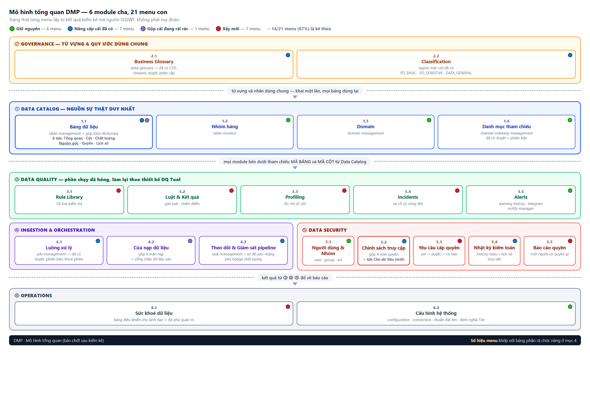

**Đọc sơ đồ theo 3 câu**

1. **Module ② cung cấp từ vựng và nhãn dùng chung** — khai một lần, mọi bảng dùng lại.
2. **Module ① là gốc** — mọi module còn lại tham chiếu **mã bảng** và **mã cột** từ đây. Đây là lời giải cho **V1**.
3. **③ ④ ⑤ là ba nhánh sử dụng**, cùng đổ kết quả về **⑥** để báo cáo.

**Cấu trúc phân cấp**

- **6 module** = 6 nhóm menu cha trên thanh điều hướng
- **21 menu con** = các mục bấm vào được
- Mọi mặt khác của một thực thể là **tab trong màn chi tiết**, không phải menu riêng

</details>

---

## 4. Bảng phân rã chức năng — 21 menu

<details open>
<summary><b>Cách đọc bảng</b></summary>

| Cột | Nghĩa |
|---|---|
| **Mục đích** | Menu này để làm gì — bằng ngôn ngữ nghiệp vụ |
| **Khai báo gì** | Người dùng nhập vào những gì |
| **Là đầu vào cho** | Thông tin khai ở đây được **menu nào khác dùng lại** |
| **SQLWF hiện có** | ⭐ **Lấy từ mã nguồn**, kèm tên module thật |
| **Việc** | 🟢 giữ · 🔵 nâng cấp · 🟣 gộp · 🔴 xây mới |

> ⚠️ **Hai bộ ký hiệu khác nhau, đừng lẫn:**
> - Cột **SQLWF hiện có** dùng **✅ đã có đủ · ⚠️ có nhưng yếu hoặc rời rạc · ❌ chưa có**
> - Cột **Việc** dùng **🟢 🔵 🟣 🔴**

</details>

<details open>
<summary><b>Module ① — DATA CATALOG (4 menu)</b></summary>

| Menu | Mục đích | Khai báo gì | Là đầu vào cho | SQLWF hiện có | Việc |
|---|---|---|---|---|:---:|
| **1.1 Bảng dữ liệu** ⭐ | **Nguồn sự thật.** Khai và tra cứu mọi bảng. Màn chi tiết có **6 tab**: Tổng quan · Cột · Chất lượng · **Nguồn gốc** · Quyền · Lịch sử | Tên · mô tả · vùng lưu trữ · định dạng · **BDA/DE phụ trách** · miền · **mức quan trọng (mới)** · **chu kỳ cập nhật** · trạng thái vòng đời. Tab Cột: tên · kiểu · mô tả · **thuật ngữ** · **nhãn phân loại** · quy tắc nghiệp vụ · tập giá trị | **Toàn bộ 5 module còn lại** | ✅ `table-management` đã rất đầy đủ: có `businessOwner`/`dataEngineerOwner`, `syncFrequency`, và bảng khai trường đã có `Glossary term` · `Phân loại dữ liệu` · `Quy tắc nghiệp vụ` · `Tập giá trị`.<br>⚠️ `data-dictionary` đang tách rời → **gộp vào tab Cột**.<br>❌ Chưa có: **mức quan trọng (Tier)** · **trạng thái vòng đời** · **tìm kiếm toàn văn** · **cổng chặn khi khai thiếu** · **tab Nguồn gốc mức cột + phân tích ảnh hưởng** | 🔵🟣 |
| **1.2 Nhóm bảng** | Gom bảng thành bộ để phân quyền và theo dõi chung | Tên nhóm · mô tả · danh sách bảng · bật/tắt từng bảng | Menu 5.2 | ✅ `table-monitor` — đã có đủ, kể cả bật/tắt từng bảng trong nhóm | 🟢 |
| **1.3 Domain** | Khai miền nghiệp vụ phân cấp | Tên miền · miền cha · mô tả | Menu 1.1 · 5.2 | ✅ `domain-management` — có `domain-categories`, `domain-details`, và màn `metadata/domain/:domainName` hiển thị BDA/DE/Tags theo miền | 🟢 |
| **1.4 Danh mục tham chiếu** | Quản lý danh mục dùng chung (đối tác, tỉnh/thành, trạng thái…) — **nguồn đối chiếu cho luật chất lượng** | Định nghĩa danh mục (các trường: kiểu · định dạng · min · max · bắt buộc · khoá chính) + dữ liệu từng bản ghi | **Menu 3.1** (luật tham chiếu) | ✅ `channel-indexing-management` — **đã có đủ**: phê duyệt bản ghi · phiên bản · so sánh thay đổi · nạp file · xuất Excel · tự sinh menu.<br>⚠️ Chỉ cần **mở API cho luật chất lượng gọi vào** | 🟢 |

> 💡 **Vì sao KHÔNG có menu "Lineage" riêng:** nguồn gốc dữ liệu **không có gì để khai, không có gì để tạo** — nó được sinh tự động từ câu SQL của job. Và người dùng **luôn xuất phát từ một bảng cụ thể**, không ai mở sơ đồ 11.482 bảng ra ngắm. Nên nó là **tab "Nguồn gốc" trong chi tiết bảng 1.1**, không phải menu.
>
> Bản thân `data-linage` của SQLWF hiện cũng đã hoạt động đúng kiểu tab — route là `data-lineage/:id`, luôn mở từ một bảng.
>
> **Ba mảnh của lineage đi về ba chỗ:**
>
> | Mảnh | Về đâu |
> |---|---|
> | Nguồn gốc của **một bảng** + phân tích ảnh hưởng + xuất danh sách người cần báo | **Tab Nguồn gốc** trong 1.1 |
> | **Sơ đồ pipeline** (job → bảng, phủ badge chất lượng) | **Menu 4.3** — góc nhìn theo job, không theo bảng |
> | **Chỉ số độ phủ lineage** | **Menu 6.1** — là số liệu quản trị |

</details>

<details open>
<summary><b>Module ② — GOVERNANCE (2 menu)</b></summary>

| Menu | Mục đích | Khai báo gì | Là đầu vào cho | SQLWF hiện có | Việc |
|---|---|---|---|---|:---:|
| **2.1 Business Glossary** | Thống nhất cách hiểu khái niệm trong toàn công ty | Tên · bí danh · định nghĩa · **cờ CDE** · chủ sở hữu · steward · người duyệt · thuật ngữ cha · thuật ngữ liên quan · tài liệu đính kèm | Menu 1.1 (gắn vào cột) · **tìm kiếm** | ✅ `data-glossary` **đầy đủ hơn mặt bằng thị trường** — có CDE, steward tách khỏi owner, duyệt/từ chối, phân cấp, đính kèm, nạp hàng loạt.<br>❌ Thiếu **đúng một thứ: đưa thuật ngữ vào chỉ mục tìm kiếm** | 🔵 |
| **2.2 Classification** | Đánh dấu dữ liệu nhạy cảm một lần, để chính sách bảo mật tự áp | Cây nhãn · tên nhãn · mô tả · mức nhạy cảm · **chính sách mặc định (mới)** | Menu 1.1 (gắn nhãn cột) · **5.2 (chính sách theo nhãn)** | ✅ **Đã có nền**: `tagIds` ở mức cột với 3 nhãn `PD_BASIC` / `PD_SENSITIVE` / `DATA_GENERAL`, có đồng bộ sang OPA.<br>❌ Thiếu: **cây nhãn phân cấp** · **gắn chính sách che dữ liệu vào nhãn** · **bộ dò gợi ý nhãn** | 🔵 |

</details>

<details open>
<summary><b>Module ③ — DATA QUALITY (5 menu)</b></summary>

> 🔴 **Toàn bộ module này phải làm lại phần chạy** — tính năng cũ đã hỏng và bị bỏ. Lược đồ dữ liệu (`dqType` · `dqMin` · `dqMax` · `dqEnum` · `dqExpr` · `dimension`) **vẫn dùng lại được**.
> Thiết kế chức năng **lấy từ bản DQ Tool demo của đội** — 28 loại kiểm tra, mẫu 3 tầng, ngưỡng 3 cấp, 6 chiều chất lượng, vòng đời sự cố 6 trạng thái có 4-eye.

| Menu | Mục đích | Khai báo gì | Là đầu vào cho | SQLWF hiện có | Việc |
|---|---|---|---|---|:---:|
| **3.1 Rule Library** | Danh mục **loại luật** dùng chung, khai một lần dùng cho mọi bảng. **28 loại** — 10 mức bảng, 18 mức cột | Mã · tên · chiều chất lượng · tham số · ngưỡng mặc định · là luật dựng sẵn hay tự tạo | Menu 3.2 | ❌ Chưa có khái niệm thư viện luật. `data-quality` chỉ chọn từ danh sách chỉ số cố định | 🔴 |
| **3.2 Luật & Kết quả** | Gán luật cho bảng/cột, xem kết quả và xu hướng | Bảng/cột · luật · tham số · **ngưỡng 3 cấp** (luật → bảng → toàn cục) · lịch chạy · **có chặn job hạ nguồn không** | Menu 3.4 · 4.2 · 6.1 | ⚠️ `data-quality` có bật/tắt, chọn chỉ số, chu kỳ chi tiết (`dqCycleType`/`dqOffset`/`dqDelay`).<br>❌ Thiếu: luật nghiệp vụ thật · **regex định dạng** · **tham chiếu danh mục** · chấm điểm · bảng điều khiển | 🔴 |
| **3.3 Profiling** | Đo chỉ số thống kê của cột — **nơi duy nhất đo** | Không khai — chạy theo lịch hoặc thủ công | **Tab Cột của 1.1** (hiển thị lại) · **3.2** (gợi ý luật nên gán) | ⚠️ Chỉ số đang nằm rải ở `data-dictionary` (`nullValue`, `minValue`, `maxValue`, `meanValue`, `duplicateRow`) và `data-quality`.<br>❌ Cần **gom về một nơi** | 🔴 |
| **3.4 Incidents** | Biến cảnh báo thành **việc có người chịu trách nhiệm và có hạn** | Người xử lý · trạng thái · nguyên nhân · lý do đóng · bình luận · **4-eye** | Menu 6.1 | ❌ Chưa có. `warning-history` có duyệt và tạo ticket SOC nhưng **không có vòng đời sự cố, không gán người** | 🔴 |
| **3.5 Alerts** | Cấu hình ai nhận cảnh báo gì, qua kênh nào | Quy tắc · điều kiện · người/nhóm nhận · kênh · bật/tắt | — | ✅ **Đã có và mạnh**: `notify-manager` (nhóm nhận email) · `telegram` · `warning-history` (có duyệt hàng loạt, tạo ticket SOC). Email + SMS + Telegram | 🟢 |

</details>

<details open>
<summary><b>Module ④ — INGESTION & ORCHESTRATION (3 menu)</b></summary>

| Menu | Mục đích | Khai báo gì | Là đầu vào cho | SQLWF hiện có | Việc |
|---|---|---|---|---|:---:|
| **4.1 Luồng xử lý (Job)** | Tạo chuỗi bước SQL có phụ thuộc, ghi ra bảng đích. Tab: Bước · Lịch chạy · Lần chạy · Phiên bản · Cảnh báo | Tên job · các bước · SQL · **bảng đích (chọn từ danh mục)** · lịch chạy · người nhận cảnh báo | **Tab Nguồn gốc của 1.1** (sinh nguồn gốc) · 4.3 | ✅ `job-management` **rất mạnh**: DAG nhiều bước · sơ đồ bước · quy trình duyệt · **lịch sử phiên bản** · **xử lý xung đột khi 2 người sửa** · **khoá phiên** · chế độ chạy thử. `pentaho-job-management` lo lịch.<br>❌ Thiếu: ép bảng đích phải có trong danh mục · **bật quét lineage mặc định** | 🔵 |
| **4.2 Cửa nạp dữ liệu** | Gom mọi đường dữ liệu vào một chỗ, cùng một khuôn khai báo. Tab: Mẫu nạp · Lịch sử nạp · **Cổng chất lượng** · **Vùng chờ** | Loại cửa nạp · nguồn · bảng đích · mẫu file · lịch · **luật kiểm tại cửa (mới)** | Tab Nguồn gốc của 1.1 · Menu 3.2 | ⚠️ Đang rải ở **6 màn**: `import-data` (đã có **quản lý mẫu** đầy đủ) · `sync-management` (MariaDB/MongoDB/OracleDB, có duyệt) · `invoice-uploader` · `data-migration-management` · `fsync` · `clean-delivery`.<br>❌ Thiếu: **cổng chặn dữ liệu xấu tại cửa nạp** | 🟣 |
| **4.3 Theo dõi & Giám sát pipeline** | Hai việc: *(a)* xem job/tác vụ nào đang chạy, hỏng ở bước nào; *(b)* **sơ đồ pipeline job → bảng, phủ badge chất lượng lên từng nút** | Không khai — chỉ xem | Menu 3.4 · 6.1 | ✅ `task-management` có `taskCode` · `cronExpression` · `cyclePattern` · **kết quả lần chạy gần nhất**.<br>❌ Thiếu: sơ đồ pipeline · nối kết quả chạy với kết quả chất lượng.<br>💡 Thiết kế lấy từ bản DQ Tool demo — *"hiển thị pipeline chỉ-đọc kèm chỉ số chất lượng"* | 🔵 |

</details>

<details open>
<summary><b>Module ⑤ — DATA SECURITY (5 menu)</b></summary>

| Menu | Mục đích | Khai báo gì | Là đầu vào cho | SQLWF hiện có | Việc |
|---|---|---|---|---|:---:|
| **5.1 Người dùng & Nhóm** | Quản lý tài khoản, nhóm, vai trò, và **quyền truy cập MENU** | Tài khoản · nhóm · vai trò · nhãn người dùng | Menu 5.2–5.5 | ✅ `user-managerment` · `group-management` · `acl` · `feature-menu-authorization` · `group-authorize` — đầy đủ | 🟢 |
| **5.2 Chính sách truy cập** ⭐ | Một nơi duy nhất cho mọi chính sách **trên DỮ LIỆU**. **4 tab**: Quyền dữ liệu · **Che dữ liệu** · **Lọc theo dòng** · Chính sách theo nhãn | Đối tượng · phạm vi · loại quyền · **kiểu che (mới)** · **điều kiện lọc (mới)** · thời hạn | Menu 5.4 · 5.5 | ⚠️ Đang rải 3 màn, cần **gộp**: `data-authorize` (nhóm dữ liệu → thư mục) · `file-view-group` (quyền thư mục HDFS: Read/Write/Execute, Encrypted, Erasure Coding) · `tags` (chặn hàm SQL).<br>*(`group-authorize` là quyền **MENU** nên xếp về 5.1, không phải ở đây)*<br>❌ Thiếu hẳn: **che dữ liệu** và **lọc theo dòng** — mã nguồn **không có** trường `maskType`/`rowFilter` nào | 🔵🟣 |
| **5.3 Yêu cầu cấp quyền** | Xin quyền có dấu vết: gửi → người phụ trách bảng duyệt → quyền có thời hạn → tự thu hồi | Bảng/cột cần xin · lý do · thời hạn · người duyệt | Menu 5.2 · 5.4 | ❌ Chưa có. Hiện xin qua chat/email | 🔴 |
| **5.4 Nhật ký kiểm toán** | Ai truy cập gì, lúc nào, **chính sách nào quyết định** | Không khai — hệ thống tự ghi | Menu 6.1 | ✅ `history-data` chi tiết: `Giá trị cũ` · `Giá trị mới` · `Người thay đổi` · **`IP Address`**. Lịch sử truy vấn ở `sql-history` · `query-history` · `sql-query-report`.<br>⚠️ Đang rải 5 màn, cần **gộp lại** · ❌ thêm "chính sách nào quyết định" | 🔵🟣 |
| **5.5 Báo cáo quyền truy cập** | Trả lời *"một người đang có quyền gì trên toàn hệ thống"* ở một chỗ | Không khai — chỉ tra | — | ❌ Chưa có. Quyền rải ở 4 màn, phải mở từng cái kiểm tra tay | 🔴 |

</details>

<details open>
<summary><b>Module ⑥ — OPERATIONS (2 menu)</b></summary>

| Menu | Mục đích | Khai báo gì | Là đầu vào cho | SQLWF hiện có | Việc |
|---|---|---|---|---|:---:|
| **6.1 Sức khoẻ dữ liệu** | Một màn cho lãnh đạo: dữ liệu công ty đang khoẻ hay yếu, quản trị dữ liệu tiến tới đâu | Không khai — chỉ xem | — | ⚠️ `report-management` có báo cáo quản trị nhưng không phải bảng điều khiển sức khoẻ | 🔴 |
| **6.2 Cấu hình hệ thống** | Kết nối nguồn · tham số · **chuẩn đặt tên** · **định nghĩa Tier** | Kết nối · tham số · biểu thức chuẩn tên · điều kiện bắt buộc theo Tier | Toàn hệ thống · **1.1 (kiểm tên khi tạo bảng)** | ✅ `connection-management` rất đầy đủ (JDBC · FTP · Kafka · Kerberos keytab/principal) · `configuration-management` có nhật ký cấu hình.<br>❌ Thêm mục: **chuẩn đặt tên** · **định nghĩa Tier** | 🟢 |

</details>

<details open>
<summary><b>Tổng hợp khối lượng công việc</b></summary>

| Việc | Số menu | Danh sách |
|---|:---:|---|
| 🟢 **Giữ nguyên** | **6** | 1.2 · 1.3 · 1.4 · 3.5 · 5.1 · 6.2 |
| 🔵 **Nâng cấp cái đã có** | **7** | 1.1 · 2.1 · 2.2 · 4.1 · 4.3 · 5.2 · 5.4 |
| 🟣 **Gộp cái đang rải rác** | **1** | 4.2 *(gộp 6 màn nạp)*<br>*(3 menu khác có gộp kèm nhưng tính vào 🔵: 1.1 gộp `data-dictionary` · 5.2 gộp 3 màn quyền dữ liệu · 5.4 gộp 5 màn nhật ký)* |
| 🔴 **Xây mới** | **7** | 3.1 · 3.2 · 3.3 · 3.4 · 5.3 · 5.5 · 6.1 |

> **Câu để báo cáo lãnh đạo:** trong 21 menu thì **14 menu (67%) là kế thừa hoặc nâng cấp cái đã có**. Bảy menu xây mới thì **năm trong số đó nằm trong module Chất lượng** — vốn là phần đã hỏng và cần làm lại.
>
> **Đây không phải làm lại từ đầu. Đây là gom lại, nối lại, và hồi sinh phần đã chết.**

</details>

---

## 5. Thứ tự khai báo — menu nào phải làm trước

<details open>
<summary><b>Ba ràng buộc cứng</b></summary>

**Luồng khép kín, 9 bước:**

**① Khai chuẩn tên · cây nhãn · miền · định nghĩa Tier** *(2.2 · 6.2 · 1.3)* → **② Khai bảng** *(1.1)* → **③ Khai cột, gắn thuật ngữ & nhãn** *(tab Cột)* → **④ Tạo job / cửa nạp** *(4.1 · 4.2)* → **⑤ Nguồn gốc sinh tự động** *(tab Nguồn gốc của 1.1)* → **⑥ Gán luật, quét, chấm điểm** *(3.1 · 3.2 · 3.3)* → **⑦ Sinh sự cố, gửi cảnh báo** *(3.4 · 3.5)* → **⑧ Phân quyền & che dữ liệu theo nhãn** *(5.2)* → **⑨ Báo cáo** *(6.1)*

| # | Ràng buộc | Vì sao |
|:---:|---|---|
| **RB1** | Không khai được bảng nếu chưa có **chuẩn tên · miền · định nghĩa Tier** | Form khai bảng bắt buộc chọn miền và Tier; tên bị kiểm theo chuẩn |
| **RB2** | Không gán luật / không phân quyền / job không ghi được nếu **bảng chưa có trong danh mục** | Nguyên tắc NT1 |
| **RB3** | Không áp được che dữ liệu nếu **cột chưa gắn nhãn** | Chính sách viết theo nhãn, không viết theo tên cột |

**Ba chỗ luồng dễ đứt — phải xử lý ngay từ thiết kế**

| Chỗ đứt | Cách nối |
|---|---|
| Bảng nạp qua **cửa upload** không đi qua job SQL → tab Nguồn gốc trống | Lấy nguồn gốc từ **cấu hình cửa nạp** (nguồn → bảng đích đã khai sẵn), không cần phân tích SQL |
| Luật *"mã phải tồn tại trong danh mục"* ở bước ⑥ cần **1.4 Danh mục tham chiếu** | Mở API để module Chất lượng gọi vào danh mục — **đây là việc nối, không phải xây** |
| Sơ đồ nguồn gốc chỉ quét job đã bật `enableDataLineage`, **mặc định tắt** | **Đổi mặc định thành bật** + rà bật lại toàn bộ job cũ + hiện **chỉ số độ phủ** trên màn |

</details>

---

## 6. Ánh xạ 67 màn SQLWF sang tool mới

<details open>
<summary><b>Bảng ánh xạ đầy đủ — không bỏ sót màn nào</b></summary>

| Về đâu | Màn SQLWF | Việc |
|---|---|:---:|
| **1.1 Bảng dữ liệu** | `table-management` *(gồm cả `upload-management`)* · `data-management` | 🔵 |
| ↳ *tab Cột* | `data-dictionary` | 🟣 |
| ↳ *tab Lịch sử* | `history-data` | 🟢 |
| **1.2 Nhóm bảng** | `table-monitor` | 🟢 |
| **1.3 Domain** | `domain-management` *(+ `metadata/domain/:domainName`)* | 🟢 |
| **1.4 Danh mục tham chiếu** | **`channel-indexing-management`** | 🟢 |
| ↳ *tab Nguồn gốc* | `data-linage` | 🔵 |
| **2.1 Business Glossary** | `data-glossary` *(+ `document-management`)* | 🔵 |
| **2.2 Classification** | `tagIds` trong `Field` + màn `tags` | 🔵 |
| **③ Data Quality** | `data-quality` *(+ `notify-manager`)* · `table-monitor` *(phần giám sát)* | 🔴 |
| ↳ *3.5 Alerts* | `warning-history` · `telegram` · `group-telegram` · `user-telegram` | 🟢 |
| **4.1 Luồng xử lý** | `job-management` · `data-transform` · `pentaho-job-management` v1/v2 | 🔵 |
| **4.2 Cửa nạp** | `import-data` · `sync-management` · `invoice-uploader` · `data-migration-management` · `fsync` · `clean-delivery` | 🟣 |
| **4.3 Theo dõi & Giám sát pipeline** | `task-management` *(+ sơ đồ pipeline mới)* | 🔵 |
| **5.1 Người dùng & Nhóm** | `user-managerment` · `group-management` · `acl` · `feature-menu-authorization` · **`group-authorize`** · `kdc-management` | 🟢 |
| **5.2 Chính sách truy cập** | `data-authorize` · `file-view-group` · `tags` | 🔵🟣 |
| **5.4 Nhật ký kiểm toán** | `history-data` · `sql-history` · `sql-query-history` · `query-history` · `sql-query-report` | 🔵🟣 |
| **6.1 Sức khoẻ dữ liệu** | `report-management` | 🔴 |
| **6.2 Cấu hình** | `configuration-management` · `connection-management` · `processing-guidance` | 🟢 |
| 🔶 **Ngoài phạm vi — khai thác dữ liệu** | `hdfs-explorer` · `file-management` · `io-download` · `data-delivery/*` · `zeppelin` · `feature-selection*` · màn SQL Query | Giữ ở SQLWF |
| 🔶 **Ngoài phạm vi — nghiệp vụ riêng** | 5 màn đối soát · `blacklist` · `leadgen` · `lead-marketing` · `look-a-like/*` · `remarketing` · `news` · `backtest*` · `brand` · `partner` · `pyc` · `in-depth-analysis` · 3 màn chatbot · `business-management` | Giữ ở SQLWF |

**Kết luận:** khoảng **34/67 màn** thuộc phạm vi Data Management. Số còn lại là khai thác dữ liệu và nghiệp vụ chuyên biệt — **giữ nguyên tại SQLWF**, chỉ cần nối dữ liệu sang.

</details>

<details open>
<summary><b>Ba màn ngoài phạm vi nhưng phải NỐI vào</b></summary>

| Màn | Nối để làm gì |
|---|---|
| **Màn SQL Query + lịch sử truy vấn** | **Không xây lại** — nó gắn với TaskUtil, Query Guard, kiểm soát IP, giới hạn truy vấn đồng thời. Nhưng DMP **đọc lịch sử truy vấn** để: *(a)* tính **mức độ sử dụng** của từng bảng, *(b)* ghi nhật ký kiểm toán, *(c)* **sinh nguồn gốc** từ câu SQL người dùng chạy |
| **Nhóm màn đối soát** | Giữ nguyên nghiệp vụ. Nhưng các **luật đối soát nên khai thành luật chất lượng** ở 3.1 để dùng chung cơ chế chấm điểm và cảnh báo, thay vì mỗi màn tự code |
| **Xuất dữ liệu ra ngoài** (`io-download` · `data-delivery`) | Là điểm **rủi ro lộ dữ liệu** — phải ghi nhật ký ở 5.4 và kiểm tra nhãn trước khi cho xuất |

</details>

---

## 7. Còn treo

<details open>
<summary><b>Một câu hỏi và ba quyết định</b></summary>

**Câu hỏi còn treo** *(4/5 câu đã đóng nhờ đợt kiểm kê)*

| # | Câu hỏi | Ảnh hưởng |
|:---:|---|---|
| **H5** | **Bao nhiêu % job đang bật `enableDataLineage`?** | Quyết định sơ đồ nguồn gốc hiện tại đáng tin đến đâu. Không chặn thiết kế |

**Ba quyết định**

| # | Quyết định | Trạng thái |
|:---:|---|---|
| **Q1** | **Tên tool** — đang tạm đặt **DMP** | ⏸ **Còn treo.** Xuất hiện trên mọi ảnh màn hình, đổi sau sẽ phải render lại toàn bộ |
| ~~**Q2**~~ | ~~Mức chi tiết~~ | ✅ **Đã chốt**: mỗi menu làm **đủ màn thực tế cần** — từ 1 đến 8 màn tuỳ menu, tổng **55 màn** |
| ~~**Q3**~~ | ~~Bảng CRUD chi tiết~~ | ✅ **Đã làm**: gộp thành **[Phụ lục A — Ma trận thao tác](#phụ-lục-a--ma-trận-thao-tác-theo-vai-trò)** ở cuối tài liệu, không rải trong từng menu |

</details>

---

# PHẦN 2 — MODULE ① DATA CATALOG

> **4 menu · 15 màn hình.** Đây là module gốc — mọi module còn lại tham chiếu mã bảng và mã cột từ đây.

---

## 1.1 Bảng dữ liệu

<details open>
<summary><b>Menu này để làm gì và có những màn nào</b></summary>

**Mục đích:** khai báo và tra cứu mọi bảng dữ liệu của công ty. Đây là **nguồn sự thật duy nhất** — bảng chưa có ở đây thì không gán được luật chất lượng, không phân quyền được, và job không được phép ghi vào.

**8 màn:**

| # | Màn | Vai trò |
|:---:|---|---|
| 1 | Danh sách | Tra cứu, lọc, và theo dõi độ hoàn thiện hồ sơ toàn hệ thống |
| 2 | Thêm mới | Khai bảng theo 5 bước, có cổng chặn khi khai thiếu |
| 3–8 | Chi tiết — **6 tab** | Tổng quan · Cột · Chất lượng · Nguồn gốc · Quyền · Lịch sử |

**Vai trò được làm gì:**

| Vai trò | Xem | Thêm | Sửa | Duyệt | Ngừng dùng |
|---|:---:|:---:|:---:|:---:|:---:|
| Người dùng thường | ✔ | | | | |
| BDA phụ trách | ✔ | ✔ | ✔ *(bảng mình phụ trách)* | | |
| DE phụ trách | ✔ | ✔ | ✔ *(phần kỹ thuật)* | | |
| Quản trị dữ liệu | ✔ | ✔ | ✔ *(mọi bảng)* | ✔ | ✔ |

</details>

<details open>
<summary><b>Màn 1 — Danh sách bảng dữ liệu</b></summary>

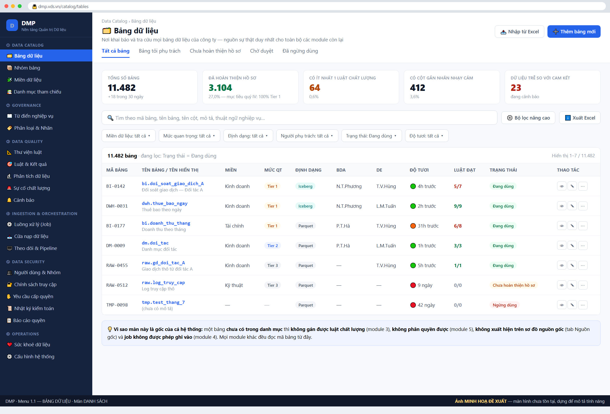

**Màn này trả lời:** *công ty có bảng nào, bảng nào dùng được, bảng nào đang bỏ hoang.*

**5 thẻ số liệu trên đầu — đây là phần quan trọng nhất của màn**

| Thẻ | Ý nghĩa | Vì sao cần |
|---|---|---|
| **Tổng số bảng** — 11.482 | Toàn bộ bảng đã khai | Con số nền |
| **Đã hoàn thiện hồ sơ** — 3.104 (27%) | Bảng khai đủ mô tả, người phụ trách, miền, Tier | **Chỉ số quản trị chính** — báo cáo tiến độ hằng quý bằng con số này |
| **Có ít nhất 1 luật chất lượng** — 64 (0,6%) | Bảng đang thực sự được kiểm | Cho thấy khoảng cách thật giữa "có dữ liệu" và "tin được dữ liệu" |
| **Có cột gắn nhãn nhạy cảm** — 412 | Bảng đã đánh dấu PII | Cơ sở để rà soát tuân thủ |
| **Dữ liệu trễ so với cam kết** — 23 | Bảng vượt quá chu kỳ đã khai | Danh sách việc cần xử lý ngay hôm nay |

**Các cột trong bảng danh sách**

| Cột | Nội dung | Ghi chú |
|---|---|---|
| Mã bảng | `BI-0142` | Hệ thống tự sinh theo vùng lưu trữ, dùng làm khoá tham chiếu ở mọi module khác |
| Tên bảng / Tên hiển thị | `bi.doi_soat_giao_dich_A` + tên tiếng Việt | Hai dòng — người kỹ thuật đọc dòng trên, người nghiệp vụ đọc dòng dưới |
| Miền | Kinh doanh | Lấy từ menu 1.3 |
| Mức QT | Tier 1 / 2 / 3 | Quyết định thứ tự ưu tiên khi có sự cố |
| Định dạng | Iceberg / Parquet | Iceberg mới sửa/xoá được từng dòng |
| BDA · DE | Người phụ trách | Ô trống là dấu hiệu bảng vô chủ |
| Độ tươi | 🟢 4h trước | So thời điểm cập nhật thật với chu kỳ cam kết |
| Luật đạt | 5/7 | Đỏ khi có luật thất bại |
| Trạng thái | Đang dùng / Chưa hoàn thiện hồ sơ / Ngừng dùng | |

**5 tab lọc nhanh:** Tất cả bảng · Bảng tôi phụ trách · Chưa hoàn thiện hồ sơ · Chờ duyệt · Đã ngừng dùng

**Đối chiếu SQLWF:** `table-management` đã có danh sách và tìm kiếm, nhưng **chỉ tìm theo tên bảng**, không có 5 thẻ số liệu, không có cột Tier · độ tươi · luật đạt · trạng thái vòng đời.

</details>

<details open>
<summary><b>Màn 2 — Thêm bảng mới</b></summary>

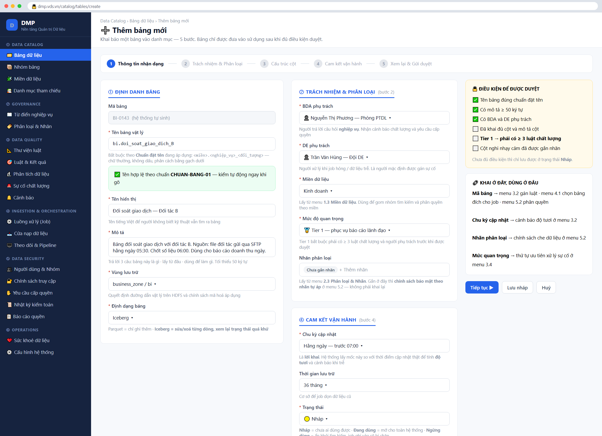

**Màn này trả lời:** *muốn đưa một bảng vào hệ thống thì phải khai những gì.*

**Các trường phải khai**

| Nhóm | Trường | Bắt buộc | Khai để làm gì |
|---|---|:---:|---|
| ① Định danh | Mã bảng | — | Hệ thống tự sinh, dùng làm khoá ở mọi module |
| ① | Tên bảng vật lý | ✔ | **Kiểm theo chuẩn đặt tên ngay khi gõ** — sai thì không lưu được |
| ① | Tên hiển thị | ✔ | Để người không biết kỹ thuật tìm được bảng |
| ① | Mô tả | ✔ | Trả lời 3 câu: là gì · lấy từ đâu · dùng làm gì. Tối thiểu 50 ký tự |
| ① | Vùng lưu trữ | ✔ | Quyết định đường dẫn HDFS và chính sách mã hoá |
| ① | Định dạng bảng | ✔ | Parquet chỉ ghi thêm · **Iceberg sửa/xoá được từng dòng** |
| ② Trách nhiệm | BDA phụ trách | ✔ | Người trả lời câu hỏi nghiệp vụ · **duyệt yêu cầu xin quyền** ở 5.3 |
| ② | DE phụ trách | ✔ | Người xử lý khi job hỏng · **được gán sự cố tự động** ở 3.4 |
| ② | Miền dữ liệu | ✔ | Lấy từ 1.3 — chọn miền thì BDA/DE được điền sẵn theo mặc định của miền |
| ③ Phân loại | Mức độ quan trọng | ✔ | Tier 1 bắt buộc có ≥ 3 luật chất lượng mới được duyệt |
| ③ | Nhãn phân loại | — | Lấy từ 2.2 — gắn ở đây thì **chính sách che dữ liệu ở 5.2 tự áp** |
| ④ Vận hành | Chu kỳ cập nhật | ✔ | **Chỉ là lời khai.** Hệ thống lấy mốc này so với thời điểm cập nhật thật để tính độ tươi và cảnh báo trễ. Không khai thì không cảnh báo được |
| ④ | Thời gian lưu trữ | — | Cơ sở để job dọn dữ liệu cũ |
| ④ | Trạng thái | ✔ | Nháp = chưa ai dùng được · Đang dùng = mở cho toàn hệ thống · Ngừng dùng = ẩn khỏi tìm kiếm và **chặn job ghi vào** |

**Khối "Điều kiện để được duyệt"** — danh sách tick ở cột phải. Chưa đủ thì chỉ lưu được ở trạng thái **Nháp**:

✅ Tên đúng chuẩn · ✅ Mô tả ≥ 50 ký tự · ✅ Có BDA và DE · ⬜ Đã khai đủ cột và mô tả cột · ⬜ **Tier 1 → phải có ≥ 3 luật chất lượng** · ⬜ Cột nghi nhạy cảm đã gắn nhãn

**Đối chiếu SQLWF:** form khai bảng hiện tại **đã có phần lớn trường này** — kể cả `businessOwner`, `dataEngineerOwner`, `syncFrequency`. Ba thứ phải thêm: **mức quan trọng (Tier)** · **trạng thái vòng đời** · **cổng chặn khi khai thiếu**.

</details>

<details open>
<summary><b>Màn 3 — Chi tiết bảng, tab Tổng quan</b></summary>

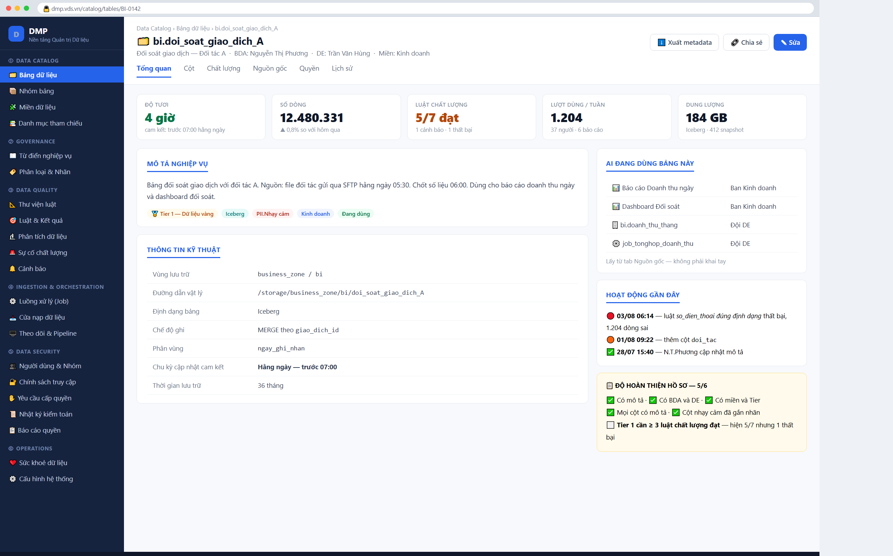

**Màn này trả lời:** *bảng này có tin được không, và nếu có vấn đề thì gọi ai.*

**Bố cục 3 phần**

| Phần | Nội dung |
|---|---|
| **5 thẻ số liệu** | Độ tươi *(kèm cam kết)* · Số dòng *(kèm % thay đổi)* · Luật chất lượng · Lượt dùng/tuần · Dung lượng |
| **Cột trái** | Mô tả nghiệp vụ + các nhãn · Thông tin kỹ thuật *(vùng lưu trữ, đường dẫn, định dạng, chế độ ghi, phân vùng, chu kỳ cam kết, thời gian lưu)* |
| **Cột phải** | Ai đang dùng bảng này · Hoạt động gần đây · **Độ hoàn thiện hồ sơ** |

**Hai khối đáng chú ý**

**"Ai đang dùng bảng này"** — liệt kê báo cáo, bảng và job đang phụ thuộc. Dữ liệu này **lấy từ tab Nguồn gốc, không khai tay**. Nó trả lời câu hỏi thực tế nhất: *"tôi sửa bảng này thì phải báo ai."*

**"Độ hoàn thiện hồ sơ — 5/6"** — danh sách tick, dòng chưa đạt được tô rõ. Ở ví dụ này bảng là Tier 1 nhưng có luật đang thất bại nên chưa đạt điều kiện cuối.

</details>

<details open>
<summary><b>Màn 4 — tab Cột ⭐</b></summary>

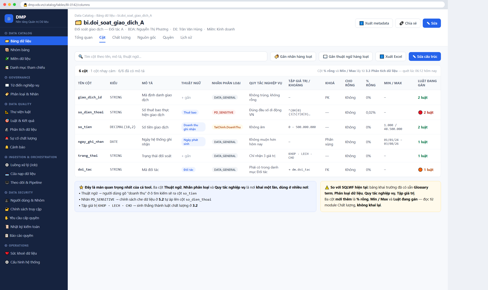

**Đây là màn quan trọng nhất của cả tool.** Mọi thứ về cột nằm ở đây, không phải đi menu khác.

**12 cột thông tin cho mỗi trường dữ liệu**

| Cột | Nguồn | Dùng ở đâu |
|---|---|---|
| Tên cột · Kiểu · Mô tả | Người khai | Tìm kiếm |
| **Thuật ngữ** | Chọn từ 2.1 | Gõ "doanh thu" ở ô tìm kiếm sẽ ra cột `so_tien` dù tên cột không chứa chữ đó |
| **Nhãn phân loại** | Chọn từ 2.2 | Nhãn `PD_SENSITIVE` → chính sách che dữ liệu ở 5.2 **tự áp** lên cột này |
| **Quy tắc nghiệp vụ** | Người khai, viết bằng chữ | Người đọc hiểu ý nghĩa; là gợi ý để đặt luật |
| **Tập giá trị / Khoảng** | Người khai | `KHOP · LECH · CHO` → **sinh thẳng thành luật kiểm tập giá trị** ở 3.2 |
| Khoá · Cho rỗng | Người khai | Sinh luật không trùng, không rỗng |
| **% rỗng** · **Min / Max** | **Đọc từ 3.3 Phân tích dữ liệu** | Không khai lại — đúng nguyên tắc *đo một nơi, hiện nhiều nơi* |
| **Luật đang gán** | Đọc từ 3.2 | Bấm vào nhảy sang xem chi tiết luật |

**Bốn thao tác**

- Tìm cột theo tên, mô tả, thuật ngữ
- **Gắn nhãn hàng loạt** — chọn nhiều cột rồi gắn một lần, quan trọng với bảng vài trăm cột
- **Gắn thuật ngữ hàng loạt**
- Xuất Excel · Sửa cấu trúc

**Đối chiếu SQLWF:** bảng khai trường hiện tại **đã có sẵn** `Glossary term` · `Phân loại dữ liệu` · `Quy tắc nghiệp vụ` · `Tập giá trị`. Ba cột **mới thêm** là `% rỗng` · `Min / Max` · `Luật đang gán` — và cả ba đều **đọc từ module Chất lượng**, không phải khai thêm.

</details>

<details open>
<summary><b>Màn 5 — tab Chất lượng</b></summary>

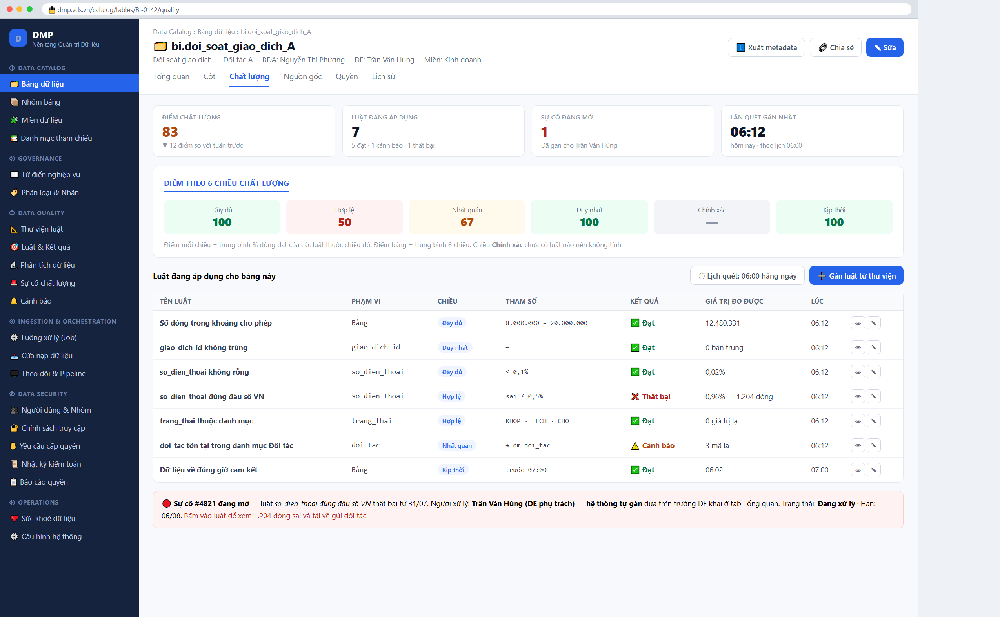

**Màn này trả lời:** *dữ liệu trong bảng này có sạch không, sai ở đâu, ai đang xử lý.*

**Cách chấm điểm** — hiển thị bằng dải 6 chiều:

> % dòng đạt của một luật = **điểm luật** → trung bình các luật cùng chiều = **điểm chiều** → trung bình 6 chiều = **điểm bảng**

Ở ví dụ: Đầy đủ 100 · **Hợp lệ 50** · Nhất quán 67 · Duy nhất 100 · Chính xác **—** · Kịp thời 100 → điểm bảng **83**.

Chiều **Chính xác** để trống vì chưa có luật nào thuộc chiều đó — **không tính vào trung bình**. Chi tiết này quan trọng: nếu tính 0 điểm thì bảng nào cũng bị kéo tụt oan.

**Bảng luật đang áp dụng** — mỗi dòng có: tên luật *(viết bằng tiếng Việt)* · phạm vi · chiều chất lượng · tham số · kết quả · **giá trị đo được cụ thể** · thời điểm chạy.

**Khối sự cố dưới cùng** — điểm đáng chú ý nhất:

> Sự cố được **tự gán cho DE phụ trách** dựa trên trường đã khai ở tab Tổng quan. Không ai phải quyết định giao cho ai. Đây chính là ví dụ của nguyên tắc *khai một lần, dùng nhiều nơi*.

**Đối chiếu SQLWF:** `data-quality` hiện chỉ có bật/tắt + chọn chỉ số + chu kỳ + nhóm nhận email. **Không có** chấm điểm, không có 6 chiều, không có sự cố có người xử lý.

</details>

<details open>
<summary><b>Màn 6 — tab Nguồn gốc</b></summary>

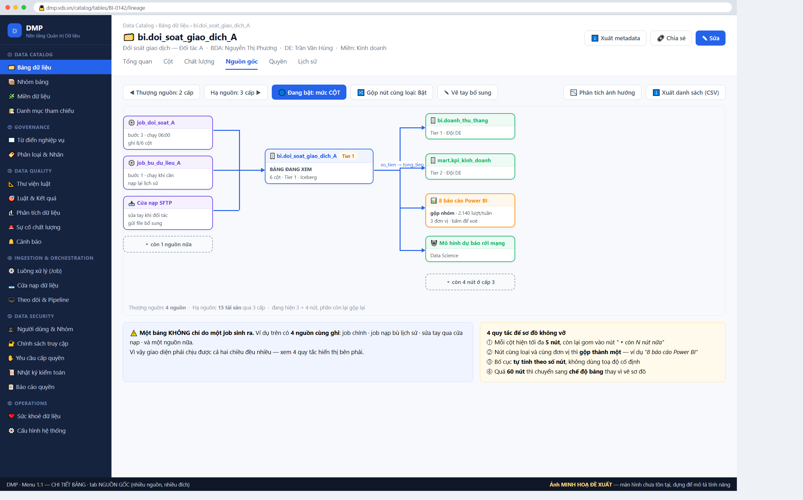

**Màn này trả lời hai câu:** *số này lấy từ đâu ra* và *tôi sửa cột này thì cái gì gãy.*

**⚠️ Quan hệ bảng ↔ job là NHIỀU-NHIỀU, không phải 1-1**

Đã đối chiếu mã nguồn để chắc chắn:

| Chiều | Thực tế | Bằng chứng trong code |
|---|---|---|
| Một **job** ghi ra bao nhiêu bảng | **Nhiều** — mỗi bước ghi một bảng | `TempJob.steps` là `List<StepInfo>`, mỗi `StepInfo` có một `output` riêng |
| Một **bảng** do bao nhiêu nguồn sinh ra | **Nhiều** | `TableLineageNodeEntity.targetOfSteps` là **`List`**, không phải một giá trị |
| Một **bảng** là đầu vào cho bao nhiêu nơi | **Nhiều** | `sourceOfSteps` cũng là `List` |

**Bốn tình huống thật khiến một bảng có nhiều nguồn ghi**

1. **Job chính + job nạp bù lịch sử** — job chạy hằng ngày, thêm job backfill khi cần nạp lại
2. **Nhiều job theo lát cắt** — mỗi đối tác hoặc mỗi vùng một job, cùng ghi vào một bảng chung
3. **Job + cửa nạp thủ công** — bảng vừa có job ghi vừa nhận sửa tay khi đối tác gửi file bổ sung
4. **Nhiều bước trong cùng một job** cùng ghi vào một bảng

**Bốn quy tắc hiển thị để sơ đồ không vỡ**

| # | Quy tắc | Vì sao |
|:---:|---|---|
| ① | Mỗi cột hiện tối đa **5 nút**, còn lại gom vào nút *"▾ còn N nút nữa"* | Bảng Tier 1 có thể có hàng chục nút hạ nguồn |
| ② | Nút **cùng loại và cùng đơn vị thì gộp thành một** — ví dụ *"8 báo cáo Power BI"*, bấm mới xoè | Tránh 8 ô báo cáo giống hệt nhau chiếm hết màn |
| ③ | Bố cục **tự tính theo số nút**, không dùng toạ độ cố định | Nếu cắm toạ độ cứng thì thêm một nút là vỡ |
| ④ | Quá **60 nút** thì chuyển sang **chế độ bảng** thay vì vẽ sơ đồ | Sơ đồ 60+ nút không ai đọc được — bảng có lọc và sắp xếp hữu ích hơn |

**Ba trường hợp biên phải xử lý**

| Trường hợp | Hiển thị thế nào |
|---|---|
| Bảng **không có nguồn nào** — nạp bằng upload thủ công, hoặc job chưa bật quét nguồn gốc | Cột trái để trống kèm dòng *"Chưa ghi nhận nguồn nào — có thể do job chưa bật quét nguồn gốc"*. **Không được để trống trơn** khiến người xem tưởng bảng tự sinh ra |
| **Vòng lặp** — A sinh ra B, B lại ghi ngược vào A *(hay gặp ở job nạp bù)* | Vẽ đường quay lại có màu khác + cảnh báo, **không đệ quy vô hạn** |
| Bảng **tự đọc chính nó** — `INSERT INTO t SELECT FROM t` | Vẽ vòng lặp tại chỗ trên chính nút đó |

**Thanh công cụ:** số cấp thượng nguồn · số cấp hạ nguồn · bật/tắt mức cột · **gộp nút cùng loại** · **vẽ tay bổ sung** · **phân tích ảnh hưởng** · **xuất danh sách CSV**.

**Đối chiếu SQLWF:** `data-linage` đã có sơ đồ mức bảng trên Neo4j. Thiếu: **mức cột** · **màn phân tích ảnh hưởng + xuất CSV** · **nguồn gốc từ cửa nạp không qua SQL** · **chỉ số độ phủ**.

</details>

<details open>
<summary><b>Màn 7 — tab Quyền</b></summary>

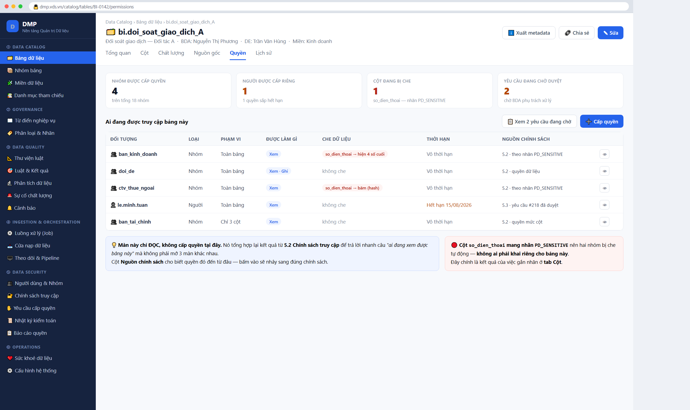

**Màn này trả lời:** *ai đang xem được bảng này, và họ thấy dữ liệu ở dạng nào.*

**Đây là màn CHỈ ĐỌC — không cấp quyền tại đây.** Nó tổng hợp kết quả từ 5.2 để trả lời nhanh mà không phải mở 3 màn khác nhau.

**Các cột**

| Cột | Nội dung |
|---|---|
| Đối tượng · Loại | Nhóm hay cá nhân |
| Phạm vi | Toàn bảng hay chỉ một số cột |
| Được làm gì | Xem · Ghi |
| **Che dữ liệu** | Cột nào bị che và che kiểu gì — ví dụ `so_dien_thoai → hiện 4 số cuối` |
| **Thời hạn** | Vô thời hạn hoặc ngày hết hạn — quyền cấp qua 5.3 luôn có hạn |
| **Nguồn chính sách** | Quyền này đến từ đâu — bấm vào nhảy sang đúng chính sách |

**Điểm cần thấy rõ:** hai nhóm bị che cột `so_dien_thoai` **không phải do ai khai riêng cho bảng này**, mà vì cột đó mang nhãn `PD_SENSITIVE` gắn ở tab Cột, và chính sách theo nhãn ở 5.2 tự áp xuống.

</details>

<details open>
<summary><b>Màn 8 — tab Lịch sử</b></summary>

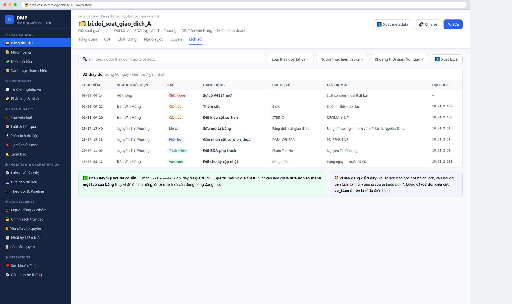

**Màn này trả lời:** *hôm qua ai sửa gì bảng này.* Đây luôn là câu hỏi đầu tiên khi số liệu báo cáo đột nhiên lệch.

**Các cột:** Thời điểm · Người thực hiện · **Loại thay đổi** · Hành động · **Giá trị cũ** · **Giá trị mới** · Địa chỉ IP

**6 loại thay đổi được ghi:** Cấu trúc · Mô tả · Phân loại · Trách nhiệm · Vận hành · Chất lượng

Ví dụ trong ảnh: dòng **01/08 đổi kiểu cột `so_tien` từ `STRING` sang `DECIMAL(18,2)`** — đúng loại thay đổi hay gây lệch số liệu ở hạ nguồn.

**Đối chiếu SQLWF:** ✅ **Phần này đã có sẵn** — `history-data` ghi đầy đủ giá trị cũ → mới và địa chỉ IP. Việc cần làm chỉ là **đưa vào thành tab của bảng** thay vì để ở màn riêng, để xem được lịch sử của đúng bảng đang mở.

</details>

---

## 1.2 Nhóm bảng

<details open>
<summary><b>Menu này để làm gì</b></summary>

**Mục đích:** gom nhiều bảng thành một bộ để **cấp quyền một lần cho cả nhóm**, thay vì cấp từng bảng.

Khi thêm bảng mới vào nhóm, mọi người đang có quyền trên nhóm **tự động thấy bảng mới** — không phải cấp lại.

**2 màn:** Danh sách · Thêm mới

</details>

<details open>
<summary><b>Màn 9 — Danh sách nhóm bảng</b></summary>

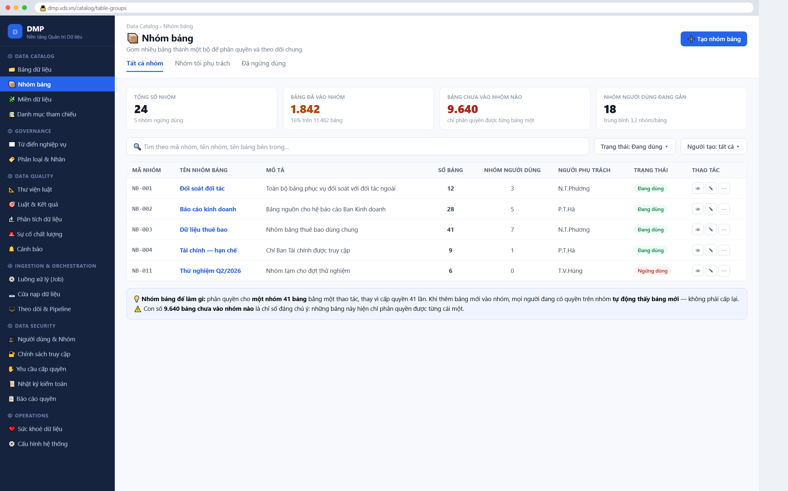

**Các cột:** Mã nhóm · Tên nhóm · Mô tả · **Số bảng** · **Số nhóm người dùng đang gắn** · Người phụ trách · Trạng thái

**Bốn thẻ số liệu** — trong đó có một con số đáng chú ý:

> **9.640 bảng chưa vào nhóm nào** — những bảng này hiện chỉ phân quyền được từng cái một.

Đây là chỉ số quản trị nên theo dõi: tỉ lệ bảng đã được gom nhóm càng cao thì việc cấp quyền càng nhẹ.

**Đối chiếu SQLWF:** ✅ `table-monitor` đã có đủ, kể cả bật/tắt từng bảng trong nhóm.

</details>

<details open>
<summary><b>Màn 10 — Tạo nhóm bảng</b></summary>

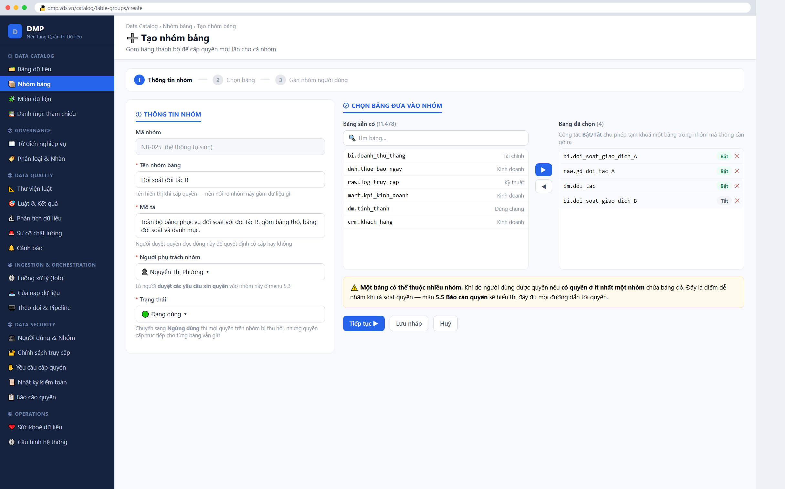

**Các trường phải khai**

| Trường | Bắt buộc | Khai để làm gì |
|---|:---:|---|
| Mã nhóm | — | Tự sinh |
| Tên nhóm bảng | ✔ | Tên hiển thị khi cấp quyền — nên nói rõ nhóm gồm dữ liệu gì |
| Mô tả | ✔ | **Người duyệt quyền đọc dòng này để quyết định có cấp hay không** |
| Người phụ trách nhóm | ✔ | Là người **duyệt yêu cầu xin quyền** vào nhóm ở menu 5.3 |
| Trạng thái | ✔ | Ngừng dùng thì mọi quyền trên nhóm bị thu hồi, nhưng quyền cấp trực tiếp cho từng bảng vẫn giữ |

**Cách chọn bảng:** hai cột — *Bảng sẵn có* bên trái, *Bảng đã chọn* bên phải, chuyển qua lại bằng nút mũi tên. Mỗi bảng trong nhóm có **công tắc Bật/Tắt** để tạm khoá mà không cần gỡ ra.

**Điểm dễ nhầm khi rà soát quyền**

> Một bảng có thể thuộc **nhiều nhóm**. Người dùng được quyền nếu có quyền ở **ít nhất một nhóm** chứa bảng đó. Vì vậy màn **5.5 Báo cáo quyền** phải hiển thị đầy đủ mọi đường dẫn tới quyền, không chỉ một.

</details>

---

## 1.3 Miền dữ liệu

<details open>
<summary><b>Menu này để làm gì</b></summary>

**Mục đích:** khai lĩnh vực nghiệp vụ theo **cây phân cấp tối đa 3 cấp**, dùng để gom nhóm khi tìm kiếm, phân quyền theo miền, và **điền sẵn người phụ trách** khi tạo bảng mới.

**2 màn:** Danh sách *(cây bên trái, chi tiết bên phải)* · Thêm mới

</details>

<details open>
<summary><b>Màn 11 — Cây miền dữ liệu</b></summary>

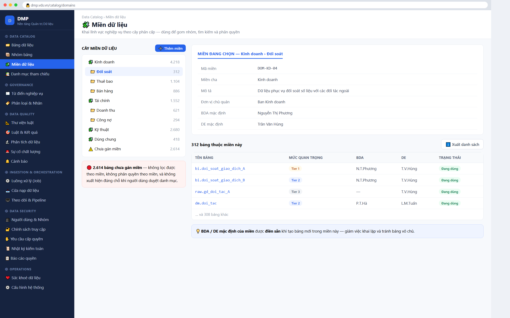

**Bố cục:** cây miền bên trái *(mỗi nhánh kèm số bảng)*, thông tin miền đang chọn và danh sách bảng thuộc miền bên phải.

**Dòng cuối cây là chỗ đáng chú ý:**

> ⚠️ **Chưa gán miền — 2.614 bảng.** Những bảng này không lọc được theo miền, không phân quyền theo miền, và không xuất hiện đúng chỗ khi người dùng duyệt danh mục.

**Đối chiếu SQLWF:** ✅ `domain-management` đã có `domain-categories`, `domain-details`, và màn `metadata/domain/:domainName` hiển thị BDA/DE/Tags theo miền.

</details>

<details open>
<summary><b>Màn 12 — Thêm miền dữ liệu</b></summary>

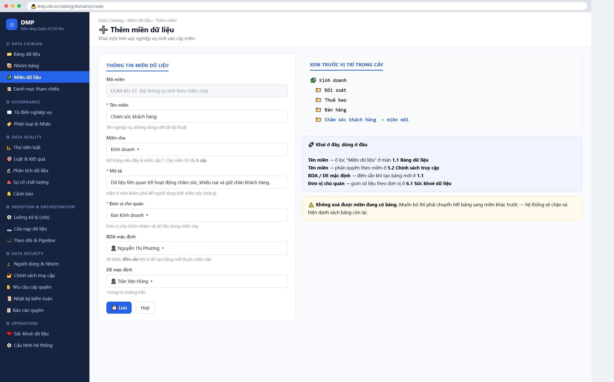

**Các trường phải khai**

| Trường | Bắt buộc | Khai để làm gì |
|---|:---:|---|
| Mã miền | — | Tự sinh theo miền cha |
| Tên miền | ✔ | Tên nghiệp vụ, không dùng viết tắt kỹ thuật |
| Miền cha | — | Để trống nếu là miền cấp 1. Cây tối đa 3 cấp |
| Mô tả | ✔ | Hiện ở màn khám phá để người dùng biết miền chứa gì |
| Đơn vị chủ quản | ✔ | Đơn vị chịu trách nhiệm về dữ liệu trong miền |
| **BDA mặc định** | — | **Điền sẵn khi ai đó tạo bảng mới thuộc miền này** |
| **DE mặc định** | — | Tương tự |

**Ràng buộc:** không xoá được miền đang có bảng. Hệ thống chặn và hiện danh sách bảng còn lại để chuyển đi trước.

**Khối "Khai ở đây, dùng ở đâu"** — cụ thể cho miền dữ liệu:

- **Tên miền** → ô lọc "Miền dữ liệu" ở màn 1.1 · phân quyền theo miền ở 5.2
- **BDA / DE mặc định** → điền sẵn khi tạo bảng mới ở 1.1
- **Đơn vị chủ quản** → gom số liệu theo đơn vị ở 6.1 Sức khoẻ dữ liệu

</details>

---

## 1.4 Danh mục tham chiếu

<details open>
<summary><b>Menu này để làm gì — và vì sao nó phải là menu chứ không phải tab</b></summary>

**Mục đích:** quản lý các danh mục dùng chung — Đối tác, Tỉnh/Thành, Trạng thái, Gói cước… Mỗi danh mục có **vòng đời riêng**: khai định nghĩa → nhập dữ liệu → phê duyệt → có phiên bản.

**Vì sao là menu riêng:** ngoài việc là dữ liệu độc lập, nó còn là **nguồn đối chiếu cho luật chất lượng**. Luật *"mã đối tác phải tồn tại trong danh mục Đối tác"* không chạy được nếu không có menu này.

**Mô hình 2 tầng**

| Tầng | Nội dung |
|---|---|
| **Định nghĩa danh mục** | Tên, nhóm, người phụ trách, và **cấu trúc các trường** |
| **Dữ liệu trong danh mục** | Từng bản ghi, có trạng thái phê duyệt và phiên bản |

**3 màn:** Danh sách · Thêm mới *(khai định nghĩa)* · Chi tiết *(dữ liệu + phiên bản)*

</details>

<details open>
<summary><b>Màn 13 — Danh sách danh mục</b></summary>

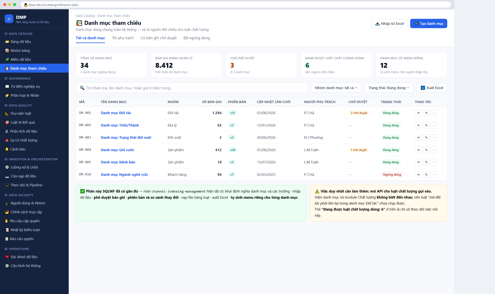

**Các cột:** Mã · Tên danh mục · Nhóm · **Số bản ghi** · **Phiên bản** · Cập nhật lần cuối · Người phụ trách · **Chờ duyệt** · Trạng thái

**Năm thẻ số liệu** — trong đó có hai thẻ đo mức độ nối:

- **Đang được luật chất lượng dùng — 6** *(làm nguồn đối chiếu)*
- **Danh mục có menu riêng — 12** *(tự sinh menu cho người nhập liệu)*

**Đối chiếu SQLWF:** ✅ `channel-indexing-management` **đã có gần đủ** — khai định nghĩa, nhập dữ liệu, phê duyệt bản ghi, phiên bản và so sánh thay đổi, nạp file, xuất Excel, tự sinh menu riêng.

> ⚠️ **Việc duy nhất cần làm thêm: mở API cho luật chất lượng gọi vào.** Hiện danh mục và module Chất lượng không biết đến nhau.

</details>

<details open>
<summary><b>Màn 14 — Tạo danh mục</b></summary>

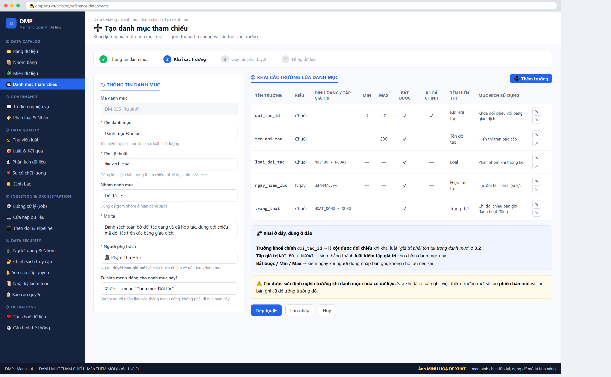

**Bước 1 — thông tin danh mục**

| Trường | Bắt buộc | Khai để làm gì |
|---|:---:|---|
| Mã danh mục | — | Tự sinh |
| Tên danh mục | ✔ | Tên hiển thị ở ô chọn khi khai luật chất lượng |
| **Tên kỹ thuật** | ✔ | Dùng khi luật tham chiếu tới, ví dụ `→ dm_doi_tac` |
| Nhóm danh mục | — | Gom nhóm ở màn danh sách |
| Mô tả | ✔ | |
| Người phụ trách | ✔ | **Duyệt bản ghi mới** và chịu trách nhiệm nội dung |
| Tự sinh menu riêng? | — | Bật thì người nhập liệu vào thẳng menu riêng |

**Bước 2 — khai các trường của danh mục**

Mỗi trường khai: Tên trường · Kiểu · **Định dạng / Tập giá trị** · Min · Max · **Bắt buộc** · **Khoá chính** · Tên hiển thị · Mục đích sử dụng.

**Ba trường quyết định việc nối sang module Chất lượng:**

| Khai gì ở đây | Sinh ra gì ở 3.2 |
|---|---|
| **Trường khoá chính** `doi_tac_id` | Là **cột được đối chiếu** khi khai luật *"giá trị phải tồn tại trong danh mục"* |
| **Tập giá trị** `NOI_BO / NGOAI` | Sinh thẳng thành **luật kiểm tập giá trị** cho chính danh mục |
| **Bắt buộc · Min · Max** | Kiểm ngay khi nhập bản ghi, không cho lưu nếu sai |

**Ràng buộc:** chỉ sửa được định nghĩa trường khi danh mục **chưa có dữ liệu**. Sau khi đã có bản ghi, thêm trường mới sẽ tạo **phiên bản mới** và các bản ghi cũ để trống trường đó.

</details>

<details open>
<summary><b>Màn 15 — Chi tiết danh mục ⭐</b></summary>

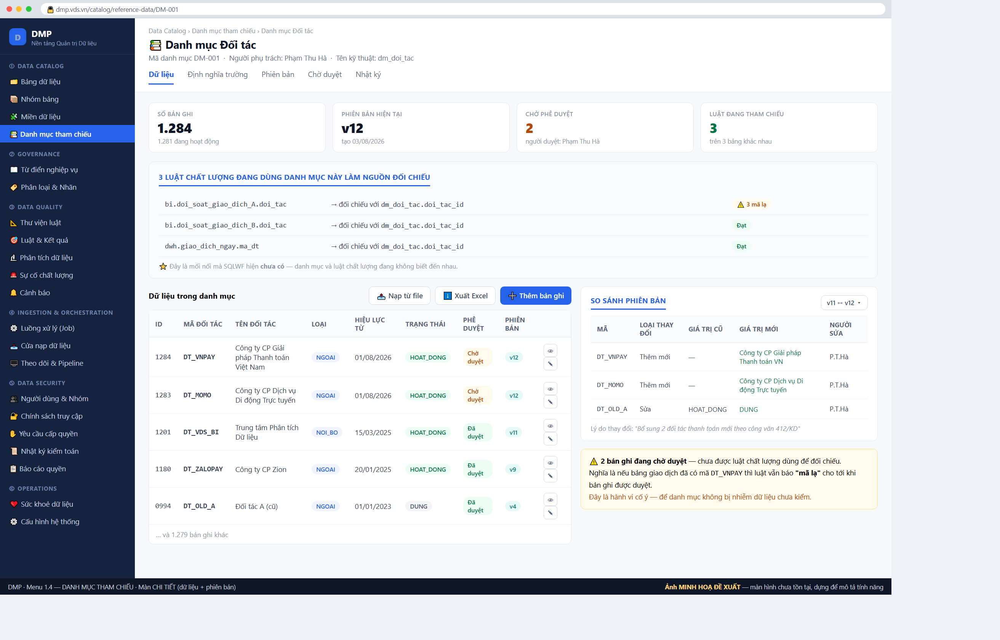

**5 tab:** Dữ liệu · Định nghĩa trường · Phiên bản · Chờ duyệt · Nhật ký

**Khối trên cùng là điểm mới quan trọng nhất của menu này**

> **3 luật chất lượng đang dùng danh mục này làm nguồn đối chiếu** — liệt kê rõ cột nào của bảng nào đối chiếu với cột nào của danh mục, kèm kết quả gần nhất.

Đây chính là mối nối mà SQLWF hiện **chưa có**. Có khối này thì người phụ trách danh mục biết được: sửa danh mục sẽ ảnh hưởng tới luật nào.

**Bảng dữ liệu:** mỗi bản ghi có ID · các trường đã khai · **trạng thái phê duyệt** · **phiên bản tạo ra nó**.

**Khối so sánh phiên bản:** chọn hai phiên bản để xem khác nhau chỗ nào — mã · loại thay đổi · giá trị cũ · giá trị mới · người sửa · **lý do thay đổi**.

**Một hành vi cần hiểu đúng**

> Bản ghi **đang chờ duyệt chưa được luật chất lượng dùng để đối chiếu**. Nghĩa là nếu bảng giao dịch đã có mã `DT_VNPAY` mà bản ghi chưa duyệt, luật vẫn báo **"mã lạ"**.
>
> Đây là **hành vi cố ý** — để danh mục không bị nhiễm dữ liệu chưa kiểm. Nhưng phải nói rõ với người dùng, nếu không họ sẽ tưởng hệ thống lỗi.

</details>

---

## Tổng kết Module ①

<details open>
<summary><b>15 màn · việc phải làm · thứ tự triển khai</b></summary>

| Menu | Số màn | Việc | Phần lớn công sức nằm ở đâu |
|---|:---:|:---:|---|
| **1.1 Bảng dữ liệu** | 8 | 🔵 Nâng cấp | Tìm kiếm toàn văn · 3 trường mới · tab Cột đọc chỉ số từ Chất lượng · tab Nguồn gốc mức cột · cổng chặn khi khai thiếu |
| **1.2 Nhóm bảng** | 2 | 🟢 Giữ | Gần như giữ nguyên `table-monitor`, chỉ thêm thẻ số liệu |
| **1.3 Miền dữ liệu** | 2 | 🟢 Giữ | Thêm **BDA/DE mặc định** để điền sẵn khi tạo bảng |
| **1.4 Danh mục tham chiếu** | 3 | 🟢 Giữ | Chỉ cần **mở API cho luật chất lượng gọi vào** |

**Thứ tự triển khai đề xuất**

1. **1.3 Miền dữ liệu** — thêm BDA/DE mặc định *(nhỏ, làm trước để bước sau dùng được)*
2. **1.1 Bảng dữ liệu** — nâng cấp form khai + tìm kiếm + tab Cột *(khối lượng lớn nhất)*
3. **1.4 Danh mục tham chiếu** — mở API *(chặn module ③)*
4. **1.2 Nhóm bảng** — thêm thẻ số liệu *(nhỏ nhất, làm cuối)*

**Ba việc ở Module ① chặn các module sau**

| Việc | Chặn cái gì |
|---|---|
| Tab Cột gắn được **nhãn phân loại** | Chặn toàn bộ 5.2 Che dữ liệu và chính sách theo nhãn |
| **Mã bảng** làm khoá tham chiếu chuẩn | Chặn 3.2 gán luật · 4.1 chọn bảng đích · 5.2 phân quyền |
| **1.4 mở API** | Chặn luật *"giá trị phải tồn tại trong danh mục"* ở 3.2 |

</details>

---

# PHẦN 3 — MODULE ② GOVERNANCE

> **2 menu · 5 màn hình.** Module này cung cấp **từ vựng và nhãn dùng chung** — khai một lần, mọi bảng dùng lại. Không có nó thì tìm kiếm ở 1.1 và che dữ liệu ở 5.2 đều không chạy được.

---

## 2.1 Business Glossary — Từ điển nghiệp vụ

<details open>
<summary><b>Menu này để làm gì</b></summary>

**Hai mục đích, và mục đích thứ hai mới là quan trọng:**

1. Thống nhất cách hiểu khái niệm trong toàn công ty — *"doanh thu"* nghĩa là gì
2. **Gắn khái niệm đó vào các cột dữ liệu thật** — để người dùng tìm bằng ngôn ngữ nghiệp vụ vẫn ra đúng cột kỹ thuật

Không làm việc thứ hai thì từ điển chỉ là một quyển sách nằm riêng.

**3 màn:** Danh sách · Chi tiết · Thêm mới

**Vai trò**

| Vai trò | Xem | Đề xuất thuật ngữ | Sửa | Duyệt |
|---|:---:|:---:|:---:|:---:|
| Người dùng thường | ✔ | ✔ *(vào trạng thái Nháp)* | | |
| Steward | ✔ | ✔ | ✔ *(thuật ngữ mình phụ trách)* | |
| Chủ sở hữu *(đơn vị)* | ✔ | ✔ | ✔ | ✔ |

</details>

<details open>
<summary><b>Màn 16 — Danh sách thuật ngữ</b></summary>

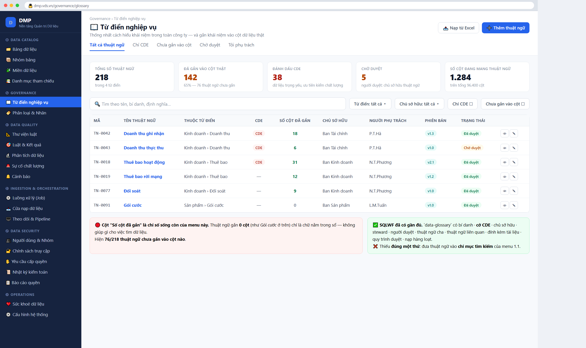

**Các cột:** Mã · Tên thuật ngữ · Thuộc từ điển · **CDE** · **Số cột đã gắn** · Chủ sở hữu · Người phụ trách · Phiên bản · Trạng thái

**Năm thẻ số liệu** — hai thẻ quan trọng nhất:

| Thẻ | Vì sao quan trọng |
|---|---|
| **Đã gắn vào cột thật — 142/218 (65%)** | Đây là **chỉ số sống còn của menu này**. Thuật ngữ gắn 0 cột chỉ là chữ trong sổ, không giúp gì cho việc tìm dữ liệu |
| **Đánh dấu CDE — 38** | Dữ liệu trọng yếu, kéo theo ràng buộc bắt buộc phải có luật chất lượng |

Ở ảnh có ví dụ cụ thể: thuật ngữ *Gói cước* gắn **0 cột** — tô xám để thấy ngay.

**5 tab lọc:** Tất cả · Chỉ CDE · **Chưa gắn vào cột** · Chờ duyệt · Tôi phụ trách

**Đối chiếu SQLWF:** ✅ `data-glossary` **đã có gần đủ** — bí danh, cờ CDE, chủ sở hữu, steward, người duyệt, thuật ngữ cha, thuật ngữ liên quan, đính kèm tài liệu, quy trình duyệt, nạp hàng loạt. ❌ Thiếu **đúng một thứ**: đưa thuật ngữ vào **chỉ mục tìm kiếm** của menu 1.1.

</details>

<details open>
<summary><b>Màn 17 — Chi tiết thuật ngữ</b></summary>

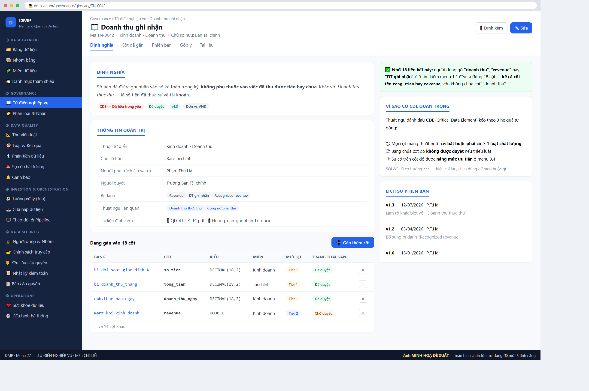

**5 tab:** Định nghĩa · Cột đã gắn · Phiên bản · Góp ý · Tài liệu

**Khối định nghĩa** — điểm cần chú ý về cách viết:

> Định nghĩa phải **nói rõ khác gì với thuật ngữ dễ nhầm**. Ví dụ trong ảnh: *"Khác với Doanh thu thực thu — là số tiền đã thực sự về tài khoản."* Không có câu này thì hai ban vẫn hiểu khác nhau dù cả hai đều đọc từ điển.

**Bảng "Đang gắn vào 18 cột"** — liệt kê bảng · cột · kiểu · miền · mức quan trọng · trạng thái gắn.

Nhờ 18 liên kết này, người dùng gõ **"doanh thu"**, **"revenue"** hay **"DT ghi nhận"** ở ô tìm kiếm menu 1.1 đều ra đúng 18 cột — **kể cả cột tên `tong_tien` hay `revenue`** vốn không chứa chữ "doanh thu".

**Vì sao cờ CDE quan trọng** — kéo theo 3 hệ quả tự động:

| # | Hệ quả | Ở menu nào |
|:---:|---|---|
| ① | Mọi cột mang thuật ngữ này **bắt buộc phải có ≥ 1 luật chất lượng** | 3.2 |
| ② | Bảng chứa cột đó **không được duyệt** nếu thiếu luật | 1.1 — cổng duyệt |
| ③ | Sự cố trên cột đó được **nâng mức ưu tiên** | 3.4 |

> SQLWF **đã có trường `cde`** — hiện chỉ lưu, chưa dùng để ràng buộc gì. Đây là ví dụ điển hình của vấn đề **V2 khai rồi để đó**.

</details>

<details open>
<summary><b>Màn 18 — Thêm thuật ngữ</b></summary>

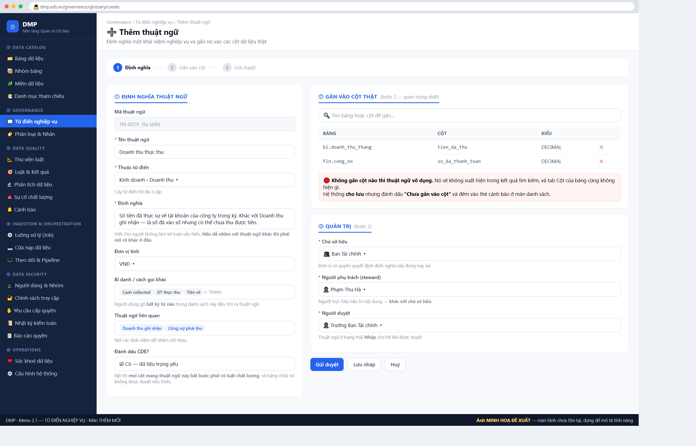

**Bước 1 — định nghĩa**

| Trường | Bắt buộc | Khai để làm gì |
|---|:---:|---|
| Mã thuật ngữ | — | Tự sinh |
| Tên thuật ngữ | ✔ | Tên chính thức |
| Thuộc từ điển | ✔ | Cây từ điển tối đa 3 cấp |
| Định nghĩa | ✔ | Viết cho người không làm chuyên môn vẫn hiểu. **Nếu dễ nhầm với thuật ngữ khác thì phải nói rõ khác ở đâu** |
| Đơn vị tính | — | Tránh nhầm đơn vị khi so số |
| **Bí danh / cách gọi khác** | — | Người dùng gõ **bất kỳ từ nào** trong danh sách này đều tìm ra thuật ngữ |
| Thuật ngữ liên quan | — | Nối các khái niệm dễ nhầm với nhau |
| **Đánh dấu CDE** | — | Bật thì kéo theo 3 ràng buộc ở màn 17 |

**Bước 2 — gắn vào cột thật.** Đây là bước quan trọng nhất.

> 🔴 Không gắn cột nào thì thuật ngữ **vô dụng** — không xuất hiện trong kết quả tìm kiếm, tab Cột của bảng cũng không hiện gì.
>
> Hệ thống **vẫn cho lưu** nhưng đánh dấu **"Chưa gắn vào cột"** và đếm vào thẻ cảnh báo ở màn danh sách. Không chặn cứng, vì có trường hợp thuật ngữ khai trước khi có dữ liệu.

**Bước 3 — quản trị**

| Trường | Bắt buộc | Ghi chú |
|---|:---:|---|
| Chủ sở hữu | ✔ | **Đơn vị** có quyền quyết định định nghĩa đúng hay sai |
| Người phụ trách (steward) | ✔ | **Người** trực tiếp bảo trì nội dung — khác với chủ sở hữu |
| Người duyệt | ✔ | Thuật ngữ ở trạng thái **Nháp** cho tới khi được duyệt |

</details>

---

## 2.2 Classification — Phân loại & Nhãn

<details open>
<summary><b>Menu này để làm gì — và vì sao nó là nền móng của trụ bảo mật</b></summary>

**Mục đích:** đánh dấu cột nào chứa dữ liệu nhạy cảm **một lần**, để mọi chính sách bảo mật gắn với nhãn đó **tự động áp** — không phải khai lại cho từng bảng.

**Con số minh hoạ giá trị:** 4 chính sách khai một lần → áp cho **144 cột** hiện tại và **mọi cột gắn nhãn sau này**.

**2 màn:** Cây nhãn + chi tiết · Thêm nhãn

**Hiện trạng SQLWF:** ✅ đã có nhãn ở mức cột (`tagIds` trên entity `Field`) với 3 giá trị `PD_BASIC` · `PD_SENSITIVE` · `DATA_GENERAL`, và **đã có đường đồng bộ sang OPA**. ❌ Thiếu: **cây phân cấp** · **gắn chính sách che dữ liệu vào nhãn** · **bộ dò gợi ý nhãn**.

</details>

<details open>
<summary><b>Màn 19 — Cây nhãn và chi tiết ⭐</b></summary>

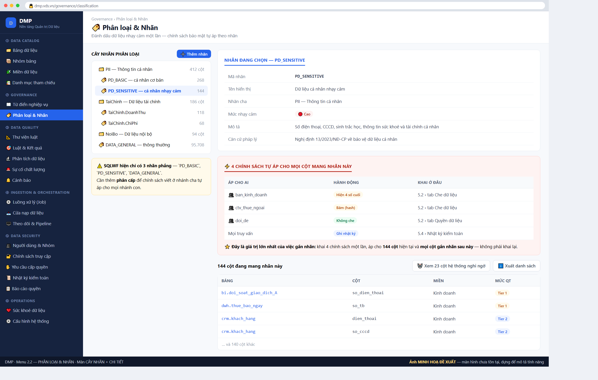

**Bố cục:** cây nhãn bên trái *(mỗi nhãn kèm số cột đang mang)*, chi tiết nhãn đang chọn bên phải.

**Các trường của một nhãn**

| Trường | Nội dung ví dụ | Ghi chú |
|---|---|---|
| Mã nhãn | `PD_SENSITIVE` | Là mã **đồng bộ sang OPA** — không đổi được sau khi tạo |
| Tên hiển thị | Dữ liệu cá nhân nhạy cảm | |
| Nhãn cha | PII — Thông tin cá nhân | Chính sách ở nhãn cha **tự áp xuống nhánh con** |
| Mức nhạy cảm | 🔴 Cao | Quyết định kiểu che gợi ý khi gắn cho cột mới |
| Mô tả | Số điện thoại, CCCD, sinh trắc học… | |
| **Căn cứ pháp lý** | Nghị định 13/2023/NĐ-CP | Ghi để phục vụ **kiểm toán tuân thủ** |

**Khối "4 chính sách tự áp" — đây là giá trị lớn nhất của menu**

| Áp cho ai | Hành động | Khai ở đâu |
|---|---|---|
| `ban_kinh_doanh` | Hiện 4 số cuối | 5.2 › tab Che dữ liệu |
| `ctv_thue_ngoai` | Băm (hash) | 5.2 › tab Che dữ liệu |
| `doi_de` | Không che | 5.2 › tab Quyền dữ liệu |
| Mọi truy vấn | Ghi nhật ký | 5.4 › Nhật ký kiểm toán |

**Nút "Xem 23 cột hệ thống nghi ngờ"** — bộ dò quét tên cột và dữ liệu mẫu, gợi ý cột nào nên gắn nhãn. Máy chỉ **gợi ý**, người quản trị dữ liệu quyết định.

**Điểm cần nói rõ trong tài liệu:** SQLWF hiện chỉ có **3 nhãn phẳng**, không có phân cấp. Cần thêm phân cấp để chính sách viết ở nhánh cha *(ví dụ toàn bộ `PII`)* tự áp cho mọi nhánh con.

</details>

<details open>
<summary><b>Màn 20 — Thêm nhãn phân loại</b></summary>

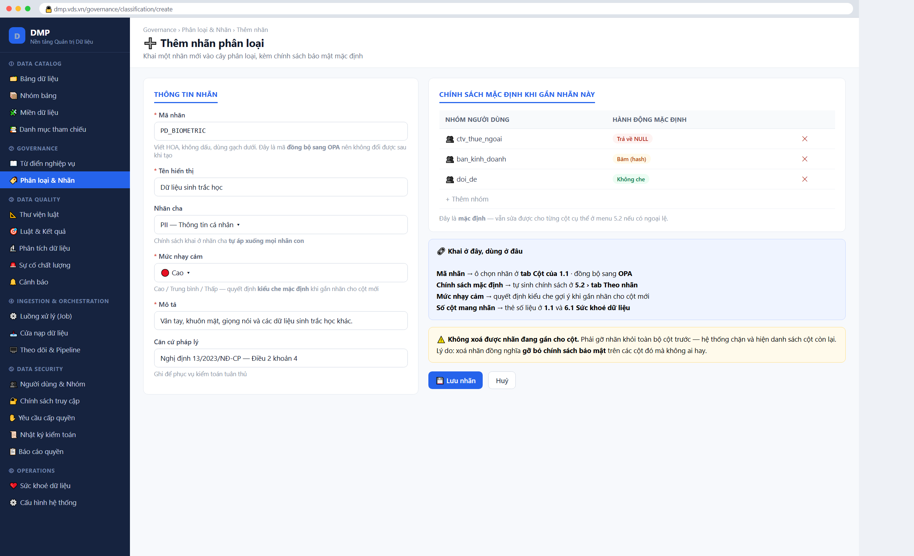

**Các trường phải khai**

| Trường | Bắt buộc | Khai để làm gì |
|---|:---:|---|
| **Mã nhãn** | ✔ | Viết HOA, không dấu, gạch dưới. Là mã **đồng bộ sang OPA** nên **không đổi được sau khi tạo** |
| Tên hiển thị | ✔ | Hiện trên tab Cột của bảng |
| Nhãn cha | — | Chính sách ở nhãn cha tự áp xuống nhãn con |
| Mức nhạy cảm | ✔ | Cao / Trung bình / Thấp — quyết định **kiểu che mặc định** |
| Mô tả | ✔ | |
| Căn cứ pháp lý | — | Phục vụ kiểm toán tuân thủ |

**Khối "Chính sách mặc định khi gắn nhãn này"** — khai luôn ở đây: nhóm nào thì che kiểu gì. Đây là **mặc định**, vẫn sửa được cho từng cột cụ thể ở 5.2 nếu có ngoại lệ.

**Ràng buộc quan trọng**

> ⚠️ **Không xoá được nhãn đang gắn cho cột.** Phải gỡ nhãn khỏi toàn bộ cột trước.
>
> Lý do: xoá nhãn đồng nghĩa **gỡ bỏ chính sách bảo mật** trên các cột đó mà không ai hay biết.

</details>

---

## Tổng kết Module ②

<details open>
<summary><b>5 màn · việc phải làm · điều kiện chặn</b></summary>

| Menu | Số màn | Việc | Công sức nằm ở đâu |
|---|:---:|:---:|---|
| **2.1 Business Glossary** | 3 | 🔵 Nâng cấp | Chỉ cần **đưa thuật ngữ vào chỉ mục tìm kiếm** + dùng cờ `cde` để ràng buộc. Phần khai báo đã đủ |
| **2.2 Classification** | 2 | 🔵 Nâng cấp | Thêm **phân cấp nhãn** · **gắn chính sách vào nhãn** · **bộ dò gợi ý** |

**Hai việc ở Module ② chặn module sau**

| Việc | Chặn cái gì |
|---|---|
| **2.2 gắn được chính sách vào nhãn** | Chặn toàn bộ **5.2 › tab Che dữ liệu** và **tab Theo nhãn** |
| **2.1 đưa vào chỉ mục tìm kiếm** | Chặn tính năng tìm kiếm toàn văn ở **1.1** |

**Thứ tự triển khai đề xuất:** làm **2.2 trước 2.1**, vì 2.2 chặn cả module ⑤ còn 2.1 chỉ ảnh hưởng trải nghiệm tìm kiếm.

</details>

---

# PHẦN 4 — MODULE ③ DATA QUALITY

> **5 menu · 10 màn hình.** Đây là module **nặng nhất** và là phần SQLWF đang hỏng hoàn toàn.
>
> Thiết kế chức năng **lấy từ bản DQ Tool demo của đội** — 28 loại kiểm tra · mẫu 3 tầng · **ngưỡng 3 cấp** · 6 chiều chất lượng · **vòng đời sự cố 6 trạng thái có 4 mắt** · 4 chế độ gửi cảnh báo.
>
> Lược đồ dữ liệu cũ (`dqType` · `dqMin` · `dqMax` · `dqEnum` · `dqExpr` · `MetricInfo.dimension`) **vẫn dùng lại được** — chỉ phần chạy phải làm mới.

---

## 3.1 Rule Library — Thư viện luật

<details open>
<summary><b>Menu này để làm gì</b></summary>

**Mục đích:** danh mục các **LOẠI kiểm tra** dùng chung — khai một lần, gán cho mọi bảng.

Cần phân biệt rõ hai khái niệm, vì đây là chỗ dễ nhầm nhất của cả module:

| | **Loại kiểm tra** *(menu 3.1)* | **Luật đang chạy** *(menu 3.2)* |
|---|---|---|
| Là gì | Khuôn — *"kiểm cột có đúng định dạng không"* | Một lần gán cụ thể — *"cột `so_dien_thoai` phải khớp `^(84\|0)…`"* |
| Số lượng | **28** | **795** |
| Ai quản | Quản trị dữ liệu | BDA / DE của từng bảng |
| Thay đổi | Hiếm | Thường xuyên |

Ví dụ: loại `format_regex` khai **một lần** ở 3.1, rồi gán **41 lần** cho 41 cột khác nhau với biểu thức khác nhau.

**2 màn:** Danh sách 28 loại · Tạo loại kiểm tra

</details>

<details open>
<summary><b>Màn 21 — Danh sách 28 loại kiểm tra</b></summary>

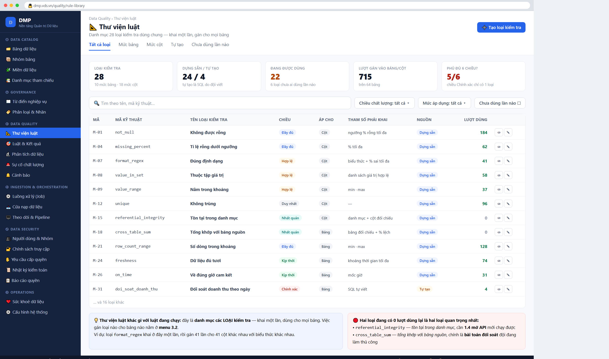

**Các cột:** Mã · **Mã kỹ thuật** · Tên loại · **Chiều chất lượng** · Áp cho *(bảng/cột)* · **Tham số phải khai** · Nguồn *(dựng sẵn / tự tạo)* · **Lượt dùng**

**28 loại chia theo 6 chiều** — một số loại quan trọng:

| Mã kỹ thuật | Tên | Chiều | Áp cho |
|---|---|---|---|
| `not_null` · `missing_percent` | Không rỗng · Tỉ lệ rỗng dưới ngưỡng | Đầy đủ | Cột |
| `format_regex` | Đúng định dạng | Hợp lệ | Cột |
| `value_in_set` | Thuộc tập giá trị | Hợp lệ | Cột |
| `value_range` | Nằm trong khoảng | Hợp lệ | Cột |
| `unique` | Không trùng | Duy nhất | Cột |
| **`referential_integrity`** | **Tồn tại trong danh mục** | Nhất quán | Cột |
| **`cross_table_sum`** | **Tổng khớp với bảng nguồn** | Nhất quán | Bảng |
| `row_count_range` | Số dòng trong khoảng | Đầy đủ | Bảng |
| `freshness` · `on_time` | Đủ tươi · Về đúng giờ cam kết | Kịp thời | Bảng |

**Cột "Lượt dùng" là chỗ đáng soi nhất**

> 🔴 Hai loại đang có **0 lượt dùng** lại chính là hai loại quan trọng nhất:
>
> - **`referential_integrity`** — cần **1.4 mở API** mới chạy được
> - **`cross_table_sum`** — chính là **bài toán đối soát** đội đang làm thủ công bằng màn riêng

**Thẻ "Phủ đủ 6 chiều? — 5/6"** cho biết chiều **Chính xác** chỉ có 1 loại kiểm tra. Đây là chiều khó nhất vì phải đối chiếu với nguồn ngoài hệ thống.

</details>

<details open>
<summary><b>Màn 22 — Tạo loại kiểm tra</b></summary>

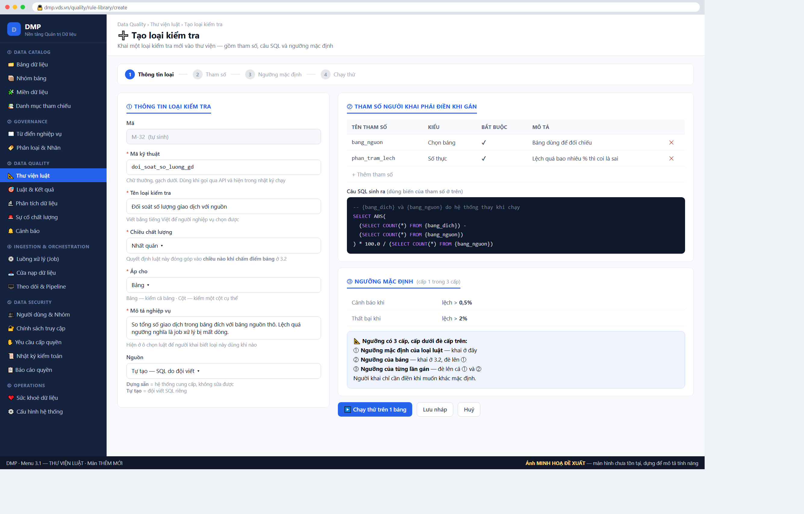

**Bước 1 — thông tin loại**

| Trường | Bắt buộc | Khai để làm gì |
|---|:---:|---|
| Mã kỹ thuật | ✔ | Chữ thường, gạch dưới. Dùng khi gọi qua API và hiện trong nhật ký chạy |
| Tên loại kiểm tra | ✔ | Viết tiếng Việt để người nghiệp vụ chọn được |
| **Chiều chất lượng** | ✔ | Quyết định luật này **đóng góp vào chiều nào khi chấm điểm bảng** |
| Áp cho | ✔ | Bảng — kiểm cả bảng · Cột — kiểm một cột |
| Mô tả nghiệp vụ | ✔ | Hiện ở ô chọn luật để người khai biết dùng khi nào |
| Nguồn | — | **Dựng sẵn** = hệ thống cung cấp, không sửa · **Tự tạo** = đội viết SQL riêng |

**Bước 2 — khai tham số người dùng phải điền khi gán**

Ví dụ loại *"đối soát số lượng giao dịch"* cần 2 tham số: `bang_nguon` *(chọn bảng)* và `phan_tram_lech` *(số thực)*. Câu SQL dùng biến `{bang_dich}` và `{bang_nguon}` — hệ thống thay khi chạy.

**Bước 3 — ngưỡng mặc định. Đây là cấp 1 trong hệ thống 3 cấp:**

| Cấp | Khai ở đâu | Ai đặt |
|:---:|---|---|
| ① Ngưỡng mặc định của loại luật | Màn này | Quản trị dữ liệu |
| ② Ngưỡng của bảng | 3.2 | BDA/DE của bảng |
| ③ Ngưỡng riêng cho từng lần gán | 3.2 | Người gán luật |

**Cấp dưới đè cấp trên.** Người khai chỉ cần điền khi muốn khác mặc định — đây là điểm giúp khai luật nhanh.

</details>

---

## 3.2 Luật & Kết quả

<details open>
<summary><b>Menu này để làm gì</b></summary>

**Hai việc trong một menu:** *(a)* gán luật cho bảng/cột, *(b)* xem kết quả toàn cảnh.

Gộp lại vì người dùng luôn làm hai việc này cùng lúc — thấy bảng nào điểm thấp thì gán thêm luật ngay.

**3 màn:** Bảng điều khiển · Gán luật · *(chi tiết luật hỏng nằm ở tab Chất lượng của 1.1)*

</details>

<details open>
<summary><b>Màn 23 — Bảng điều khiển chất lượng</b></summary>

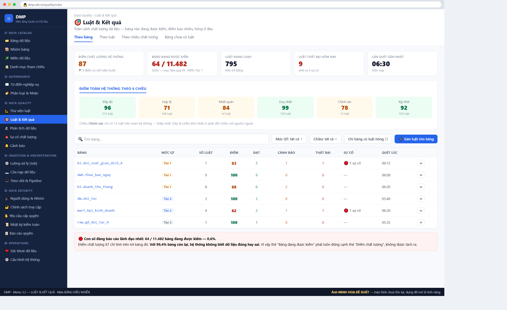

**Cách chấm điểm — 4 tầng**

> % dòng đạt của một luật = **điểm luật** → trung bình các luật cùng chiều = **điểm chiều** → trung bình 6 chiều = **điểm bảng** → trung bình các bảng = **điểm hệ thống**

**Dải 6 chiều toàn hệ thống** — mỗi chiều kèm số luật đang chạy. Ví dụ chiều **Chính xác** chỉ có 12 luật trên toàn hệ thống, thấp nhất.

**Bảng danh sách:** Bảng · Mức QT · Số luật · **Điểm** · Đạt / Cảnh báo / Thất bại · Sự cố · Quét lúc

**Con số quan trọng nhất để báo cáo lãnh đạo**

> 🔴 **64 / 11.482 bảng đang được kiểm — 0,6%.**
>
> Điểm chất lượng 87 chỉ tính trên 64 bảng đó. **Với 99,4% bảng còn lại, hệ thống không biết dữ liệu đúng hay sai.**
>
> Vì vậy thẻ *"Bảng đang được kiểm"* phải **luôn đứng cạnh** thẻ *"Điểm chất lượng"*, không được tách ra — nếu không sẽ tạo cảm giác an toàn giả.

**4 tab:** Theo bảng · Theo luật · Theo chiều chất lượng · **Bảng chưa có luật**

</details>

<details open>
<summary><b>Màn 24 — Gán luật cho bảng / cột</b></summary>

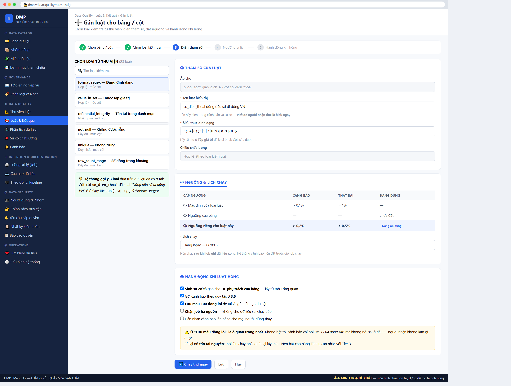

**5 bước:** Chọn bảng/cột → Chọn loại kiểm tra → Điền tham số → Ngưỡng & lịch → Hành động khi hỏng

**Hệ thống gợi ý loại kiểm tra dựa trên dữ liệu đã có** — đây là điểm giảm công khai nhiều nhất:

| Nguồn gợi ý | Ví dụ |
|---|---|
| Ô **Quy tắc nghiệp vụ** ở tab Cột | Cột đã khai *"Đúng đầu số di động VN"* → gợi ý `format_regex` |
| Ô **Tập giá trị** ở tab Cột | `KHOP · LECH · CHO` → gợi ý `value_in_set`, **điền sẵn luôn 3 giá trị** |
| Kết quả **Profiling** ở 3.3 | Cột có 100% giá trị phân biệt → gợi ý `unique` |
| **Cờ CDE** ở 2.1 | Cột mang thuật ngữ CDE → **bắt buộc** phải có ≥ 1 luật |

**Bảng ngưỡng 3 cấp** hiển thị rõ cấp nào đang được áp dụng — trong ảnh là cấp ③, đè lên mặc định của loại luật.

**Lịch chạy** — hệ thống **cảnh báo nếu đặt trước giờ job ghi dữ liệu**, vì quét trước khi có dữ liệu thì luôn báo sai.

**Bước 5 — hành động khi luật hỏng**

| Ô tích | Ý nghĩa |
|---|---|
| **Sinh sự cố** và gán cho **DE phụ trách của bảng** | Lấy từ tab Tổng quan — không ai phải quyết định giao cho ai |
| Gửi cảnh báo theo quy tắc ở 3.5 | |
| **Lưu mẫu 100 dòng lỗi** | ⭐ Ô quan trọng nhất — xem ghi chú dưới |
| **Chặn job hạ nguồn** | Không cho dữ liệu sai chảy tiếp |
| Gắn nhãn cảnh báo lên bảng | Mọi người dùng đều thấy |

> ⚠️ **Ô "Lưu mẫu dòng lỗi" phải cân nhắc.** Không bật thì cảnh báo chỉ nói *"có 1.204 dòng sai"* mà không nói sai ở đâu — người nhận không làm gì được.
>
> Bù lại nó **tốn tài nguyên**: mỗi lần chạy phải quét lại để lấy mẫu. Nên **bật cho bảng Tier 1**, cân nhắc với Tier 3.

</details>

---

## 3.3 Profiling — Phân tích dữ liệu

<details open>
<summary><b>Màn 25 — Kết quả phân tích cột</b></summary>

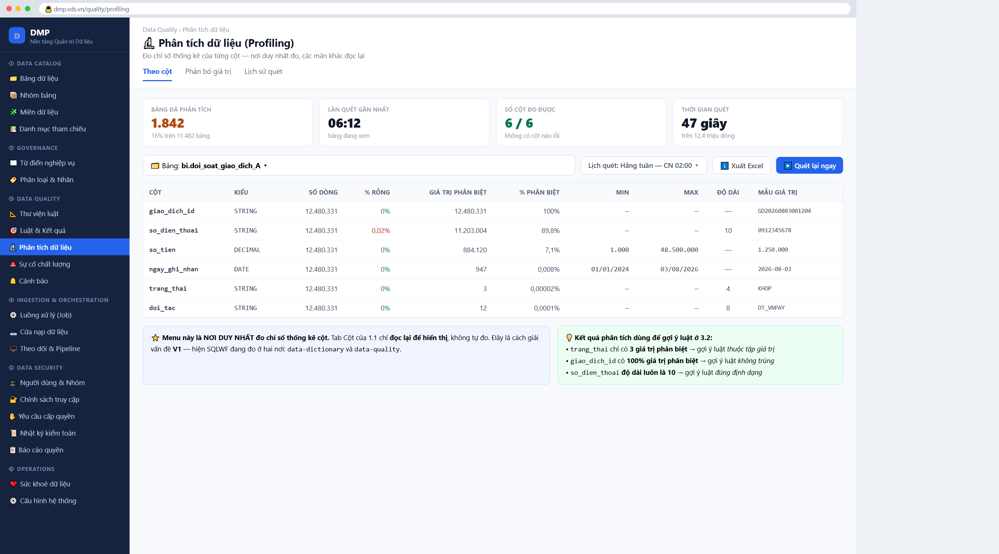

**Mục đích:** đo chỉ số thống kê của từng cột. **Đây là nơi duy nhất đo** — tab Cột của 1.1 chỉ đọc lại để hiển thị.

**Các chỉ số đo được:** Số dòng · **% rỗng** · Số giá trị phân biệt · % phân biệt · **Min** · **Max** · Độ dài · Mẫu giá trị

**Hai công dụng**

**① Giải vấn đề V1.** Hiện SQLWF đo chỉ số ở **hai nơi**: `data-dictionary` *(nullValue, minValue, maxValue, meanValue, duplicateRow)* và `data-quality`. Gom về một nơi thì hết trùng.

**② Gợi ý luật cho 3.2** — đây mới là giá trị chính:

| Kết quả đo | Gợi ý luật |
|---|---|
| `trang_thai` chỉ có **3 giá trị phân biệt** | `value_in_set` — và điền sẵn 3 giá trị đó |
| `giao_dich_id` có **100% giá trị phân biệt** | `unique` |
| `so_dien_thoai` **độ dài luôn là 10** | `format_regex` |
| Cột có **% rỗng cao bất thường** | `missing_percent` với ngưỡng phù hợp |

**Lịch quét:** mặc định hằng tuần, vì quét profiling nặng hơn chạy luật. Có nút **Quét lại ngay** cho trường hợp cần gấp.

**Thẻ "Bảng đã phân tích — 1.842 / 11.482 (16%)"** — cao hơn tỉ lệ bảng có luật (0,6%) vì profiling không cần ai khai gì.

</details>

---

## 3.4 Incidents — Sự cố chất lượng

<details open>
<summary><b>Menu này để làm gì — và khác cảnh báo ở chỗ nào</b></summary>

| | Cảnh báo *(3.5)* | Sự cố *(3.4)* |
|---|---|---|
| Bản chất | **Tin nhắn gửi đi rồi thôi** | **Một việc có người chịu trách nhiệm** |
| Có trạng thái không | Không | Có — 6 trạng thái |
| Có hạn không | Không | Có |
| Ai biết đã xử lý chưa | Không ai | Hệ thống theo dõi |

> Đây chính là thứ SQLWF **chưa có**. Hiện `warning-history` chỉ lưu lịch sử gửi cảnh báo — **không ai biết cảnh báo đó đã được xử lý hay chưa**.

**2 màn:** Danh sách · Chi tiết

</details>

<details open>
<summary><b>Màn 26 — Danh sách sự cố</b></summary>

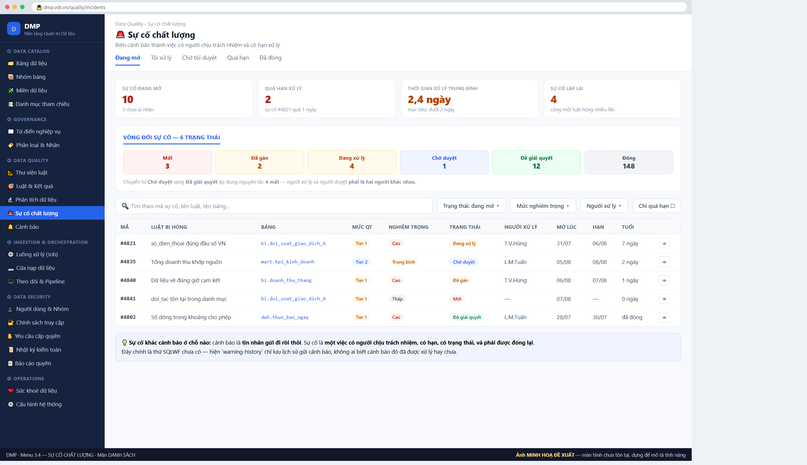

**Vòng đời 6 trạng thái** *(theo thiết kế DQ Tool demo)*

`Mới` → `Đã gán` → `Đang xử lý` → `Chờ duyệt` → `Đã giải quyết` → `Đóng`

> ⚠️ Chuyển từ **Chờ duyệt** sang **Đã giải quyết** áp dụng **nguyên tắc 4 mắt** — người xử lý và người duyệt **phải là hai người khác nhau**.

**Các cột:** Mã · Luật bị hỏng · Bảng · Mức QT · **Mức nghiêm trọng** · Trạng thái · Người xử lý · Mở lúc · **Hạn** · **Tuổi**

**Mức nghiêm trọng được tính tự động** từ 3 yếu tố: mức quan trọng của bảng *(Tier)* · cột có mang nhãn nhạy cảm không · thuật ngữ trên cột có phải CDE không.

**Bốn thẻ số liệu vận hành**

| Thẻ | Dùng để làm gì |
|---|---|
| Sự cố đang mở — 10 *(3 chưa ai nhận)* | Việc cần làm hôm nay |
| **Quá hạn xử lý — 2** | Cần leo thang lên quản lý |
| Thời gian xử lý trung bình — 2,4 ngày | Đo hiệu quả đội, so với mục tiêu |
| **Sự cố lặp lại — 4** | Cùng một luật hỏng nhiều lần → **vấn đề gốc chưa được sửa** |

</details>

<details open>
<summary><b>Màn 27 — Chi tiết sự cố ⭐</b></summary>

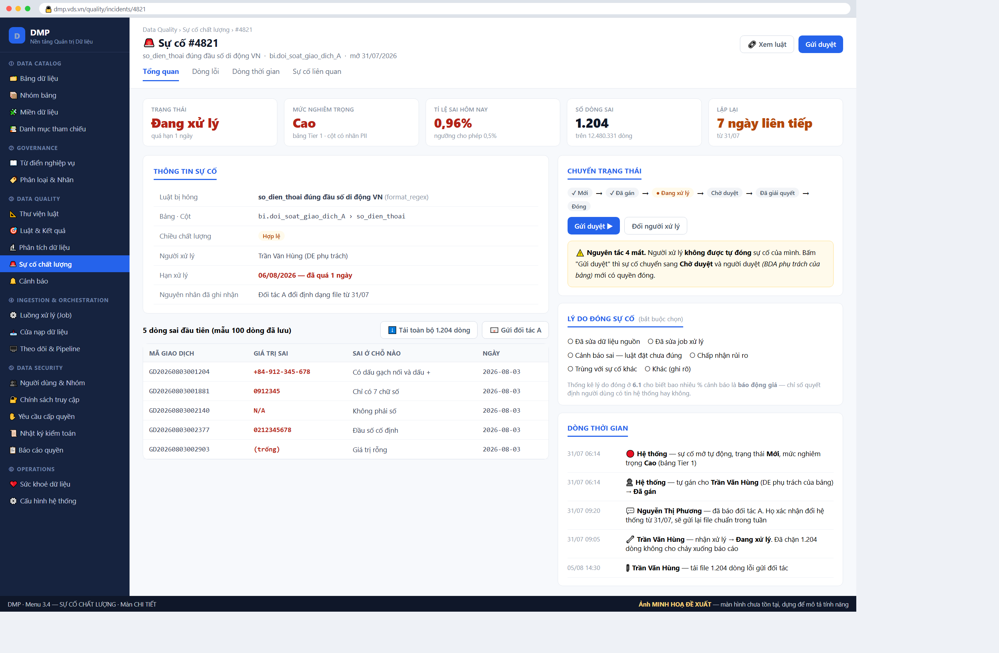

**Bốn khối chính**

| Khối | Nội dung |
|---|---|
| **Thông tin sự cố** | Luật bị hỏng · bảng/cột · chiều chất lượng · người xử lý · **hạn xử lý** · nguyên nhân đã ghi nhận |
| **Mẫu dòng lỗi** | 5 dòng đầu kèm **giải thích sai ở chỗ nào** · nút tải toàn bộ · nút gửi thẳng cho đối tác |
| **Chuyển trạng thái** | Thanh 6 trạng thái + nút hành động + cảnh báo 4 mắt |
| **Dòng thời gian** | Mọi thao tác trên sự cố, kèm người và thời điểm |

**Nguyên tắc 4 mắt được thể hiện cụ thể**

> Người xử lý **không được tự đóng** sự cố của mình. Bấm *"Gửi duyệt"* thì sự cố chuyển sang **Chờ duyệt**, và **BDA phụ trách của bảng** mới có quyền đóng.

**Lý do đóng sự cố — bắt buộc chọn 1 trong 6**

`Đã sửa dữ liệu nguồn` · `Đã sửa job xử lý` · **`Cảnh báo sai — luật đặt chưa đúng`** · `Chấp nhận rủi ro` · `Trùng với sự cố khác` · `Khác`

> ⭐ **Vì sao bắt buộc chọn lý do:** thống kê lý do đóng ở **6.1** cho biết **bao nhiêu % cảnh báo là báo động giả**.
>
> Đây là chỉ số quyết định người dùng có tin hệ thống hay không. Tỉ lệ báo động giả cao thì người ta sẽ tắt thông báo, và toàn bộ module ③ thành vô dụng.

</details>

---

## 3.5 Alerts — Cảnh báo & Kênh gửi

<details open>
<summary><b>Màn 28 — Danh sách quy tắc cảnh báo</b></summary>

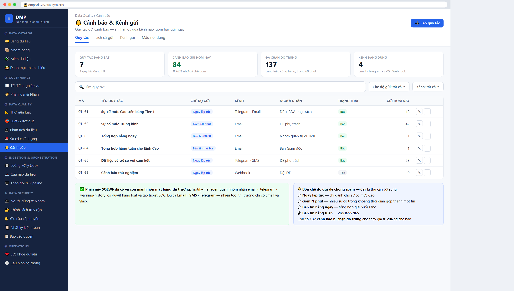

**Các cột:** Mã · Tên quy tắc · **Chế độ gửi** · Kênh · Người nhận · Trạng thái · Gửi hôm nay

**Đối chiếu SQLWF:** ✅ **Phần này đã có và còn mạnh hơn mặt bằng thị trường** — `notify-manager` quản nhóm nhận email, `telegram`, `warning-history` có duyệt hàng loạt và tạo ticket SOC. Đủ cả **Email · SMS · Telegram**, trong khi nhiều tool thị trường chỉ có Email và Slack.

**Thứ cần bổ sung: 4 chế độ gửi để chống spam**

| Chế độ | Dùng khi nào |
|---|---|
| ① **Ngay lập tức** | Chỉ dành cho sự cố mức **Cao** |
| ② **Gom N phút** | Nhiều sự cố trong khoảng thời gian gộp thành một tin |
| ③ **Bản tin hằng ngày** | Tổng hợp gửi buổi sáng |
| ④ **Bản tin hằng tuần** | Cho lãnh đạo |

Thẻ **"Đã chặn do trùng — 137"** cho thấy giá trị của cơ chế này: cùng một luật, cùng một bảng, trong 60 phút chỉ gửi một lần.

</details>

<details open>
<summary><b>Màn 29 — Tạo quy tắc cảnh báo</b></summary>

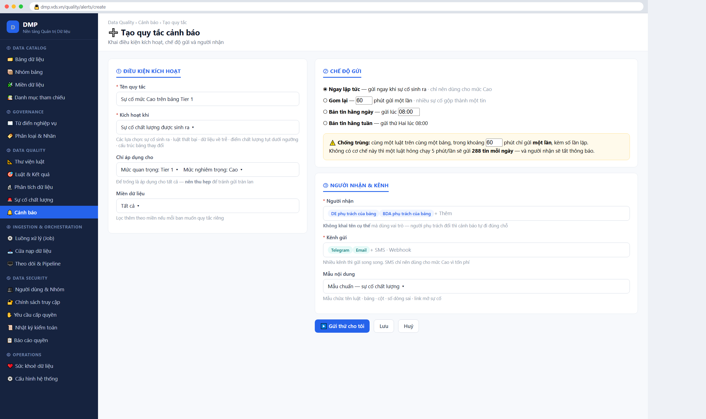

**Bước 1 — điều kiện kích hoạt**

| Trường | Ghi chú |
|---|---|
| Kích hoạt khi | Sự cố sinh ra · luật thất bại · **dữ liệu về trễ** · điểm chất lượng tụt dưới ngưỡng · cấu trúc bảng thay đổi |
| Chỉ áp dụng cho | Lọc theo **mức quan trọng** và **mức nghiêm trọng** — nên thu hẹp để tránh gửi tràn lan |
| Miền dữ liệu | Lọc thêm nếu mỗi ban muốn quy tắc riêng |

**Bước 2 — chế độ gửi + chống trùng**

> ⚠️ Cùng một luật trên cùng một bảng, trong **60 phút** chỉ gửi **một lần**, kèm số lần lặp.
>
> Không có cơ chế này thì một luật hỏng chạy 5 phút/lần sẽ gửi **288 tin mỗi ngày** — và người nhận sẽ tắt thông báo.

**Bước 3 — người nhận & kênh**

> ⭐ **Không khai tên người cụ thể mà dùng VAI TRÒ** — `DE phụ trách của bảng`, `BDA phụ trách của bảng`.
>
> Người phụ trách đổi thì cảnh báo **tự đi đúng chỗ**, không phải sửa lại quy tắc. Đây là hệ quả trực tiếp của việc khai người phụ trách ở 1.1.

SMS chỉ nên dùng cho mức Cao vì tốn phí.

</details>

<details open>
<summary><b>Màn 30 — Tab Kênh gửi</b></summary>

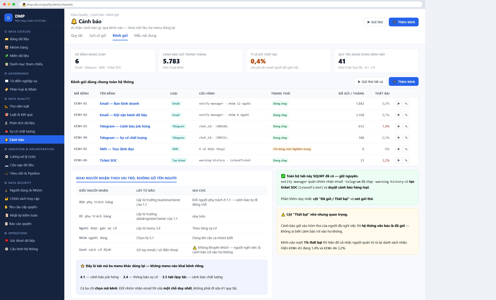

**Các cột:** Mã kênh · Tên kênh · Loại · Cấu hình · Trạng thái · **Đã gửi / tháng** · **Thất bại**

**Bốn loại kênh — cả bốn SQLWF đã có**

| Loại | SQLWF hiện có | Dùng cho |
|---|---|---|
| Email | `notify-manager` — quản nhóm nhận | Cảnh báo thường ngày |
| Telegram | `telegram` — đã chạy | Cảnh báo cần biết ngay |
| SMS | đã có | Chỉ mức Nghiêm trọng, chi phí cao |
| Ticket SOC | `warning-history` · `isSendTicket` | Sự cố cần đội khác vào cuộc |

**Khai người nhận theo VAI TRÒ, không gõ tên người**

| Kiểu người nhận | Lấy từ đâu |
|---|---|
| BDA phụ trách bảng | Trường `businessOwner` của 1.1 |
| DE phụ trách bảng | Trường `dataEngineerOwner` của 1.1 |
| Người được gán sự cố | Menu 3.4 |
| Nhóm người dùng | Menu 5.1 |
| Danh sách cố định | ⚠️ Gõ tay — **không khuyến khích**, người nghỉ việc là cảnh báo rơi vào hư không |

> ⭐ **Đây là tab mà ba menu khác dùng lại — không menu nào khai kênh riêng.**
>
> **4.1** cảnh báo job hỏng · **3.4** thông báo sự cố · **3.5 tab Quy tắc** cảnh báo chất lượng.
>
> Cả ba chỉ **chọn mã kênh**. Đổi nhóm nhận email thì sửa **một chỗ duy nhất**, không phải đi sửa 41 quy tắc.

**Cột "Thất bại" nhỏ nhưng quan trọng**

> Cảnh báo gửi vào hòm thư của người đã nghỉ việc thì **hệ thống vẫn báo là đã gửi** — không ai biết cảnh báo rơi vào hư không.
>
> Kênh nào vượt **1% thất bại** thì hiện đỏ và nhắc người quản trị rà lại danh sách nhận.

> ✅ **Toàn bộ tab này SQLWF đã có — giữ nguyên.** Phần thêm duy nhất: **cột Đã gửi / Thất bại** và **nút gửi thử**.

</details>

---

## Tổng kết Module ③

<details open>
<summary><b>10 màn · việc phải làm · điều kiện chặn · thứ tự triển khai</b></summary>

| Menu | Số màn | Việc | Ghi chú |
|---|:---:|:---:|---|
| **3.1 Rule Library** | 2 | 🔴 Xây mới | Chưa có khái niệm thư viện loại luật |
| **3.2 Luật & Kết quả** | 2 | 🔴 Xây mới | `data-quality` chỉ có bật/tắt + chọn chỉ số. Không có chấm điểm, không có bảng điều khiển |
| **3.3 Profiling** | 1 | 🔴 Xây mới | Gom chỉ số đang rải ở `data-dictionary` và `data-quality` về một nơi |
| **3.4 Incidents** | 2 | 🔴 Xây mới | `warning-history` có duyệt và tạo ticket SOC nhưng **không có vòng đời sự cố** |
| **3.5 Alerts** | 3 | 🟢 Giữ | Đã có và mạnh — chỉ thêm **4 chế độ gửi**, **chống trùng** và **cột theo dõi gửi thất bại** |

**Module ③ phụ thuộc vào gì**

| Cần có trước | Để làm gì |
|---|---|
| **1.1 — mã bảng, mã cột** | Gán luật vào đâu |
| **1.1 — BDA / DE phụ trách** | Gán sự cố cho ai · gửi cảnh báo cho ai |
| **1.1 — tab Cột: quy tắc nghiệp vụ, tập giá trị** | Gợi ý luật, điền sẵn tham số |
| **1.4 — Danh mục tham chiếu mở API** | Luật `referential_integrity` mới chạy được |
| **2.1 — cờ CDE** | Ràng buộc cột CDE bắt buộc có luật |
| **3.3 — Profiling** | Gợi ý luật cho 3.2 |

**Thứ tự triển khai đề xuất**

1. **3.3 Profiling** — không phụ thuộc gì, chạy được ngay, và cho ra dữ liệu gợi ý cho các bước sau
2. **3.1 Rule Library** — khai 28 loại
3. **3.2 Luật & Kết quả** — gán luật và chấm điểm
4. **3.4 Incidents** — biến kết quả thành việc có người xử lý
5. **3.5 Alerts** — bổ sung 4 chế độ gửi vào cái đã có

**Ba con số phải theo dõi từ ngày đầu**

| Chỉ số | Vì sao |
|---|---|
| **% bảng đang được kiểm** *(hiện 0,6%)* | Điểm chất lượng vô nghĩa nếu chỉ tính trên vài chục bảng |
| **% cảnh báo là báo động giả** | Cao thì người dùng tắt thông báo, cả module thành vô dụng |
| **Thời gian xử lý sự cố trung bình** | Đo hiệu quả thật, không phải đo số cảnh báo đã gửi |

</details>

---

# PHẦN 5 — MODULE ④ INGESTION & ORCHESTRATION

> **3 menu · 9 màn hình.** Đây là module **ít việc nhất** — vì `job-management` của SQLWF là một trong những màn hoàn thiện nhất hiện có.
>
> Toàn bộ phần **chạy** (DAG, duyệt, phiên bản, khoá phiên, chế độ chạy thử, lịch Pentaho) **giữ nguyên**. Việc thêm nằm ở ba chỗ: **ép bảng đích phải có trong danh mục**, **bật quét nguồn gốc mặc định**, và **chặn dữ liệu xấu ngay tại cửa nạp**.
>
> Module này là chỗ **ba module khác lấy dữ liệu về**: 1.1 lấy nguồn gốc · 3.2 lấy mốc thời gian để chấm độ tươi · 3.4 lấy sự kiện để mở sự cố.

---

## 4.1 Luồng xử lý (Job)

<details open>
<summary><b>Menu này để làm gì</b></summary>

**Mục đích:** khai một chuỗi bước SQL có phụ thuộc lẫn nhau, chạy theo lịch, ghi kết quả ra một bảng đích.

Đây là menu **SQLWF làm tốt nhất**. Kiểm kê mã nguồn cho thấy `job-management` đã có đủ:

| Đã có | Ghi chú từ mã nguồn |
|---|---|
| Chuỗi bước có phụ thuộc (DAG) | `StepInfo.parents[]` · `order` |
| Sơ đồ bước · trình xem SQL | thư mục `step-diagram` · `sql-viewer` |
| Quy trình xin duyệt / duyệt / từ chối | `job-approval` · `approvedUser` · `approvedDate` |
| **Lịch sử phiên bản** | `job-version-history` |
| **Xử lý xung đột khi 2 người sửa cùng lúc** | `job-version-conflict` |
| **Khoá phiên chỉnh sửa** | `acquireLock` · `refreshLock` · `releaseLock` |
| Nhân bản job · chế độ chạy thử | `job-clone/:id` · `updateTestMode` |
| Lịch chạy | `cronExpression` · `coordinatorCode` · `pentaho-job-management` |

> ⭐ **Kết luận cho menu này: không làm lại gì cả.** Chỉ thêm **hai ràng buộc ở phần khai báo** — và cả hai đều là để module khác dùng được dữ liệu của module này.

**3 màn:** Danh sách job · Chi tiết › tab Bước · Chi tiết › tab Lần chạy + Lịch

</details>

<details open>
<summary><b>Màn 31 — Danh sách job</b></summary>

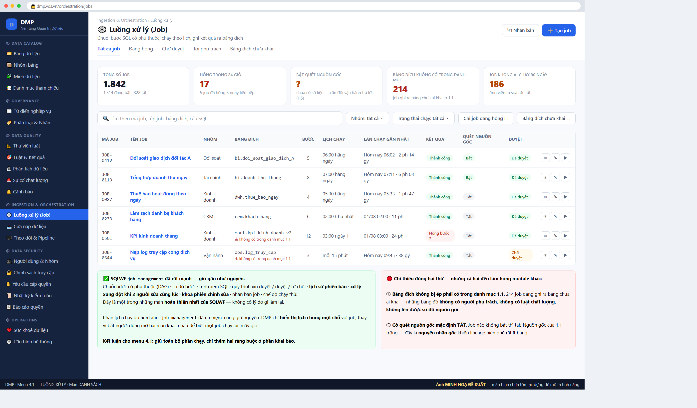

**Các cột:** Mã job · Tên job · Nhóm · **Bảng đích** · Số bước · Lịch chạy · Lần chạy gần nhất · Kết quả · **Quét nguồn gốc** · Duyệt

**Năm thẻ số liệu — ba thẻ là để chỉ ra vấn đề, không phải để khoe**

| Thẻ | Con số | Ý nghĩa |
|---|:---:|---|
| Tổng số job | 1.842 | 1.514 đang bật · 328 tắt |
| Hỏng trong 24 giờ | 17 | trong đó **5 job đã hỏng 3 ngày liên tiếp mà chưa ai xử lý** |
| **Bật quét nguồn gốc** | **?** | ⭐ **chưa có số liệu — xem câu hỏi treo H5 ở Phần 1** |
| **Bảng đích không có trong danh mục** | **214** | job ghi ra bảng **chưa ai khai ở 1.1** |
| Job không ai chạy 90 ngày | 186 | ứng viên rà soát để tắt |

**Hai thẻ đỏ là hai lỗ hổng nối module**

> 🔴 **214 job đang ghi ra bảng không có trong danh mục.**
>
> Bảng đó **không có người phụ trách** → sự cố chất lượng không biết gán cho ai.
> Bảng đó **không có luật chất lượng** → không ai biết số đúng hay sai.
> Bảng đó **không lên được sơ đồ nguồn gốc** → hỏng thì không biết ảnh hưởng tới đâu.
>
> Ba module ③ ⑤ ⑥ đều **mù** với 214 bảng này.

> 🔴 **Cờ `enableDataLineage` mặc định là `false`.**
>
> Đây là **nguyên nhân gốc** khiến tab Nguồn gốc của phần lớn bảng đang trống — không phải vì bộ quét lineage yếu, mà vì **phần lớn job chưa bật cờ**.
>
> Hàm `TableLineageServiceImpl.transformData()` chạy cron `0 0 7-18 * * *` nhưng **chỉ xử lý job có `enableDataLineage = true`**.

</details>

<details open>
<summary><b>Màn 32 — Tạo job</b></summary>

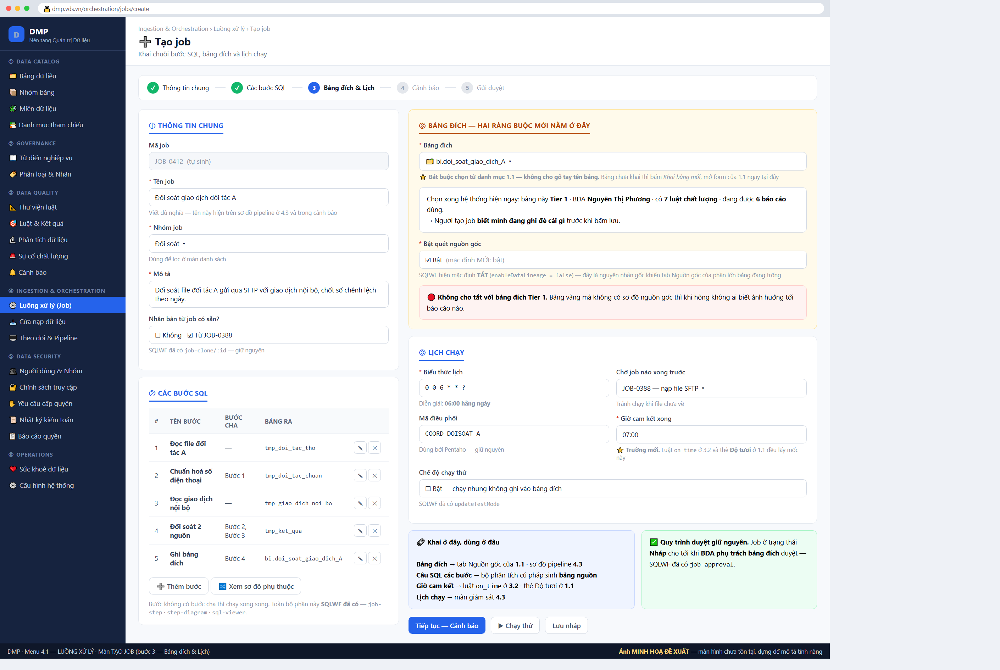

**Năm bước:** Thông tin chung → Các bước SQL → **Bảng đích & Lịch** → Cảnh báo → Gửi duyệt

> ⭐ **Toàn bộ giá trị mới của menu 4.1 nằm ở bước ③.** Bốn bước còn lại là những gì `job-management` đã làm tốt — giữ nguyên.

**Bước ① Thông tin chung**

| Trường | Bắt buộc | Ghi chú |
|---|:---:|---|
| Mã job | — | Tự sinh |
| Tên job | ✔ | Hiện trên sơ đồ pipeline ở 4.3 và trong cảnh báo — viết đủ nghĩa |
| Nhóm job | ✔ | Dùng để lọc ở màn danh sách |
| Mô tả | ✔ | |
| Nhân bản từ job có sẵn | — | SQLWF đã có `job-clone/:id` |

**Bước ③ Bảng đích — hai ràng buộc mới**

| Trường | Ràng buộc |
|---|---|
| **Bảng đích** | ⭐ **Bắt buộc chọn từ danh mục 1.1** — không cho gõ tay. Bảng chưa khai thì mở form của 1.1 ngay tại đây |
| **Bật quét nguồn gốc** | ⭐ **Mặc định BẬT.** 🔴 **Không cho tắt với bảng đích Tier 1** |

> Chọn bảng đích xong, hệ thống hiện ngay: **Tier 1** · BDA **Nguyễn Thị Phương** · **7 luật chất lượng** · **6 báo cáo** đang dùng.
>
> Người tạo job **biết mình đang ghi đè cái gì** trước khi bấm lưu.

**Bước ③ Lịch chạy**

| Trường | Ghi chú |
|---|---|
| Biểu thức lịch · Mã điều phối | SQLWF đã có — `cronExpression` · `coordinatorCode` |
| Chờ job nào xong trước | Tránh chạy khi file nguồn chưa về |
| **Giờ cam kết xong** | ⭐ **Trường mới** — luật `on_time` ở 3.2 và thẻ Độ tươi ở 1.1 đều lấy mốc này |
| Chế độ chạy thử | SQLWF đã có `updateTestMode` |

> ✅ **Quy trình duyệt giữ nguyên.** Job ở trạng thái **Nháp** cho tới khi **BDA phụ trách bảng đích** duyệt — `job-approval`.

</details>

<details open>
<summary><b>Màn 33 — Chi tiết job › tab Bước</b></summary>

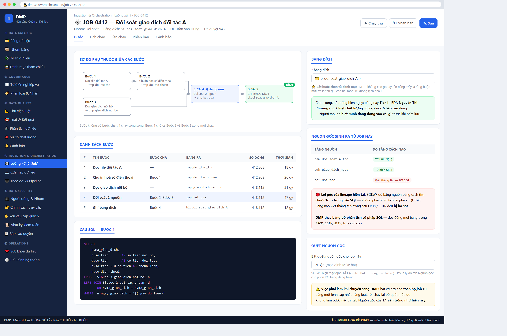

**Ba khối trên màn:** sơ đồ phụ thuộc · danh sách bước · câu SQL của bước đang chọn.

**Các trường của một bước**

| Trường | Bắt buộc | Khai để làm gì | Dùng ở đâu |
|---|:---:|---|---|
| Tên bước | ✔ | Hiện trên sơ đồ và trong nhật ký lần chạy | Màn 34 |
| **Bước cha** | — | Quyết định **thứ tự chạy**. Bước không có cha thì chạy song song | Sơ đồ · bộ điều phối |
| Câu SQL | ✔ | Nội dung bước | Bộ phân tích nguồn gốc |
| **Bảng ra của bước** | ✔ | Bảng tạm hoặc bảng đích | Tab Nguồn gốc của 1.1 |

**Trường quan trọng nhất của cả menu: Bảng đích**

| | |
|---|---|
| **Ràng buộc mới** | ⭐ **Bắt buộc chọn từ danh mục 1.1** — không cho gõ tay tên bảng |
| **Nếu bảng chưa khai** | Bấm *Khai bảng mới* ngay tại đây, mở form của 1.1 |
| **Chọn xong hiện gì** | Bảng này **Tier 1** · BDA **Nguyễn Thị Phương** · có **7 luật chất lượng** · đang được **6 báo cáo** dùng |

> 💡 Dòng thông tin đó không phải để trang trí. Nó làm cho người tạo job **biết mình đang động vào cái gì** trước khi bấm lưu — ghi đè một bảng Tier 1 có 6 báo cáo đang đọc là chuyện khác hẳn ghi vào một bảng tạm.

**Lỗi gốc của lineage hiện tại — đã đọc ra từ mã nguồn**

Hàm `StepLineage.setSourceTables()` dò bảng nguồn bằng cách **tìm chuỗi `${…}` trong câu SQL** — không phải phân tích cú pháp SQL thật.

| Bảng trong câu SQL | Có dò ra không |
|---|:---:|
| `FROM ${buoc_3_giao_dich_noi_bo}` | ✅ dò ra |
| `LEFT JOIN ${buoc_2_doi_tac_chuan}` | ✅ dò ra |
| `JOIN ref.doi_tac` *(viết thẳng tên)* | ❌ **bỏ sót** |

> 🔴 Bảng đích thì đọc từ `stepInfo.getOutput().getTable()` — là **trường cấu hình**, nên **luôn đúng**.
> Bảng nguồn thì đoán từ chuỗi ký tự, nên **thiếu**. Sơ đồ nguồn gốc vì vậy **luôn thiếu nhánh phía trên**.
>
> **DMP thay bằng bộ phân tích cú pháp SQL** — đọc đúng mọi bảng trong `FROM`, `JOIN`, `WITH`, và truy vấn con.

**Việc phải làm khi chuyển sang DMP**

1. Bật `enableDataLineage` cho **toàn bộ job cũ** bằng một lệnh cập nhật hàng loạt
2. Chạy lại bộ quét một lượt trên toàn bộ job
3. Đối chiếu 214 bảng đích chưa khai → khai bổ sung vào 1.1

> Không làm ba bước này thì tab Nguồn gốc của 1.1 **vẫn trống như hiện nay**, dù đã xây xong màn.

</details>

<details open>
<summary><b>Màn 34 — Chi tiết job › tab Lần chạy + Lịch</b></summary>

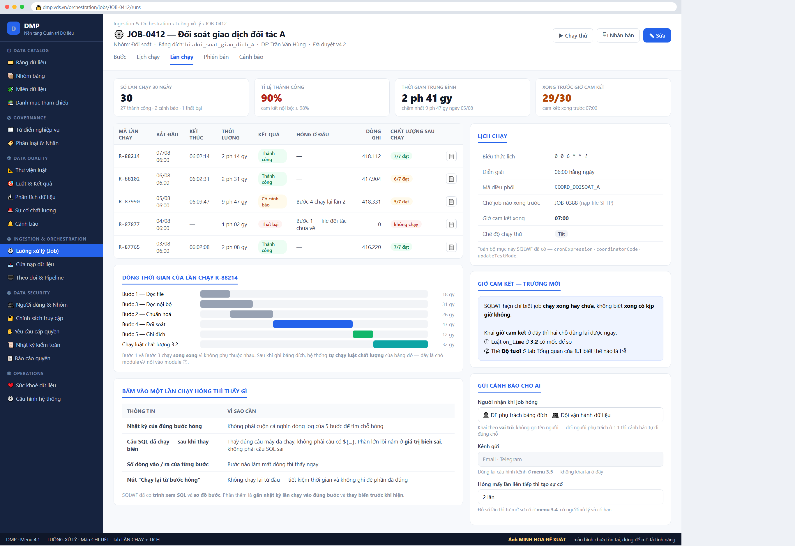

**Các cột lịch sử chạy:** Mã lần chạy · Bắt đầu · Kết thúc · Thời lượng · Kết quả · **Hỏng ở đâu** · Số dòng ghi · **Chất lượng sau chạy**

**Cột "Chất lượng sau chạy" là chỗ module ④ nối vào module ③**

Dòng thời gian cho thấy: sau khi Bước 5 ghi bảng đích xong, hệ thống **tự chạy luật chất lượng** của bảng đó *(32 giây)*. Kết quả đổ ngược lại cột này.

> Nhờ vậy một dòng lịch sử trả lời được **cả hai câu**: job có chạy xong không, **và** số ghi ra có đúng không. Hiện SQLWF chỉ trả lời được câu đầu.

**Trường mới: Giờ cam kết xong**

| | |
|---|---|
| **Vấn đề hiện tại** | SQLWF biết job **chạy xong hay chưa**, không biết **xong có kịp giờ không** |
| **Khai ở đây** | Một mốc giờ, ví dụ `07:00` |
| **Hai chỗ dùng lại ngay** | ① Luật `on_time` ở **3.2** có mốc để so ② Thẻ **Độ tươi** ở tab Tổng quan của **1.1** biết thế nào là trễ |

**Gửi cảnh báo — khai theo VAI TRÒ**

| Trường | Giá trị | Vì sao |
|---|---|---|
| Người nhận khi job hỏng | `DE phụ trách bảng đích` · `Đội vận hành dữ liệu` | ⭐ Không gõ tên người. Đổi người phụ trách ở 1.1 thì cảnh báo **tự đi đúng chỗ** |
| Kênh gửi | Email · Telegram | Dùng lại cấu hình kênh ở **menu 3.5** — không khai lại |
| Hỏng mấy lần liên tiếp thì tạo sự cố | `2 lần` | Đủ số lần thì **tự mở sự cố ở 3.4**, có người xử lý và có hạn |

> 💡 Dòng cuối là cách xử lý **5 job đã hỏng 3 ngày liên tiếp** ở màn 31. Hiện chúng chỉ gửi email mỗi sáng rồi thôi — không ai nhận trách nhiệm, không ai theo dõi.

**Bấm vào một lần chạy hỏng thì thấy gì**

| Thông tin | Vì sao cần |
|---|---|
| Nhật ký của **đúng bước hỏng** | Không phải cuộn cả nghìn dòng log của 5 bước để tìm chỗ hỏng |
| **Câu SQL đã chạy — sau khi thay biến** | Phần lớn lỗi nằm ở **giá trị biến sai**, không phải câu SQL sai |
| Số dòng vào / ra của **từng bước** | Bước nào làm mất dòng thì thấy ngay |
| Nút **"Chạy lại từ bước hỏng"** | Không chạy lại từ đầu — tiết kiệm thời gian và không ghi đè phần đã đúng |

> SQLWF đã có **trình xem SQL** và **sơ đồ bước**. Phần thêm là **gắn nhật ký lần chạy vào đúng bước** và **thay biến trước khi hiện**.

</details>

<details open>
<summary><b>Màn 35 — Chi tiết job › tab Phiên bản</b></summary>

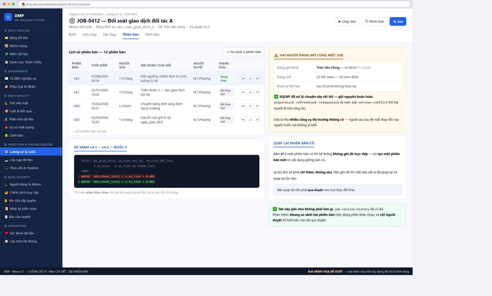

**Các cột:** Phiên bản · Thời điểm · Người sửa · **Nội dung thay đổi** · Người duyệt · Trạng thái

**Khung so sánh hai phiên bản chỉ hiện phần khác nhau**

Không bắt người duyệt đọc lại cả câu SQL 80 dòng để tìm chỗ đã đổi.

**Hai người mở cùng một job — SQLWF đã xử lý rất tốt**

| Cơ chế | SQLWF hiện có |
|---|---|
| Khoá phiên chỉnh sửa | `acquireLock` · `refreshLock` · `releaseLock` |
| Người thứ hai vào sau | Chỉ xem được, thấy ai đang giữ khoá và từ lúc nào |
| Khoá tự hết hạn | Sau 30 phút không thao tác |
| Hai người lỡ sửa cùng lúc | Màn `job-version-conflict` |

> ⭐ Đây là thứ **nhiều công cụ thị trường không có** — người sau lưu đè mất thay đổi của người trước mà không ai biết. **Giữ nguyên hoàn toàn.**

**Quay lại phiên bản cũ — không ghi đè**

> Bấm ↩ ở một phiên bản cũ thì hệ thống **tạo một phiên bản mới** có nội dung giống bản cũ, chứ không ghi đè.
>
> Lý do: lịch sử phải **chỉ thêm, không sửa**. Nếu ghi đè thì mất dấu vết ai đã quay lại và quay lại lúc nào. Bản quay lại vẫn phải **qua duyệt** như mọi thay đổi khác.

> ✅ **Tab này gần như không phải làm gì.** `job-version-history` đã có đủ. Phần thêm: **khung so sánh** và **cột người duyệt**.

</details>

---

## 4.2 Cửa nạp dữ liệu

<details open>
<summary><b>Menu này để làm gì</b></summary>

**Mục đích:** gom **mọi đường dữ liệu đi vào hệ thống** về một chỗ, dùng chung một khuôn khai báo và một cổng kiểm tra.

Hiện SQLWF rải việc này ra **6 màn khác nhau**, mỗi màn một kiểu khai báo, mỗi màn một chỗ xem lịch sử.

| Màn SQLWF hiện tại | Việc nó làm | Về đâu trong DMP |
|---|---|---|
| `import-data` | Tải file lên — **đã có quản lý mẫu đầy đủ** | Loại **Tải file lên** |
| `sync-management` | Đồng bộ MariaDB · MongoDB · OracleDB, có duyệt | Loại **Đồng bộ CSDL** |
| `invoice-uploader` | Nạp hoá đơn, có kết quả xử lý của đội AI | Loại **Nạp hoá đơn** |
| `data-migration-management` | Chuyển dữ liệu hệ thống cũ | Loại **Di trú một lần** |
| `fsync` | Đồng bộ thư mục tệp | Loại **Đồng bộ tệp** |
| `clean-delivery` | Bàn giao số liệu ra ngoài | Loại **Bàn giao ra ngoài** |

> 💡 **Gộp không có nghĩa là viết lại.** Phần chạy của 6 màn **giữ nguyên** — chỉ thống nhất **một khuôn khai báo**, **một chỗ xem lịch sử nạp**, và **một cổng chất lượng dùng chung**.

**2 màn:** Danh sách mẫu nạp · Tạo mẫu nạp *(4 tab: Mẫu nạp · Lịch sử nạp · Cổng chất lượng · Vùng chờ)*

</details>

<details open>
<summary><b>Màn 36 — Danh sách mẫu nạp</b></summary>

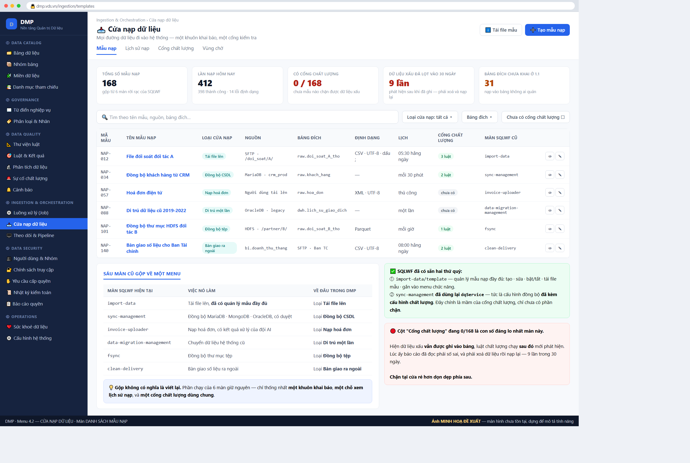

**Các cột:** Mã mẫu · Tên mẫu nạp · **Loại cửa nạp** · Nguồn · Bảng đích · Định dạng · Lịch · **Cổng chất lượng** · Màn SQLWF cũ

> 💡 Cột **"Màn SQLWF cũ"** chỉ tồn tại trong **giai đoạn chuyển đổi** — để đội vận hành đối chiếu được mẫu nào đến từ màn nào. Chuyển xong thì bỏ cột này.

**SQLWF đã có sẵn hai thứ quý**

| | |
|---|---|
| ✅ `import-data/template` | Quản lý mẫu nạp **đầy đủ**: tạo · sửa · bật/tắt · tải file mẫu · gắn vào menu chức năng. Các trường `templateName` · `fileCode` · `fileType` · `encodingType` · `delimiter` · `partitionBy` · `dataCategory` · `dataRange` · `functionName` **dùng lại nguyên** |
| ✅ `sync-management` | **Đã dùng lại `dqService`** — tức là cấu hình đồng bộ **đã kèm cấu hình chất lượng** (`dqEnable`, `dqCycleType`, `dqOffset`, `dqDelay`, `dqComparedCycle`). Đây chính là **mầm của cổng chất lượng**, chỉ chưa có phần **chặn** |

**Con số đáng lo nhất màn này: cổng chất lượng 0/168**

> 🔴 Hiện dữ liệu xấu **vẫn được ghi thẳng vào bảng**. Luật chất lượng chạy **sau đó** mới phát hiện.
>
> Lúc ấy báo cáo đã đọc phải số sai, và phải **xoá dữ liệu rồi nạp lại** — đã xảy ra **9 lần trong 30 ngày**.
>
> **Chặn tại cửa rẻ hơn dọn dẹp phía sau.**

</details>

<details open>
<summary><b>Màn 37 — Tạo mẫu nạp (5 bước)</b></summary>

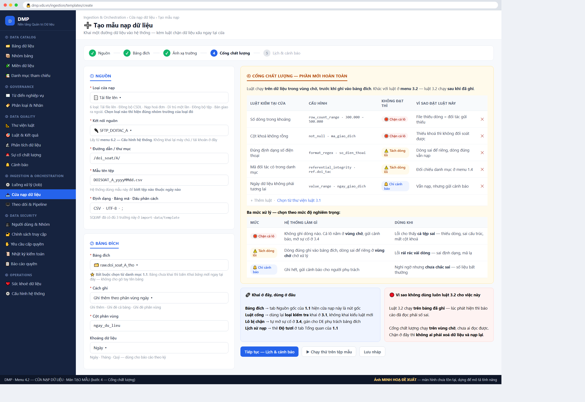

**Năm bước:** Nguồn → Bảng đích → Ánh xạ trường → **Cổng chất lượng** → Lịch & cảnh báo

**Bước ① — Nguồn**

| Trường | Bắt buộc | Khai để làm gì |
|---|:---:|---|
| **Loại cửa nạp** | ✔ | 6 loại. **Chọn loại nào thì hiện đúng nhóm trường của loại đó** — không bắt người dùng nhìn cả 40 trường |
| Kết nối nguồn | ✔ | Lấy từ **menu 6.2**. Không khai lại máy chủ / tài khoản ở đây |
| Đường dẫn / thư mục | ✔ | Nơi lấy dữ liệu |
| **Mẫu tên tệp** | ✔ | Hệ thống dùng mẫu này để **biết tệp nào thuộc ngày nào** |
| Định dạng · Bảng mã · Dấu phân cách | ✔ | SQLWF đã có đủ 3 trường này |

**Bước ② — Bảng đích**

| Trường | Bắt buộc | Khai để làm gì |
|---|:---:|---|
| **Bảng đích** | ✔ | ⭐ **Bắt buộc chọn từ danh mục 1.1** — cùng ràng buộc như menu 4.1 |
| Cách ghi | ✔ | Ghi thêm · Ghi đè cả bảng · Ghi đè phân vùng |
| Cột phân vùng | ✔ | Dùng cho ghi đè theo phân vùng |
| Khoảng dữ liệu | — | Ngày · Tháng · Quý — dùng cho báo cáo theo kỳ |

**Bước ④ — Cổng chất lượng ⭐ phần mới hoàn toàn**

Luật chạy **trên dữ liệu trong vùng chờ, trước khi ghi vào bảng đích**. Khác hẳn luật ở menu 3.2 — luật 3.2 chạy **sau khi đã ghi**.

| Luật kiểm tại cửa | Cấu hình | Không đạt thì | Vì sao đặt luật này |
|---|---|---|---|
| Số dòng trong khoảng | `row_count_range` · 300.000 – 500.000 | 🛑 Chặn cả lô | File thiếu dòng = đối tác gửi thiếu |
| Cột khoá không rỗng | `not_null` · `ma_giao_dich` | 🛑 Chặn cả lô | Thiếu khoá thì không đối soát được |
| Đúng định dạng số điện thoại | `format_regex` · `so_dien_thoai` | ⚠️ Tách dòng lỗi | Dòng sai để riêng, dòng đúng vẫn nạp |
| Mã đối tác có trong danh mục | `referential_integrity` · `ref.doi_tac` | ⚠️ Tách dòng lỗi | Đối chiếu danh mục ở **menu 1.4** |
| Ngày dữ liệu không phải tương lai | `value_range` · `ngay_giao_dich` | 🔔 Chỉ cảnh báo | Vẫn nạp, nhưng gửi cảnh báo |

**Ba mức xử lý — chọn theo mức độ nghiêm trọng**

| Mức | Hệ thống làm gì | Dùng khi |
|---|---|---|
| 🛑 **Chặn cả lô** | Không ghi dòng nào. Cả lô nằm ở **vùng chờ**, gửi cảnh báo, mở sự cố ở 3.4 | Lỗi cho thấy **cả tệp sai** — thiếu dòng, sai cấu trúc, mất cột khoá |
| ⚠️ **Tách dòng lỗi** | Dòng đúng ghi vào bảng đích, dòng sai để riêng ở **vùng chờ** chờ xử lý | Lỗi **rải rác vài dòng** — sai định dạng, mã lạ |
| 🔔 **Chỉ cảnh báo** | Ghi hết, gửi cảnh báo cho người phụ trách | Nghi ngờ nhưng **chưa chắc sai** — số liệu bất thường |

> 🔴 **Vì sao không dùng luôn luật 3.2 cho việc này**
>
> Luật 3.2 chạy **trên bảng đã ghi** — lúc phát hiện thì báo cáo đã đọc phải số sai.
> Cổng chất lượng chạy **trên vùng chờ**, chưa ai đọc được. Chặn ở đây thì **không ai phải xoá dữ liệu và nạp lại**.
>
> Hai nơi dùng **cùng một thư viện loại kiểm tra ở 3.1** — không khai thêm kiểu luật mới, chỉ khác **thời điểm chạy** và **quyền chặn**.

**Khai ở đây, dùng ở đâu**

| Khai gì | Menu nào dùng lại |
|---|---|
| **Bảng đích** | Tab Nguồn gốc của **1.1** hiện cửa nạp này là **nút gốc** của sơ đồ |
| **Luật cổng** | Dùng lại loại kiểm tra khai ở **3.1** |
| **Lô bị chặn** | Tự mở sự cố ở **3.4**, gán cho DE phụ trách bảng đích |
| **Lịch sử nạp** | Thẻ **Độ tươi** ở tab Tổng quan của **1.1** |

</details>

<details open>
<summary><b>Màn 38 — Tab Vùng chờ</b></summary>

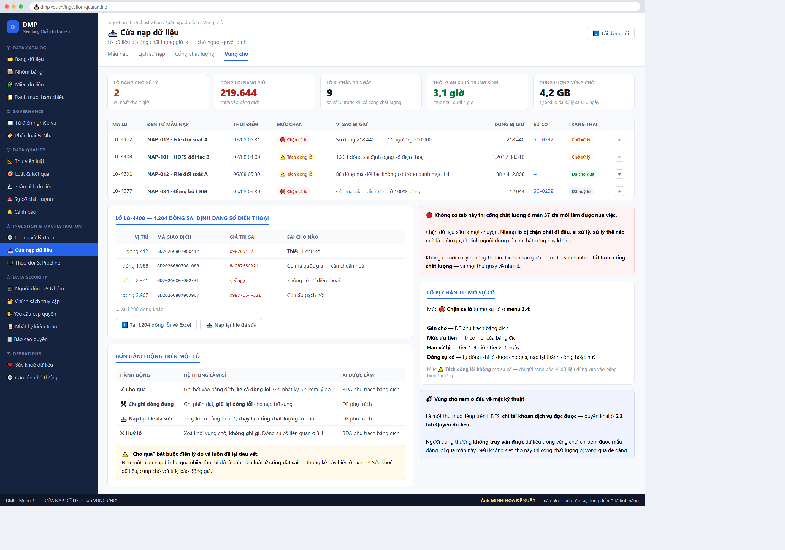

> 🔴 **Không có tab này thì cổng chất lượng ở màn 37 chỉ mới làm được nửa việc.**
>
> Chặn dữ liệu xấu là một chuyện. Nhưng **lô bị chặn phải đi đâu, ai xử lý, xử lý thế nào** mới là phần quyết định người dùng có chịu bật cổng hay không.
>
> Không có nơi xử lý rõ ràng thì lần đầu bị chặn giữa đêm, đội vận hành sẽ **tắt luôn cổng chất lượng** — và mọi thứ quay về như cũ.

**Các cột:** Mã lô · Đến từ mẫu nạp · Thời điểm · **Mức chặn** · **Vì sao bị giữ** · Dòng bị giữ · Sự cố · Trạng thái

**Bốn hành động trên một lô**

| Hành động | Hệ thống làm gì | Ai được làm |
|---|---|---|
| **✔ Cho qua** | Ghi hết vào bảng đích, **kể cả dòng lỗi**. Ghi nhật ký 5.4 kèm lý do | BDA phụ trách bảng đích |
| **✂️ Chỉ ghi dòng đúng** | Ghi phần đạt, **giữ lại dòng lỗi** chờ nạp bổ sung | DE phụ trách |
| **📤 Nạp lại file đã sửa** | Thay lô cũ bằng lô mới, **chạy lại cổng chất lượng** từ đầu | DE phụ trách |
| **✕ Huỷ lô** | Xoá khỏi vùng chờ, **không ghi gì**. Đóng sự cố liên quan ở 3.4 | BDA phụ trách bảng đích |

> ⚠️ **"Cho qua" bắt buộc điền lý do và luôn để lại dấu vết.** Nếu một mẫu nạp bị cho qua nhiều lần thì đó là dấu hiệu **luật ở cổng đặt sai** — thống kê này hiện ở màn 53, cùng chỗ với tỉ lệ báo động giả.

**Lô bị chặn tự mở sự cố**

| | |
|---|---|
| Gán cho | DE phụ trách bảng đích |
| Mức ưu tiên | Theo Tier của bảng đích |
| Hạn xử lý | Tier 1: **4 giờ** · Tier 2: **1 ngày** |
| Tự đóng khi | Lô được cho qua, nạp lại thành công, hoặc huỷ |

> Mức **⚠️ Tách dòng lỗi** **không** mở sự cố — chỉ gửi cảnh báo, vì dữ liệu đúng vẫn vào bảng bình thường.

**Vùng chờ nằm ở đâu về mặt kỹ thuật**

> Là một thư mục riêng trên HDFS, **chỉ tài khoản dịch vụ đọc được** — quyền khai ở **5.2 tab Quyền dữ liệu**.
>
> Người dùng thường **không truy vấn được** dữ liệu trong vùng chờ, chỉ xem được mẫu dòng lỗi qua màn này. Nếu không siết chỗ này thì cổng chất lượng bị vòng qua dễ dàng.

</details>

---

## 4.3 Theo dõi & Giám sát pipeline

<details open>
<summary><b>Menu này để làm gì</b></summary>

**Hai việc trong một menu:**

1. Xem **tác vụ nào đang chạy, hỏng ở bước nào** — phần này `task-management` đã có
2. **Sơ đồ pipeline** cửa nạp → bảng → job → báo cáo, **phủ badge chất lượng lên từng nút** — phần này chưa có

Gộp lại vì cả hai đều trả lời cùng một câu hỏi vận hành: *"sáng nay có gì hỏng không, và hỏng đó ảnh hưởng tới đâu"*.

> 💡 Thiết kế sơ đồ **lấy từ bản DQ Tool demo của đội** — đúng chủ trương đã ghi trong repo: *hiển thị pipeline chỉ-đọc kèm chỉ số chất lượng, còn tạo job vẫn ở SQLWF*.

**1 màn:** Giám sát *(4 tab: Sơ đồ pipeline · Danh sách tác vụ · Đang hỏng · Trễ giờ cam kết)*

</details>

<details open>
<summary><b>Màn 39 — Giám sát pipeline</b></summary>

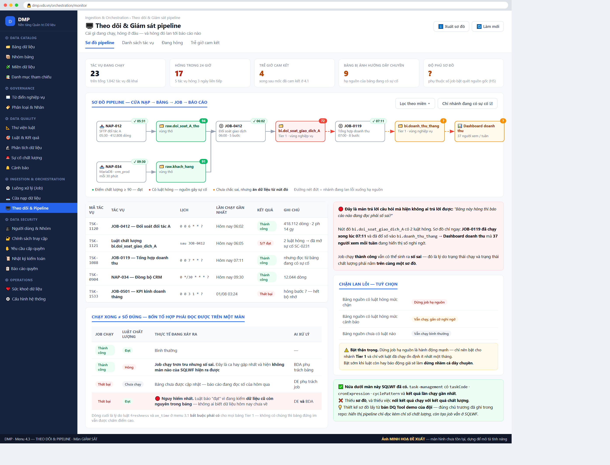

**Bốn loại nút trên sơ đồ**

| Nút | Là gì | Lấy từ đâu |
|---|---|---|
| 📥 | Cửa nạp | Menu **4.2** |
| 🗂️ | Bảng | Menu **1.1** |
| ⚙️ | Job | Menu **4.1** |
| 📊 | Báo cáo / dashboard | Danh sách hệ thống tiêu thụ khai ở **1.1** |

**Màu nút = trạng thái chất lượng, không phải trạng thái chạy**

| Màu | Nghĩa |
|---|---|
| 🟢 Xanh | Điểm chất lượng ≥ 90 — đạt |
| 🔴 Đỏ | Có luật hỏng — **nguồn gây sự cố** |
| 🟠 Cam | Chưa chắc sai, nhưng **ăn dữ liệu từ nút đỏ** |

**Câu hỏi màn này trả lời — hiện không ai trả lời được**

> ❓ *"Bảng này hỏng thì báo cáo nào đang đọc phải số sai?"*
>
> Nút đỏ `bi.doi_soat_giao_dich_A` có **2 luật hỏng**. Sơ đồ chỉ ngay:
> **JOB-0119 đã chạy xong lúc 07:11** và đã đổ số vào `bi.doanh_thu_thang` → **Dashboard doanh thu** mà **37 người xem mỗi tuần** đang hiển thị số nghi ngờ.

**Bốn tổ hợp giữa trạng thái chạy và trạng thái chất lượng**

| Job chạy | Luật chất lượng | Thực tế đang xảy ra | Ai xử lý |
|---|---|---|---|
| ✅ Thành công | ✅ Đạt | Bình thường | — |
| ✅ Thành công | ❌ Hỏng | **Job chạy trơn tru nhưng số sai.** Ca hay gặp nhất, hiện **không màn nào của SQLWF hiện ra được** | BDA phụ trách bảng |
| ❌ Thất bại | ⬜ Chưa chạy | Bảng chưa được cập nhật — báo cáo đang đọc số của hôm qua | DE phụ trách job |
| ❌ Thất bại | ✅ **Đạt** | 🔴 **Nguy hiểm nhất.** Luật báo "đạt" vì đang kiểm **dữ liệu cũ còn nguyên trong bảng** — không ai biết dữ liệu hôm nay chưa về | DE **và** BDA |

> ⭐ Dòng cuối là lý do luật `freshness` và `on_time` ở menu 3.1 **bắt buộc phải có cho mọi bảng Tier 1**. Không có chúng thì **một bảng đứng im vẫn được chấm điểm cao**.

**Chặn lan lỗi — tuỳ chọn, bật thận trọng**

| Bảng nguồn | Hành động với job hạ nguồn |
|---|---|
| Có luật hỏng **mức chặn** | 🛑 Dừng job hạ nguồn |
| Có luật hỏng **mức cảnh báo** | ⚠️ Vẫn chạy, gắn cờ nghi ngờ |
| Chưa có luật nào | Vẫn chạy bình thường |

> ⚠️ **Dừng job hạ nguồn là hành động mạnh.** Chỉ nên bật cho nhánh **Tier 1**, và chỉ với luật đã chạy ổn định **ít nhất một tháng**.
>
> Bật sớm khi luật còn hay báo động giả sẽ làm **dừng nhầm cả dây chuyền** — và lần sau không ai dám bật nữa.

**Thẻ "Độ phủ sơ đồ" để dấu hỏi là có chủ ý**

> Độ phủ sơ đồ **phụ thuộc trực tiếp vào số job đã bật quét nguồn gốc** — tức là câu hỏi treo **H5**. Sơ đồ chỉ vẽ được phần pipeline mà lineage đã quét ra.
>
> Đây là lý do **việc bật `enableDataLineage` hàng loạt ở menu 4.1 phải làm trước**, nếu không màn này xây xong cũng chỉ hiện được vài nhánh.

</details>

---

## Tổng kết Module ④

<details open>
<summary><b>9 màn · việc phải làm · điều kiện chặn · thứ tự triển khai</b></summary>

| Menu | Số màn | Việc | Ghi chú |
|---|:---:|:---:|---|
| **4.1 Luồng xử lý (Job)** | 5 | 🔵 Nâng cấp | `job-management` giữ **toàn bộ phần chạy**. Chỉ thêm: ép bảng đích có trong 1.1 · bật quét lineage mặc định · giờ cam kết · nhật ký theo bước |
| **4.2 Cửa nạp dữ liệu** | 3 | 🟣 Gộp | Gộp 6 màn, giữ nguyên phần chạy từng loại. Phần **xây mới thật sự là cổng chất lượng và vùng chờ** |
| **4.3 Theo dõi & Pipeline** | 1 | 🔵 Nâng cấp | `task-management` giữ nguyên. Thêm **sơ đồ** và **nối kết quả chạy với kết quả chất lượng** |

**Module ④ phụ thuộc vào gì**

| Cần có trước | Để làm gì |
|---|---|
| **1.1 — danh mục bảng** | Ép bảng đích phải chọn từ đây (cả 4.1 và 4.2) |
| **1.1 — DE / BDA phụ trách** | Gửi cảnh báo job hỏng theo vai trò |
| **1.4 — Danh mục tham chiếu mở API** | Luật `referential_integrity` ở cổng chất lượng mới chạy được |
| **3.1 — Thư viện luật** | Cổng chất lượng dùng lại loại kiểm tra, không khai kiểu luật riêng |
| **3.4 — Incidents** | Lô bị chặn và job hỏng liên tiếp tự mở sự cố ở đây |
| **6.2 — Kết nối nguồn** | Mẫu nạp chọn kết nối từ đây, không khai lại máy chủ |

**Module ④ là đầu vào cho ai**

| Cấp cho | Cái gì |
|---|---|
| **1.1 › tab Nguồn gốc** | Toàn bộ quan hệ bảng → job → bảng |
| **1.1 › thẻ Độ tươi** | Thời điểm nạp gần nhất + giờ cam kết |
| **3.2** | Mốc thời gian cho luật `freshness` và `on_time` |
| **3.4** | Sự kiện job hỏng liên tiếp · lô bị cổng chặn |
| **6.1** | Tỉ lệ job chạy đúng giờ · độ phủ lineage |

**Thứ tự triển khai đề xuất**

1. **Bật `enableDataLineage` hàng loạt** — một lệnh cập nhật, không phải việc lập trình. **Làm trước tiên vì mọi thứ khác phụ thuộc vào nó**
2. **Bộ phân tích cú pháp SQL** thay cách dò `${…}` — sửa chất lượng lineage tận gốc
3. **4.1 — ràng buộc bảng đích + giờ cam kết** — ít việc, giá trị cao
4. **4.3 — sơ đồ pipeline** — chạy được ngay sau khi (1) và (2) xong
5. **4.2 — gộp 6 màn nạp** — việc nhiều nhất, làm sau
6. **4.2 — cổng chất lượng** — làm cuối, sau khi 3.1 và 3.2 đã chạy ổn định

**Hai con số phải theo dõi**

| Chỉ số | Vì sao |
|---|---|
| **% job đã bật quét nguồn gốc** *(hiện: chưa biết — H5)* | Quyết định độ phủ của cả sơ đồ nguồn gốc lẫn sơ đồ pipeline |
| **Số bảng đích chưa khai ở 1.1** *(hiện 214)* | Mỗi bảng chưa khai là một điểm mù cho ba module ③ ⑤ ⑥ |

</details>

---

# PHẦN 6 — MODULE ⑤ DATA SECURITY

> **5 menu · 13 màn hình.** Đây là module có **hai tính năng mới hoàn toàn** — và cả hai đều đã được kiểm tra kỹ trong mã nguồn để chắc chắn là chưa có:
>
> | Tính năng | Kết quả kiểm tra mã nguồn |
> |---|---|
> | **Che dữ liệu** *(data masking)* | Không có trường `maskType` nào, ở bất kỳ thực thể nào. Cơ chế OPA hiện tại là **chặn HÀM SQL theo nhãn** (`TagFunctionBlacklist`), **không phải che giá trị** |
> | **Lọc theo dòng** *(row-level filter)* | Không có trường `rowFilter` nào. Đang được làm vòng bằng cách **tạo bảng riêng cho mỗi chi nhánh** |
>
> Phần còn lại của module — người dùng, nhóm, quyền menu, nhật ký — SQLWF đã có và **có chỗ còn mạnh hơn mặt bằng thị trường**.

---

## 5.1 Người dùng & Nhóm

<details open>
<summary><b>Menu này để làm gì</b></summary>

**Mục đích:** quản lý tài khoản, nhóm, vai trò, và **quyền truy cập MENU**.

**Đây là chỗ dễ nhầm nhất của cả module — phải phân biệt hai loại quyền:**

| | **Quyền MENU** | **Quyền DỮ LIỆU** |
|---|---|---|
| Trả lời câu hỏi | Người này **mở được màn nào** | Người này **đọc được dòng nào, cột nào** |
| Khai ở đâu | **Menu 5.1** | **Menu 5.2** |
| SQLWF hiện có | `acl` · `feature-menu-authorization` · `group-authorize` | `data-authorize` · `file-view-group` · `tags` |
| Việc | 🟢 Giữ nguyên | 🔵 Nâng cấp + gộp |

> 💡 **Vì sao phải tách:** mở được màn *Truy vấn dữ liệu* **không có nghĩa** là đọc được mọi bảng trong đó.
>
> Hiện SQLWF trộn hai loại vào cùng một màn `user-managerment` — các cột *Phân quyền truy cập dữ liệu* · *Phân quyền File View* · *Phân quyền danh mục* · *Phân quyền PYC* nằm cạnh nhau, người khai **rất khó biết mình đang cấp cái gì**.

**1 màn:** Danh sách người dùng *(4 tab: Người dùng · Nhóm · Vai trò · Quyền menu)*

</details>

<details open>
<summary><b>Màn 40 — Danh sách người dùng</b></summary>

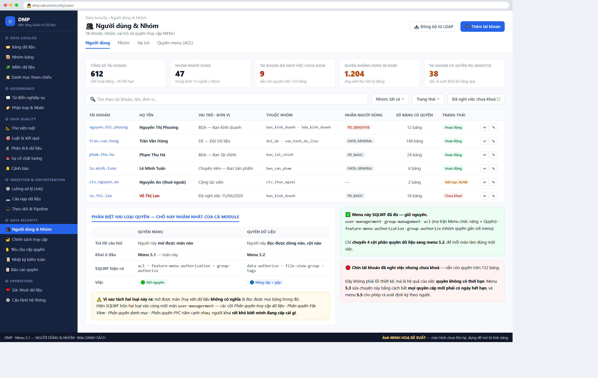

**Các cột:** Tài khoản · Họ tên · Vai trò · Đơn vị · Thuộc nhóm · **Nhãn người dùng** · **Số bảng có quyền** · Trạng thái

**Năm thẻ số liệu**

| Thẻ | Con số | Ý nghĩa |
|---|:---:|---|
| Tổng số tài khoản | 612 | 584 hoạt động · 28 hết hạn |
| Nhóm người dùng | 47 | trung bình 13 người / nhóm |
| **Tài khoản đã nghỉ việc chưa khoá** | **9** | 🔴 vẫn còn quyền trên **132 bảng** |
| Quyền không dùng 90 ngày | 1.204 | ứng viên thu hồi tự động |
| Tài khoản có quyền PD_SENSITIVE | 38 | cần rà soát định kỳ hằng quý |

> ✅ **Menu này SQLWF đã đủ — giữ nguyên.** `user-managerment` · `group-management` · `acl` (ma trận Menu chức năng × Quyền) · `feature-menu-authorization` · `group-authorize`.
>
> Việc duy nhất: **chuyển 4 cột phân quyền dữ liệu sang menu 5.2**, để mỗi màn làm đúng một việc.

> 🔴 **Chín tài khoản đã nghỉ việc nhưng chưa khoá** không phải lỗi thiết kế — đó là hệ quả của việc **quyền không có thời hạn**. Menu **5.3** sửa tận gốc bằng cách bắt mọi quyền cấp mới phải có ngày hết hạn.

</details>

<details open>
<summary><b>Màn 41 — Tab Nhóm & Quyền menu</b></summary>

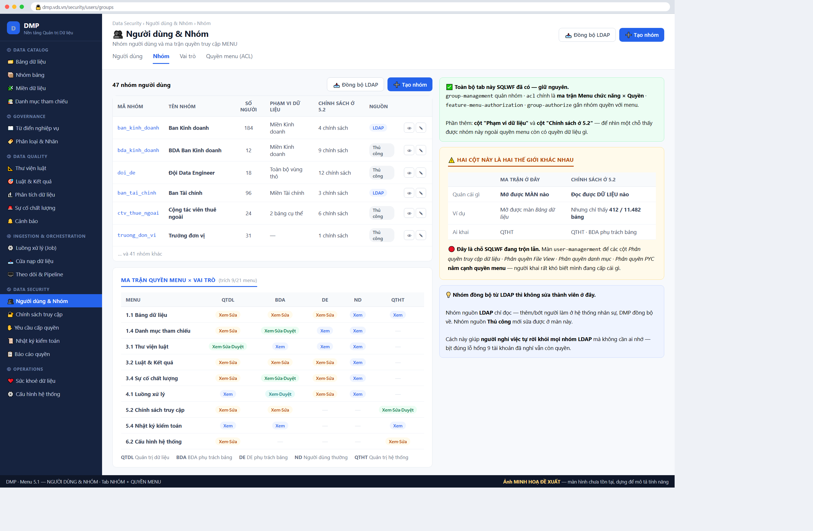

**Các cột nhóm:** Mã nhóm · Tên nhóm · Số người · **Phạm vi dữ liệu** · **Chính sách ở 5.2** · Nguồn

> ✅ **Toàn bộ tab này SQLWF đã có — giữ nguyên.** `group-management` · `acl` (chính là **ma trận Menu chức năng × Quyền**) · `feature-menu-authorization` · `group-authorize`.
>
> Phần thêm: **hai cột Phạm vi dữ liệu và Chính sách ở 5.2** — để nhìn một chỗ thấy được nhóm này ngoài quyền menu còn có quyền dữ liệu gì.

**Hai cột này là hai thế giới khác nhau**

| | Ma trận ở đây | Chính sách ở 5.2 |
|---|---|---|
| Quản cái gì | **Mở được MÀN nào** | **Đọc được DỮ LIỆU nào** |
| Ví dụ | Mở được màn *Bảng dữ liệu* | Nhưng chỉ thấy **412 / 11.482 bảng** |
| Ai khai | QTHT | QTHT · BDA phụ trách bảng |

> 🔴 **Đây là chỗ SQLWF đang trộn lẫn.** Màn `user-managerment` để các cột *Phân quyền truy cập dữ liệu* · *Phân quyền File View* · *Phân quyền danh mục* · *Phân quyền PYC* **nằm cạnh quyền menu** — người khai rất khó biết mình đang cấp cái gì.

**Nhóm đồng bộ từ LDAP thì không sửa thành viên ở đây**

> Nhóm nguồn **LDAP** chỉ đọc — thêm/bớt người làm ở hệ thống nhân sự, DMP đồng bộ về. Nhóm nguồn **Thủ công** mới sửa được ở màn này.
>
> Cách này giúp **người nghỉ việc tự rời khỏi mọi nhóm LDAP** mà không cần ai nhớ — bịt đúng lỗ hổng 9 tài khoản đã nghỉ vẫn còn quyền.

</details>

---

## 5.2 Chính sách truy cập ⭐

<details open>
<summary><b>Menu này để làm gì</b></summary>

**Mục đích:** một nơi duy nhất cho **mọi chính sách trên DỮ LIỆU**.

**4 tab — hai tab đầu đã có ở SQLWF, hai tab sau là mới hoàn toàn:**

| Tab | Trả lời câu hỏi | Trạng thái |
|---|---|---|
| **Quyền dữ liệu** | Người này được **động vào bảng nào** | ⚠️ Có, đang rải 3 màn → gộp |
| **Che dữ liệu** | Người này thấy được **CỘT nào** | ❌ **Chưa có** |
| **Lọc theo dòng** | Người này thấy được **DÒNG nào** | ❌ **Chưa có** |
| **Chính sách theo nhãn** | Khai một lần, áp cho **mọi cột mang nhãn** | ❌ Chưa có |

> ⚠️ Lưu ý: `group-authorize` là quyền **MENU** nên xếp về **5.1**, không thuộc menu này.

**4 màn:** một màn cho mỗi tab

</details>

<details open>
<summary><b>Màn 42 — Tab Quyền dữ liệu</b></summary>

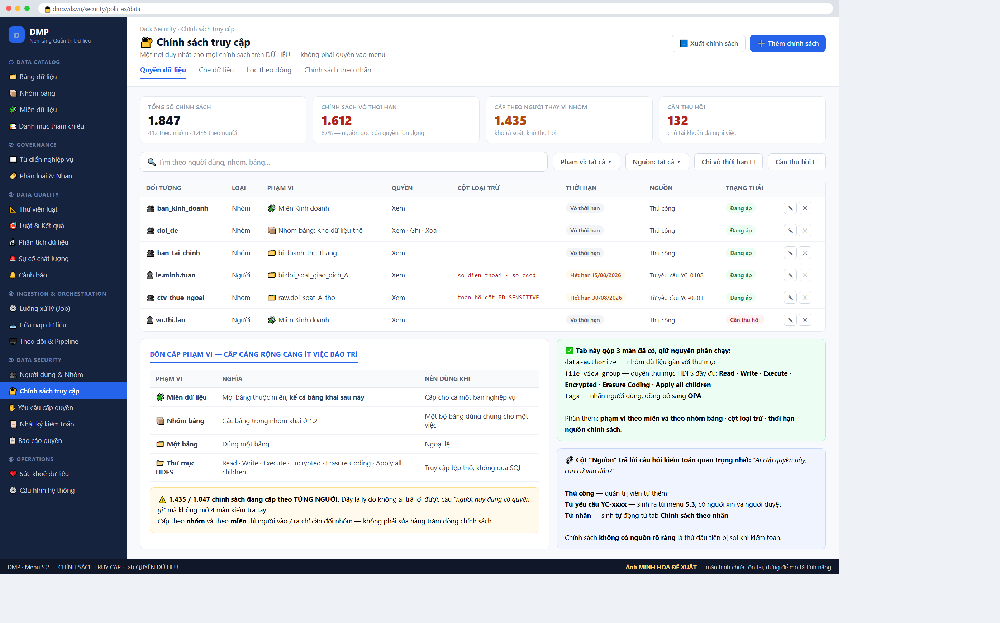

**Các cột:** Đối tượng · Loại *(nhóm/người)* · **Phạm vi** · Quyền · **Cột loại trừ** · **Thời hạn** · **Nguồn** · Trạng thái

**Bốn cấp phạm vi — cấp càng rộng càng ít việc bảo trì**

| Phạm vi | Nghĩa | Nên dùng khi |
|---|---|---|
| 🧩 **Miền dữ liệu** | Mọi bảng thuộc miền, **kể cả bảng khai sau này** | Cấp cho cả một ban nghiệp vụ |
| 📦 **Nhóm bảng** | Các bảng trong nhóm khai ở 1.2 | Một bộ bảng dùng chung cho một việc |
| 🗂️ **Một bảng** | Đúng một bảng | Ngoại lệ |
| 📁 **Thư mục HDFS** | Read · Write · Execute · Encrypted · Erasure Coding · Apply all children | Truy cập tệp thô, không qua SQL |

> ✅ Dòng cuối **giữ nguyên `file-view-group`** — màn này đã có đủ 6 tuỳ chọn quyền thư mục HDFS, không cần làm lại.

**Cột "Nguồn" trả lời câu hỏi kiểm toán quan trọng nhất**

*"Ai cấp quyền này, căn cứ vào đâu?"*

| Giá trị | Nghĩa |
|---|---|
| **Thủ công** | Quản trị viên tự thêm |
| **Từ yêu cầu YC-xxxx** | Sinh ra từ menu **5.3** — có người xin, có người duyệt, có lý do |
| **Từ nhãn** | Sinh tự động từ tab *Chính sách theo nhãn* |

> 🔴 **1.409 / 1.847 chính sách (76%) hiện ghi nguồn là "Thủ công" — không có yêu cầu, không có lý do, không biết ai duyệt.** Đây là thứ đầu tiên bị soi khi kiểm toán.

**Hai con số cần chú ý**

> ⚠️ **1.435 / 1.847 chính sách đang cấp theo TỪNG NGƯỜI.** Đây là lý do không ai trả lời được câu *"người này đang có quyền gì"* mà không mở 4 màn kiểm tra tay.
>
> Cấp theo **nhóm** và theo **miền** thì người vào / ra chỉ cần đổi nhóm — không phải sửa hàng trăm dòng chính sách.

> ⚠️ **87% chính sách là vô thời hạn.** Đây là nguồn gốc của cả 1.204 quyền bỏ quên lẫn 9 tài khoản đã nghỉ việc vẫn còn quyền.

</details>

<details open>
<summary><b>Màn 43 — Tab Che dữ liệu ⭐ mới hoàn toàn</b></summary>

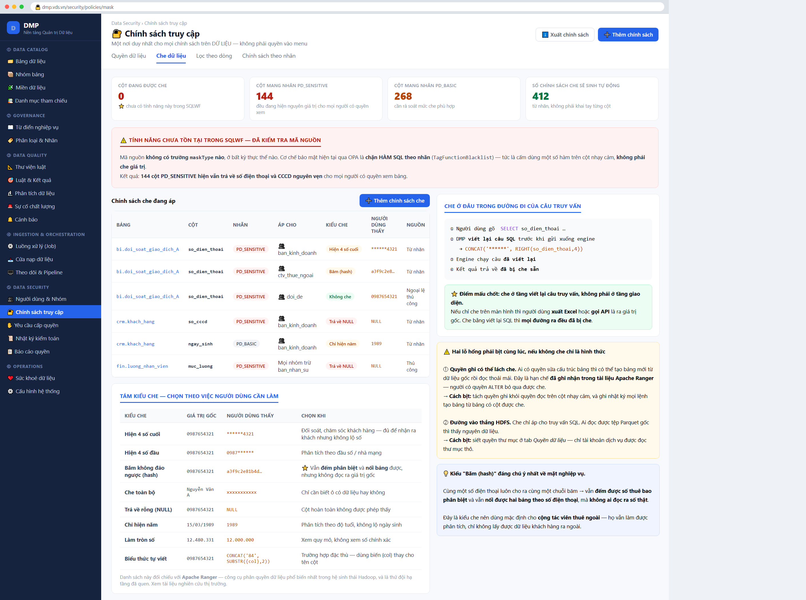

> 🔴 **Đã kiểm tra mã nguồn: không có trường `maskType` nào.**
>
> Cơ chế bảo mật hiện tại qua OPA là **chặn HÀM SQL theo nhãn** (`TagFunctionBlacklist`) — tức là cấm dùng một số hàm trên cột nhạy cảm, **không phải che giá trị**.
>
> Kết quả: **144 cột `PD_SENSITIVE` hiện vẫn trả về số điện thoại và CCCD nguyên vẹn** cho mọi người có quyền xem bảng.

**Các cột:** Bảng · Cột · Nhãn · **Áp cho** · **Kiểu che** · **Người dùng thấy** · Nguồn

**Tám kiểu che — chọn theo việc người dùng cần làm**

| Kiểu che | Giá trị gốc | Người dùng thấy | Chọn khi |
|---|---|---|---|
| Hiện 4 số cuối | `0987654321` | `******4321` | Đối soát, chăm sóc khách hàng — đủ để nhận ra khách nhưng không lộ số |
| Hiện 4 số đầu | `0987654321` | `0987******` | Phân tích theo đầu số / nhà mạng |
| **Băm không đảo ngược** | `0987654321` | `a3f9c2e81b4d…` | ⭐ Vẫn **đếm phân biệt** và **nối bảng** được, nhưng không đọc ra giá trị gốc |
| Che toàn bộ | `Nguyễn Văn A` | `xxxxxxxxxxx` | Chỉ cần biết ô có dữ liệu hay không |
| Trả về rỗng (NULL) | `0987654321` | `NULL` | Cột hoàn toàn không được phép thấy |
| Chỉ hiện năm | `15/03/1989` | `1989` | Phân tích theo độ tuổi, không lộ ngày sinh |
| Làm tròn số | `12.480.331` | `12.000.000` | Xem quy mô, không xem số chính xác |
| Biểu thức tự viết | `0987654321` | `CONCAT('84', SUBSTR({col},2))` | Trường hợp đặc thù — dùng biến `{col}` thay cho tên cột |

> 💡 Danh sách này **đối chiếu với Apache Ranger** — công cụ phân quyền dữ liệu phổ biến nhất trong hệ sinh thái Hadoop và là thứ đội hạ tầng đã quen. Xem [tài liệu nghiên cứu thị trường](SQLWF-Nghien-cuu-thi-truong-Demo-cong-cu.md).

**Che ở đâu trong đường đi của câu truy vấn**

```
① Người dùng gõ    SELECT so_dien_thoai …
② DMP viết lại câu SQL trước khi gửi xuống engine
   → CONCAT('******', RIGHT(so_dien_thoai,4))
③ Engine chạy câu đã viết lại
④ Kết quả trả về đã bị che sẵn
```

> ⭐ **Điểm mấu chốt: che ở tầng viết lại câu truy vấn, không phải ở tầng giao diện.**
>
> Nếu chỉ che trên màn hình thì người dùng **xuất Excel** hoặc **gọi API** là ra giá trị gốc. Che bằng viết lại SQL thì **mọi đường ra đều đã bị che**.

**Hai lỗ hổng phải bịt cùng lúc, nếu không che chỉ là hình thức**

| Lỗ hổng | Cách bịt |
|---|---|
| **① Quyền ghi có thể lách che.** Ai có quyền sửa cấu trúc bảng thì tạo bảng mới từ dữ liệu gốc rồi đọc thoải mái. Đây là hạn chế **đã ghi nhận trong tài liệu Apache Ranger** — người có quyền `ALTER` bỏ qua được che | Tách quyền ghi khỏi quyền đọc trên cột nhạy cảm, và **ghi nhật ký mọi lệnh tạo bảng** từ bảng có cột được che |
| **② Đường vào thẳng HDFS.** Che chỉ áp cho truy vấn SQL. Ai đọc được tệp Parquet gốc thì thấy nguyên dữ liệu | Siết quyền thư mục ở tab *Quyền dữ liệu* — chỉ tài khoản dịch vụ được đọc thư mục thô |

**Kiểu "Băm (hash)" đáng chú ý nhất về mặt nghiệp vụ**

> Cùng một số điện thoại luôn cho ra cùng một chuỗi băm → vẫn **đếm được số thuê bao phân biệt** và vẫn **nối được hai bảng theo số điện thoại**, mà **không ai đọc ra số thật**.
>
> Đây là kiểu che nên dùng mặc định cho **cộng tác viên thuê ngoài** — họ vẫn làm được phân tích, chỉ không lấy được dữ liệu khách hàng ra ngoài.

</details>

<details open>
<summary><b>Màn 44 — Thêm chính sách che dữ liệu</b></summary>

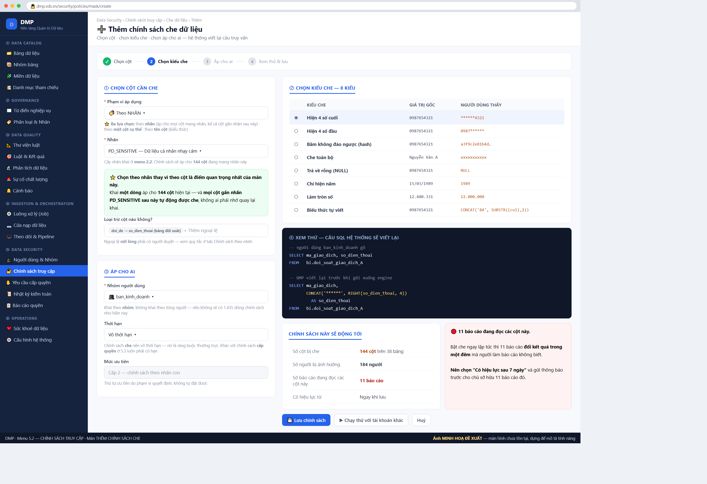

**Bốn bước:** Chọn cột → Chọn kiểu che → Áp cho ai → **Xem thử & lưu**

**Bước ① — chọn theo NHÃN thay vì theo cột**

| Phạm vi | Nghĩa |
|---|---|
| 🏷️ **Theo nhãn** ⭐ | Áp cho mọi cột mang nhãn, **kể cả cột gắn nhãn sau này** |
| Theo một cột cụ thể | Ngoại lệ |
| Theo tên cột *(biểu thức)* | Ví dụ mọi cột tên `*_cccd` |

> ⭐ **Đây là điểm quan trọng nhất của màn.** Khai **một dòng** áp cho **144 cột** hiện tại — và **mọi cột gắn nhãn `PD_SENSITIVE` sau này tự động được che**, không ai phải nhớ quay lại khai.

**Bước ③ — áp cho ai**

| Trường | Ghi chú |
|---|---|
| Nhóm người dùng | Khai theo **nhóm**, không theo từng người — nếu không sẽ có 1.435 dòng như hiện nay |
| Thời hạn | **Vô thời hạn** — chính sách *che* là ràng buộc thường trực. Khác với chính sách *cấp quyền* ở 5.3 luôn phải có hạn |
| Mức ưu tiên | Chỉ đọc — do phạm vi quyết định, không tự đặt được |

**Bước ④ — xem thử câu SQL hệ thống sẽ viết lại**

```sql
-- người dùng ban_kinh_doanh gõ
SELECT ma_giao_dich, so_dien_thoai FROM bi.doi_soat_giao_dich_A

-- DMP viết lại trước khi gửi xuống engine
SELECT ma_giao_dich,
       CONCAT('******', RIGHT(so_dien_thoai, 4)) AS so_dien_thoai
FROM   bi.doi_soat_giao_dich_A
```

**Trước khi lưu, hệ thống cho biết chính sách này động tới đâu**

| | |
|---|---|
| Số cột bị che | **144 cột** trên 38 bảng |
| Số người bị ảnh hưởng | **184 người** |
| **Số báo cáo đang đọc các cột này** | 🔴 **11 báo cáo** |

> 🔴 **11 báo cáo đang đọc các cột này.** Bật che ngay lập tức thì 11 báo cáo **đổi kết quả trong một đêm** mà người làm báo cáo không biết.
>
> **Nên chọn "Có hiệu lực sau 7 ngày"** và gửi thông báo trước cho chủ sở hữu 11 báo cáo đó.

</details>

<details open>
<summary><b>Màn 45 — Tab Lọc theo dòng ⭐ mới hoàn toàn</b></summary>

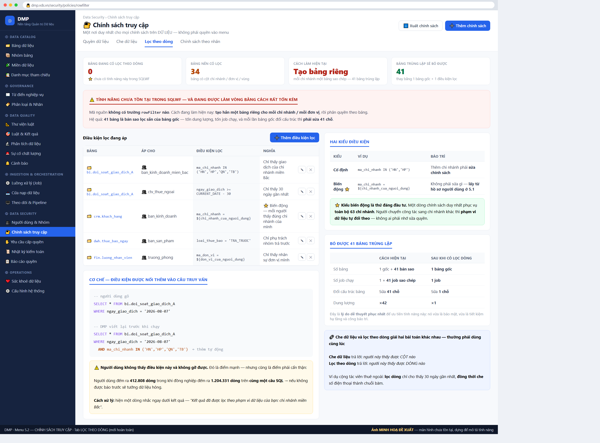

> 🔴 **Đã kiểm tra mã nguồn: không có trường `rowFilter` nào — và việc này đang được làm vòng bằng cách rất tốn kém.**
>
> Cách đang làm hiện nay: **tạo hẳn một bảng riêng cho mỗi chi nhánh / mỗi đơn vị**, rồi phân quyền theo bảng.
>
> Hệ quả: **41 bảng là bản sao lọc sẵn của bảng gốc** — tốn dung lượng, tốn job chạy, và mỗi lần bảng gốc đổi cấu trúc thì **phải sửa 41 chỗ**.

**Các cột:** Bảng · Áp cho · **Điều kiện lọc** · Nghĩa

**Cơ chế — điều kiện được nối thêm vào câu truy vấn**

```sql
-- người dùng gõ
SELECT * FROM bi.doi_soat_giao_dich_A
WHERE ngay_giao_dich = '2026-08-07'

-- DMP viết lại trước khi chạy
SELECT * FROM bi.doi_soat_giao_dich_A
WHERE ngay_giao_dich = '2026-08-07'
  AND ma_chi_nhanh IN ('HN','HP','QN','TB')   ← thêm tự động
```

**Hai kiểu điều kiện**

| Kiểu | Ví dụ | Bảo trì |
|---|---|---|
| **Cố định** | `ma_chi_nhanh IN ('HN','HP')` | Thêm chi nhánh phải **sửa chính sách** |
| **Biến động** ⭐ | `ma_chi_nhanh = ${chi_nhanh_cua_nguoi_dung}` | Không phải sửa gì — **lấy từ hồ sơ người dùng ở 5.1** |

> ⭐ **Kiểu biến động là thứ đáng đầu tư.** Một dòng chính sách duy nhất phục vụ **toàn bộ 63 chi nhánh**. Người chuyển công tác sang chi nhánh khác thì **phạm vi dữ liệu tự đổi theo** — không ai phải nhớ sửa quyền.

**Lý do dễ thuyết phục nhất: bỏ được 41 bảng trùng lặp**

| | Cách hiện tại | Sau khi có lọc dòng |
|---|---|---|
| Số bảng | 1 gốc + **41 bản sao** | **1 bảng gốc** |
| Số job chạy | 1 + **41 job sao chép** | **1 job** |
| Đổi cấu trúc bảng | Sửa **41 chỗ** | Sửa **1 chỗ** |
| Dung lượng | **×42** | **×1** |

> Tính năng này **vừa là bảo mật, vừa là tiết kiệm hạ tầng và công bảo trì** — nên dễ được duyệt hơn nếu trình bày ở góc thứ hai.

**Một rủi ro phải xử lý ngay từ đầu**

> ⚠️ **Người dùng không thấy điều kiện này và không gỡ được.** Đó là điểm mạnh — nhưng cũng là điểm phải cẩn thận.
>
> Người dùng đếm ra **412.808 dòng** trong khi đồng nghiệp đếm ra **1.204.331 dòng** trên **cùng một câu SQL** → nếu không được báo trước sẽ tưởng dữ liệu hỏng.
>
> **Cách xử lý:** hiện một dòng nhắc ngay dưới kết quả — *"Kết quả đã được lọc theo phạm vi dữ liệu của bạn: chi nhánh miền Bắc"*.

**Che dữ liệu và lọc theo dòng giải hai bài toán khác nhau — thường phải dùng cùng lúc**

| | Trả lời câu hỏi |
|---|---|
| **Che dữ liệu** | Người này thấy được **CỘT** nào |
| **Lọc theo dòng** | Người này thấy được **DÒNG** nào |

Ví dụ cộng tác viên thuê ngoài: **lọc dòng** chỉ cho thấy 30 ngày gần nhất, **đồng thời che** số điện thoại thành chuỗi băm.

</details>

<details open>
<summary><b>Màn 46 — Thêm điều kiện lọc theo dòng</b></summary>

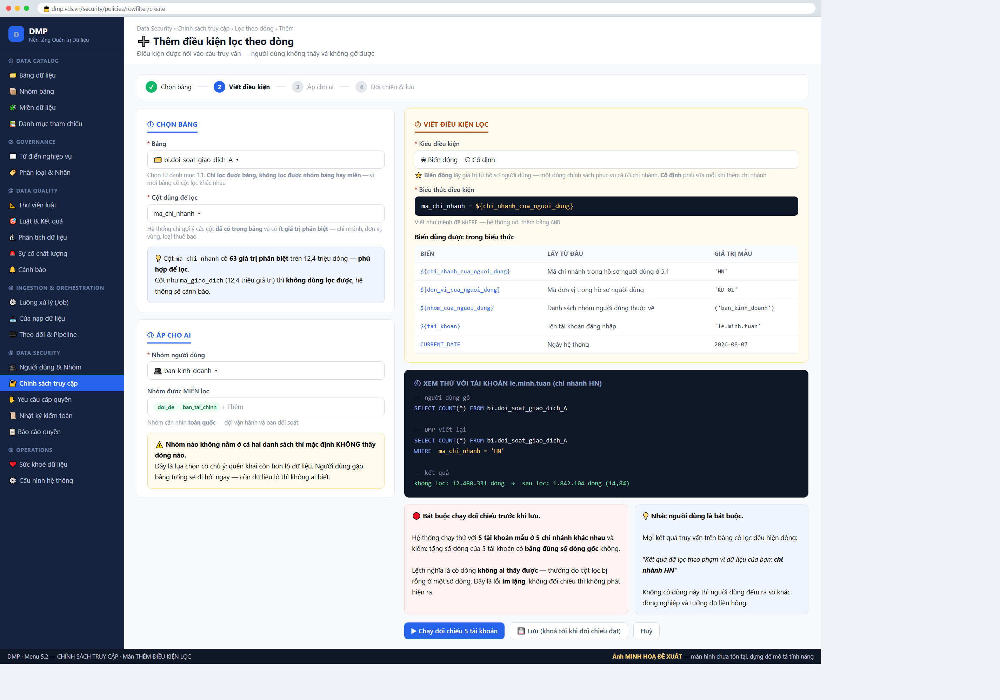

**Bốn bước:** Chọn bảng → Viết điều kiện → Áp cho ai → **Đối chiếu & lưu**

**Bước ① — hệ thống chỉ gợi ý cột phù hợp để lọc**

> Cột `ma_chi_nhanh` có **63 giá trị phân biệt** trên 12,4 triệu dòng — **phù hợp**.
>
> Cột như `ma_giao_dich` (12,4 triệu giá trị) thì **không dùng lọc được**, hệ thống cảnh báo.

> ⚠️ **Chỉ lọc được theo BẢNG**, không lọc được theo nhóm bảng hay miền — vì mỗi bảng có cột lọc khác nhau.

**Bước ② — năm biến dùng được trong biểu thức**

| Biến | Lấy từ đâu |
|---|---|
| `${chi_nhanh_cua_nguoi_dung}` | Mã chi nhánh trong hồ sơ người dùng ở 5.1 |
| `${don_vi_cua_nguoi_dung}` | Mã đơn vị trong hồ sơ người dùng |
| `${nhom_cua_nguoi_dung}` | Danh sách nhóm người dùng thuộc về |
| `${tai_khoan}` | Tên tài khoản đăng nhập |
| `CURRENT_DATE` | Ngày hệ thống |

**Bước ③ — nhóm không khai thì mặc định KHÔNG thấy gì**

> ⚠️ Nhóm nào không nằm ở cả danh sách *áp* lẫn danh sách *miễn* thì **không thấy dòng nào**.
>
> Đây là lựa chọn có chủ ý: **quên khai còn hơn lộ dữ liệu**. Người dùng gặp bảng trống sẽ đi hỏi ngay — còn dữ liệu lộ thì không ai biết.

**Bước ④ — bắt buộc chạy đối chiếu trước khi lưu**

> 🔴 Hệ thống chạy thử với **5 tài khoản mẫu ở 5 chi nhánh khác nhau** và kiểm: tổng số dòng của 5 tài khoản có **bằng đúng số dòng gốc** không.
>
> Lệch nghĩa là có dòng **không ai thấy được** — thường do cột lọc bị rỗng ở một số dòng. Đây là lỗi **im lặng**, không đối chiếu thì không phát hiện ra.
>
> **Nút Lưu bị khoá cho tới khi đối chiếu đạt.**

> 💡 **Nhắc người dùng là bắt buộc.** Mọi kết quả truy vấn trên bảng có lọc đều hiện dòng: *"Kết quả đã lọc theo phạm vi dữ liệu của bạn: chi nhánh HN"*. Không có dòng này thì người dùng đếm ra số khác đồng nghiệp và tưởng dữ liệu hỏng.

</details>

<details open>
<summary><b>Màn 47 — Tab Chính sách theo nhãn</b></summary>

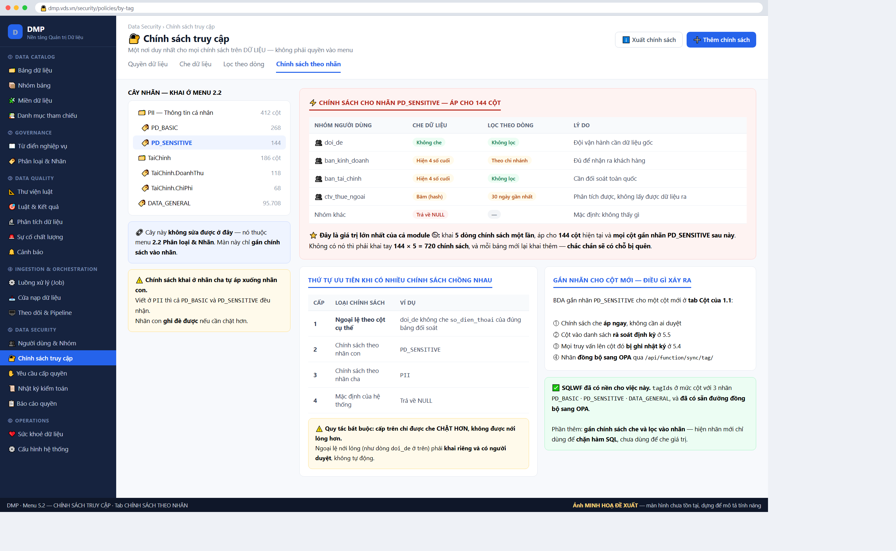

**Đây là tab giải thích vì sao module ② Governance đáng làm.**

Cây nhãn khai ở **menu 2.2**, không sửa được ở đây. Màn này chỉ **gắn chính sách vào nhãn**.

**Chính sách cho nhãn `PD_SENSITIVE` — áp cho 144 cột**

| Nhóm người dùng | Che dữ liệu | Lọc theo dòng | Lý do |
|---|---|---|---|
| 👥 `doi_de` | Không che | Không lọc | Đội vận hành cần dữ liệu gốc |
| 👥 `ban_kinh_doanh` | Hiện 4 số cuối | Theo chi nhánh | Đủ để nhận ra khách hàng |
| 👥 `ban_tai_chinh` | Hiện 4 số cuối | Không lọc | Cần đối soát toàn quốc |
| 👥 `ctv_thue_ngoai` | Băm (hash) | 30 ngày gần nhất | Phân tích được, không lấy được dữ liệu ra |
| Nhóm khác | Trả về NULL | — | Mặc định: không thấy gì |

> ⭐ **Đây là giá trị lớn nhất của cả module ⑤:** khai **5 dòng chính sách một lần**, áp cho **144 cột** hiện tại và **mọi cột gắn nhãn `PD_SENSITIVE` sau này**.
>
> Không có nó thì phải khai tay **144 × 5 = 720 chính sách**, và mỗi bảng mới lại khai thêm — **chắc chắn sẽ có chỗ bị quên**.

**Thứ tự ưu tiên khi có nhiều chính sách chồng nhau**

| Cấp | Loại chính sách | Ví dụ |
|:---:|---|---|
| **1** | **Ngoại lệ theo cột cụ thể** | `doi_de` không che `so_dien_thoai` của đúng bảng đối soát |
| **2** | Chính sách theo nhãn con | `PD_SENSITIVE` |
| **3** | Chính sách theo nhãn cha | `PII` |
| **4** | Mặc định của hệ thống | Trả về NULL |

> ⚠️ **Quy tắc bắt buộc: cấp trên chỉ được che CHẶT HƠN, không được nới lỏng hơn.**
>
> Ngoại lệ nới lỏng (như dòng `doi_de` ở trên) phải **khai riêng và có người duyệt**, không tự động.

**Gắn nhãn cho cột mới — điều gì xảy ra**

BDA gắn nhãn `PD_SENSITIVE` cho một cột mới ở **tab Cột của 1.1**:

1. Chính sách che **áp ngay**, không cần ai duyệt
2. Cột vào danh sách **rà soát định kỳ** ở 5.5
3. Mọi truy vấn lên cột đó **bị ghi nhật ký** ở 5.4
4. Nhãn **đồng bộ sang OPA** qua `/api/function/sync/tag/`

> ✅ **SQLWF đã có nền cho việc này.** `tagIds` ở mức cột với 3 nhãn `PD_BASIC` · `PD_SENSITIVE` · `DATA_GENERAL`, và **đã có sẵn đường đồng bộ sang OPA**.
>
> Phần thêm: **gắn chính sách che và lọc vào nhãn** — hiện nhãn mới chỉ dùng để **chặn hàm SQL**, chưa dùng để che giá trị.

</details>

---

## 5.3 Yêu cầu cấp quyền

<details open>
<summary><b>Menu này để làm gì</b></summary>

**Mục đích:** xin quyền có dấu vết — gửi → người phụ trách bảng duyệt → quyền có thời hạn → tự thu hồi.

> 🔴 **Chưa có trong SQLWF — hiện xin quyền qua chat và email.** Ba hệ quả đo được:
>
> | Hệ quả | Con số |
> |---|---|
> | Không biết ai cấp, căn cứ vào đâu | **1.409 / 1.847** chính sách (76%) không có nguồn |
> | Quyền không có hạn | **87%** vô thời hạn → **9 người** đã nghỉ việc vẫn còn quyền |
> | Không có số liệu để rà soát | **1.204** quyền không ai dùng suốt 90 ngày |

> ✅ **Không phải xây từ con số không.** SQLWF đã có **khung duyệt** chạy tốt ở ba chỗ: `job-approval` · `channel-indexing-management` (duyệt bản ghi danh mục) · `sync-management` (`approveRecord` / `rejectRecord`).
>
> Menu 5.3 **dùng lại đúng khung đó**, chỉ đổi đối tượng duyệt từ *job* sang *quyền truy cập*, và thêm phần **thời hạn + tự thu hồi**.

**2 màn:** Danh sách yêu cầu · Màn duyệt

</details>

<details open>
<summary><b>Màn 48 — Danh sách yêu cầu</b></summary>

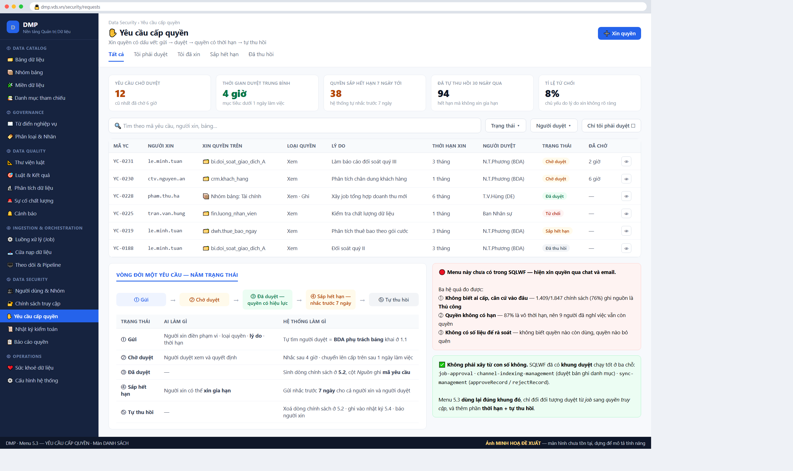

**Các cột:** Mã YC · Người xin · Xin quyền trên · Loại quyền · **Lý do** · Thời hạn xin · Người duyệt · Trạng thái · **Đã chờ**

**Vòng đời một yêu cầu — năm trạng thái**

| Trạng thái | Ai làm gì | Hệ thống làm gì |
|---|---|---|
| **① Gửi** | Người xin điền phạm vi · loại quyền · **lý do** · thời hạn | Tự tìm người duyệt = **BDA phụ trách bảng** khai ở 1.1 |
| **② Chờ duyệt** | Người duyệt xem và quyết định | Nhắc sau 4 giờ · chuyển lên cấp trên sau 1 ngày làm việc |
| **③ Đã duyệt** | — | Sinh dòng chính sách ở **5.2**, cột *Nguồn* ghi **mã yêu cầu** |
| **④ Sắp hết hạn** | Người xin có thể **xin gia hạn** | Gửi nhắc trước **7 ngày** cho cả người xin và người duyệt |
| **⑤ Tự thu hồi** | — | Xoá dòng chính sách ở 5.2 · ghi vào nhật ký 5.4 · báo người xin |

> 💡 Cột **"Đã chờ"** là thứ giữ cho quy trình không thành nút thắt. Yêu cầu chờ quá lâu thì người ta quay lại xin qua chat — và cả menu này thành vô dụng.

</details>

<details open>
<summary><b>Màn 49 — Xin quyền</b></summary>

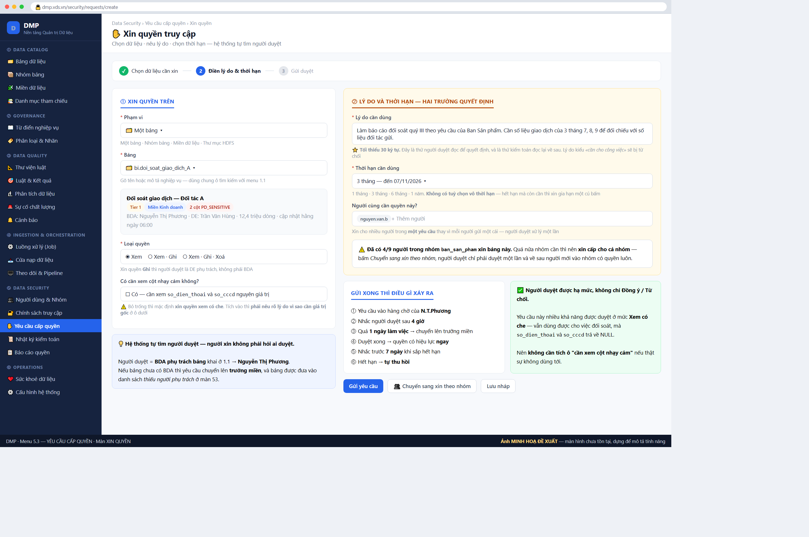

**Ba bước:** Chọn dữ liệu cần xin → **Điền lý do & thời hạn** → Gửi duyệt

**Bước ① — chọn xong hiện ngay hồ sơ bảng**

Tier · miền · **số cột nhạy cảm** · BDA · DE · số dòng · chu kỳ cập nhật — đọc từ menu 1.1.

| Trường | Ghi chú |
|---|---|
| Phạm vi | Một bảng · Nhóm bảng · Miền dữ liệu · Thư mục HDFS |
| Loại quyền | Xin quyền **Ghi** thì người duyệt là **DE phụ trách**, không phải BDA |
| **Có cần xem cột nhạy cảm không** | Bỏ trống → mặc định xin **quyền xem có che**. Tích vào thì **phải nêu rõ vì sao cần giá trị gốc** |

**Bước ② — hai trường quyết định**

| Trường | Ràng buộc |
|---|---|
| **Lý do cần dùng** | ⭐ **Tối thiểu 30 ký tự.** Lý do kiểu *«cần cho công việc»* sẽ bị từ chối |
| **Thời hạn cần dùng** | 1 tháng · 3 tháng · 6 tháng · 1 năm. **Không có tuỳ chọn vô thời hạn** |
| Người cùng cần quyền này | Xin cho nhiều người trong **một yêu cầu** — người duyệt xử lý một lần |

> 💡 **Hệ thống gợi ý xin theo nhóm khi thấy quá nửa nhóm đã xin cùng một bảng.**
>
> *"Đã có 4/9 người trong nhóm `ban_san_pham` xin bảng này"* → nên chuyển sang xin cho cả nhóm. Người duyệt duyệt một lần, và về sau **người mới vào nhóm có quyền luôn**.
>
> Đây là cách kéo tỉ lệ *cấp theo nhóm* từ **22%** lên, thay vì để nó tiếp tục sinh ra chính sách theo từng người.

**Hệ thống tự tìm người duyệt**

> Người duyệt = **BDA phụ trách bảng** khai ở 1.1. Người xin **không phải hỏi ai duyệt**.
>
> Nếu bảng **chưa có BDA** thì yêu cầu chuyển lên **trưởng miền**, và bảng được đưa vào danh sách *thiếu người phụ trách* ở màn 53.

</details>

<details open>
<summary><b>Màn 50 — Màn duyệt</b></summary>

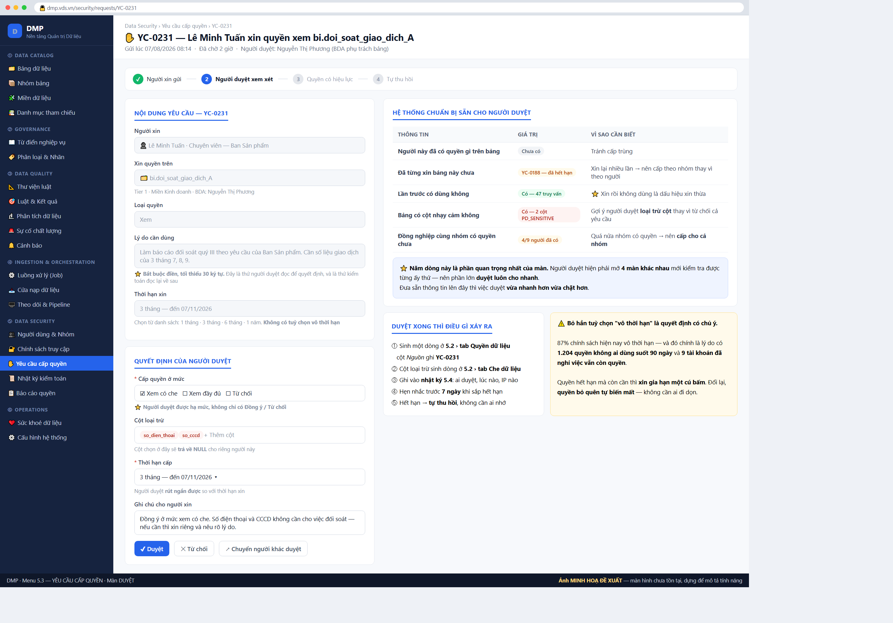

**Các trường người xin điền**

| Trường | Bắt buộc | Ghi chú |
|---|:---:|---|
| Xin quyền trên | ✔ | Chọn từ danh mục 1.1 — hiện kèm Tier, miền, BDA phụ trách |
| Loại quyền | ✔ | Xem · Ghi · Xoá |
| **Lý do cần dùng** | ✔ | ⭐ **Tối thiểu 30 ký tự.** Đây là thứ người duyệt đọc để quyết định, và là thứ kiểm toán đọc lại về sau |
| Thời hạn xin | ✔ | 1 tháng · 3 tháng · 6 tháng · 1 năm. **Không có tuỳ chọn vô thời hạn** |

**Quyết định của người duyệt — không chỉ có Đồng ý / Từ chối**

| Trường | Ghi chú |
|---|---|
| **Cấp quyền ở mức** | ⭐ Xem có che · Xem đầy đủ · Từ chối — **người duyệt được hạ mức** |
| **Cột loại trừ** | Cột chọn ở đây **trả về NULL** cho riêng người này |
| Thời hạn cấp | Người duyệt **rút ngắn được** so với thời hạn xin |
| Ghi chú cho người xin | Giải thích quyết định — quan trọng khi hạ mức hoặc từ chối |

**Hệ thống chuẩn bị sẵn năm thông tin cho người duyệt**

| Thông tin | Vì sao cần biết |
|---|---|
| Người này đã có quyền gì trên bảng | Tránh cấp trùng |
| Đã từng xin bảng này chưa | Xin lại nhiều lần → nên **cấp theo nhóm** thay vì theo người |
| **Lần trước có dùng không** | ⭐ Xin rồi không dùng là dấu hiệu **xin thừa** |
| Bảng có cột nhạy cảm không | Gợi ý người duyệt **loại trừ cột** thay vì từ chối cả yêu cầu |
| Đồng nghiệp cùng nhóm có quyền chưa | Quá nửa nhóm có quyền → nên **cấp cho cả nhóm** |

> ⭐ **Năm dòng này là phần quan trọng nhất của màn.** Người duyệt hiện phải mở **4 màn khác nhau** mới kiểm tra được từng ấy thứ — nên phần lớn **duyệt luôn cho nhanh**.
>
> Đưa sẵn thông tin lên đây thì việc duyệt **vừa nhanh hơn vừa chặt hơn**.

**Bỏ hẳn tuỳ chọn "vô thời hạn" là quyết định có chủ ý**

> 87% chính sách hiện nay vô thời hạn — và đó chính là lý do có **1.204 quyền không ai dùng suốt 90 ngày** và **9 tài khoản đã nghỉ việc vẫn còn quyền**.
>
> Quyền hết hạn mà còn cần thì **xin gia hạn một cú bấm**. Đổi lại, **quyền bỏ quên tự biến mất** — không cần ai đi dọn.

</details>

---

## 5.4 Nhật ký kiểm toán

<details open>
<summary><b>Menu này để làm gì</b></summary>

**Mục đích:** ghi lại ai truy cập gì, lúc nào, từ đâu — và **chính sách nào đã quyết định**.

Hiện SQLWF rải việc này ra **5 màn**:

| Màn SQLWF hiện tại | Ghi cái gì | Đã có trường gì |
|---|---|---|
| `history-data` | Thay đổi cấu hình | ✅ **Giá trị cũ · Giá trị mới · Người thay đổi · IP Address** — rất đầy đủ |
| `sql-history` | Lịch sử câu lệnh SQL | Câu lệnh · người chạy |
| `query-history` | Lịch sử truy vấn | Truy vấn · thời điểm |
| `sql-query-report` | Báo cáo truy vấn | Thống kê theo kỳ |
| `detail-log-configuration` | Nhật ký cấu hình tác vụ | Thay đổi theo `taskCode` |

> ✅ **Phần khó nhất SQLWF đã làm rồi.** `history-data` ghi cả **giá trị cũ**, **giá trị mới** và **địa chỉ IP** — nhiều công cụ thị trường cũng chỉ ghi được đến mức này.
>
> Việc còn lại chủ yếu là **gộp 5 màn về một chỗ tra cứu**, không phải xây mới.

**1 màn:** Tra cứu *(5 tab: Tất cả · Truy vấn dữ liệu · Xuất dữ liệu · Thay đổi cấu hình · Thay đổi quyền)*

</details>

<details open>
<summary><b>Màn 51 — Tra cứu nhật ký</b></summary>

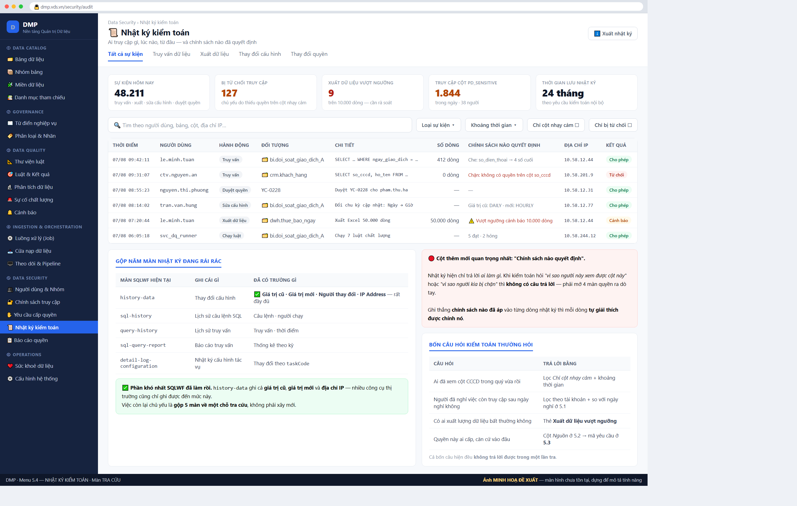

**Các cột:** Thời điểm · Người dùng · Hành động · Đối tượng · Chi tiết · Số dòng · **Chính sách nào quyết định** · Địa chỉ IP · Kết quả

**Cột thêm mới quan trọng nhất: "Chính sách nào quyết định"**

> 🔴 Nhật ký hiện chỉ trả lời *ai làm gì*. Khi kiểm toán hỏi *"vì sao người này xem được cột này"* hoặc *"vì sao người kia bị chặn"* thì **không có câu trả lời** — phải mở 4 màn quyền ra dò tay.
>
> Ghi thẳng **chính sách nào đã áp** vào từng dòng nhật ký thì mỗi dòng **tự giải thích được chính nó**.

**Bốn câu hỏi kiểm toán thường hỏi**

| Câu hỏi | Trả lời bằng |
|---|---|
| Ai đã xem cột CCCD trong quý vừa rồi | Lọc *Chỉ cột nhạy cảm* + khoảng thời gian |
| Người đã nghỉ việc còn truy cập sau ngày nghỉ không | Lọc theo tài khoản + so với ngày nghỉ ở 5.1 |
| Có ai xuất lượng dữ liệu bất thường không | Thẻ **Xuất dữ liệu vượt ngưỡng** |
| Quyền này ai cấp, căn cứ vào đâu | Cột *Nguồn* ở 5.2 → mã yêu cầu ở **5.3** |

> Cả bốn câu hiện đều **không trả lời được trong một lần tra**.

**Ngưỡng cảnh báo xuất dữ liệu**

> Xuất trên **10.000 dòng** thì ghi cờ cảnh báo và báo cho người phụ trách bảng. Đây là dấu hiệu sớm của việc **mang dữ liệu ra ngoài** — không chặn, nhưng phải để lại dấu vết.

</details>

---

## 5.5 Báo cáo quyền truy cập

<details open>
<summary><b>Menu này để làm gì</b></summary>

**Mục đích:** trả lời *"một người đang có quyền gì trên toàn hệ thống"* — **ở một màn duy nhất**.

> 🔴 **Chưa có trong SQLWF.** Quyền hiện rải ở **4 màn** (`user-managerment` · `data-authorize` · `file-view-group` · `group-authorize`), phải mở từng cái kiểm tra tay.
>
> Hệ quả thực tế: khi có người nghỉ việc, **không ai chắc đã thu hồi hết quyền chưa** — và đó là lý do **9 tài khoản đã nghỉ vẫn còn quyền trên 132 bảng**.

**1 màn:** Tra theo người *(có nút chuyển sang tra theo bảng)*

</details>

<details open>
<summary><b>Màn 52 — Báo cáo quyền theo người</b></summary>

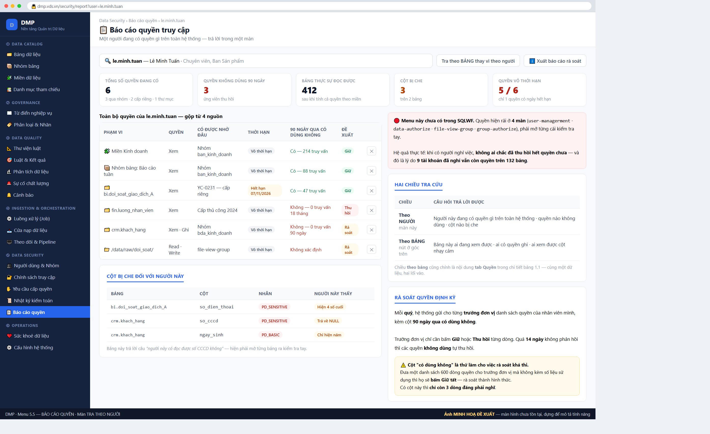

**Các cột:** Phạm vi · Quyền · **Có được nhờ đâu** · Thời hạn · **90 ngày qua có dùng không** · **Đề xuất**

**Hai chiều tra cứu**

| Chiều | Câu hỏi trả lời được |
|---|---|
| **Theo NGƯỜI** *(màn này)* | Người này đang có quyền gì trên toàn hệ thống · quyền nào không dùng · cột nào bị che |
| **Theo BẢNG** *(nút ở góc trên)* | Bảng này ai đang xem được · ai có quyền ghi · ai xem được cột nhạy cảm |

> Chiều **theo bảng** cũng chính là nội dung **tab Quyền** trong chi tiết bảng 1.1 — cùng một dữ liệu, hai lối vào.

**Rà soát quyền định kỳ**

Mỗi **quý**, hệ thống gửi cho từng **trưởng đơn vị** danh sách quyền của nhân viên mình, kèm cột **90 ngày qua có dùng không**.

Trưởng đơn vị chỉ cần bấm **Giữ** hoặc **Thu hồi** từng dòng. Quá **14 ngày** không phản hồi thì các quyền **không dùng** tự thu hồi.

> ⚠️ **Cột "có dùng không" là thứ làm cho việc rà soát khả thi.**
>
> Đưa một danh sách 600 dòng quyền cho trưởng đơn vị mà không kèm số liệu sử dụng thì họ sẽ **bấm Giữ tất** — rà soát thành hình thức.
>
> Có cột này thì **chỉ còn 3 dòng đáng phải nghĩ**.

</details>

---

## Tổng kết Module ⑤

<details open>
<summary><b>13 màn · việc phải làm · điều kiện chặn · thứ tự triển khai</b></summary>

| Menu | Số màn | Việc | Ghi chú |
|---|:---:|:---:|---|
| **5.1 Người dùng & Nhóm** | 2 | 🟢 Giữ | Đã đủ. Chỉ chuyển 4 cột phân quyền dữ liệu sang 5.2 |
| **5.2 Chính sách truy cập** | 6 | 🔵🟣 Nâng cấp + gộp | Gộp 3 màn quyền dữ liệu. **Hai tab Che dữ liệu và Lọc theo dòng là xây mới hoàn toàn** |
| **5.3 Yêu cầu cấp quyền** | 3 | 🔴 Xây mới | Dùng lại khung duyệt đã có ở `job-approval` |
| **5.4 Nhật ký kiểm toán** | 1 | 🔵🟣 Nâng cấp + gộp | `history-data` đã mạnh. Gộp 5 màn + thêm cột *chính sách nào quyết định* |
| **5.5 Báo cáo quyền** | 1 | 🔴 Xây mới | Chỉ là màn tra cứu — không khai gì, đọc lại dữ liệu của 5.1 và 5.2 |

**Module ⑤ phụ thuộc vào gì**

| Cần có trước | Để làm gì |
|---|---|
| **1.1 — danh mục bảng, cột** | Chính sách gắn vào đâu |
| **1.1 — BDA phụ trách** | Tự tìm người duyệt yêu cầu cấp quyền |
| **1.3 — Miền dữ liệu** | Phạm vi chính sách theo miền |
| **2.2 — Cây nhãn phân cấp** | ⭐ **Điều kiện chặn của tab Chính sách theo nhãn** — không có nhãn phân cấp thì phải khai tay 720 chính sách |
| **5.1 — hồ sơ người dùng có chi nhánh / đơn vị** | Lọc theo dòng kiểu **biến động** mới chạy được |

**Thứ tự triển khai đề xuất**

1. **5.1** — chuyển 4 cột phân quyền dữ liệu sang 5.2. Việc nhỏ, làm trước để hai màn sạch nghĩa
2. **5.2 › tab Quyền dữ liệu** — gộp 3 màn đang có, chưa thêm gì mới
3. **5.3** — yêu cầu cấp quyền. Làm sớm vì **mọi quyền cấp mới từ đây trở đi mới có thời hạn và có nguồn**
4. **5.2 › tab Che dữ liệu** — cần 2.2 xong trước
5. **5.2 › tab Chính sách theo nhãn** — ngay sau che dữ liệu
6. **5.4** — gộp nhật ký + thêm cột *chính sách nào quyết định*
7. **5.5** — báo cáo quyền, làm cuối vì chỉ đọc lại dữ liệu các menu trên
8. **5.2 › tab Lọc theo dòng** — làm sau cùng, vì đây là thứ **đụng vào câu truy vấn của người dùng** nên rủi ro cao nhất

> 💡 **Bước 3 đáng làm sớm hơn cảm giác ban đầu.** Che dữ liệu và lọc dòng là hai tính năng "hào nhoáng" hơn, nhưng menu 5.3 mới là thứ **chặn dòng chảy quyền tồn đọng**. Càng làm muộn thì số quyền vô thời hạn càng nhiều.

**Ba con số phải theo dõi**

| Chỉ số | Hiện tại | Vì sao |
|---|:---:|---|
| **% chính sách có thời hạn** | 13% | Quyền vô thời hạn là nguồn gốc của mọi quyền tồn đọng |
| **% chính sách cấp theo nhóm** | 22% | Cấp theo người thì không rà soát nổi khi số lượng lớn |
| **Số cột nhạy cảm chưa có chính sách che** | 412 / 412 | Cột mang nhãn mà không bị che thì việc gắn nhãn là vô nghĩa |

</details>

---

# PHẦN 7 — MODULE ⑥ OPERATIONS

> **2 menu · 3 màn hình.** Module nhỏ nhất nhưng là chỗ **cả năm module kia đổ số liệu về**.
>
> Điểm cần nhớ: **6.1 không khai gì cả** — toàn bộ số liệu đọc lại từ các module khác. Nên nó chỉ đúng khi **các module kia được dùng thật**, và đó là lý do đặt nó ở **cuối lộ trình**.

---

## 6.1 Sức khoẻ dữ liệu

<details open>
<summary><b>Menu này để làm gì</b></summary>

**Mục đích:** một màn cho lãnh đạo — dữ liệu công ty đang khoẻ hay yếu, và việc quản trị dữ liệu đã tiến tới đâu.

> ⚠️ **SQLWF hiện có `report-management`** với các báo cáo quản trị, nhưng đó là **báo cáo vận hành** — không phải bảng điều khiển sức khoẻ dữ liệu.
>
> Khác biệt: báo cáo vận hành trả lời *"hệ thống chạy thế nào"*; màn này trả lời *"**dữ liệu** của công ty đang ở tình trạng nào"*.

**2 màn:** Tổng quan · Theo miền *(4 tab: Tổng quan · Độ phủ quản trị · Xu hướng · Theo miền)*

</details>

<details open>
<summary><b>Màn 53 — Tổng quan</b></summary>

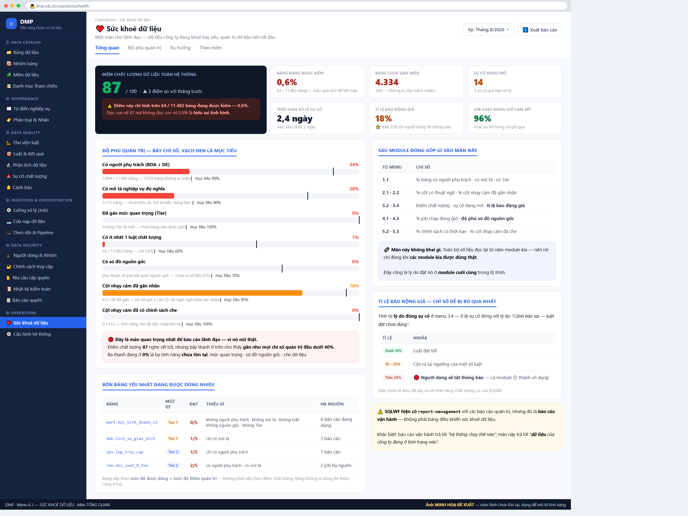

**Cách trình bày điểm chất lượng — đây là quyết định thiết kế quan trọng nhất của màn**

> Điểm **87/100** được đặt trong ô đen nổi bật, **nhưng ngay dưới nó là dòng cảnh báo**:
>
> ⚠️ *Điểm này chỉ tính trên **64 / 11.482 bảng** đang được kiểm — **0,6%**.*
>
> **Đọc con số 87 mà không đọc con số 0,6% là hiểu sai tình hình.**
>
> Nếu tách hai con số ra hai chỗ khác nhau trên màn, người xem sẽ chỉ nhớ con số 87 — và cả bảng điều khiển thành công cụ tạo cảm giác an toàn giả.

**Bảy chỉ số độ phủ quản trị — vạch đen là mục tiêu**

| Chỉ số | Hiện tại | Mục tiêu | Ghi chú |
|---|:---:|:---:|---|
| Có người phụ trách (BDA + DE) | 34% | 90% | 7.578 bảng không ai nhận |
| Có mô tả nghiệp vụ đủ nghĩa | 28% | 80% | chưa tính các mô tả kiểu *"bảng tạm"* |
| **Đã gán mức quan trọng (Tier)** | **0%** | 100% | trường Tier là mới |
| Có ít nhất 1 luật chất lượng | 1% | 60% | 64 / 11.482 bảng |
| **Có sơ đồ nguồn gốc** | **0%** | 70% | phụ thuộc số job bật quét — chưa có số liệu **(H5)** |
| Cột nhạy cảm đã gắn nhãn | 78% | 95% | 412 cột đã gắn · bộ dò còn 23 cột nghi ngờ |
| **Cột nhạy cảm đã có chính sách che** | **0%** | 100% | tính năng che dữ liệu chưa tồn tại |

> 🔴 **Đây là màn quan trọng nhất để báo cáo lãnh đạo — vì nó nói thật.**
>
> Điểm chất lượng **87** nghe rất tốt, nhưng bảy thanh cho thấy **gần như mọi chỉ số quản trị đều dưới 40%**. Ba thanh đang ở **0%** là ba tính năng **chưa tồn tại**.

**Bốn bảng yếu nhất đang được dùng nhiều**

Xếp theo **mức độ được dùng × mức độ thiếu quản trị** — không xếp theo điểm chất lượng.

> 💡 Bảng không ai dùng thì thiếu cũng ít hại. `mart.kpi_kinh_doanh_v2` đạt **0/5** tiêu chí mà đang có **6 báo cáo dùng** — đó mới là chỗ phải xử lý trước.

**Tỉ lệ báo động giả — chỉ số dễ bị bỏ qua nhất**

Tính từ **lý do đóng sự cố** ở menu 3.4 — tỉ lệ sự cố đóng với lý do *"Cảnh báo sai — luật đặt chưa đúng"*.

| Tỉ lệ | Nghĩa |
|---|---|
| Dưới 10% | Luật đặt tốt |
| 10 – 25% | Cần rà lại ngưỡng của một số luật |
| **Trên 25%** | 🔴 **Người dùng sẽ tắt thông báo** — cả module ③ thành vô dụng |

> ⭐ **Đây chính là điều đã xảy ra với tính năng chất lượng cũ của SQLWF.** Nên chỉ số này phải có mặt từ ngày đầu, không phải thêm vào sau.

**Sáu module đóng góp gì vào màn này**

| Từ menu | Chỉ số |
|---|---|
| **1.1** | % bảng có người phụ trách · có mô tả · có Tier |
| **2.1 · 2.2** | % cột có thuật ngữ · % cột nhạy cảm đã gắn nhãn |
| **3.2 · 3.4** | Điểm chất lượng · sự cố đang mở · **tỉ lệ báo động giả** |
| **4.1 · 4.3** | % job chạy đúng giờ · **độ phủ sơ đồ nguồn gốc** |
| **5.2 · 5.5** | % chính sách có thời hạn · % cột nhạy cảm đã che |

</details>

<details open>
<summary><b>Màn 54 — Theo miền</b></summary>

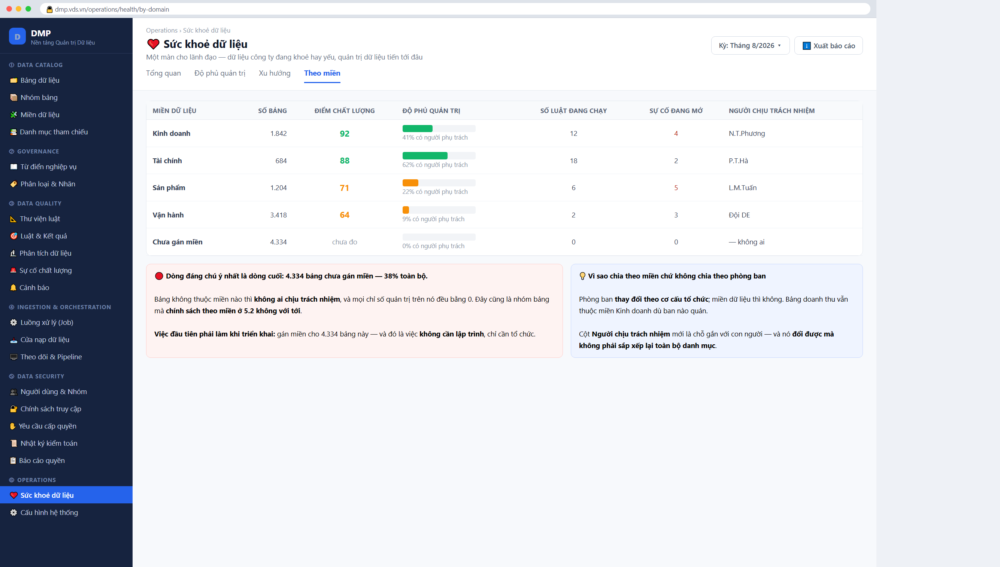

**Các cột:** Miền dữ liệu · Số bảng · Điểm chất lượng · **Độ phủ quản trị** · Số luật đang chạy · Sự cố đang mở · **Người chịu trách nhiệm**

> 🔴 **Dòng đáng chú ý nhất là dòng cuối: 4.334 bảng chưa gán miền — 38% toàn bộ.**
>
> Bảng không thuộc miền nào thì **không ai chịu trách nhiệm**, và mọi chỉ số quản trị trên nó đều bằng 0. Đây cũng là nhóm bảng mà **chính sách theo miền ở 5.2 không với tới**.
>
> **Việc đầu tiên phải làm khi triển khai:** gán miền cho 4.334 bảng này — và đó là việc **không cần lập trình**, chỉ cần tổ chức.

**Vì sao chia theo miền chứ không chia theo phòng ban**

> Phòng ban **thay đổi theo cơ cấu tổ chức**; miền dữ liệu thì không. Bảng doanh thu vẫn thuộc miền Kinh doanh dù ban nào quản.
>
> Cột **Người chịu trách nhiệm** mới là chỗ gắn với con người — và nó **đổi được mà không phải sắp xếp lại toàn bộ danh mục**.

**Cột này dùng để làm gì trong thực tế**

Đây là màn để **giao chỉ tiêu**. Không giao *"nâng điểm chất lượng toàn công ty lên 90"* — không ai biết bắt đầu từ đâu. Giao theo miền, có tên người chịu trách nhiệm, và có con số cụ thể phải nâng.

</details>

---

## 6.2 Cấu hình hệ thống

<details open>
<summary><b>Menu này để làm gì</b></summary>

**Mục đích:** kết nối nguồn · tham số hệ thống · **định nghĩa Tier** · **chuẩn đặt tên**.

> ✅ **SQLWF đã có hai màn mạnh, giữ nguyên cả hai:**
>
> | Màn | Đã có gì |
> |---|---|
> | `connection-management` | `connectionType` · `databaseType` · `databaseConnectionURL` · `databaseConnectionIpList` · `ftpIpAddress` · `kafkaBrokers` · `topics` · **`kerberos` · `keytab` · `principal`** · `protocol` · `portCLI` · `portData` |
> | `configuration-management` | Cấu hình theo `taskCode` · Source name → Target name → Target type → Order · **nhật ký cấu hình** (`detail-log-configuration`) |
>
> Menu 6.2 chỉ **thêm hai mục**: định nghĩa Tier và chuẩn đặt tên.

**1 màn:** Cấu hình *(5 tab: Kết nối nguồn · Định nghĩa Tier · Chuẩn đặt tên · Tham số hệ thống · Nhật ký cấu hình)*

</details>

<details open>
<summary><b>Màn 55 — Cấu hình hệ thống</b></summary>

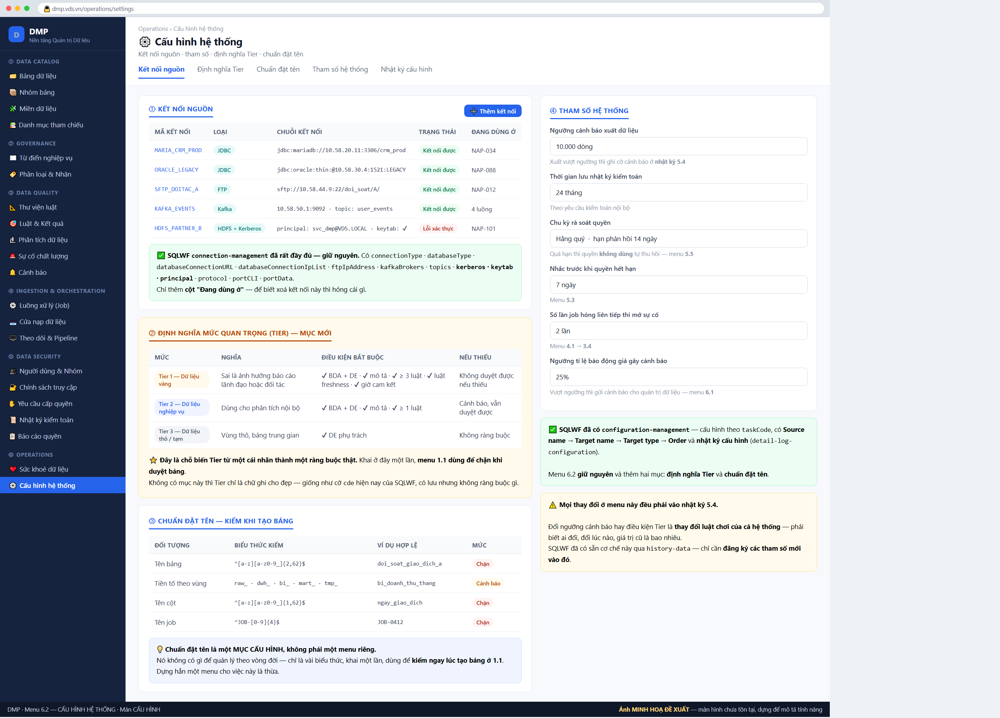

**① Kết nối nguồn — chỉ thêm một cột**

Cột **"Đang dùng ở"** cho biết xoá kết nối này thì hỏng cái gì. Hiện xoá một kết nối là việc mò mẫm.

**② Định nghĩa mức quan trọng (Tier) — mục mới ⭐**

| Mức | Nghĩa | Điều kiện bắt buộc | Nếu thiếu |
|---|---|---|---|
| **Tier 1 — Dữ liệu vàng** | Sai là ảnh hưởng báo cáo lãnh đạo hoặc đối tác | BDA + DE · mô tả · ≥ 3 luật · **luật `freshness`** · **giờ cam kết** | 🛑 **Không duyệt được** |
| **Tier 2 — Dữ liệu nghiệp vụ** | Dùng cho phân tích nội bộ | BDA + DE · mô tả · ≥ 1 luật | ⚠️ Cảnh báo, vẫn duyệt được |
| **Tier 3 — Dữ liệu thô / tạm** | Vùng thô, bảng trung gian | DE phụ trách | Không ràng buộc |

> ⭐ **Đây là chỗ biến Tier từ một cái nhãn thành một ràng buộc thật.** Khai ở đây một lần, **menu 1.1 dùng để chặn khi duyệt bảng**.
>
> Không có mục này thì Tier chỉ là chữ ghi cho đẹp — giống như cờ `cde` hiện nay của SQLWF, **có lưu nhưng không ràng buộc gì**.

**③ Chuẩn đặt tên — kiểm khi tạo bảng**

| Đối tượng | Biểu thức kiểm | Ví dụ hợp lệ | Mức |
|---|---|---|---|
| Tên bảng | `^[a-z][a-z0-9_]{2,62}$` | `doi_soat_giao_dich_a` | 🛑 Chặn |
| Tiền tố theo vùng | `raw_` · `dwh_` · `bi_` · `mart_` · `tmp_` | `bi_doanh_thu_thang` | ⚠️ Cảnh báo |
| Tên cột | `^[a-z][a-z0-9_]{1,62}$` | `ngay_giao_dich` | 🛑 Chặn |
| Tên job | `^JOB-[0-9]{4}$` | `JOB-0412` | 🛑 Chặn |

> 💡 **Chuẩn đặt tên là một MỤC CẤU HÌNH, không phải một menu riêng.**
>
> Nó không có gì để quản lý theo vòng đời — chỉ là vài biểu thức, khai một lần, dùng để **kiểm ngay lúc tạo bảng ở 1.1**. Dựng hẳn một menu cho việc này là thừa.

**④ Tham số hệ thống**

| Tham số | Giá trị | Dùng ở menu nào |
|---|---|---|
| Ngưỡng cảnh báo xuất dữ liệu | 10.000 dòng | **5.4** |
| Thời gian lưu nhật ký kiểm toán | 24 tháng | **5.4** |
| Chu kỳ rà soát quyền | Hằng quý · hạn phản hồi 14 ngày | **5.5** |
| Nhắc trước khi quyền hết hạn | 7 ngày | **5.3** |
| Số lần job hỏng liên tiếp thì mở sự cố | 2 lần | **4.1** → **3.4** |
| Ngưỡng tỉ lệ báo động giả gây cảnh báo | 25% | **6.1** |

> ⚠️ **Mọi thay đổi ở menu này đều phải vào nhật ký 5.4.**
>
> Đổi ngưỡng cảnh báo hay điều kiện Tier là **thay đổi luật chơi của cả hệ thống** — phải biết ai đổi, đổi lúc nào, giá trị cũ là bao nhiêu.
>
> SQLWF đã có sẵn cơ chế này qua `history-data` — chỉ cần **đăng ký các tham số mới vào đó**.

</details>

---

## Tổng kết Module ⑥

<details open>
<summary><b>3 màn · việc phải làm · điều kiện chặn</b></summary>

| Menu | Số màn | Việc | Ghi chú |
|---|:---:|:---:|---|
| **6.1 Sức khoẻ dữ liệu** | 2 | 🔴 Xây mới | `report-management` là báo cáo vận hành, không phải bảng điều khiển sức khoẻ dữ liệu |
| **6.2 Cấu hình hệ thống** | 1 | 🟢 Giữ | `connection-management` và `configuration-management` giữ nguyên. Thêm 2 mục: **định nghĩa Tier** · **chuẩn đặt tên** |

**Module ⑥ phụ thuộc vào gì**

| Cần có trước | Để làm gì |
|---|---|
| **Cả 5 module kia** | 6.1 không có dữ liệu riêng — chỉ đọc lại |
| **1.3 — Miền dữ liệu** | Màn *Theo miền* mới chia được |
| **3.4 — lý do đóng sự cố** | ⭐ Tính **tỉ lệ báo động giả** |
| **4.1 — giờ cam kết** | Tính % job chạy đúng giờ |

**Hai mục của 6.2 phải làm SỚM, không phải làm cuối**

> ⚠️ Đây là điểm dễ nhầm: menu 6.2 nằm ở module cuối cùng, nhưng **hai mục mới của nó là điều kiện chặn của module ①**:
>
> - **Định nghĩa Tier** → 1.1 cần để **chặn khi duyệt bảng Tier 1 thiếu luật**
> - **Chuẩn đặt tên** → 1.1 cần để **kiểm ngay lúc tạo bảng**
>
> Nên trong lộ trình, **hai mục này đi cùng đợt với 1.1**, còn màn 6.1 mới để cuối.

</details>

---

# PHẦN 8 — LỘ TRÌNH · ƯỚC LƯỢNG · RỦI RO

## 1. Toàn cảnh sau khi thiết kế xong

<details open>
<summary><b>6 module · 21 menu · 55 màn hình</b></summary>

| Module | Menu | Màn | Việc |
|---|:---:|:---:|---|
| ① Data Catalog | 4 | 15 | 🔵🟣 1.1 · 🟢 1.2 · 🟢 1.3 · 🟢 1.4 |
| ② Governance | 2 | 5 | 🔵 2.1 · 🔵 2.2 |
| ③ Data Quality | 5 | 10 | 🔴 3.1 · 🔴 3.2 · 🔴 3.3 · 🔴 3.4 · 🟢 3.5 |
| ④ Ingestion & Orchestration | 3 | 9 | 🔵 4.1 · 🟣 4.2 · 🔵 4.3 |
| ⑤ Data Security | 5 | 13 | 🟢 5.1 · 🔵🟣 5.2 · 🔴 5.3 · 🔵🟣 5.4 · 🔴 5.5 |
| ⑥ Operations | 2 | 3 | 🔴 6.1 · 🟢 6.2 |
| **Tổng** | **21** | **55** | 🟢 6 · 🔵 7 · 🟣 1 · 🔴 7 |

> **14 / 21 menu (67%) là kế thừa hoặc nâng cấp cái đã có.** Bảy menu xây mới thì **năm nằm trong module Chất lượng** — vốn là phần đã hỏng và cần làm lại.

**Ba tính năng thật sự chưa từng tồn tại — đã kiểm tra mã nguồn**

| Tính năng | Bằng chứng | Menu |
|---|---|---|
| **Che dữ liệu** | Không có trường `maskType` ở bất kỳ thực thể nào. OPA hiện chỉ **chặn hàm SQL** (`TagFunctionBlacklist`) | 5.2 |
| **Lọc theo dòng** | Không có trường `rowFilter`. Đang làm vòng bằng **41 bảng sao chép** | 5.2 |
| **Mức quan trọng (Tier) có ràng buộc** | Có cờ `cde` nhưng **chỉ lưu, không ràng buộc gì** | 1.1 + 6.2 |

</details>

---

## 2. Bốn đợt triển khai

<details open>
<summary><b>Nguyên tắc chia đợt: mỗi đợt phải TỰ DÙNG ĐƯỢC, không chờ đợt sau</b></summary>

> Đây là bài học rút từ vấn đề **V2 — "khai rồi để đó, không ai dùng"**. Nếu đợt 1 chỉ làm phần khai báo còn phần tiêu thụ để đợt 3, thì trong suốt hai đợt giữa **không ai có lý do gì để khai** — và đến lúc cần thì dữ liệu đã cũ hoặc rỗng.
>
> Nên mỗi đợt đều được cắt sao cho **có ít nhất một thứ dùng được ngay**.

</details>

<details open>
<summary><b>ĐỢT 1 — Nền tảng: một nguồn sự thật và một sơ đồ nguồn gốc chạy được</b></summary>

| Làm gì | Menu | Loại việc |
|---|---|---|
| Gộp `data-dictionary` vào **tab Cột** của 1.1 | 1.1 | Gộp |
| Thêm **mức quan trọng (Tier)** · **trạng thái vòng đời** · **tìm kiếm toàn văn** | 1.1 | Mới |
| **Định nghĩa Tier** + **chuẩn đặt tên** *(hai mục của 6.2, nhưng là điều kiện chặn của 1.1)* | 6.2 | Mới |
| **Cổng chặn khi khai thiếu** theo Tier | 1.1 | Mới |
| Ép **bảng đích của job phải có trong danh mục** | 4.1 | Mới |
| **Bật `enableDataLineage` hàng loạt** cho toàn bộ job cũ | 4.1 | Vận hành |
| **Bộ phân tích cú pháp SQL** thay cách dò `${…}` | 4.1 | Mới |
| **Tab Nguồn gốc** mức cột + phân tích ảnh hưởng | 1.1 | Mới |
| Giữ nguyên 1.2 · 1.3 · 1.4, chỉ **mở API danh mục tham chiếu** | 1.2–1.4 | Giữ |

**Kết quả đo được sau đợt 1**

| Chỉ số | Trước | Sau |
|---|:---:|:---:|
| Bảng có người phụ trách | 34% | ≥ 70% *(ép theo Tier)* |
| Bảng có sơ đồ nguồn gốc | ~0% | ≥ 60% |
| Bảng đích của job chưa khai | 214 | 0 |
| Bảng chưa gán miền | 4.334 | ≤ 500 |

> ⭐ **Đợt này tự dùng được ngay:** tìm kiếm toàn văn + tab Nguồn gốc là hai thứ người dùng thấy giá trị lập tức, không cần chờ module nào khác.

</details>

<details open>
<summary><b>ĐỢT 2 — Từ vựng và chất lượng: hồi sinh phần đã chết</b></summary>

| Làm gì | Menu | Loại việc |
|---|---|---|
| Đưa thuật ngữ vào **chỉ mục tìm kiếm** *(thiếu đúng một thứ)* | 2.1 | Nâng cấp |
| **Cây nhãn phân cấp** + bộ dò gợi ý nhãn | 2.2 | Nâng cấp |
| **Profiling** — nơi duy nhất đo chỉ số cột | 3.3 | Mới |
| **Thư viện luật** — 28 loại kiểm tra | 3.1 | Mới |
| **Gán luật + chấm điểm** — ngưỡng 3 cấp, 6 chiều | 3.2 | Mới |
| Chạy luật ở **chế độ chỉ quan sát** 1 tháng trước khi bật cảnh báo | 3.2 | Vận hành |

**Kết quả đo được sau đợt 2**

| Chỉ số | Trước | Sau |
|---|:---:|:---:|
| Bảng có ít nhất 1 luật chất lượng | 0,6% | ≥ 40% *(ưu tiên Tier 1 + Tier 2)* |
| Thuật ngữ đã gắn vào cột | 65% | ≥ 85% |
| **Tỉ lệ báo động giả** | — | **đo được lần đầu**, mục tiêu ≤ 15% |

> ⚠️ **Chế độ chỉ quan sát là bắt buộc.** Bật cảnh báo ngay khi luật còn chưa chỉnh ngưỡng là cách nhanh nhất để lặp lại đúng thất bại của tính năng chất lượng cũ.

</details>

<details open>
<summary><b>ĐỢT 3 — Trách nhiệm: biến cảnh báo thành việc, biến quyền thành có dấu vết</b></summary>

| Làm gì | Menu | Loại việc |
|---|---|---|
| **Sự cố chất lượng** — vòng đời 6 trạng thái, 4 mắt, lý do đóng bắt buộc | 3.4 | Mới |
| Bổ sung **4 chế độ gửi** + chống trùng vào cảnh báo đã có | 3.5 | Nâng cấp |
| Chuyển 4 cột phân quyền dữ liệu khỏi `user-managerment` | 5.1 | Giữ |
| Gộp 3 màn quyền dữ liệu → **5.2 tab Quyền dữ liệu** | 5.2 | Gộp |
| **Yêu cầu cấp quyền** — có lý do, có thời hạn, tự thu hồi | 5.3 | Mới |
| Gộp 5 màn nhật ký + thêm cột **chính sách nào quyết định** | 5.4 | Gộp |

**Kết quả đo được sau đợt 3**

| Chỉ số | Trước | Sau |
|---|:---:|:---:|
| Chính sách quyền có thời hạn | 13% | **100% với quyền cấp mới** |
| Chính sách có nguồn rõ ràng | 24% | 100% với quyền cấp mới |
| Thời gian xử lý sự cố chất lượng | không đo được | đo được, mục tiêu ≤ 2 ngày |
| Tài khoản đã nghỉ việc còn quyền | 9 | 0 |

> ⭐ **Menu 5.3 đáng làm sớm hơn cảm giác ban đầu.** Che dữ liệu và lọc dòng "hào nhoáng" hơn, nhưng 5.3 mới là thứ **chặn dòng chảy quyền tồn đọng**. Càng làm muộn thì số quyền vô thời hạn càng nhiều.

</details>

<details open>
<summary><b>ĐỢT 4 — Bảo mật mức cột/dòng và bức tranh toàn cảnh</b></summary>

| Làm gì | Menu | Loại việc |
|---|---|---|
| **Che dữ liệu** — 8 kiểu, viết lại câu truy vấn | 5.2 | **Mới hoàn toàn** |
| **Chính sách theo nhãn** — khai 1 lần áp 412 cột | 5.2 | Mới |
| **Báo cáo quyền** + rà soát định kỳ theo quý | 5.5 | Mới |
| Gộp 6 màn nạp → **4.2**, giữ nguyên phần chạy từng loại | 4.2 | Gộp |
| **Cổng chất lượng tại cửa nạp** | 4.2 | Mới |
| **Sơ đồ pipeline** phủ badge chất lượng | 4.3 | Nâng cấp |
| **Bảng điều khiển sức khoẻ dữ liệu** | 6.1 | Mới |
| **Lọc theo dòng** *(làm sau cùng — rủi ro cao nhất)* | 5.2 | **Mới hoàn toàn** |

**Kết quả đo được sau đợt 4**

| Chỉ số | Trước | Sau |
|---|:---:|:---:|
| Cột nhạy cảm có chính sách che | 0 / 412 | 412 / 412 |
| Bảng trùng lặp do phân quyền theo chi nhánh | 41 | 0 |
| Mẫu nạp có cổng chất lượng | 0 / 168 | ≥ 60% |
| Bảng điều khiển sức khoẻ | không có | có, cập nhật hằng ngày |

</details>

---

## 3. Ước lượng khối lượng

<details open>
<summary><b>Ước lượng sơ bộ — cần đội phát triển xác nhận lại</b></summary>

> ⚠️ **Đây là ước lượng của BA, dựa trên số màn và mức độ kế thừa — không phải ước lượng kỹ thuật.** Con số phải được đội phát triển soát lại trước khi đưa vào kế hoạch.
>
> **Giả định:** một đội gồm **2 BE · 1 FE · 1 BA/QC**, làm liên tục, không tính thời gian chờ nghiệm thu và triển khai lên môi trường thật.

| Đợt | Nội dung chính | Màn | Ước lượng |
|:---:|---|:---:|---|
| **1** | Nền tảng danh mục + nguồn gốc *(① · 6.2 · 4.1)* | 21 | **10 – 12 tuần** |
| **2** | Từ vựng + chất lượng *(② · 3.1 – 3.3)* | 10 | **12 – 14 tuần** |
| **3** | Sự cố + quyền có dấu vết *(3.4 · 3.5 · 5.1 · 5.3 · 5.4)* | 12 | **12 – 14 tuần** |
| **4** | Che dữ liệu + lọc dòng + cửa nạp + sức khoẻ | 12 | **14 – 16 tuần** |
| | | **55** | **≈ 48 – 56 tuần** *(12 – 14 tháng)* |

**Ba hạng mục nặng nhất — chiếm phần lớn rủi ro ước lượng**

| Hạng mục | Vì sao nặng |
|---|---|
| **Bộ phân tích cú pháp SQL** *(đợt 1)* | Phải đọc đúng mọi cú pháp đang dùng trong 1.842 job, kể cả cú pháp đặc thù của engine |
| **Che dữ liệu bằng viết lại câu truy vấn** *(đợt 4)* | Chạm vào đường đi của mọi câu truy vấn — sai một chỗ là ảnh hưởng toàn hệ thống |
| **Lọc theo dòng** *(đợt 4)* | Như trên, và còn **thay đổi kết quả người dùng nhận được** — sai là trả sai số liệu mà không ai biết |

**Ba hạng mục nhẹ hơn nhiều so với cảm giác ban đầu**

| Hạng mục | Vì sao nhẹ |
|---|---|
| **2.1 Business Glossary** | `data-glossary` đã đầy đủ hơn mặt bằng thị trường. Thiếu **đúng một thứ**: đưa vào chỉ mục tìm kiếm |
| **5.3 Yêu cầu cấp quyền** | Dùng lại **khung duyệt đã chạy tốt** ở `job-approval` · `channel-indexing-management` · `sync-management` |
| **4.2 Gộp 6 màn nạp** | Chỉ gộp **khai báo và tra cứu**. Phần chạy của 6 loại **giữ nguyên** |

</details>

---

## 4. Việc làm được ngay, không cần lập trình

<details open>
<summary><b>Sáu việc nên bắt đầu trước khi dòng mã đầu tiên được viết</b></summary>

| # | Việc | Vì sao làm trước | Ai làm |
|:---:|---|---|---|
| **1** | **Gán miền cho 4.334 bảng chưa có miền** | 38% dữ liệu công ty hiện không ai chịu trách nhiệm. Không gán thì mọi chính sách theo miền ở 5.2 không với tới | Quản trị dữ liệu + BDA từng ban |
| **2** | **Bật `enableDataLineage` cho toàn bộ job cũ** | Một lệnh cập nhật hàng loạt. Không làm thì tab Nguồn gốc xây xong vẫn trống | Đội vận hành |
| **3** | **Gán BDA / DE cho 7.578 bảng chưa có người phụ trách** | Mọi cảnh báo, sự cố, yêu cầu quyền đều cần biết gửi cho ai | Trưởng các miền |
| **4** | **Khoá 9 tài khoản đã nghỉ việc** | Đang còn quyền trên 132 bảng. Việc 5 phút | Quản trị hệ thống |
| **5** | **Rà 214 bảng đích của job chưa khai trong danh mục** | Đây là 214 điểm mù của cả ba module ③ ⑤ ⑥ | Đội DE |
| **6** | **Trả lời câu hỏi H5** — bao nhiêu % job đang bật quét nguồn gốc | Con số này quyết định độ phủ của cả sơ đồ nguồn gốc lẫn sơ đồ pipeline | Đội vận hành |

> ⭐ **Sáu việc này quan trọng hơn vẻ ngoài của chúng.** Chúng quyết định **tool mới có dữ liệu để chạy hay không**. Xây xong 55 màn mà 38% bảng vẫn không có miền và không có người phụ trách thì kết cục **giống hệt tình trạng hiện nay**.

</details>

---

## 5. Rủi ro và cách giảm

<details open>
<summary><b>Tám rủi ro — xếp theo mức độ nghiêm trọng</b></summary>

| # | Rủi ro | Vì sao đáng lo | Cách giảm |
|:---:|---|---|---|
| **R1** | ⭐ **Lặp lại đúng vấn đề V2 — khai rồi để đó, không ai dùng** | Đây là thứ đã xảy ra với SQLWF. Thêm 55 màn mà không ai khai thì chỉ là 55 màn trống | **Nghiệm thu theo ĐỘ PHỦ, không theo số màn bàn giao.** Mỗi trường khai mới phải chỉ ra được **ít nhất một nơi tiêu thụ** — trường nào không có nơi tiêu thụ thì **bỏ khỏi thiết kế** |
| **R2** | **Báo động giả làm chết module ③** | Đã xảy ra một lần với tính năng chất lượng cũ | Chạy luật ở **chế độ chỉ quan sát 1 tháng** trước khi bật cảnh báo. Theo dõi **tỉ lệ báo động giả** ở 6.1 **từ ngày đầu**, ngưỡng đỏ 25% |
| **R3** | **Lọc theo dòng viết lại SQL sai → trả sai số liệu** | Nguy hiểm hơn lỗi thường vì **không ai biết là sai** — câu truy vấn vẫn chạy, chỉ ra thiếu dòng | Làm **sau cùng**. Chạy song song đối chiếu kết quả có lọc / không lọc trong 1 tháng. Bật cho **Tier 3 trước, Tier 1 sau cùng** |
| **R4** | **Che dữ liệu bị lách** qua quyền `ALTER` hoặc đọc thẳng HDFS | Che chỉ là hình thức nếu còn hai đường vòng này | **Bịt hai lỗ hổng cùng đợt** — không tách ra: tách quyền ghi khỏi quyền đọc trên cột nhạy cảm, và siết quyền thư mục thô |
| **R5** | **Bộ phân tích cú pháp SQL không đọc được hết cú pháp đặc thù** | 1.842 job, mỗi job có thể có cú pháp riêng | Chạy **song song với cách dò `${…}` cũ** trong 1 tháng, so kết quả. Giữ cách cũ làm dự phòng. Báo cáo danh sách câu SQL không phân tích được để xử lý tay |
| **R6** | **Gộp 6 màn nạp làm gián đoạn vận hành** | Đây là đường dữ liệu vào hệ thống — gián đoạn là mất dữ liệu | Gộp **giao diện trước, giữ nguyên phần chạy**. Chuyển **từng loại một**, mỗi loại chạy song song 2 tuần trước khi tắt màn cũ |
| **R7** | **Không đủ người khai metadata cho 11.482 bảng** | Ép khai đủ cho mọi bảng là bất khả thi | **Chỉ ép với Tier 1 và Tier 2.** Tier 3 chỉ cần DE phụ trách. Dùng **bộ dò gợi ý nhãn** và **Profiling gợi ý luật** để giảm việc gõ tay. **Giao chỉ tiêu theo miền** ở màn 54, không giao chỉ tiêu chung |
| **R8** | **Tên và phạm vi tool chưa chốt** *(câu hỏi Q1)* | Ảnh hưởng tới việc trình bày với lãnh đạo và tới quyết định gộp / tách hệ thống | Chốt trước khi trình duyệt chủ trương. Tài liệu này tạm dùng tên **DMP** |

</details>

<details open>
<summary><b>R1 nói kỹ hơn — vì đây là rủi ro lớn nhất</b></summary>

**Vấn đề V2 ở Phần 1 đã chỉ ra:** SQLWF không thiếu tính năng, mà là **có tính năng nhưng không ai dùng, hoặc đã chết**. Ví dụ đã kiểm chứng:

| Thứ đã có | Tình trạng |
|---|---|
| Cờ `cde` ở thuật ngữ | Có lưu, **không ràng buộc gì** |
| `enableDataLineage` | Mặc định **tắt** |
| Tính năng chất lượng cũ | **Đã hỏng, bị bỏ từ lâu** |
| Chỉ số cột ở `data-dictionary` | Có trường, **không ai đọc lại** |

**Cách chống lặp lại — ba quy tắc nghiệm thu**

| Quy tắc | Nghĩa |
|---|---|
| **① Mỗi trường khai mới phải có nơi tiêu thụ** | Nếu không chỉ ra được menu nào đọc lại trường này thì **bỏ trường đó khỏi thiết kế** |
| **② Nghiệm thu theo độ phủ, không theo màn** | Không nghiệm thu *"đã bàn giao màn Thư viện luật"*, mà nghiệm thu *"40% bảng Tier 1+2 đã có ≥ 1 luật đang chạy"* |
| **③ Mặc định phải là BẬT** | Cờ nào có ích cho hệ thống thì mặc định bật, ai không cần thì tự tắt. `enableDataLineage` mặc định tắt là bài học đắt nhất |

> ⭐ **Bảng điều khiển ở menu 6.1 chính là công cụ thực thi ba quy tắc này** — nó hiện độ phủ thật, không hiện số màn đã làm.

</details>

---

## 6. Còn treo

<details open>
<summary><b>Hai câu hỏi cần trả lời trước khi trình duyệt</b></summary>

| Mã | Câu hỏi | Cần ai trả lời | Ảnh hưởng |
|:---:|---|---|---|
| **H5** | Bao nhiêu % job đang bật `enableDataLineage`? | Đội vận hành | Quyết định **độ phủ sơ đồ nguồn gốc** và **sơ đồ pipeline**. Chưa có số này thì hai thẻ chỉ số ở màn 31 và màn 39 phải để dấu hỏi |
| **Q1** | Tên chính thức của tool? | Lãnh đạo phòng | Tài liệu này tạm dùng **DMP — Nền tảng Quản trị Dữ liệu** |

> 💡 Các câu hỏi khác trong bản trước (**H2**, **H2b** — về tính năng cũ đã lỗi và bị bỏ) đã được xử lý bằng cách **thiết kế lại từ đầu ở module ③**, nên không còn chặn tiến độ.

</details>

---

## 7. Ba câu để báo cáo lãnh đạo

<details open>
<summary><b>Nếu chỉ có 3 phút trình bày</b></summary>

> **① Đây không phải làm lại từ đầu.**
> Trong 21 menu thì **14 menu (67%) là kế thừa hoặc nâng cấp cái đã có**. `job-management` · `channel-indexing-management` · `data-glossary` · `connection-management` · `history-data` đều đã mạnh — có chỗ còn hơn mặt bằng thị trường. Việc chính là **gom lại, nối lại, và hồi sinh phần đã chết**.

> **② Vấn đề lớn nhất không phải thiếu tính năng, mà là tính năng không nối với nhau.**
> Cờ `cde` có lưu nhưng không ràng buộc gì. `enableDataLineage` mặc định tắt nên sơ đồ nguồn gốc gần như trống. Chỉ số cột đo rồi nhưng không ai đọc lại. **Điểm chất lượng 87 chỉ tính trên 0,6% số bảng.**

> **③ Ba tính năng thật sự chưa từng có — và cả ba đều liên quan tới bảo vệ dữ liệu cá nhân.**
> **Che dữ liệu** · **lọc theo dòng** · **mức quan trọng có ràng buộc**. Hiện **144 cột dữ liệu cá nhân nhạy cảm vẫn trả về số điện thoại và CCCD nguyên vẹn** cho mọi người có quyền xem bảng — trong khi Nghị định 13/2023/NĐ-CP đã có hiệu lực.

</details>

---

# PHỤ LỤC A — MA TRẬN THAO TÁC THEO VAI TRÒ

<details open>
<summary><b>Năm vai trò trong hệ thống</b></summary>

| Ký hiệu | Vai trò | Là ai |
|:---:|---|---|
| **QTDL** | Quản trị dữ liệu | Đội Tool — sở hữu danh mục chung: thư viện luật, cây nhãn, từ điển, cấu hình hệ thống |
| **BDA** | BDA phụ trách bảng | Người hiểu **nghĩa nghiệp vụ** của bảng — khai ở trường `businessOwner` của 1.1 |
| **DE** | DE phụ trách bảng | Người vận hành **đường dữ liệu** vào bảng — khai ở trường `dataEngineerOwner` của 1.1 |
| **ND** | Người dùng thường | Có quyền xem dữ liệu, không phụ trách bảng nào |
| **QTHT** | Quản trị hệ thống | Tài khoản, nhóm, quyền menu, kết nối nguồn |

> ⭐ **BDA và DE là vai trò gắn với TỪNG BẢNG, không phải chức danh.** Một người có thể là BDA của 12 bảng và là ND với 11.470 bảng còn lại. Đây là lý do mọi cảnh báo và sự cố đều khai theo **vai trò**, không gõ tên người.

</details>

<details open>
<summary><b>Ma trận đầy đủ — 21 menu × 5 thao tác</b></summary>

**Quy ước:** ✔ được làm · ✔* được làm nhưng chỉ trên bảng mình phụ trách · — không được làm

| Menu | Xem | Thêm / Sửa | Xoá | Duyệt | Xuất |
|---|---|---|---|---|---|
| **1.1 Bảng dữ liệu** | tất cả | QTDL · BDA* · DE* | QTDL | BDA* *(bảng Tier 1–2)* | tất cả |
| **1.2 Nhóm bảng** | tất cả | QTDL · BDA | QTDL | — | tất cả |
| **1.3 Miền dữ liệu** | tất cả | QTDL | QTDL *(chặn nếu còn bảng)* | — | QTDL |
| **1.4 Danh mục tham chiếu** | tất cả | QTDL · BDA* | QTDL | QTDL *(theo từng bản ghi)* | tất cả |
| **2.1 Business Glossary** | tất cả | QTDL · BDA | QTDL | Chủ sở hữu thuật ngữ | tất cả |
| **2.2 Classification** | tất cả | QTDL | QTDL *(chặn nếu còn cột mang nhãn)* | — | QTDL |
| **3.1 Rule Library** | tất cả | **QTDL** | QTDL *(chặn nếu còn luật đang dùng)* | — | QTDL |
| **3.2 Luật & Kết quả** | tất cả | BDA* · DE* | BDA* | — | tất cả |
| **3.3 Profiling** | tất cả | *(không khai — chỉ chạy lại thủ công: BDA\* · DE\*)* | — | — | tất cả |
| **3.4 Incidents** | tất cả | Người được gán · BDA* | — | **BDA*** *(4 mắt — người xử lý không tự đóng)* | tất cả |
| **3.5 Alerts** | tất cả | QTDL · BDA* | BDA* | — | QTDL |
| **4.1 Luồng xử lý (Job)** | tất cả | DE* | DE* | **BDA*** *(bảng đích)* | DE |
| **4.2 Cửa nạp dữ liệu** | tất cả | DE* | DE* | BDA* *(bảng đích)* | DE |
| **4.3 Theo dõi & Pipeline** | tất cả | *(không khai — chỉ xem)* | — | — | tất cả |
| **5.1 Người dùng & Nhóm** | QTHT · QTDL | **QTHT** | QTHT | — | QTHT |
| **5.2 Chính sách truy cập** | QTHT · QTDL · BDA* | QTHT · **BDA\*** *(chỉ bảng mình phụ trách)* | QTHT | — | QTHT · QTDL |
| **5.3 Yêu cầu cấp quyền** | Người xin · người duyệt · QTHT | **Ai cũng gửi được** | — | **BDA*** *(bảng được xin)* | QTHT |
| **5.4 Nhật ký kiểm toán** | QTHT · QTDL · BDA* | *(hệ thống tự ghi — không ai sửa được)* | — | — | QTHT · QTDL |
| **5.5 Báo cáo quyền** | QTHT · QTDL · Trưởng đơn vị | *(không khai — chỉ tra)* | — | Trưởng đơn vị *(rà soát quý)* | QTHT · QTDL |
| **6.1 Sức khoẻ dữ liệu** | tất cả | *(không khai — chỉ xem)* | — | — | tất cả |
| **6.2 Cấu hình hệ thống** | QTDL · QTHT | QTDL *(Tier · chuẩn tên · tham số)* · QTHT *(kết nối)* | QTHT | — | QTDL |

</details>

<details open>
<summary><b>Sáu quy tắc rút ra từ ma trận</b></summary>

| # | Quy tắc | Vì sao |
|:---:|---|---|
| **1** | **Xem thì rộng, sửa thì hẹp** | 15/21 menu cho **tất cả** xem. Dữ liệu quản trị càng nhiều người thấy càng tốt — cái phải siết là **quyền sửa** |
| **2** | **Danh mục dùng chung do QTDL sở hữu** | Thư viện luật (3.1) · cây nhãn (2.2) · miền (1.3) · cấu hình (6.2) — nếu ai cũng thêm được thì sau 6 tháng sẽ có 200 loại luật trùng nhau |
| **3** | **BDA duyệt cái liên quan tới NGHĨA, DE làm cái liên quan tới ĐƯỜNG DẪN** | BDA duyệt bảng · duyệt job ghi vào bảng mình · duyệt yêu cầu quyền. DE tạo job, tạo mẫu nạp, chạy lại khi hỏng |
| **4** | ⭐ **Người tạo không được tự duyệt** | Áp dụng ở 1.1 · 1.4 · 2.1 · 3.4 · 4.1 · 4.2 · 5.3. Ở 3.4 gọi là **nguyên tắc 4 mắt** |
| **5** | **Ba menu không ai sửa được** | 3.3 Profiling · 4.3 Pipeline · 5.4 Nhật ký · 6.1 Sức khoẻ — đều là **dữ liệu đo được**, sửa tay thì mất ý nghĩa. Riêng 5.4 **kể cả QTHT cũng không xoá được dòng nào** |
| **6** | **Quyền dữ liệu tách khỏi quyền hệ thống** | QTHT quản tài khoản và kết nối, **không tự cấp cho mình quyền đọc dữ liệu nhạy cảm** — phải qua 5.3 như mọi người |

> ⚠️ **Quy tắc 6 là chỗ nhiều hệ thống làm sai.** Quản trị hệ thống thường được cấp quyền cao nhất trên mọi thứ, kể cả dữ liệu. Ở đây họ **tạo được tài khoản nhưng không đọc được cột `so_cccd`** — muốn đọc thì cũng phải xin qua 5.3 và để lại dấu vết ở 5.4.

</details>

---

<div align="center">

**HẾT**

*Tài liệu gồm 8 phần + 1 phụ lục · 21 menu · 55 màn hình minh hoạ*
*Toàn bộ cột "SQLWF hiện có" lấy từ kết quả đọc mã nguồn — xem [Kiểm kê màn hình SQLWF](DMP-Kiem-ke-man-hinh-SQLWF.md)*

</div>
