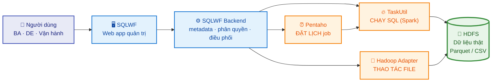
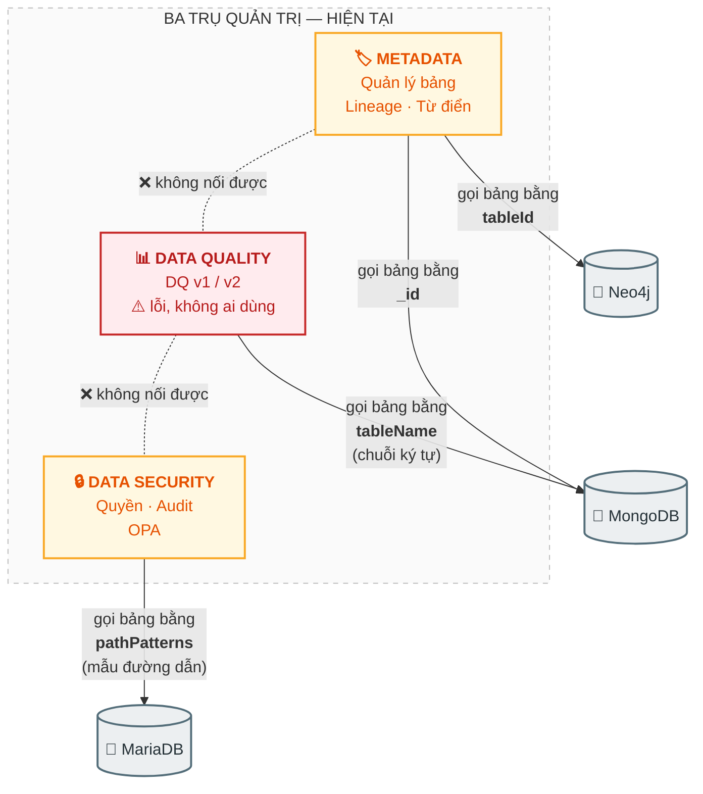
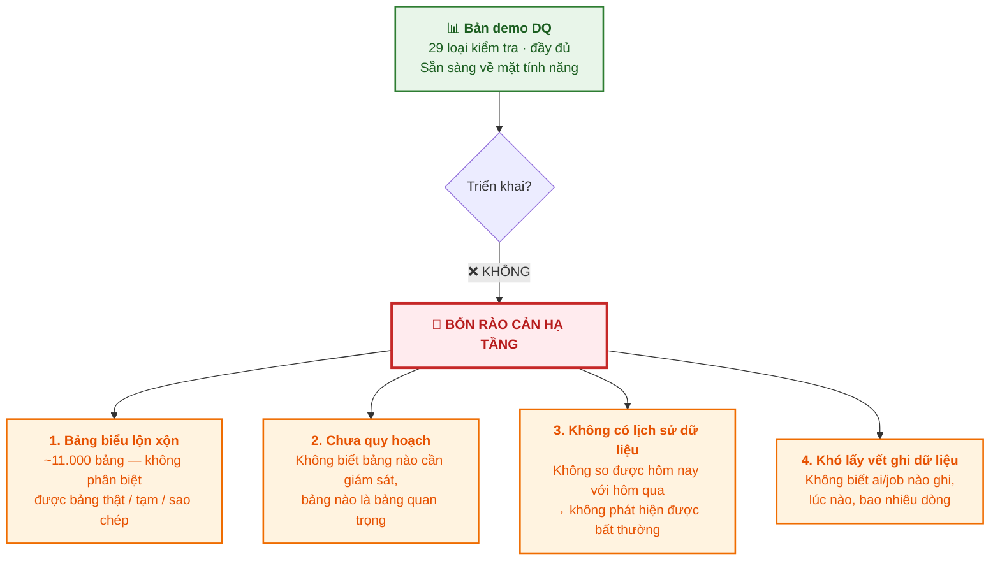
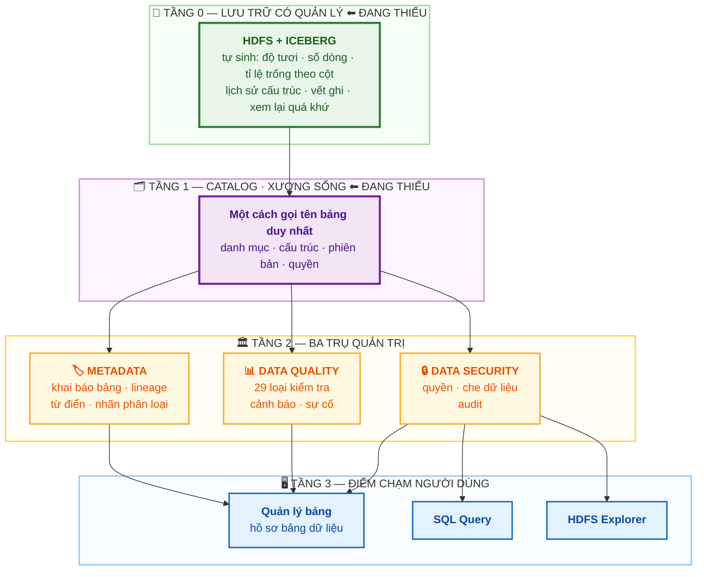
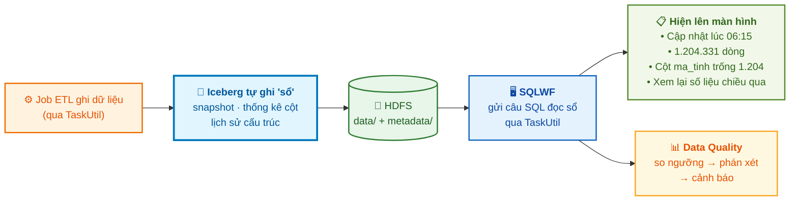
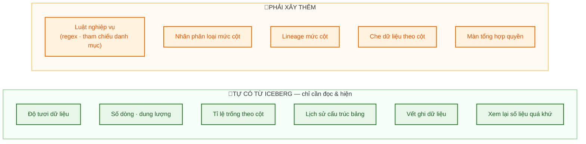
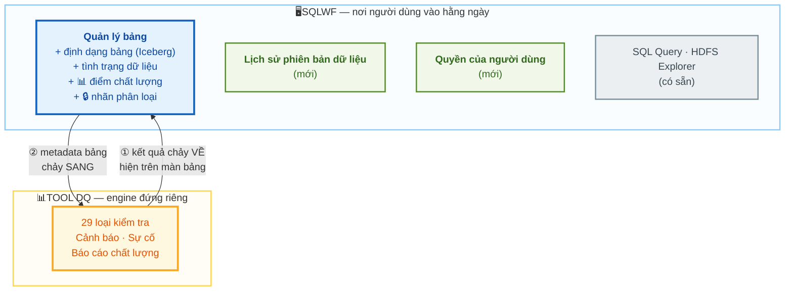
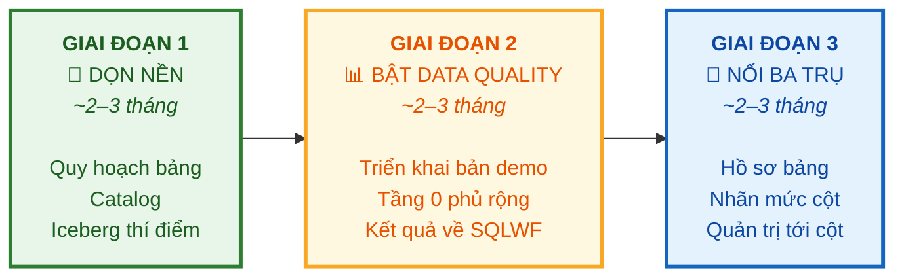

# ĐỀ XUẤT KIẾN TRÚC DATA MANAGEMENT CHO SQLWF
### Metadata · Data Quality · Data Security — và vai trò của Hudi/Iceberg

> **Người trình:** Khôi (IT BA)
> **Ngày:** 08/2026
> **Tài liệu nền:** [SQLWF — Hiện trạng Data Management & Nghiên cứu thị trường](./SQLWF-Hien-trang-Data-Management-va-Nghien-cuu-thi-truong.md)
> **Ký hiệu:** ✅ đã có · 🟡 có nhưng chưa dùng được · ❌ chưa có · ⚠️ cần xác nhận với đội kỹ thuật

---

## MỤC LỤC

- [TÓM TẮT](#tóm-tắt-cho-lãnh-đạo)
- [1. HIỆN TRẠNG](#1-hiện-trạng)
  - [1.1 SQLWF đang làm gì](#11-sqlwf-đang-làm-gì)
  - [1.2 Ba trụ đã có sẵn những gì](#12-ba-trụ-đã-có-sẵn-những-gì)
  - [1.3 Vì sao ba trụ "rời rạc"](#13-vì-sao-ba-trụ-rời-rạc)
  - [1.4 Vì sao Data Quality chưa triển khai được](#14-vì-sao-data-quality-chưa-triển-khai-được)
- [2. MÔ HÌNH TỔNG QUAN ĐỀ XUẤT](#2-mô-hình-tổng-quan-đề-xuất)
- [3. TẦNG NỀN — ICEBERG & CATALOG](#3-tầng-nền--iceberg--catalog)
- [4. BA TRỤ — ĐÁP ỨNG GÌ / THIẾU GÌ / ĐẮP THÊM GÌ](#4-ba-trụ--đáp-ứng-gì--thiếu-gì--đắp-thêm-gì)
- [5. XÂY Ở ĐÂU — TRÊN SQLWF HAY TÁCH RIÊNG](#5-xây-ở-đâu--trên-sqlwf-hay-tách-riêng)
- [6. LỘ TRÌNH TRIỂN KHAI — 3 GIAI ĐOẠN](#6-lộ-trình-triển-khai--3-giai-đoạn)
- [7. OUTPUT — SẼ RA ĐƯỢC GÌ](#7-output--sẽ-ra-được-gì)
- [8. RỦI RO & ĐIỀU KIỆN CẦN](#8-rủi-ro--điều-kiện-cần)
- [9. NHỮNG ĐIỂM CẦN LÃNH ĐẠO QUYẾT](#9-những-điểm-cần-lãnh-đạo-quyết)

---
---

# TÓM TẮT

<details open>
<summary><b>TÓM TẮT</b></summary>


### Vấn đề

SQLWF **đã có đủ cả ba trụ** Data Management: Metadata (quản lý bảng, lineage, từ điển), Data Quality, Data Security (phân quyền, audit). Nhưng:

- Ba trụ **không nói chuyện được với nhau** — xem thông tin bảng không thấy chất lượng, xem chất lượng không thấy ai chịu trách nhiệm, không có màn nào trả lời được *"người này đang xem được dữ liệu gì"*.
- **Data Quality trong SQLWF bị lỗi, không ai dùng.** Đã xây bản demo mới nhưng **chưa triển khai được**.

### Nguyên nhân gốc — và đây là điểm mấu chốt

> **Bản demo DQ chưa triển khai được KHÔNG phải vì tool kém — mà vì NỀN DỮ LIỆU chưa chuẩn.**
>
> Bảng biểu lộn xộn (~11.000 bảng, không phân biệt được bảng thật / bảng tạm / bảng sao chép), không biết bảng nào cần giám sát, không có lịch sử dữ liệu, không lấy được vết ai ghi gì lúc nào.
>
> **Xây tool giám sát trên một cái nền chưa quy hoạch thì tool nào cũng không chạy được.**

Cũng chính lý do đó khiến ba trụ rời rạc: **mỗi trụ tự xoay xở với cái nền lộn xộn theo một cách riêng**, nên bốn hệ thống gọi tên cùng một bảng theo bốn kiểu khác nhau.

### Đề xuất

**Làm nền trước, làm tính năng sau.** Cụ thể là bổ sung **hai tầng đang thiếu** bên dưới ba trụ:

| Tầng thiếu | Là gì | Giải quyết được |
|---|---|---|
| **Catalog** (danh mục bảng) | Một nơi duy nhất định danh bảng | Ba trụ hết gọi tên loạn xạ → nối được với nhau |
| **Iceberg** (định dạng bảng có quản lý) | Lớp "sổ" ghi trên file dữ liệu | Bảng lộn xộn hết lộn xộn · có lịch sử · có vết ghi · có độ tươi — **tự động, không phải xây** |

**Hudi/Iceberg trong đề xuất này không phải một yêu cầu riêng lẻ — nó chính là lời giải cho bài toán "nền chưa chuẩn" đang chặn cả Data Quality lẫn việc nối ba trụ.**

### Ba giai đoạn

| Giai đoạn | Tên | Thời gian ước tính ⚠️ | Kết quả chính |
|---|---|---|---|
| **GĐ 1** | Dọn nền | ~2–3 tháng | Danh mục bảng chuẩn · Catalog · Iceberg trên nhóm thí điểm |
| **GĐ 2** | Bật Data Quality | ~2–3 tháng | DQ chạy thật trên toàn bộ bảng đã quy hoạch |
| **GĐ 3** | Nối ba trụ | ~2–3 tháng | Một "Hồ sơ bảng" duy nhất · quản trị tới mức cột |

### Output cuối cùng

Người dùng mở một bảng bất kỳ trong SQLWF và trả lời được **5 câu hỏi** mà hôm nay chưa trả lời được:

1. Bảng này có dữ liệu mới chưa?
2. Số liệu này tin được không?
3. Con số này từ đâu ra?
4. Chiều qua số liệu là bao nhiêu?
5. Ai đang được xem dữ liệu này?

</details>

---
---

# 1. HIỆN TRẠNG

<details open>
<summary><b>HIỆN TRẠNG</b></summary>


## 1.1 SQLWF đang làm gì

<details open>
<summary><b>SQLWF đang làm gì</b></summary>


SQLWF là **web app quản trị kho dữ liệu lớn** trên nền Hadoop, khoảng 60 màn hình. Bốn nhóm việc chính:

| Việc | Nội dung |
|---|---|
| **Khai báo bảng** | Bảng tên gì, cột nào, thuộc lĩnh vực nào, ai sở hữu, đồng bộ mấy lần/ngày |
| **Đưa dữ liệu vào** | 5 cửa: Upload file · Job ETL · Quản lý danh mục · Đồng bộ DB nguồn · File tài chính |
| **Khai thác dữ liệu** | 6 kênh: màn dữ liệu · SQL Query · HDFS Explorer · Export/Delivery · Zeppelin · API |
| **Kiểm soát** | Chất lượng · phân quyền · ghi vết |

**Điểm cần nhớ:** SQLWF **không tự xử lý dữ liệu lớn**. Nó là lớp quản trị và điều phối. Việc chạy SQL thật do dịch vụ **TaskUtil** (Spark) đảm nhiệm, việc đặt lịch do **Pentaho**.



</details>

## 1.2 Ba trụ đã có sẵn những gì

<details open>
<summary><b>Ba trụ đã có sẵn những gì</b></summary>


Cần nói rõ ngay: **SQLWF không hề thiếu tính năng.** Nhiều chỗ còn tốt hơn mặt bằng công cụ phổ thông trên thị trường.

| Trụ | Đang có | Điểm mạnh đáng ghi nhận |
|---|---|---|
| **METADATA** | Quản lý bảng (tên, cột, vùng lưu trữ, BDA phụ trách + DE phụ trách, domain, tần suất đồng bộ, datamart)<br>Data Lineage mức bảng (Neo4j)<br>Data Dictionary có phiên bản + phản hồi<br>Data Glossary gắn phòng ban<br>Lịch sử thay đổi cấu hình | Metadata **nghiệp vụ** khá đầy đủ — nhiều tool thị trường cũng chỉ có bấy nhiêu trường |
| **DATA QUALITY** | Khung 6 chiều chất lượng<br>14 chỉ số (3 mức bảng, 11 mức trường)<br>Cấu hình chu kỳ rất chi tiết<br>Cảnh báo Email / SMS / Telegram | Cấu hình chu kỳ (độ trễ, độ lệch, so với N kỳ trước) **chi tiết hơn nhiều tool thị trường** |
| **DATA SECURITY** | 7 tầng: đăng nhập → quyền chức năng → quyền bảng → quyền thư mục → kiểm soát truy vấn → kiểm soát IP → ghi vết<br>Vùng lưu trữ mã hoá / nhạy cảm riêng<br>Chặn hàm SQL theo nhãn người dùng | **IP riêng cho dữ liệu nhạy cảm** và **chặn hàm SQL theo nhãn** là những thứ hiếm tool nào có |

> **Kết luận mục này:** vấn đề **không phải thiếu tính năng**. Vấn đề nằm ở chỗ khác — xem 1.3 và 1.4.

</details>

## 1.3 Vì sao ba trụ "rời rạc"

<details open>
<summary><b>Vì sao ba trụ "rời rạc"</b></summary>


Ba trụ được xây **theo từng yêu cầu nghiệp vụ riêng lẻ qua nhiều năm**, không theo một khung thống nhất. Hệ quả: mỗi trụ lưu ở một kho khác nhau và **gọi tên cùng một bảng theo một cách khác nhau**.



> ### 🔴 Bốn cái tên cho một cái bảng
>
> Cùng một bảng `DOI_SOAT_A`, nhưng:
> - Quản lý bảng gọi bằng **mã `_id`** trong MongoDB
> - Data Quality gọi bằng **chuỗi tên bảng**
> - Phân quyền gọi bằng **mẫu đường dẫn HDFS**
> - Lineage gọi bằng **mã `tableId`** trong Neo4j
>
> **Bốn cách gọi tên ⇒ không thể ghép ba trụ lại một cách đáng tin.** Đây không phải lỗi cẩu thả — đây là hệ quả tất yếu khi **không có một danh mục bảng chung**.

**Mười mối nối đang đứt** (chi tiết ở tài liệu nền, mục 12). Ba cái đau nhất:

| Mối nối đứt | Hiện tượng người dùng gặp |
|---|---|
| Metadata ↔ Data Quality | Xem thông tin bảng không biết bảng đó chất lượng ra sao; xem cảnh báo không biết báo cho ai |
| Data Quality ↔ Lineage | Bảng A lỗi, không biết những báo cáo nào phía sau bị ảnh hưởng |
| Quyền bảng ↔ Quyền thư mục HDFS | Hai hệ thống độc lập, không có nơi nào trả lời *"người X đang xem được gì"* |

</details>

## 1.4 Vì sao Data Quality chưa triển khai được

<details open>
<summary><b>Vì sao Data Quality chưa triển khai được</b></summary>


Đây là phần quan trọng nhất của mục Hiện trạng.

**Bối cảnh:** DQ trong SQLWF bị lỗi, không ai dùng → đã xây một **bản demo DQ mới, độc lập** (React, đã qua 3 vòng review). Bản demo về mặt nội dung **rất đầy đủ**: 29 loại kiểm tra phủ trọn 6 chiều chất lượng, cơ chế lan truyền lỗi xuống báo cáo phía sau, vòng đời sự cố, mẫu cấu hình theo loại bảng/loại cột.

**Nhưng vẫn chưa triển khai được. Lý do không nằm ở tool:**



> ### 🔑 Luận điểm trung tâm của đề xuất này
>
> **Không thể xây một hệ thống giám sát chất lượng trên một cái nền chưa được quy hoạch.**
>
> Giống như lắp hệ thống báo cháy cho một toà nhà mà **chưa có sơ đồ mặt bằng, chưa đánh số phòng, không biết phòng nào có người ở**. Thiết bị báo cháy tốt đến mấy cũng vô dụng.
>
> ⇒ **Phải dọn nền trước. Và bốn rào cản ở trên chính là bốn thứ mà Iceberg + Catalog giải quyết trực tiếp.**

Đây cũng là lý do vì sao **ba yêu cầu tưởng như rời rạc — Data Management, Data Quality, Hudi/Iceberg — thực chất là một bài toán duy nhất.**

</details>

</details>

---
---

# 2. MÔ HÌNH TỔNG QUAN ĐỀ XUẤT

<details open>
<summary><b>MÔ HÌNH TỔNG QUAN ĐỀ XUẤT</b></summary>


## 2.1 Mô hình 4 tầng

<details open>
<summary><b>Mô hình 4 tầng</b></summary>




</details>

## 2.2 Giải thích từng tầng

<details open>
<summary><b>Giải thích từng tầng</b></summary>


| Tầng | Là gì | Hiện trạng | Vai trò |
|---|---|---|---|
| **Tầng 0 — Lưu trữ có quản lý** | HDFS như cũ, **cộng thêm Iceberg** ghi một lớp "sổ" trên file | ❌ Chưa có | **Sinh ra thông tin quản trị một cách tự động**, không phải xây bằng tay |
| **Tầng 1 — Catalog** | Danh mục bảng: một nơi duy nhất trả lời "bảng này tên gì, ở đâu, cấu trúc ra sao, ai được xem" | ❌ Chưa có | **Xương sống** — để ba trụ hết gọi tên mỗi kiểu |
| **Tầng 2 — Ba trụ quản trị** | Metadata · Data Quality · Data Security | ✅ Đã có, nhưng rời rạc | Nghiệp vụ quản trị |
| **Tầng 3 — Điểm chạm** | Các màn hình người dùng thật sự mở ra | ✅ Đã có | **Nơi mọi thông tin quản trị phải hiện ra** |

</details>

## 2.3 Ba nguyên tắc thiết kế

<details open>
<summary><b>Ba nguyên tắc thiết kế</b></summary>


> **Nguyên tắc 1 — Ba trụ KHÔNG nối chéo với nhau, mà cùng cắm vào Catalog.**
> Nối chéo 3 trụ = 3 mối nối phải bảo trì, thêm trụ thứ 4 thì thành 6. Cùng cắm vào một xương sống = mỗi trụ chỉ 1 mối nối, thêm trụ mới không phát sinh gì.

> **Nguyên tắc 2 — Cái gì hạ tầng sinh ra tự động thì đừng xây bằng tay.**
> Độ tươi, số dòng, tỉ lệ trống, lịch sử cấu trúc, vết ghi dữ liệu — **Iceberg cho không**. Xây tay vừa tốn công vừa kém tin cậy.

> **Nguyên tắc 3 — Người dùng chỉ nhìn Tầng 3.**
> Dù engine nằm ở đâu, **kết quả phải hiện trong SQLWF** — chỗ người dùng vốn đã vào hằng ngày. Không bắt họ mở thêm cổng khác để tra chất lượng.

</details>

</details>

---
---

# 3. TẦNG NỀN — ICEBERG & CATALOG

<details open>
<summary><b>TẦNG NỀN — ICEBERG & CATALOG</b></summary>


## 3.1 Iceberg là gì 

<details open>
<summary><b>Iceberg là gì</b></summary>


**Iceberg = một thư viện + một quy ước ghi file.** Đội hạ tầng cài nó vào TaskUtil, và từ đó mỗi khi ghi dữ liệu, hệ thống ghi thêm một **"quyển sổ"** bên cạnh.

**Ví von:**
- **Parquet** = những **trang giấy rời** ghi số liệu → đây là cái đang có
- **Iceberg** = **quyển sổ mục lục + nhật ký chỉnh sửa** kẹp cùng xấp giấy đó

Nhờ quyển sổ, ta biết được: trang nào mới nhất, trang nào đã bỏ, **hôm qua xấp giấy trông thế nào**, ai kẹp thêm trang lúc mấy giờ.

</details>

## 3.2 Iceberg ghi ra cái gì — nhìn thấy được trên HDFS

<details open>
<summary><b>Iceberg ghi ra cái gì — nhìn thấy được trên HDFS</b></summary>


```
/storage/business_zone/bi/doi_soat_A/
│
├── data/                          ← file Parquet — Y NGUYÊN như hiện tại
│   └── PARTITION_DATE=20260802/
│       └── part-00000.parquet
│
└── metadata/                      ← ★ MỚI: "quyển sổ" Iceberg tự ghi
    ├── v1.metadata.json           ← cấu trúc bảng hiện tại
    ├── v2.metadata.json              + TOÀN BỘ cấu trúc cũ trước đây
    ├── snap-4821....avro          ← mỗi lần ghi = 1 "ảnh chụp" (snapshot)
    └── 4821...-m0.avro            ← thống kê từng file:
                                       số dòng · số giá trị trống theo cột
                                       giá trị nhỏ nhất/lớn nhất theo cột
```

**Dữ liệu cũ không mất, không phải chuyển đổi định dạng file.** Chỉ mọc thêm thư mục `metadata/`.

</details>

## 3.3 Đọc "quyển sổ" đó ra bằng cách nào

<details open>
<summary><b>Đọc "quyển sổ" đó ra bằng cách nào</b></summary>


Đây là điểm quyết định tính khả thi: **đọc bằng SQL thường, gửi qua đúng TaskUtil đang dùng.** Không cần hạ tầng mới, không cần kết nối mới.

```sql
-- ① ĐỘ TƯƠI: bảng cập nhật lần cuối lúc nào, thao tác gì
SELECT committed_at, operation, summary
FROM   doi_soat_A.snapshots
ORDER  BY committed_at DESC LIMIT 5;

-- ② SỐ DÒNG + DUNG LƯỢNG — không quét một dòng dữ liệu nào
SELECT sum(record_count), sum(file_size_in_bytes)
FROM   doi_soat_A.files;

-- ③ SỐ GIÁ TRỊ TRỐNG THEO TỪNG CỘT — cũng không quét dữ liệu
SELECT null_value_counts, value_counts
FROM   doi_soat_A.files;

-- ④ XEM LẠI SỐ LIỆU ĐÚNG 15H CHIỀU QUA
SELECT * FROM doi_soat_A FOR TIMESTAMP AS OF '2026-08-02 15:00:00';
```

⚠️ Tên các bảng metadata phụ thuộc phiên bản Iceberg + Spark; riêng **lịch sử thay đổi cấu trúc** nằm trong file `metadata.json` nên có thể phải đọc file thay vì truy vấn SQL — cần đội hạ tầng xác nhận.

**Một điểm rất thuận lợi:** bộ phân tích câu lệnh SQL mà SQLWF đang dùng **đã hiểu sẵn** cú pháp `FOR TIMESTAMP AS OF` và `MERGE INTO` của Iceberg. Không phải sửa tầng kiểm tra SQL.

</details>

## 3.4 Từ "quyển sổ" ra màn hình — luồng đầy đủ

<details open>
<summary><b>Từ "quyển sổ" ra màn hình — luồng đầy đủ</b></summary>




> **Phân vai cho rõ:**
> **Iceberg = cái đồng hồ đo.** Nó cho ra **con số** (cập nhật 06:15, 1.204.331 dòng).
> **Data Quality = người đọc đồng hồ.** Nó đưa ra **phán xét** (đáng lẽ 06:00 → TRỄ → báo cho chị Tuyền).
>
> Có Iceberg mà không có DQ: hiện được số nhưng **không ai canh**.
> Có DQ mà không có Iceberg: **phải tự đi quét dữ liệu** để tính từng con số — tốn tài nguyên, và không có lịch sử để so.

</details>

## 3.5 Iceberg giải quyết trực tiếp 4 rào cản của Data Quality

<details open>
<summary><b>Iceberg giải quyết trực tiếp 4 rào cản của Data Quality</b></summary>


| Rào cản (mục 1.4) | Iceberg xử lý thế nào |
|---|---|
| **1. Bảng biểu lộn xộn** | Bảng Iceberg là **đối tượng có tên trong Catalog**, không còn là "một thư mục ai đó tạo trên HDFS". Bảng nào đăng ký trong catalog mới là bảng thật |
| **2. Chưa quy hoạch** | ⚠️ Iceberg không tự quy hoạch — **nhưng nó tạo ranh giới rõ ràng**: chuyển bảng nào sang Iceberg = tuyên bố bảng đó là bảng chính thức, cần quản trị |
| **3. Không có lịch sử dữ liệu** | ✅ **Giải quyết trọn vẹn** — mỗi lần ghi là 1 snapshot, so được hôm nay với hôm qua, xem lại được quá khứ |
| **4. Khó lấy vết ghi dữ liệu** | ✅ **Giải quyết trọn vẹn** — nhật ký commit ghi sẵn: lúc nào, thao tác gì, thêm/xoá bao nhiêu dòng |

</details>

## 3.6 Thông tin nào có được "miễn phí" — và quan trọng ở mức nào

<details open>
<summary><b>Thông tin nào có được "miễn phí" — và quan trọng ở mức nào</b></summary>


Trong 29 loại kiểm tra của bản demo DQ, khoảng **8 loại chuyển từ "phải quét dữ liệu" sang "chỉ đọc sổ"**:

| Loại kiểm tra | Parquet thuần | Iceberg |
|---|---|---|
| Số dòng | Quét cả bảng | 📗 Đọc sổ |
| Tỉ lệ giá trị trống theo cột | Quét cả bảng | 📗 Đọc sổ |
| Dung lượng bảng | Liệt kê file | 📗 Đọc sổ |
| Biến động khối lượng so kỳ trước | Quét 2 kỳ | 📗 So 2 snapshot |
| Độ tươi dữ liệu | Đoán qua tên thư mục | 📗 Thời điểm commit |
| Đúng giờ (SLA) | Đoán | 📗 Commit vs giờ cam kết |
| Giá trị nhỏ nhất / lớn nhất | Quét cả bảng | 📗 Đọc sổ |
| Kiểu dữ liệu đúng chuẩn | Quét cả bảng | 📗 **Không cần kiểm — Iceberg ép kiểu ngay lúc ghi** |

> ### 💡 Ý nghĩa với bài toán 11.000 bảng
>
> Đây không phải chuyện tiết kiệm vặt. Nó **thay đổi hẳn cách triển khai DQ**:
>
> | | Cách chạy | Phủ được bao nhiêu bảng |
> |---|---|---|
> | **Tầng 0** — 8 loại kiểm tra | Đọc sổ, gần như không tốn tài nguyên | **Toàn bộ ~11.000 bảng** |
> | **Tầng 1** — 21 loại còn lại | Quét dữ liệu bằng Spark | Chỉ vài trăm bảng quan trọng |
>
> Trước đây phải chọn: **hoặc** phủ rộng mà không đủ máy, **hoặc** phủ hẹp. Giờ làm được cả hai: **phủ rộng ở mức nông + phủ sâu ở chỗ trọng yếu.**

</details>

## 3.7 Catalog — vì sao bắt buộc phải có

<details open>
<summary><b>Catalog — vì sao bắt buộc phải có</b></summary>


Hiện SQLWF gọi bảng bằng **đường dẫn file**, không phải bằng tên trong danh mục:

```
Người dùng chọn bảng DOI_SOAT_A
              ↓  SQLWF sinh ra câu lệnh:
SELECT * FROM parquet.`/storage/business_zone/bi/doi_soat_A`
                       └───── ĐƯỜNG DẪN, không phải TÊN BẢNG ─────┘
```

**Iceberg không hoạt động theo kiểu này.** Các tính năng chính (xem lại quá khứ, `MERGE INTO`, đổi cấu trúc an toàn) đều gọi qua **tên bảng trong một danh mục**.

Nên việc thật sự phải làm **không phải** "thêm 2 lựa chọn vào ô dropdown", mà là:

1. Dựng **Catalog** — chọn Hive Metastore (nếu hạ tầng đã có sẵn) hoặc một catalog nhẹ ⚠️
2. Bổ sung trường **"định dạng bảng"** vào metadata
3. Sửa chỗ **sinh câu SQL** để rẽ nhánh theo định dạng
4. Rà lại các tính năng đang dựa vào đường dẫn (cảnh báo SQL, phân quyền theo mẫu đường dẫn, lineage)

**Lợi ích kép:** Catalog vừa là điều kiện cần cho Iceberg, **vừa chính là "xương sống" giải quyết bài toán ba trụ rời rạc** (mục 1.3). Một khoản đầu tư, hai vấn đề được giải.

</details>

</details>

---
---

# 4. BA TRỤ — ĐÁP ỨNG GÌ / THIẾU GÌ / ĐẮP THÊM GÌ

<details open>
<summary><b>BA TRỤ — ĐÁP ỨNG GÌ / THIẾU GÌ / ĐẮP THÊM GÌ</b></summary>


## 4.1 Trụ METADATA

<details open>
<summary><b>Trụ METADATA</b></summary>


| Đang đáp ứng ✅ | Đang thiếu ❌ | Đắp thêm vào tool |
|---|---|---|
| Khai báo bảng đầy đủ (cột, vùng, BDA phụ trách + DE phụ trách, domain, tần suất, datamart) | **Độ tươi dữ liệu** — không biết bảng cập nhật lúc nào | 📗 **Tự có từ Iceberg** — chỉ cần hiện lên màn chi tiết bảng |
| Lineage mức **bảng** (Neo4j) | **Lineage mức cột** — không biết cột này sinh ra từ cột nào | Bổ sung sau (GĐ 3) — SQLWF đã có sẵn toàn bộ câu SQL của job nên phân tích được |
| Data Dictionary có phiên bản + phản hồi | **Lịch sử thay đổi cấu trúc bảng** | 📗 **Tự có từ Iceberg** — thêm màn "Lịch sử cấu trúc" |
| Data Glossary gắn phòng ban | **Từ điển không gắn vào cột thật** ⚠️ | Thêm chức năng gắn thuật ngữ ↔ cột |
| Lịch sử thay đổi cấu hình bảng | **Nhãn phân loại mức cột** (PII / nhạy cảm) | Thêm cột "nhãn" vào phần khai báo schema — **nền tảng cho cả 3 trụ** |
| | **Không đối chiếu khai báo với thực tế** — bảng "ma", dữ liệu "mồ côi" | Job đối chiếu định kỳ. Với Iceberg thì gần như tự động |
| | **Không có chỉ số mức độ sử dụng** | Bổ sung sau |

**Menu/tính năng đề xuất thêm:**
- Khối **"Tình trạng dữ liệu"** trên màn chi tiết bảng *(nhỏ)* — cập nhật lần cuối · số dòng · dung lượng · số lần ghi hôm nay
- Màn **"Lịch sử phiên bản dữ liệu"** *(vừa)* — danh sách snapshot + nút "Xem dữ liệu tại thời điểm này"
- Màn **"Lịch sử thay đổi cấu trúc"** *(nhỏ)*
- Thêm **cột nhãn phân loại** vào khai báo schema *(nhỏ)*

</details>

## 4.2 Trụ DATA QUALITY

<details open>
<summary><b>Trụ DATA QUALITY</b></summary>


| Đang đáp ứng ✅ | Đang thiếu ❌ | Đắp thêm vào tool |
|---|---|---|
| Khung 6 chiều chất lượng | **2/6 chiều rỗng** — Tính nhất quán và Tính hợp lệ hiện trên giao diện nhưng không có chỉ số nào phía sau | Bản demo DQ **đã có sẵn** đủ chỉ số cho cả 2 chiều này |
| 14 chỉ số (3 mức bảng, 11 mức trường) | **9/11 chỉ số mức trường là thống kê mô tả**, không phải luật nghiệp vụ | Bản demo DQ **đã có 29 loại**, gồm regex, tham chiếu danh mục, tỉ lệ trống, biểu thức tuỳ ý |
| Cấu hình chu kỳ rất chi tiết | **Không có điểm chất lượng tổng hợp** | Bản demo đã có |
| Cảnh báo Email/SMS/Telegram | **Không có quy trình xử lý sau cảnh báo** | Bản demo đã có vòng đời sự cố |
| | **Kết quả DQ không hiện ở chỗ người dùng xem dữ liệu** | 🔴 **Việc quan trọng nhất** — đưa 1 dòng điểm chất lượng lên màn Quản lý bảng của SQLWF |
| | **Không chặn được dữ liệu xấu tại cửa nạp** | GĐ 3 |
| | **Kết quả đối soát không được tính là chất lượng** | Ghi kết quả đối soát thành chỉ số chiều Tính nhất quán |

> ### ⭐ Điểm cần nhấn mạnh khi trình bày
>
> **Bản demo DQ không cần làm lại. Nội dung đã đủ và tốt.** Việc cần làm là ba thứ:
> 1. **Chờ nền xong** (GĐ 1) mới triển khai — đúng lý do nó đang bị chặn
> 2. **Bổ sung tầng metadata-only** để phủ được 11.000 bảng
> 3. **Đưa kết quả ngược về SQLWF** — hiện đang là tích hợp một chiều (DQ kéo metadata từ SQLWF, nhưng kết quả không chảy ngược lại)

**Menu/tính năng đề xuất thêm:**
- **Đánh dấu Tầng 0 / Tầng 1** cho 29 loại kiểm tra *(vừa)*
- **Dòng điểm chất lượng trên màn Quản lý bảng SQLWF** *(nhỏ — nhưng đổi nhiều nhất về mặt cảm nhận)*
- **Ghi kết quả đối soát thành chỉ số DQ** *(vừa)*

</details>

## 4.3 Trụ DATA SECURITY

<details open>
<summary><b>Trụ DATA SECURITY</b></summary>


| Đang đáp ứng ✅ | Đang thiếu ❌ | Đắp thêm vào tool |
|---|---|---|
| 7 tầng kiểm soát đầy đủ | **Không phân quyền mức cột** — không thể cho xem bảng nhưng che cột CMND | GĐ 3 — dựa trên nhãn phân loại ở trụ Metadata |
| Vùng lưu trữ mã hoá / nhạy cảm | **Không che dữ liệu động** | GĐ 3 |
| Chặn hàm SQL theo nhãn người dùng | **Không lọc theo dòng** | GĐ 3 |
| Kiểm soát IP riêng cho dữ liệu nhạy cảm | **Không có nhãn phân loại dữ liệu** | Dùng chung nhãn với trụ Metadata |
| Audit log chi tiết (giá trị cũ/mới, IP) | **Quyền bảng và quyền thư mục là 2 hệ thống độc lập** | Đưa cả hai dựa trên Catalog (GĐ 2) |
| | **Không có màn "người này xem được gì"** | Màn tổng hợp quyền *(vừa)* — trả lời câu hỏi kiểm toán số 1 |
| | **Không có vết ai ghi dữ liệu** | 📗 **Tự có từ Iceberg** — nhật ký commit |

**Menu/tính năng đề xuất thêm:**
- Màn **"Quyền của người dùng"** *(vừa)* — gộp quyền từ cả 4 nguồn về một chỗ
- **Chính sách theo nhãn** *(GĐ 3, lớn)* — gắn nhãn PII một lần, chính sách tự áp cho mọi cột cùng nhãn

</details>

## 4.4 Tổng hợp: cái gì "miễn phí" từ hạ tầng, cái gì phải xây

<details open>
<summary><b>Tổng hợp: cái gì "miễn phí" từ hạ tầng, cái gì phải xây</b></summary>




</details>

</details>

---
---

# 5. XÂY Ở ĐÂU — TRÊN SQLWF HAY TÁCH RIÊNG

<details open>
<summary><b>XÂY Ở ĐÂU — TRÊN SQLWF HAY TÁCH RIÊNG</b></summary>


Đây là câu hỏi kiến trúc quan trọng nhất về mặt tổ chức. Đề xuất: **không phải chọn một trong hai, mà tách engine ra khỏi mặt tiền.**



| | Quyết định | Lý do |
|---|---|---|
| **Engine DQ** | 🔵 **Đứng riêng** (giữ nguyên bản demo) | SQLWF đã là hệ thống ~60 màn với 70% là nghiệp vụ chuyên biệt. Nhồi thêm cơ chế quét 11.000 bảng vào đó là sai. Engine riêng còn phục vụ được cả bảng không thuộc SQLWF |
| **Kết quả DQ** | 🔵 **Hiện trong SQLWF** | Người dùng vốn đã vào Quản lý bảng hằng ngày. Bắt họ mở thêm một cổng nữa để tra chất lượng = không ai tra |
| **Metadata, quản lý bảng, Iceberg** | 🔵 **Trên SQLWF** | Đây là chức năng lõi của SQLWF, không tách được |
| **Security** | 🔵 **Trên SQLWF** (+ OPA đã có) | Đã nằm sẵn ở đây |
| **Catalog** | 🔵 **Hạ tầng dùng chung** | Cả SQLWF và tool DQ cùng dựa vào |

> **Một câu để trả lời sếp:**
> *"Engine chất lượng dữ liệu đứng riêng vì nó nặng và phục vụ nhiều nơi. Nhưng người dùng không cần biết điều đó — họ mở màn Quản lý bảng của SQLWF là thấy đủ. Chúng ta không xây tool thứ tư, chúng ta nối ba trụ lại qua một cái nền chung."*

**Về hiện trạng tích hợp:** bản demo DQ hiện đã kéo metadata từ SQLWF sang (vùng lưu trữ, cách ghi, cách phân vùng) — nhưng **chỉ một chiều**. Việc cần bổ sung là **chiều ngược lại**: kết quả chất lượng chảy về hiện trên màn bảng.

</details>

---
---

# 6. LỘ TRÌNH TRIỂN KHAI — 3 GIAI ĐOẠN

<details open>
<summary><b>LỘ TRÌNH TRIỂN KHAI — 3 GIAI ĐOẠN</b></summary>




⚠️ *Thời gian là ước tính sơ bộ để hình dung quy mô, chưa phải cam kết — cần đội phát triển ước lượng lại sau khi chốt hướng.*

> 📄 **Chi tiết từng đầu việc** — màn hình hiển thị gì, người dùng thao tác gì, nhập gì / ra gì, FE và BE đảm nhận phần nào: xem [SQLWF — Chi tiết tính năng theo giai đoạn](./SQLWF-Chi-tiet-tinh-nang-theo-giai-doan.md).
>
> 🌍 **Đối chiếu với thị trường** — demo 19 màn hình của OpenMetadata, DataHub, Soda, Data Observability, Apache Ranger (trong đó 8 màn form khai báo / xem chi tiết); mỗi màn kèm "SQLWF hiện có chưa" và "nếu xây thêm thì được gì", cuối cùng là 8 đề xuất xếp theo giá trị/công sức: xem [Nghiên cứu thị trường — Demo công cụ](./SQLWF-Nghien-cuu-thi-truong-Demo-cong-cu.md).

---

## 🧹 GIAI ĐOẠN 1 — DỌN NỀN

<details open>
<summary><b>🧹 GIAI ĐOẠN 1 — DỌN NỀN</b></summary>


**Mục tiêu:** gỡ đúng 4 rào cản đang chặn Data Quality (mục 1.4).

| # | Việc | Ai làm | Gỡ rào cản nào |
|---|---|---|---|
| 1.1 | **Quy hoạch lại danh mục bảng** — phân loại bảng thật / bảng tạm / bảng sao chép; gán BDA / DE phụ trách; phân mức độ quan trọng | BA + đội DE + đơn vị nghiệp vụ | Rào cản 1, 2 |
| 1.2 | **Dựng Catalog** | Đội hạ tầng | Nền cho tất cả |
| 1.3 | **Cài thư viện Iceberg vào TaskUtil** ✅ *(đã xác nhận khả thi)* | Đội hạ tầng | Rào cản 3, 4 |
| 1.4 | **Chuyển nhóm bảng thí điểm sang Iceberg** *(đề xuất: nhóm đối soát)* | Đội hạ tầng | Rào cản 3, 4 |
| 1.5 | **Thêm "định dạng bảng" vào Quản lý bảng** + sửa chỗ sinh câu SQL | Team tool | |
| 1.6 | **Khối "Tình trạng dữ liệu"** trên màn chi tiết bảng | Team tool | |

**Output GĐ 1:**
- ✅ Danh mục bảng đã quy hoạch — **biết rõ bảng nào cần giám sát**
- ✅ Catalog vận hành — ba trụ có xương sống chung
- ✅ Nhóm bảng thí điểm chạy Iceberg — có lịch sử, có vết ghi, có độ tươi
- ✅ Người dùng mở màn bảng thấy ngay: *cập nhật lúc mấy giờ, bao nhiêu dòng*
- ✅ **Data Quality không còn bị chặn**

> **Đây là giai đoạn quan trọng nhất.** Bỏ qua nó thì GĐ 2 lặp lại đúng thất bại của DQ v1/v2.

</details>

---

## 📊 GIAI ĐOẠN 2 — BẬT DATA QUALITY

<details open>
<summary><b>📊 GIAI ĐOẠN 2 — BẬT DATA QUALITY</b></summary>


**Mục tiêu:** đưa bản demo DQ vào chạy thật.

| # | Việc | Ai làm |
|---|---|---|
| 2.1 | Bổ sung **tầng metadata-only** cho 8 loại kiểm tra | Team tool DQ |
| 2.2 | Triển khai DQ **Tầng 0 cho toàn bộ bảng đã quy hoạch** | Team tool DQ |
| 2.3 | Triển khai DQ **Tầng 1 cho nhóm bảng trọng yếu** | Team tool DQ |
| 2.4 | **Đưa điểm chất lượng về màn Quản lý bảng SQLWF** | Team tool SQLWF |
| 2.5 | Ghi **kết quả đối soát** thành chỉ số chiều Tính nhất quán | Team tool DQ |
| 2.6 | Màn **Lịch sử phiên bản dữ liệu** (xem lại số liệu quá khứ) | Team tool SQLWF |
| 2.7 | Ban hành **quy trình xử lý sau cảnh báo** | BA + vận hành |

**Output GĐ 2:**
- ✅ Mọi bảng đã quy hoạch có **điểm chất lượng**, cập nhật hằng ngày
- ✅ Cảnh báo bắn đúng người, có quy trình đóng lỗi
- ✅ Mở màn bảng thấy ngay *"Chất lượng 94/100 · 1 lỗi đang mở"*
- ✅ **Trả lời được câu hỏi đối soát: "chiều qua số liệu là bao nhiêu"**
- ✅ Hai chiều chất lượng đang rỗng được lấp đầy

</details>

---

## 🔗 GIAI ĐOẠN 3 — NỐI BA TRỤ

<details open>
<summary><b>🔗 GIAI ĐOẠN 3 — NỐI BA TRỤ</b></summary>


**Mục tiêu:** từ "ba trụ đã cùng nền" thành "một hồ sơ dữ liệu duy nhất".

| # | Việc | Ai làm |
|---|---|---|
| 3.1 | Màn **"Hồ sơ bảng dữ liệu"** — gộp cả 3 trụ vào 1 màn | Team tool SQLWF |
| 3.2 | **Nhãn phân loại mức cột** (PII / nhạy cảm / nội bộ / công khai) | Team tool SQLWF |
| 3.3 | **Che dữ liệu theo cột** dựa trên nhãn | Team tool + hạ tầng |
| 3.4 | **Lineage mức cột** | Team tool |
| 3.5 | Màn **"Quyền của người dùng"** — gộp quyền từ 4 nguồn | Team tool SQLWF |
| 3.6 | **Chặn dữ liệu xấu tại cửa nạp** | Team tool |
| 3.7 | Gắn **thuật ngữ nghiệp vụ vào cột** | Team tool |

**Output GĐ 3:**

```
  ┌──────────────────────────────────────────────────────────┐
  │  📋  HỒ SƠ BẢNG:  DOI_SOAT_DOI_TAC_A                      │
  ├──────────────────────────────────────────────────────────┤
  │  ⏱️  Cập nhật lần cuối: 06:15 hôm nay        ← câu hỏi 1  │
  │  ✅  Chất lượng: 94/100 — 1 lỗi đang mở       ← câu hỏi 2  │
  │  🔗  Nguồn: 3 bảng  →  Dùng ở: 2 báo cáo      ← câu hỏi 3  │
  │  🕐  Xem lại số liệu tại: [chọn thời điểm]    ← câu hỏi 4  │
  │  🔒  12 người có quyền · 2 cột gắn nhãn PII   ← câu hỏi 5  │
  ├──────────────────────────────────────────────────────────┤
  │  👤  BDA phụ trách: ...     DE phụ trách: ...             │
  │  📖  Thuật ngữ: doanh thu thuần = ...                     │
  └──────────────────────────────────────────────────────────┘
```

</details>

</details>

---
---

# 7. OUTPUT — SẼ RA ĐƯỢC GÌ

<details open>
<summary><b>OUTPUT — SẼ RA ĐƯỢC GÌ</b></summary>


## 7.1 Trước và sau

<details open>
<summary><b>Trước và sau</b></summary>


| Câu hỏi người dùng | Hôm nay | Sau GĐ 1 | Sau GĐ 2 | Sau GĐ 3 |
|---|---|---|---|---|
| *"Bảng này có dữ liệu mới chưa?"* | ❌ Đoán qua tên thư mục | ✅ | ✅ | ✅ |
| *"Số liệu này tin được không?"* | ❌ | ❌ | ✅ Điểm chất lượng | ✅ |
| *"Con số này từ đâu ra?"* | 🟡 Chỉ tới mức bảng | 🟡 | 🟡 | ✅ Tới mức cột |
| *"Chiều qua số liệu là bao nhiêu?"* | ❌ Không trả lời được | 🟡 Nhóm thí điểm | ✅ | ✅ |
| *"Ai đang xem được dữ liệu này?"* | ❌ Phải hỏi 4 nơi | ❌ | 🟡 | ✅ Một màn |
| *"Bảng nào cần giám sát?"* | ❌ 11.000 bảng lộn xộn | ✅ Đã quy hoạch | ✅ | ✅ |
| *"Ai ghi dữ liệu này, lúc nào?"* | ❌ Khó lấy | ✅ Nhật ký commit | ✅ | ✅ |

</details>

## 7.2 Output theo nhóm đối tượng

<details open>
<summary><b>Output theo nhóm đối tượng</b></summary>


| Đối tượng | Nhận được gì |
|---|---|
| **Đơn vị nghiệp vụ** | Biết số liệu có đáng tin không **trước khi** dùng ra quyết định. Tra được số liệu quá khứ khi có tranh cãi đối soát |
| **Data Engineer** | Biết bảng mình phụ trách đang lỗi gì; sửa 1 dòng không phải ghi lại cả ngày dữ liệu; đổi cấu trúc không sợ vỡ |
| **Vận hành / cảnh báo** | Cảnh báo đúng người, có quy trình đóng lỗi, không bị nhiễu |
| **Kiểm toán / tuân thủ** | Trả lời được *"ai xem được gì"*, *"ai ghi gì lúc nào"* bằng một màn hình |
| **Lãnh đạo** | Bức tranh sức khoẻ dữ liệu toàn hệ thống bằng con số, không phải cảm tính |

</details>

## 7.3 Ba kết quả mang tính nền tảng

<details open>
<summary><b>Ba kết quả mang tính nền tảng</b></summary>


> **1. Data Quality được gỡ chặn.** Bản demo đã sẵn sàng về nội dung — sau GĐ 1 là triển khai được.
>
> **2. Ba trụ có xương sống chung.** Không còn bốn cái tên cho một bảng. Thêm trụ mới sau này chỉ cần cắm vào Catalog.
>
> **3. Nhiều thông tin quản trị không cần xây.** Độ tươi, lịch sử, vết ghi, tỉ lệ trống — hạ tầng sinh ra tự động. Đội phát triển chỉ đọc và hiện.

</details>

</details>

---
---

# 8. RỦI RO & ĐIỀU KIỆN CẦN

<details open>
<summary><b>RỦI RO & ĐIỀU KIỆN CẦN</b></summary>


| # | Rủi ro | Mức độ | Cách xử lý |
|---|---|---|---|
| 1 | **Quy hoạch 11.000 bảng là việc nặng, cần nhiều đơn vị phối hợp** | 🔴 Cao | Không quy hoạch hết ngay. Làm theo nhóm nghiệp vụ, ưu tiên nhóm đối soát trước |
| 2 | **Tính năng cảnh báo SQL hiện dựa trên đường dẫn** — chuyển sang tên catalog sẽ **âm thầm ngừng hoạt động** (không báo lỗi, chỉ là không còn cảnh báo) | 🔴 Cao | Rà và sửa **cùng lúc** với việc đổi cách gọi tên bảng, không để sau |
| 3 | **Phân quyền hiện theo mẫu đường dẫn** — cũng bị ảnh hưởng khi đổi cách gọi tên | 🔴 Cao | Xử lý cùng mục 2 |
| 4 | **Toàn bộ cột upload đang lưu dưới dạng chữ**, bất kể khai kiểu gì. Iceberg **ép kiểu** → chuyển đổi có thể lỗi hàng loạt | 🟠 Trung bình | Bổ sung tầng ép kiểu lúc nạp; chuyển đổi từng nhóm bảng |
| 5 | **Dựng thêm Catalog = thêm một thành phần hạ tầng phải vận hành** | 🟠 Trung bình | Ưu tiên tận dụng Hive Metastore nếu hạ tầng đã có ⚠️ |
| 6 | **Làm nền không tạo ra tính năng nhìn thấy ngay** → dễ bị đánh giá "chậm" | 🟠 Trung bình | GĐ 1 vẫn cho ra kết quả nhìn thấy được: khối "Tình trạng dữ liệu" và xem lại số liệu quá khứ |

**Điều kiện cần:**

| Điều kiện | Trạng thái |
|---|---|
| TaskUtil nạp được thư viện Iceberg | ✅ **Đã xác nhận** |
| Bộ phân tích SQL hiểu cú pháp Iceberg | ✅ Đã kiểm — hiểu sẵn `MERGE INTO`, `FOR TIMESTAMP AS OF` |
| Hạ tầng có sẵn Hive Metastore? | ⚠️ **Cần hỏi đội hạ tầng** |
| Có nguồn lực cho việc quy hoạch bảng | ⚠️ **Cần lãnh đạo bố trí** |

</details>

---
---

# 9. NHỮNG ĐIỂM CẦN LÃNH ĐẠO QUYẾT

<details open>
<summary><b>NHỮNG ĐIỂM CẦN LÃNH ĐẠO QUYẾT</b></summary>


| # | Câu hỏi | Đề xuất của BA | Ảnh hưởng nếu quyết khác |
|---|---|---|---|
| **1** | Có đồng ý nguyên tắc **"làm nền trước, làm tính năng sau"** không? | ✅ Đồng ý | Nếu bật DQ ngay mà bỏ qua GĐ 1 → lặp lại đúng thất bại của DQ v1/v2 |
| **2** | **Engine DQ đứng riêng, kết quả hiện trong SQLWF** — đồng ý không? | ✅ Đồng ý | Nếu nhồi hết vào SQLWF: hệ thống vốn đã 60 màn sẽ khó bảo trì. Nếu để hoàn toàn tách rời: thành silo thứ tư, không ai dùng |
| **3** | **Chọn nhóm bảng nào thí điểm?** | Nhóm **đối soát** — vì xem lại số liệu quá khứ có giá trị nghiệp vụ ngay, có người dùng thật nghiệm thu | |
| **4** | **Iceberg hay Hudi?** | **Iceberg**, chưa triển khai Hudi. Giao diện vẫn thiết kế cho 4 giá trị nhưng giai đoạn đầu chỉ mở Iceberg | Hudi mạnh ở cập nhật thời gian thực — hiện chưa thấy nhu cầu này. Chạy song song 2 định dạng = chi phí vận hành gấp đôi |
| **5** | **Chấp nhận dựng thêm Catalog không?** | ✅ Có — đây vừa là điều kiện cho Iceberg, vừa là lời giải cho ba trụ rời rạc | Nếu không: phạm vi Iceberg phải thu hẹp rất nhiều, và bài toán rời rạc không giải được tận gốc |
| **6** | **Ai chủ trì việc quy hoạch danh mục bảng?** | Cần một đầu mối có thẩm quyền điều phối giữa các đơn vị nghiệp vụ | Không có đầu mối → GĐ 1 kéo dài vô thời hạn |

---

> **Tài liệu này dựa trên khảo sát trực tiếp mã nguồn SQLWF (backend Java + frontend Angular) và bản demo Data Quality, tháng 07–08/2026.**
> Mọi mục đánh ⚠️ cần xác nhận với đội kỹ thuật trước khi đưa vào kế hoạch chính thức.
> Chi tiết hiện trạng đầy đủ: [SQLWF — Hiện trạng Data Management & Nghiên cứu thị trường](./SQLWF-Hien-trang-Data-Management-va-Nghien-cuu-thi-truong.md)

</details>
