# Nghiên cứu thị trường Data Management
### Demo chức năng các công cụ hàng đầu → đối chiếu với SQLWF → đề xuất xây thêm

| | |
|---|---|
| **Người thực hiện** | BA — Đội Tool, Phòng Phân tích Dữ liệu |
| **Mục đích** | Trả lời ba câu hỏi: *Thị trường đang làm thế nào? SQLWF đang thiếu gì? Xây thêm cái gì trước?* |
| **Ngày** | 04/08/2026 |
| **Phiên bản** | 2.0 |
| **Phạm vi** | **4 sản phẩm cụ thể** (OpenMetadata · DataHub · Soda · Apache Ranger) **+ 1 nhóm sản phẩm** (Data Observability) · 22 màn hình · 24 tính năng đối chiếu · 8 đề xuất |
| **Tài liệu liên quan** | [Hiện trạng & Nghiên cứu thị trường](SQLWF-Hien-trang-Data-Management-va-Nghien-cuu-thi-truong.md) · [Đề xuất Kiến trúc](SQLWF-De-xuat-Kien-truc-Data-Management.md) · [Chi tiết tính năng theo giai đoạn](SQLWF-Chi-tiet-tinh-nang-theo-giai-doan.md) · [SRS Giai đoạn 1](SRS-Data-Management-Giai-doan-1.md) |

---

## ⚠️ Đọc trước — về các ảnh màn hình trong tài liệu này

> **Toàn bộ 22 ảnh trong tài liệu này là ẢNH DỰNG LẠI, KHÔNG phải ảnh chụp màn hình thật.**
>
> **Lý do:** mạng nội bộ công ty chặn toàn bộ truy cập ra ngoài — không vào được trang demo của các sản phẩm này.
>
> **Cách làm thay thế:**
> 1. Đọc **tài liệu chính thức** của từng sản phẩm để lấy đúng tên menu, tên tab, tên nút, tên trường, các lựa chọn trong mỗi form;
> 2. **Dựng lại màn hình** đúng theo mô tả đó;
> 3. **Thay dữ liệu mẫu bằng dữ liệu bối cảnh của mình** — bảng `bi.doi_soat_giao_dich_A`, cột `so_dien_thoai`, `so_tien` — để người xem hình dung ngay được *"nếu áp vào ta thì trông thế nào"*.
>
> **Mỗi ảnh đều có dải chú thích màu đen ở đáy ghi rõ điều này — không cắt bỏ khi đưa vào slide.**
>
> **Một ngoại lệ cần phân biệt rõ:** 21/22 màn được dựng theo tài liệu của **đúng một sản phẩm có thật**. Riêng **[màn 16](#màn-16--phát-hiện-bất-thường-tự-động)** là **ảnh minh hoạ khái niệm chung của cả một nhóm sản phẩm** ("Data Observability" là **tên nhóm**, không phải tên tool) — ảnh đó đã ghi rõ điều này ngay trên thanh địa chỉ.

> 🔎 **Đã rà soát lại toàn bộ theo tài liệu chính thức của từng sản phẩm.** Mỗi khẳng định trong tài liệu này được gắn mức xác thực — xem [Phụ lục P4](#p4--bảng-xác-thực-khẳng-định-nào-có-trong-tài-liệu-chính-thức). Đợt rà soát này đã **gỡ bỏ hoặc sửa lại 11 chỗ** không có căn cứ trong tài liệu gốc.

**Khuôn trình bày mỗi màn hình:** *Màn này để làm gì · Trên màn có gì · Người dùng thao tác · Các trường phải khai · Kết quả nhận được · Đối chiếu với SQLWF.*

---

## MỤC LỤC

<b>Mở mục lục đầy đủ</b>

**PHẦN A — LUỒNG DỮ LIỆU TRÊN THỊ TRƯỜNG**
- [1. Luồng dữ liệu chuẩn của thị trường](#1-luồng-dữ-liệu-chuẩn-của-thị-trường)
- [2. Ba thay đổi lớn mà thị trường đã đi qua](#2-ba-thay-đổi-lớn-mà-thị-trường-đã-đi-qua)
- [3. SQLWF đang đứng ở đâu trên luồng đó](#3-sqlwf-đang-đứng-ở-đâu-trên-luồng-đó)

**PHẦN B — DEMO CÁC CÔNG CỤ TRÊN THỊ TRƯỜNG**

*B1. OpenMetadata — danh mục dữ liệu gộp cả 3 trụ*
- [Màn 1 — Khám phá dữ liệu](#màn-1--khám-phá-dữ-liệu)
- [Màn 2 — Hồ sơ một bảng](#màn-2--hồ-sơ-một-bảng)
- [Màn 3 — Form khai báo thông tin bảng](#màn-3--form-khai-báo-thông-tin-bảng)
- [Màn 4 — Form gắn nhãn phân loại cho cột](#màn-4--form-gắn-nhãn-phân-loại-cho-cột)
- [Màn 5 — Nguồn gốc dữ liệu mức cột](#màn-5--nguồn-gốc-dữ-liệu-mức-cột)
- [Màn 6 — Bảng theo dõi chất lượng của một bảng](#màn-6--bảng-theo-dõi-chất-lượng-của-một-bảng)
- [Màn 7 — Form tạo luật kiểm tra](#màn-7--form-tạo-luật-kiểm-tra)
- [Màn 8 — Xem chi tiết một luật đang hỏng](#màn-8--xem-chi-tiết-một-luật-đang-hỏng)
- [Màn 9 — Từ điển nghiệp vụ](#màn-9--từ-điển-nghiệp-vụ)
- [Màn 10 — Form thêm thuật ngữ nghiệp vụ](#màn-10--form-thêm-thuật-ngữ-nghiệp-vụ)

*B2. DataHub — hợp đồng dữ liệu & phân tích ảnh hưởng*
- [Màn 11 — Hợp đồng dữ liệu của một bảng](#màn-11--hợp-đồng-dữ-liệu-của-một-bảng)
- [Màn 12 — Form tạo hợp đồng dữ liệu](#màn-12--form-tạo-hợp-đồng-dữ-liệu)
- [Màn 13 — Phân tích ảnh hưởng](#màn-13--phân-tích-ảnh-hưởng)

*B3. Soda — luật chất lượng viết bằng câu dễ hiểu*
- [Màn 14 — Bảng điều khiển luật kiểm tra toàn hệ thống](#màn-14--bảng-điều-khiển-luật-kiểm-tra-toàn-hệ-thống)
- [Màn 15 — Form soạn bộ luật cho một bảng](#màn-15--form-soạn-bộ-luật-cho-một-bảng)

*B4. Nhóm công cụ Data Observability — hệ thống tự học ngưỡng*
- [Màn 16 — Phát hiện bất thường tự động](#màn-16--phát-hiện-bất-thường-tự-động)

*B5. Apache Ranger — bảo mật mức cột và mức dòng*
- [Màn 17 — Danh sách chính sách của một service](#màn-17--danh-sách-chính-sách-của-một-service)
- [Màn 18 — Tab Masking: form tạo chính sách che dữ liệu](#màn-18--tab-masking-form-tạo-chính-sách-che-dữ-liệu)
- [Màn 19 — Tab Row Level Filter: form lọc theo dòng](#màn-19--tab-row-level-filter-form-lọc-theo-dòng)
- [Màn 20 — Tag Based Policies: chính sách theo nhãn](#màn-20--tag-based-policies-chính-sách-theo-nhãn)
- [Màn 21 — Nhật ký kiểm toán](#màn-21--nhật-ký-kiểm-toán)
- [Màn 22 — Báo cáo quyền truy cập](#màn-22--báo-cáo-quyền-truy-cập)

**PHẦN C — ĐỐI CHIẾU & ĐỀ XUẤT**
- [4. Bảng đối chiếu 24 tính năng: thị trường ↔ SQLWF](#4-bảng-đối-chiếu-24-tính-năng-thị-trường--sqlwf)
- [5. Tám đề xuất xây thêm, xếp theo giá trị / công sức](#5-tám-đề-xuất-xây-thêm-xếp-theo-giá-trị--công-sức)

**PHỤ LỤC**
- [P4. Bảng xác thực: khẳng định nào có trong tài liệu chính thức](#p4--bảng-xác-thực-khẳng-định-nào-có-trong-tài-liệu-chính-thức)
- [P3. Nguồn tham khảo](#p3--nguồn-tham-khảo)

---

# PHẦN A — LUỒNG DỮ LIỆU TRÊN THỊ TRƯỜNG

## 1. Luồng dữ liệu chuẩn của thị trường

<b>Sơ đồ tổng thể — 5 chặng đi ngang và 4 lớp xuyên suốt</b>

Một hệ thống dữ liệu hiện đại gồm **5 chặng** (dữ liệu chảy từ trái sang phải) và **4 lớp xuyên suốt** (áp lên cả 5 chặng).

**Điểm mấu chốt:** quản trị dữ liệu **không phải một chặng** — nó là **lớp xuyên suốt**. Đây là chỗ thị trường tập trung phát triển suốt 5 năm qua.

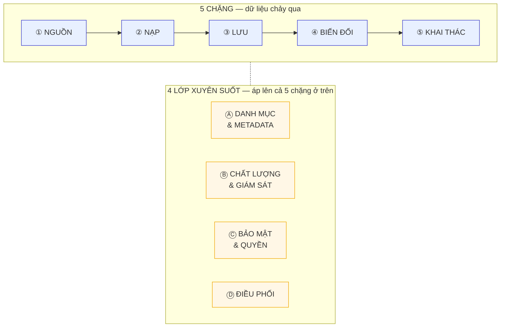
```mermaid
flowchart TB
  subgraph FLOW["5 CHẶNG — dữ liệu chảy qua"]
    direction LR
    S["① NGUỒN"] --> I["② NẠP"] --> ST["③ LƯU"] --> T["④ BIẾN ĐỔI"] --> U["⑤ KHAI THÁC"]
  end

  subgraph CROSS["4 LỚP XUYÊN SUỐT — áp lên cả 5 chặng ở trên"]
    direction LR
    C1["Ⓐ DANH MỤC<br/>& METADATA"]
    C2["Ⓑ CHẤT LƯỢNG<br/>& GIÁM SÁT"]
    C3["Ⓒ BẢO MẬT<br/>& QUYỀN"]
    C4["Ⓓ ĐIỀU PHỐI"]
  end

  FLOW -.- CROSS

  classDef flow fill:#e8f0ff,stroke:#3538cd,stroke-width:1px
  classDef cross fill:#fff7e6,stroke:#f0a500,stroke-width:1px
  class S,I,ST,T,U flow
  class C1,C2,C3,C4 cross
```

### Mô tả 5 chặng

| STT | Chặng | Việc gì diễn ra ở đây | Công cụ tiêu biểu trên thị trường |
|:---:|---|---|---|
| **①** | **Nguồn** | Dữ liệu sinh ra ở hệ thống nghiệp vụ, file đối tác gửi sang, log hệ thống | *(không phải chặng có tool riêng)* |
| **②** | **Nạp** | Đưa dữ liệu về kho, giữ nguyên bản gốc, ghi lại "lô nào, lúc nào, bao nhiêu dòng" | Fivetran · Airbyte · Kafka |
| **③** | **Lưu** | Lưu ở định dạng bảng mở: có phiên bản, sửa/xoá được, xem lại được trạng thái quá khứ | **Apache Iceberg** (đã thành chuẩn) · Delta Lake |
| **④** | **Biến đổi** | Làm sạch, ghép, tổng hợp thành bảng phục vụ báo cáo | dbt · Spark SQL |
| **⑤** | **Khai thác** | Báo cáo, dashboard, API, mô hình học máy | Power BI · Trino |

### Mô tả 4 lớp xuyên suốt

| STT | Lớp | Câu hỏi mà lớp này trả lời | Công cụ tiêu biểu | Demo ở màn nào |
|:---:|---|---|---|---|
| **Ⓐ** | **Danh mục & Metadata** | Công ty có bảng nào? Bảng này nghĩa là gì? Ai chịu trách nhiệm? Lấy từ đâu, ai đang dùng? | **OpenMetadata** · DataHub · Atlan · Collibra | [Màn 1–5](#màn-1--khám-phá-dữ-liệu), [9–10](#màn-9--từ-điển-nghiệp-vụ), [13](#màn-13--phân-tích-ảnh-hưởng) |
| **Ⓑ** | **Chất lượng & Giám sát** | Dữ liệu hôm nay có đúng không? Nếu sai thì ai biết, biết lúc mấy giờ, ai sửa? | **Soda** · Great Expectations · Monte Carlo | [Màn 6–8](#màn-6--bảng-theo-dõi-chất-lượng-của-một-bảng), [11–12](#màn-11--hợp-đồng-dữ-liệu-của-một-bảng), [14–16](#màn-14--bảng-điều-khiển-luật-kiểm-tra-toàn-hệ-thống) |
| **Ⓒ** | **Bảo mật & Quyền** | Ai được xem cột số điện thoại? Người ngoài nhìn thấy gì? | **Apache Ranger** · OPA · Immuta | [Màn 4](#màn-4--form-gắn-nhãn-phân-loại-cho-cột), [17–19](#màn-18--tab-masking-form-tạo-chính-sách-che-dữ-liệu) |
| **Ⓓ** | **Điều phối** | Job nào chạy trước job nào? Nguồn chưa về thì có chạy không? | Airflow · Dagster · Pentaho | *(SQLWF đã có, không nằm trong phạm vi báo cáo này)* |

---

## 2. Ba thay đổi lớn mà thị trường đã đi qua

<b>Thay đổi 1 — Từ ĐO dữ liệu sang KIỂM dữ liệu</b>

| Khía cạnh | **Cách cũ — ĐO** (SQLWF đang làm) | **Cách mới — KIỂM** (thị trường đang làm) |
|---|---|---|
| **Hệ thống làm gì** | Tự động **đo** các con số thống kê của mọi cột: có bao nhiêu dòng, bao nhiêu giá trị rỗng, giá trị nhỏ nhất / lớn nhất, có bao nhiêu giá trị khác nhau | **Kiểm** xem dữ liệu có vi phạm quy định nghiệp vụ không, theo **luật do người dùng đặt ra** |
| **Ai đặt ra quy định** | Không ai đặt — hệ thống đo sẵn mọi cột như nhau, không phân biệt cột nào quan trọng | **Người làm nghiệp vụ** đặt, bằng câu dễ hiểu: *"Số điện thoại phải đúng đầu số Việt Nam"* *"Mã đối tác phải có trong bảng danh mục"* |
| **Kết quả trả ra cho người dùng** | *"Cột `so_dien_thoai` có 12.480.331 giá trị, 0,02% rỗng, 11.203.004 giá trị khác nhau"* | *"1.204 số điện thoại sai định dạng — 100% đến từ đối tác A, bắt đầu từ ngày 31/07"* |
| **Người nghiệp vụ dùng được ngay không** | ❌ Chưa — vì con số thống kê **không nói lên được đúng hay sai**. Người xem không biết phải làm gì tiếp | ✅ Được — biết ngay **sai chỗ nào, sai bao nhiêu, do ai, gọi cho ai** |
| **Điểm mạnh** | Phủ được mọi bảng mà không cần khai gì | Phát hiện được lỗi nghiệp vụ thật |
| **Điểm yếu** | Không phát hiện được lỗi nghiệp vụ | Phải khai luật — nhưng khai một lần dùng mãi |

> 🔴 **Khoảng cách với SQLWF:** SQLWF đang có **11 chỉ số thống kê** nhưng **chưa có một loại luật kiểm tra nào**. Đây là khoảng cách lớn nhất trong toàn bộ báo cáo này.

<b>Thay đổi 2 — Từ "mỗi module một kho" sang "một hồ sơ dữ liệu duy nhất"</b>

Thị trường bán **một màn hình duy nhất cho một bảng**, trên đó có đủ:

- Mô tả nghiệp vụ và người chịu trách nhiệm
- Cấu trúc cột, kèm nhãn nhạy cảm và thuật ngữ nghiệp vụ của **từng cột**
- Điểm chất lượng và các luật đang chạy
- Nguồn gốc dữ liệu — lấy từ đâu, chảy đi đâu
- Ai đang dùng bảng này, dùng bao nhiêu
- Lịch sử sự cố

> 🟠 **Khoảng cách với SQLWF:** ta có **gần đủ nguyên liệu** nhưng để rời ở **4 kho khác nhau** (metadata ở MongoDB, nguồn gốc ở Neo4j, phân quyền ở MariaDB, kết quả chất lượng ở chỗ khác). Người dùng phải mở 4 màn và tự ghép trong đầu.

<b>Thay đổi 3 — Từ mức BẢNG xuống mức CỘT</b>

Mọi thứ thị trường làm đều đã xuống tới **cột**:

| Việc | Thị trường làm ở mức | SQLWF đang ở mức |
|---|---|---|
| Nguồn gốc dữ liệu | Cột → cột | Bảng → bảng |
| Phân quyền truy cập | Từng cột | Cả bảng |
| Nhãn dữ liệu nhạy cảm | Từng cột | Một cờ chung cho cả nhóm bảng |
| Che dữ liệu | Từng cột | *(chưa có)* |

> 🔴 **Bốn thiếu sót nhưng chỉ một gốc:** SQLWF chưa coi "cột" là một đối tượng có hồ sơ riêng. Xử lý được gốc này thì cả bốn thứ trên mở ra cùng lúc.

---

## 3. SQLWF đang đứng ở đâu trên luồng đó

<b>Sơ đồ đối chiếu — dùng đúng 5 chặng và 4 lớp đã đánh số ở mục 1</b>

**Điều cần nói rõ trước tiên:** SQLWF **không cùng loại** với OpenMetadata hay Soda. Thị trường tách mỗi chặng cho một công cụ riêng; SQLWF **gộp cả 5 chặng vào một nền tảng**. Đây là điểm mạnh, không phải điểm yếu.

Sơ đồ dưới dùng **đúng các số ① ② ③ ④ ⑤ và Ⓐ Ⓑ Ⓒ Ⓓ ở mục 1**, tô màu theo mức độ SQLWF đã đáp ứng:

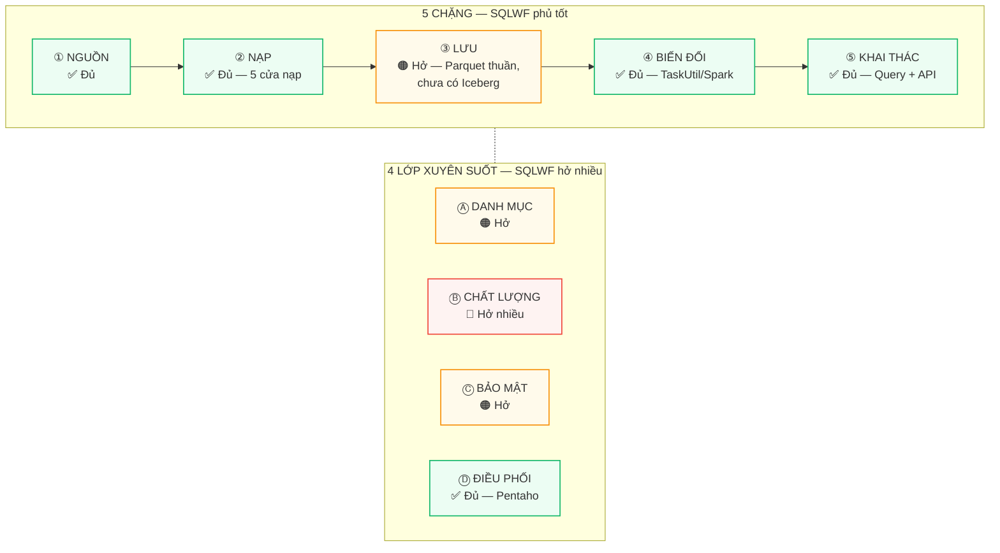
```mermaid
flowchart TB
  subgraph F["5 CHẶNG — SQLWF phủ tốt"]
    direction LR
    S1["① NGUỒN<br/>✅ Đủ"]:::ok
    S2["② NẠP<br/>✅ Đủ — 5 cửa nạp"]:::ok
    S3["③ LƯU<br/>🟠 Hở — Parquet thuần,<br/>chưa có Iceberg"]:::warn
    S4["④ BIẾN ĐỔI<br/>✅ Đủ — TaskUtil/Spark"]:::ok
    S5["⑤ KHAI THÁC<br/>✅ Đủ — Query + API"]:::ok
    S1 --> S2 --> S3 --> S4 --> S5
  end

  subgraph C["4 LỚP XUYÊN SUỐT — SQLWF hở nhiều"]
    direction LR
    L1["Ⓐ DANH MỤC<br/>🟠 Hở"]:::warn
    L2["Ⓑ CHẤT LƯỢNG<br/>🔴 Hở nhiều"]:::bad
    L3["Ⓒ BẢO MẬT<br/>🟠 Hở"]:::warn
    L4["Ⓓ ĐIỀU PHỐI<br/>✅ Đủ — Pentaho"]:::ok
  end

  F -.- C

  classDef ok fill:#ecfdf3,stroke:#12b76a,stroke-width:1.5px
  classDef warn fill:#fffaeb,stroke:#f79009,stroke-width:1.5px
  classDef bad fill:#fef3f2,stroke:#f04438,stroke-width:1.5px
```

### Chi tiết từng chặng — SQLWF làm được gì, hở chỗ nào

| STT | Chặng | SQLWF đang làm được | Hở chỗ nào |
|:---:|---|---|---|
| **①** | Nguồn | Nhận từ CSDL nguồn, file đối tác, log | — |
| **②** | Nạp | **5 cửa nạp**: upload theo mẫu · job ETL · quản lý danh mục · đồng bộ từ CSDL nguồn · nạp file chuyên biệt | Chưa chặn dữ liệu xấu ngay tại cửa nạp |
| **③** | Lưu | Lưu Parquet trên HDFS theo đường dẫn vùng lưu trữ | 🟠 Chưa có định dạng bảng hiện đại (Iceberg) → **không sửa/xoá được từng dòng, không xem lại được trạng thái quá khứ** |
| **④** | Biến đổi | TaskUtil chạy Spark SQL, đầy đủ | — |
| **⑤** | Khai thác | Màn truy vấn + API + xuất dữ liệu | — |

### Chi tiết từng lớp xuyên suốt — SQLWF làm được gì, hở chỗ nào

| STT | Lớp | SQLWF đang làm được | Hở chỗ nào |
|:---:|---|---|---|
| **Ⓐ** | Danh mục & Metadata | Có mô tả bảng, người sở hữu, miền dữ liệu; có từ điển nghiệp vụ **có phiên bản và góp ý** — điểm này **hơn nhiều tool thị trường** | 🟠 Chưa có danh mục bảng đúng nghĩa · tìm kiếm chỉ theo tên bảng · nguồn gốc dừng ở mức bảng · thuật ngữ chưa gắn vào cột · chưa có nhãn phân loại cột |
| **Ⓑ** | Chất lượng & Giám sát | Có 11 chỉ số thống kê, có cấu hình chu kỳ **rất chi tiết**, có cảnh báo đa kênh (email/SMS/Telegram) | 🔴 **Chưa có luật kiểm tra nào** · chưa có điểm chất lượng · chưa có quy trình xử lý sau cảnh báo · chưa có chỉ số độ phủ |
| **Ⓒ** | Bảo mật & Quyền | Phân quyền mức bảng và theo nhóm; **kiểm soát theo IP riêng cho dữ liệu nhạy cảm**; **chặn hàm SQL theo nhãn người dùng**; nhật ký kiểm toán chi tiết — ba điểm này **hơn mặt bằng thị trường** | 🟠 Chưa có quyền mức cột · chưa che được dữ liệu · chưa lọc theo dòng · chưa có chính sách theo nhãn |
| **Ⓓ** | Điều phối | Pentaho lo lịch chạy và phụ thuộc job | — |

### Kết luận đối chiếu

1. **Ở 5 chặng đi ngang, SQLWF phủ tốt** — chỉ hở chặng ③ (chưa có Iceberg).
2. **Ở 4 lớp xuyên suốt, SQLWF hở nhiều** — và đây đúng là phần thị trường tập trung 5 năm qua.
3. **Hướng đi:** học **mô hình chức năng** của các công cụ thị trường rồi xây vào SQLWF — đó là mục đích của phần demo dưới đây.

---

# PHẦN B — DEMO CÁC CÔNG CỤ TRÊN THỊ TRƯỜNG

> **22 màn hình.** Trong đó có **8 màn form khai báo / xem chi tiết** — là phần quan trọng nhất để hình dung tính năng cụ thể.

## B1. OpenMetadata — danh mục dữ liệu gộp cả 3 trụ

<b>Giới thiệu ngắn về công cụ này</b>

| Mục | Nội dung |
|---|---|
| **Là gì** | Danh mục dữ liệu mã nguồn mở, miễn phí hoàn toàn |
| **Vì sao chọn demo đầu tiên** | Là công cụ **duy nhất gộp cả 3 trụ trong một sản phẩm**: danh mục + chất lượng + nhãn bảo mật — đúng mô hình mà đề xuất kiến trúc của ta hướng tới |
| **Số màn demo** | 10 màn, trong đó **4 màn form** |

#### Màn 1 — Khám phá dữ liệu

<b>Xem màn 1</b>

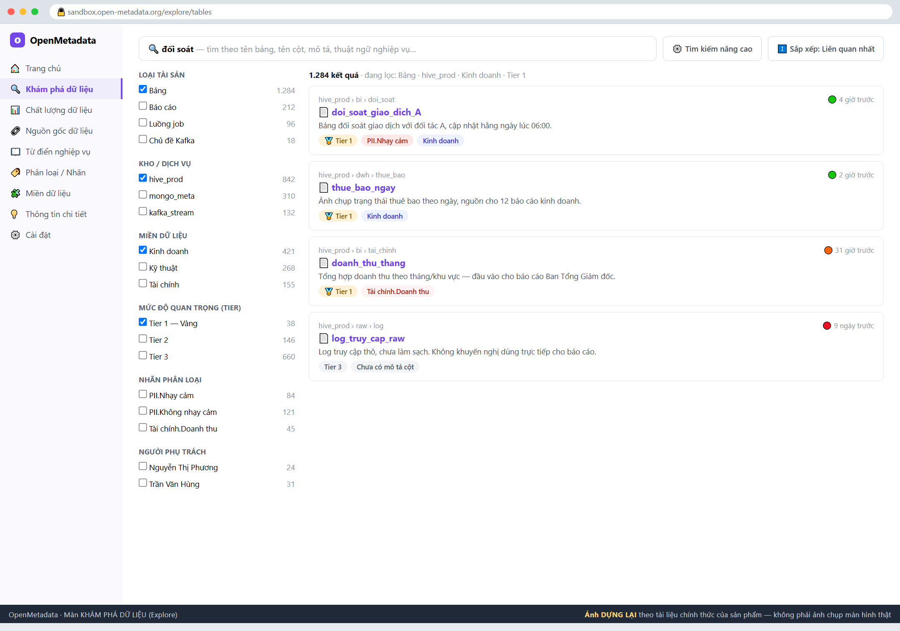

**Màn này để làm gì**

> Để người dùng **tự tìm được bảng cần dùng** trong hàng nghìn bảng, và **tự đánh giá được bảng đó có dùng được không** ngay từ danh sách kết quả — không cần mở từng bảng ra xem, không cần hỏi ai.

**Trên màn có gì**

- **Ô tìm kiếm lớn** ở trên cùng — tìm được theo tên bảng, **tên cột**, **mô tả**, và **thuật ngữ nghiệp vụ**
- **Cột lọc bên trái** — 6 nhóm lọc, **mỗi mục kèm sẵn con số đếm**:
  - Loại tài sản (Bảng · Báo cáo · Luồng job · Chủ đề Kafka)
  - Kho / dịch vụ
  - Miền dữ liệu
  - Mức độ quan trọng (Tier 1 / 2 / 3)
  - Nhãn phân loại (PII · Tài chính…)
  - Người phụ trách
- **Nút "Tìm kiếm nâng cao"** — ghép nhiều điều kiện bằng VÀ / HOẶC
- **Nút sắp xếp** — theo độ liên quan, ngày sửa gần nhất, hoặc lượt dùng trong tuần
- **Danh sách kết quả dạng thẻ**, mỗi thẻ hiển thị:
  - Đường dẫn (kho › cơ sở dữ liệu › nhóm bảng)
  - Tên bảng
  - **Mô tả nghiệp vụ**
  - Các nhãn: mức độ quan trọng, nhãn phân loại, miền dữ liệu
  - **Điểm chất lượng** và **độ tươi** (xanh / cam / đỏ)

**Người dùng thao tác**

1. Gõ từ khoá vào ô tìm kiếm
2. Tích các ô lọc bên trái → danh sách tự thu hẹp, số đếm tự cập nhật
3. Đọc thẻ kết quả để chọn bảng phù hợp
4. Bấm vào thẻ để mở hồ sơ bảng (màn 2)

**Kết quả nhận được**

- Danh sách bảng đã xếp hạng theo độ liên quan
- Đủ ngữ cảnh để quyết định "có nên dùng bảng này không" **ngay tại danh sách**

**Đối chiếu với SQLWF**

| SQLWF hiện tại | Nếu xây thêm thì được gì |
|---|---|
| 🟠 Chỉ tìm được **theo tên bảng**. Không tìm theo tên cột, không tìm theo mô tả, không tìm theo thuật ngữ. Không có bộ lọc nhiều tầng có số đếm. Không hiện điểm chất lượng / độ tươi trên danh sách | Người dùng mới **tự tìm được bảng thay vì hỏi qua chat**. Đây là tính năng có **tỉ lệ giá trị trên công sức cao nhất** trong toàn báo cáo — vì SQLWF **đã có sẵn dữ liệu**, chỉ thiếu cách trình bày |

#### Màn 2 — Hồ sơ một bảng

<b>Xem màn 2</b>

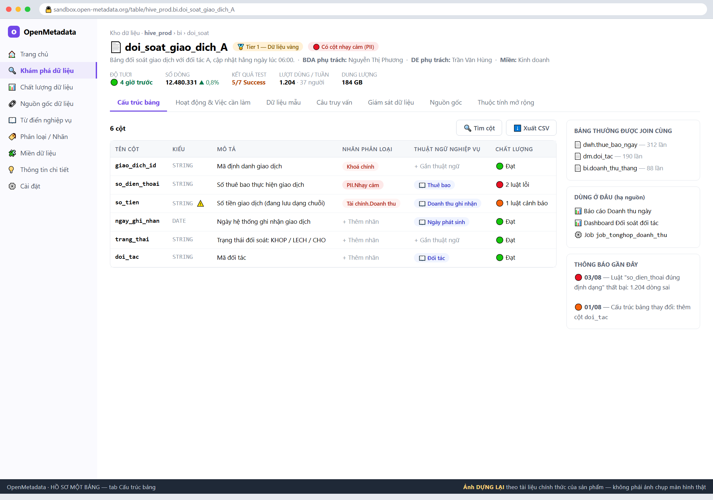

**Màn này để làm gì**

> Để trả lời **toàn bộ câu hỏi về một bảng trên một màn hình duy nhất** — thay vì phải mở 4 màn khác nhau rồi tự ghép thông tin trong đầu.

**Trên màn có gì**

- **Băng chỉ số ngay dưới tiêu đề** — 5 con số quan trọng nhất:
  - Độ tươi (bao lâu rồi chưa cập nhật)
  - Số dòng, kèm % thay đổi so với hôm trước
  - Điểm chất lượng
  - Lượt dùng mỗi tuần và số người dùng
  - Dung lượng
- **Nhãn ngay cạnh tên bảng** — mức độ quan trọng, cảnh báo có cột nhạy cảm
- **Dòng trách nhiệm** — BDA phụ trách, DE phụ trách, miền dữ liệu
- **7 tab**: Cấu trúc bảng · Hoạt động & Việc cần làm · Dữ liệu mẫu · Câu truy vấn · Giám sát dữ liệu · Nguồn gốc · Thuộc tính mở rộng
- **Bảng cấu trúc cột** — mỗi cột có 6 thông tin: tên · kiểu · mô tả · **nhãn phân loại** · **thuật ngữ nghiệp vụ** · **trạng thái chất lượng riêng của cột đó**
- **Cột phải** — 3 khối bổ trợ:
  - Bảng thường được join cùng (kèm số lần)
  - Đang được dùng ở đâu (báo cáo nào, job nào)
  - Thông báo gần đây (lỗi chất lượng, thay đổi cấu trúc)

**Người dùng thao tác**

1. Bấm thẳng vào ô mô tả để **sửa tại chỗ**, không cần vào màn quản trị riêng
2. Bấm "+ Thêm nhãn" ở từng cột để gắn nhãn phân loại
3. Bấm "+ Gắn thuật ngữ" để nối cột với từ điển nghiệp vụ
4. Chuyển tab để xem chất lượng, nguồn gốc, dữ liệu mẫu

**Kết quả nhận được**

- Một trang trả lời được: bảng này là gì · tin được không · ai chịu trách nhiệm · lấy từ đâu · ai đang dùng · có đang lỗi không

**Đối chiếu với SQLWF**

| SQLWF hiện tại | Nếu xây thêm thì được gì |
|---|---|
| 🟠 Có phần lớn **nguyên liệu** nhưng nằm ở **4 màn / 4 kho** khác nhau. 🔴 Chưa có: bảng thường join cùng · lượt dùng · nhãn phân loại cột · thuật ngữ gắn vào cột · độ tươi | Giảm thời gian trả lời câu hỏi *"bảng này dùng được không"* từ **vài giờ hỏi qua lại** xuống **vài giây** |

#### Màn 3 — Form khai báo thông tin bảng

<b>Xem màn 3 — FORM</b>

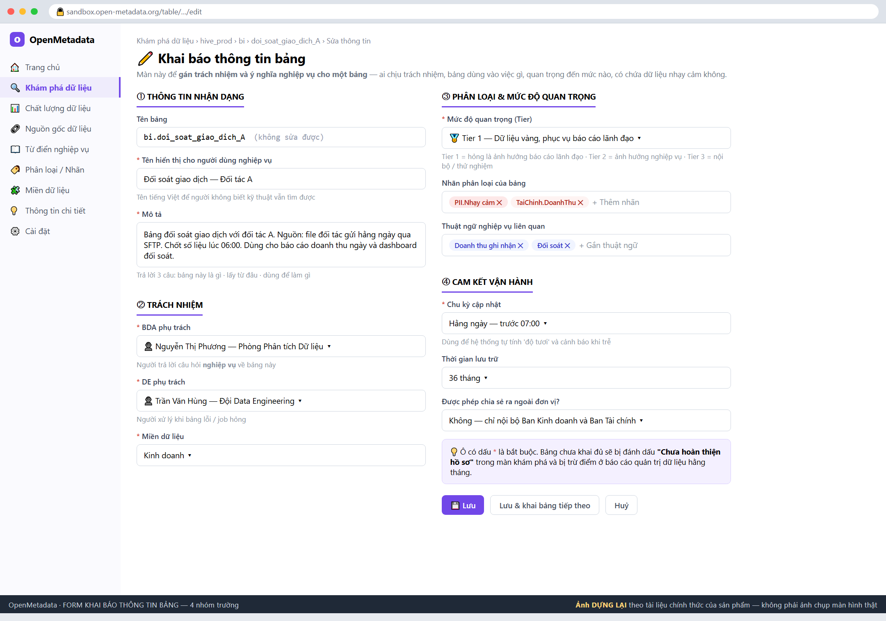

**Màn này để làm gì**

> Để **gán trách nhiệm và ý nghĩa nghiệp vụ cho một bảng**: ai chịu trách nhiệm, bảng dùng vào việc gì, quan trọng đến mức nào, có chứa dữ liệu nhạy cảm không.

**Trên màn có gì**

- Form chia **4 nhóm trường**, mỗi nhóm có tiêu đề riêng
- Ô có dấu * đỏ là **bắt buộc**
- Mỗi ô đều có **dòng hướng dẫn ngay bên dưới** giải thích khai để làm gì
- Ô cảnh báo cuối form: bảng chưa khai đủ sẽ bị đánh dấu **"Chưa hoàn thiện hồ sơ"**
- 3 nút: **Lưu** · **Lưu & khai bảng tiếp theo** · **Huỷ**

**Các trường phải khai**

| Nhóm | Trường | Bắt buộc | Kiểu nhập | Khai để làm gì |
|---|---|:---:|---|---|
| ① Nhận dạng | Tên bảng | — | Chỉ đọc | Định danh kỹ thuật |
| ① Nhận dạng | Tên hiển thị cho người dùng nghiệp vụ | ✅ | Chữ | Người không biết kỹ thuật vẫn tìm được |
| ① Nhận dạng | Mô tả | ✅ | Đoạn văn | Trả lời 3 câu: là gì · lấy từ đâu · dùng làm gì |
| ② Trách nhiệm | BDA phụ trách | ✅ | Chọn từ danh sách | Người trả lời câu hỏi **nghiệp vụ** |
| ② Trách nhiệm | DE phụ trách | ✅ | Chọn từ danh sách | Người xử lý khi bảng lỗi |
| ② Trách nhiệm | Miền dữ liệu | ✅ | Chọn từ danh sách | Gom nhóm để phân quyền và tìm kiếm |
| ③ Phân loại | Mức độ quan trọng (Tier) | ✅ | Chọn 1 trong 3 | Quyết định mức độ ưu tiên xử lý sự cố |
| ③ Phân loại | Nhãn phân loại của bảng | — | Chọn nhiều | Nền cho chính sách bảo mật theo nhãn |
| ③ Phân loại | Thuật ngữ nghiệp vụ liên quan | — | Chọn nhiều | Để tìm được bằng ngôn ngữ nghiệp vụ |
| ④ Vận hành | Chu kỳ cập nhật | ✅ | Chọn từ danh sách | Hệ thống tự tính **độ tươi** và cảnh báo khi trễ |
| ④ Vận hành | Thời gian lưu trữ | — | Chọn từ danh sách | Cơ sở để dọn dữ liệu cũ |
| ④ Vận hành | Được phép chia sẻ ra ngoài đơn vị? | — | Chọn 1 | Cơ sở để kiểm soát chia sẻ |

**Kết quả nhận được**

- Bảng có hồ sơ đầy đủ, xuất hiện đúng trong kết quả tìm kiếm và bộ lọc
- Hệ thống bắt đầu tự tính độ tươi và cảnh báo khi bảng cập nhật trễ
- Bảng chưa khai đủ bị **trừ điểm ở báo cáo quản trị dữ liệu hằng tháng** — tạo áp lực khai đủ

**Đối chiếu với SQLWF**

| SQLWF hiện tại | Nếu xây thêm thì được gì |
|---|---|
| 🟠 Đã có form khai thông tin bảng ở màn Quản lý bảng, có mô tả và người sở hữu. 🔴 Chưa có: **mức độ quan trọng (Tier)** · **chu kỳ cập nhật cam kết** · nhãn phân loại · gắn thuật ngữ · chỉ báo "chưa hoàn thiện hồ sơ" | Bổ sung **3–4 trường** vào form đã có là ra được phần lớn giá trị. Riêng trường **chu kỳ cập nhật** mở khoá luôn tính năng **cảnh báo độ tươi** — một trường khai, hai tính năng |

#### Màn 4 — Form gắn nhãn phân loại cho cột

<b>Xem màn 4 — FORM</b>

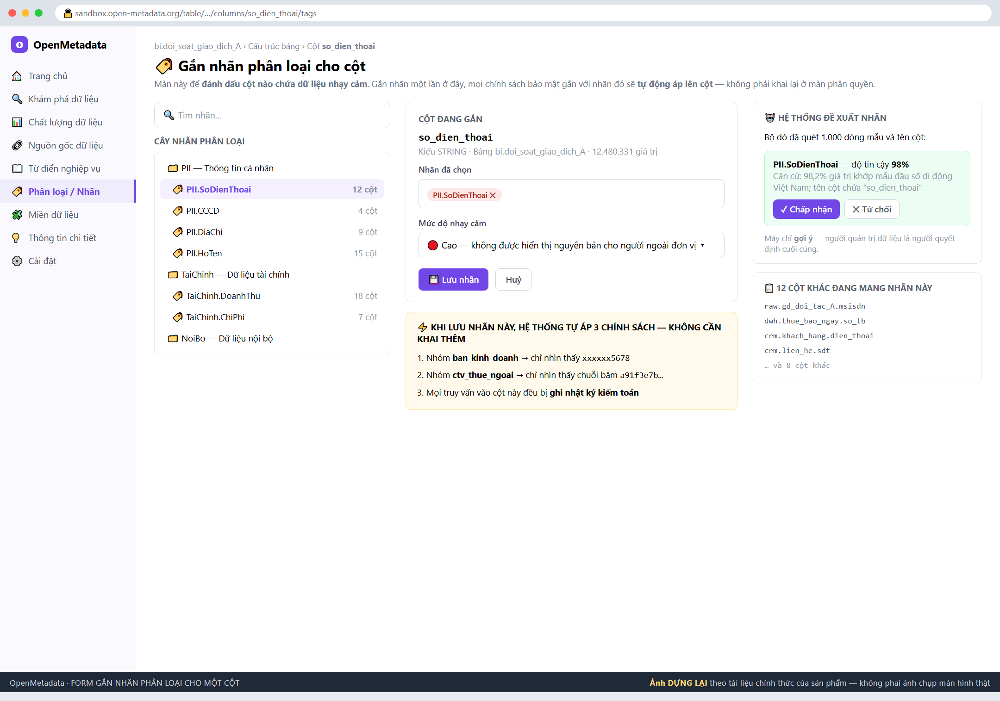

**Màn này để làm gì**

> Để **đánh dấu cột nào chứa dữ liệu nhạy cảm**. Gắn nhãn một lần ở đây, **mọi chính sách bảo mật gắn với nhãn đó tự động áp lên cột** — không phải khai lại ở màn phân quyền.

**Trên màn có gì**

- **Cột trái** — ô tìm nhãn + **cây nhãn phân loại** nhiều cấp (PII · Tài chính · Nội bộ), mỗi nhãn kèm số cột đang mang nhãn đó
- **Cột giữa** — thông tin cột đang gắn, ô nhãn đã chọn, ô chọn mức độ nhạy cảm
- **Ô vàng cảnh báo** — liệt kê rõ **3 chính sách sẽ tự động áp** ngay khi bấm Lưu
- **Cột phải** — 2 khối:
  - **Hệ thống đề xuất nhãn**: bộ dò đã quét 1.000 dòng mẫu, đưa ra nhãn kèm **độ tin cậy** và **căn cứ**, có nút Chấp nhận / Từ chối
  - Danh sách 12 cột khác đang mang cùng nhãn

**Các trường phải khai**

| Trường | Bắt buộc | Kiểu nhập | Ghi chú |
|---|:---:|---|---|
| Cột đang gắn | — | Chỉ đọc | Kèm kiểu dữ liệu và số lượng giá trị |
| Nhãn phân loại | ✅ | Chọn nhiều từ cây nhãn | Có thể gắn nhiều nhãn cho một cột |
| Mức độ nhạy cảm | ✅ | Chọn 1 trong 3 (Cao / Trung bình / Thấp) | Quyết định cách che dữ liệu mặc định |

**Người dùng thao tác**

1. Xem đề xuất của hệ thống ở cột phải → bấm **Chấp nhận** nếu đúng
2. Hoặc tự chọn nhãn từ cây bên trái
3. Chọn mức độ nhạy cảm
4. Đọc ô vàng để biết chính sách nào sẽ tự áp
5. Bấm **Lưu nhãn**

**Kết quả nhận được**

- Cột được đánh dấu nhạy cảm, hiện nhãn đỏ trên mọi màn có nhắc tới cột này
- **3 chính sách bảo mật tự động có hiệu lực ngay** mà không cần khai thêm ở đâu
- Mọi truy vấn vào cột này bắt đầu bị ghi nhật ký kiểm toán

**Đối chiếu với SQLWF**

| SQLWF hiện tại | Nếu xây thêm thì được gì |
|---|---|
| 🔴 Chưa có nhãn mức cột — chỉ có **một cờ "nhạy cảm" ở mức nhóm bảng**. Chưa có bộ dò tự động | Đây là **nền móng bắt buộc** cho toàn bộ trụ bảo mật. Không có nhãn cột thì không làm được che dữ liệu theo nhãn (màn 17, 19). Càng để lâu càng tốn công gắn ngược |

#### Màn 5 — Nguồn gốc dữ liệu mức cột

<b>Xem màn 5</b>

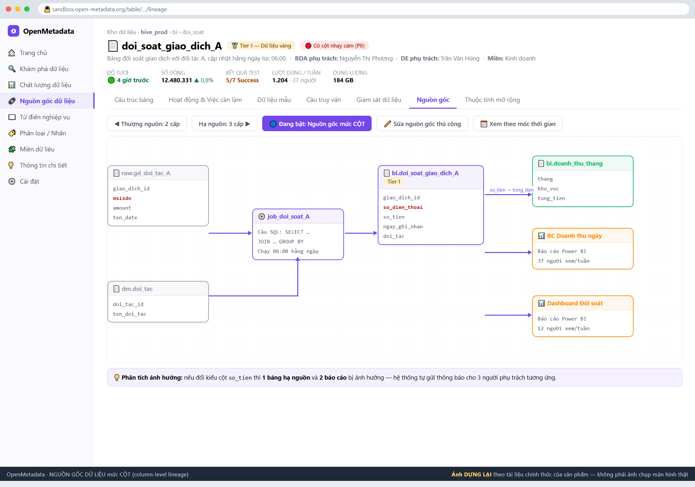

**Màn này để làm gì**

> Để trả lời hai câu hỏi đắt tiền nhất trong quản trị dữ liệu:
> - *"Số này ở báo cáo lấy từ đâu ra?"*
> - *"Tôi sửa cột này thì cái gì gãy?"*

**Trên màn có gì**

- **Sơ đồ luồng dữ liệu**: bảng nguồn → job xử lý → bảng đích → **báo cáo / dashboard cuối cùng**
- Mỗi nút hiển thị **danh sách cột** bên trong, cột nhạy cảm được tô đỏ
- Khi bật chế độ mức cột, **đường nối ghi rõ cột nào sinh ra cột nào** (`so_tien → tong_tien`)
- **Thanh công cụ** với 5 nút:
  - Số cấp thượng nguồn muốn xem
  - Số cấp hạ nguồn muốn xem
  - Bật / tắt chế độ mức cột
  - **Sửa nguồn gốc thủ công** — vẽ tay mối nối mà hệ thống chưa tự nhận ra
  - Xem theo mốc thời gian
- **Ô tím dưới cùng** — kết luận phân tích ảnh hưởng bằng số

**Người dùng thao tác**

1. Chỉnh số cấp muốn xem
2. Bật chế độ mức cột
3. Bấm vào một nút để xem nhanh cấu trúc và chất lượng của nó
4. Vẽ tay thêm mối nối nếu thiếu

**Kết quả nhận được**

- Đường đi đầy đủ của một cột dữ liệu, từ nguồn thô đến báo cáo cuối
- Danh sách chính xác những gì bị ảnh hưởng nếu thay đổi

**Đối chiếu với SQLWF**

| SQLWF hiện tại | Nếu xây thêm thì được gì |
|---|---|
| 🟠 **Có nguồn gốc mức BẢNG** (lưu trong Neo4j) — nhưng **độ phủ chưa đầy đủ**, xem ghi chú bên dưới. 🔴 Chưa có mức CỘT, chưa nối tới báo cáo / dashboard | ⭐ **Cơ hội lớn về mặt kỹ thuật:** SQLWF **đã lưu sẵn câu SQL của mọi bước job**, thị trường phải đi thu thập rất vất vả. Thay bộ quét chuỗi hiện tại bằng **bộ phân tích câu SQL thật** thì vừa có mức cột, vừa vá được các lỗ hổng ở ghi chú dưới. Ngoài ra TaskUtil chạy trên Spark, có thể bật chuẩn OpenLineage |

---

##### ⚠️ Nguồn gốc dữ liệu hiện tại của SQLWF phủ được tới đâu — đã đối chiếu mã nguồn

> **Câu hỏi cần trả lời:** *một bảng có thể vừa là đầu ra của job này, vừa là đầu vào của job khác, chứ không chỉ chảy vào một báo cáo duy nhất. Vậy sơ đồ hiện tại có bắt được hết không?*
>
> **Trả lời ngắn: bắt được chuỗi nhiều job nối nhau, nhưng KHÔNG phủ hết — có 6 lỗ hổng cụ thể.**

**Cách SQLWF đang sinh sơ đồ nguồn gốc** *(theo `TableLineageServiceImpl.transformData()` và `StepLineage`)*

| Thành phần | Cách lấy hiện nay | Đánh giá |
|---|---|---|
| **Bảng đích** của một bước | Đọc thẳng từ **trường cấu hình** `output.table` của bước job | ✅ Chắc chắn đúng |
| **Bảng nguồn** của một bước | **Quét chuỗi `${...}` trong câu SQL** rồi lấy nguyên phần bên trong làm tên bảng | ⚠️ **Không phải bộ phân tích SQL** — chỉ là dò ký tự |
| Nối nhiều bước trong **cùng một job** | Theo quan hệ bước cha – bước con | ✅ Đúng |
| Nối **nhiều job với nhau** | Ngầm định qua **trùng tên bảng**: bảng là đầu ra của job A và đầu vào của job B thì tự nối | ✅ **Đây chính là điều anh hỏi — có bắt được**, và bắt được nhiều cấp, một bảng làm đầu vào cho bao nhiêu job cũng ra hết |
| Phạm vi job được quét | Chỉ những job **đã tick ô "Quét lineage"** (`enableDataLineage = true`) | 🔴 **Lỗ hổng lớn nhất** |
| Thời điểm cập nhật | Chạy nền theo lịch — **mỗi giờ, từ 07:00 đến 18:00** | 🟠 Không phải real-time |

**Sáu lỗ hổng — những gì sơ đồ hiện tại KHÔNG thấy**

| # | Lỗ hổng | Hậu quả |
|:---:|---|---|
| 1 | **Job chưa tick "Quét lineage"** — đây là ô tick thủ công ở màn cấu hình job, mặc định **không bật** | Job đó **biến mất hoàn toàn** khỏi sơ đồ. Phân tích ảnh hưởng sẽ báo "không có gì bị ảnh hưởng" trong khi thực tế có. ⚠️ **Cần hỏi ngay đội vận hành: hiện bao nhiêu % job đã bật ô này?** |
| 2 | **Bảng viết thẳng trong câu SQL, không qua `${TÊN_BẢNG}`** | Không sinh ra cạnh nào → **thiếu nguồn**, sơ đồ trông như bảng tự sinh ra từ hư không |
| 3 | **`${...}` không phải tên bảng** — ví dụ tham số ngày, biến cấu hình | Sinh ra **cạnh giả** và **node bảng ma** trong sơ đồ (mã nguồn có sẵn nhánh tạo node cho "bảng chưa có trong cơ sở dữ liệu") |
| 4 | **4 cửa nạp không chạy qua job SQL** — upload theo mẫu · đồng bộ từ CSDL nguồn · nạp file chuyên biệt · quản lý danh mục | Bảng nạp bằng các cửa này **không có bước SQL nào** → không sinh cạnh → sơ đồ mất đầu vào |
| 5 | **Dữ liệu sau khi rời SQLWF** — file xuất, gọi API, báo cáo Power BI đọc trực tiếp | **Mất dấu hoàn toàn.** Không biết bảng đang được dùng ở báo cáo nào, do đó không biết phải báo cho ai |
| 6 | **Không có mức cột** | Không trả lời được *"tôi đổi riêng cột `so_tien` thì gãy gì"* — chỉ trả lời được ở mức cả bảng |

**Muốn phân tích ảnh hưởng đầy đủ thì phải cộng 3 nguồn, không chỉ 1**

| Nguồn | Lấy từ đâu | Công sức | Vá được lỗ hổng nào |
|:---:|---|:---:|---|
| **A** | **Bộ phân tích câu SQL thật** thay cho bộ quét `${...}` hiện tại | Trung bình | ② ③ ⑥ — và mở ra mức cột |
| **B** | **Cấu hình các cửa nạp khác** — 4 cửa kia đều đã khai sẵn "lấy từ nguồn nào, ghi vào bảng nào", chỉ cần đọc cấu hình, **không cần phân tích gì** | Thấp | ④ |
| **C** | **Đăng ký thủ công hoặc nhập từ ngoài** cho phần ngoài SQLWF — danh sách báo cáo Power BI, file xuất định kỳ | Thấp (nhưng phải duy trì) | ⑤ |
| **—** | **Bật "Quét lineage" cho toàn bộ job** + đổi mặc định thành bật | Rất thấp | ① — **rẻ nhất, làm được ngay** |

> 💡 **Việc nên làm trước tiên, gần như không tốn công:** rà lại xem bao nhiêu job đang tắt ô "Quét lineage" và bật hết lên. Sơ đồ hiện tại có thể đang thiếu nhiều không phải vì thiếu tính năng, mà vì **chưa ai bật**.
>
> ⚠️ **Bắt buộc phải có kèm:** một **chỉ số độ phủ nguồn gốc** hiển thị ngay trên màn — kiểu *"sơ đồ này dựng từ 62/180 job đang bật quét lineage"*. Không có con số đó, người xem sẽ tưởng sơ đồ là đầy đủ và **kết luận sai khi phân tích ảnh hưởng** — nguy hiểm hơn là không có sơ đồ.

#### Màn 6 — Bảng theo dõi chất lượng của một bảng

<b>Xem màn 6</b>

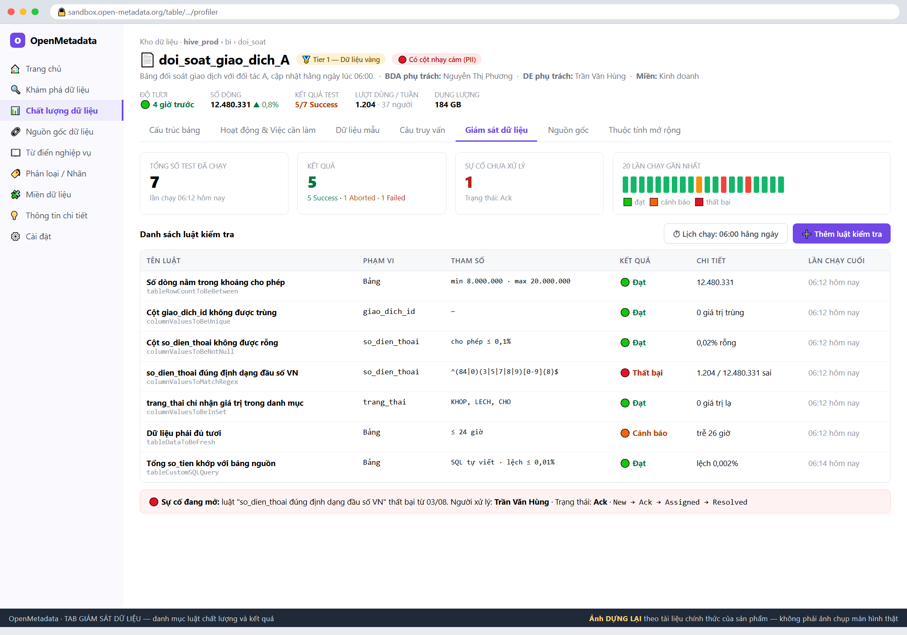

**Màn này để làm gì**

> Để **theo dõi sức khoẻ dữ liệu của một bảng**: đang có bao nhiêu luật, luật nào đang hỏng, hỏng bao lâu rồi, ai đang xử lý.

**Trên màn có gì**

- **4 thẻ tóm tắt**:
  - Tổng số test đã chạy
  - Kết quả chia theo **Success / Aborted / Failed** *(đúng 3 nhóm mà tài liệu nêu)*
  - Số sự cố chưa xử lý và trạng thái
  - Dải màu **20 lần chạy gần nhất** — nhìn phát biết bảng hay hỏng hay không

> ⚠️ *Đính chính: OpenMetadata **không có "điểm chất lượng" dạng số 0–100**. Tài liệu chỉ nói tới
> **health dashboard** ở mức bảng và mức toàn tổ chức, cùng bộ đếm Success / Aborted / Failed.
> Con số "88/100" tôi từng đưa vào là **tôi tự nghĩ ra** — đã bỏ.*
- **Danh sách luật**, mỗi dòng có:
  - Tên luật **viết bằng tiếng Việt dễ hiểu**, kèm mã kỹ thuật ở dưới
  - Phạm vi áp dụng (cả bảng hay cột nào)
  - Tham số của luật
  - Kết quả: Đạt 🟢 / Cảnh báo 🟠 / Thất bại 🔴
  - **Con số cụ thể** đo được
  - Thời điểm chạy lần cuối
- **Nút "Thêm luật kiểm tra"** và **nút lịch chạy**
- **Ô đỏ dưới cùng** — sự cố đang mở, kèm người xử lý và trạng thái theo quy trình

**Người dùng thao tác**

1. Nhìn 4 thẻ để nắm tình hình chung
2. Bấm vào luật đang hỏng để xem chi tiết (màn 8)
3. Bấm "Thêm luật kiểm tra" để tạo luật mới (màn 7)
4. Đổi lịch chạy nếu cần

**Kết quả nhận được**

- Trạng thái sức khoẻ của bảng, kèm **con số vi phạm cụ thể** thay vì chỉ số thống kê chung chung

**Đối chiếu với SQLWF**

| SQLWF hiện tại | Nếu xây thêm thì được gì |
|---|---|
| 🔴 **Khoảng cách lớn nhất.** SQLWF có 11 chỉ số **thống kê** nhưng: không có luật định dạng · không có tỉ lệ rỗng theo % · không có kiểm tra danh mục tham chiếu · không có bộ đếm Success/Failed theo lần chạy · không có quy trình xử lý sau cảnh báo | Chuyển từ *"đo cho biết"* sang *"kiểm cho đúng"* — thay đổi khiến người nghiệp vụ **thấy được giá trị ngay** |

#### Màn 7 — Form tạo luật kiểm tra

<b>Xem màn 7 — FORM</b>

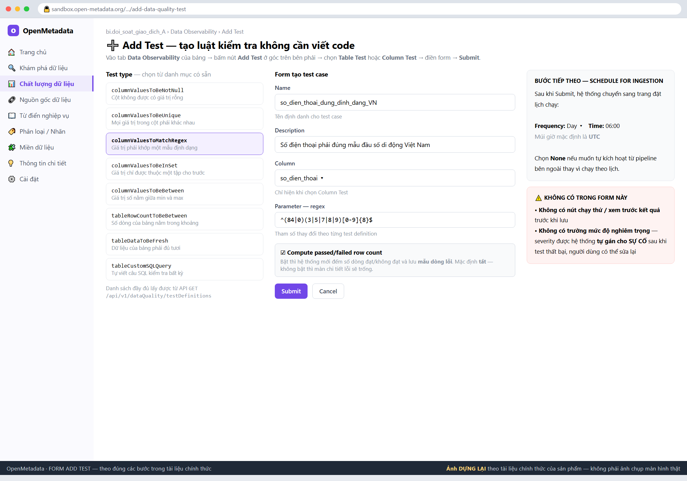

**Màn này để làm gì**

> Để **người làm nghiệp vụ tự đặt ra luật kiểm tra dữ liệu mà không cần viết code** — chọn cột, chọn loại luật từ danh mục có sẵn, điền tham số.

**Trên màn có gì**

- **Cột trái** — danh mục **test definition có sẵn**, tên kỹ thuật đúng như trong tài liệu:
  - `columnValuesToBeNotNull` — cột không được rỗng
  - `columnValuesToBeUnique` — mọi giá trị phải khác nhau
  - `columnValuesToMatchRegex` — khớp một mẫu định dạng
  - `columnValuesToBeInSet` — chỉ thuộc một tập cho trước
  - `columnValuesToBeBetween` — nằm giữa min và max
  - `tableRowCountToBeBetween` — số dòng nằm trong khoảng
  - `tableDataToBeFresh` — dữ liệu phải đủ tươi
  - `tableCustomSQLQuery` — tự viết SQL kiểm tra
  - *(lấy được danh sách đầy đủ qua API `GET /api/v1/dataQuality/testDefinitions`)*
- **Cột giữa** — form: **Name · Description · Column · Parameter** (tham số thay đổi theo từng test definition)
- Ô tick **Compute passed/failed row count** — bật thì mới đếm số dòng đạt/không đạt và **lưu mẫu dòng lỗi**. Mặc định **tắt**
- 2 nút: **Submit** · Cancel
- Sau khi Submit, hệ thống chuyển sang trang **Schedule for Ingestion** để đặt lịch chạy *(múi giờ mặc định UTC; chọn None nếu muốn tự kích hoạt từ pipeline bên ngoài)*

**Các trường phải khai**

| Trường | Bắt buộc | Kiểu nhập | Ghi chú |
|---|:---:|---|---|
| Loại test (Table / Column) | ✅ | Chọn 1 | Chọn ngay khi bấm nút Add Test |
| Test type | ✅ | Chọn từ danh mục test definition | Xem danh sách ở cột trái |
| Name | ✅ | Chữ | Tên định danh cho test case |
| Description | — | Chữ | |
| Column | ✅ *(chỉ với column test)* | Chọn từ danh sách cột | |
| Parameter | ✅ | Tuỳ test definition | Ví dụ `regex`, `minValue`/`maxValue`, danh sách giá trị hợp lệ |
| Compute passed/failed row count | — | Tick | **Không bật thì không có mẫu dòng lỗi để xem sau này** |
| Lịch chạy | — | Trang riêng sau khi Submit | Múi giờ **UTC**; chọn **None** nếu chạy từ pipeline ngoài |

**Người dùng thao tác**

1. Vào tab **Data Observability** của bảng → bấm nút **Add Test** ở góc trên bên phải
2. Chọn **Table Test** hoặc **Column Test**
3. Chọn test type, điền Name / Description / Column / Parameter
4. Tick **Compute passed/failed row count** nếu muốn xem được dòng lỗi sau này
5. Bấm **Submit** → sang trang đặt lịch chạy

**Kết quả nhận được**

- Một test case được lưu và chạy tự động theo lịch

> ⚠️ *Hai thứ tôi từng mô tả nhưng **tài liệu không có**, đã bỏ khỏi màn này:*
> - *Nút **chạy thử / xem trước kết quả** trước khi lưu — OpenMetadata không có bước này*
> - *Trường **mức độ nghiêm trọng** trong form tạo test — severity được hệ thống **tự gán cho SỰ CỐ** sau khi test thất bại, và người dùng có thể sửa lại; nó không nằm ở form tạo test*

**Đối chiếu với SQLWF**

| SQLWF hiện tại | Nếu xây thêm thì được gì |
|---|---|
| 🔴 Chưa có. SQLWF chỉ cho khai **ngưỡng min/max bằng tay** cho vài chỉ số thống kê — không có danh mục loại luật, không có chạy thử, không có mức nghiêm trọng | **Chuyển việc khai luật từ đội phát triển sang chính người nghiệp vụ.** SQLWF đã có sẵn cỗ máy chạy SQL (TaskUtil) và trường `dqExpr` chưa dùng tới — phần nền đã có, chủ yếu thiếu giao diện |

#### Màn 8 — Xem chi tiết một luật đang hỏng

<b>Xem màn 8 — XEM CHI TIẾT</b>

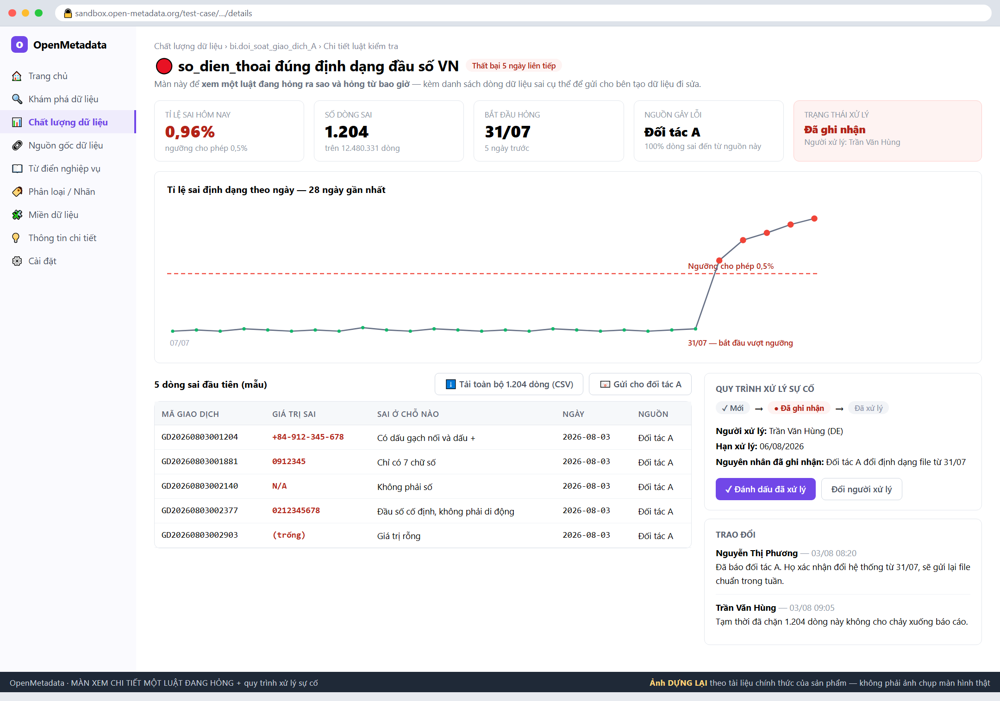

**Màn này để làm gì**

> Để **xem một luật đang hỏng ra sao và hỏng từ bao giờ** — kèm **danh sách dòng dữ liệu sai cụ thể** để gửi cho bên tạo dữ liệu đi sửa.

**Trên màn có gì**

- **5 thẻ tóm tắt**: tỉ lệ sai hôm nay · số dòng sai · ngày bắt đầu hỏng · **nguồn gây lỗi** · trạng thái xử lý
- **Biểu đồ tỉ lệ sai theo ngày** — 28 ngày gần nhất, có **đường ngưỡng cho phép**, chấm đỏ ở các ngày vượt ngưỡng, và ghi rõ **ngày bắt đầu vượt**
- **Bảng 5 dòng sai đầu tiên**, mỗi dòng có: mã giao dịch · giá trị sai · **giải thích sai ở chỗ nào** · ngày · nguồn
- 2 nút hành động: **Tải toàn bộ dòng sai (CSV)** · **Gửi cho đối tác**
- **Khối quy trình xử lý sự cố** — **4 trạng thái: New → Ack → Assigned → Resolved**, kèm người được giao, nguyên nhân đã ghi nhận
- Khi chuyển sang **Resolved**, hệ thống **bắt chọn lý do** từ danh sách cố định: **Duplicates · False Positive · Missing Data · Out of Bounds · Other**, và bắt nhập bình luận
- **Khối trao đổi** — dòng thời gian bình luận giữa các bên

**Người dùng thao tác**

1. Nhìn biểu đồ để biết lỗi bắt đầu từ ngày nào → suy ra nguyên nhân
2. Xem bảng dòng sai để hiểu sai ở chỗ nào
3. Tải CSV hoặc bấm gửi thẳng cho đối tác
4. Ghi nguyên nhân, gán người xử lý, đổi trạng thái
5. Trao đổi ngay trên màn, không phải chuyển sang email

**Kết quả nhận được**

- Đủ bằng chứng để **quy trách nhiệm đúng bên** và yêu cầu sửa
- Sự cố có người chịu trách nhiệm và hạn xử lý — **không trôi**

**Đối chiếu với SQLWF**

| SQLWF hiện tại | Nếu xây thêm thì được gì |
|---|---|
| 🔴 Chưa có màn chi tiết theo luật, chưa lưu **mẫu dòng dữ liệu sai**, chưa có quy trình xử lý sự cố, chưa có trao đổi trên hệ thống | Phần **lưu mẫu dòng sai** là chi tiết nhỏ nhưng quyết định: không có nó thì cảnh báo chỉ nói "có lỗi" mà không nói lỗi ở đâu |

> ⚠️ *Lưu ý về cách OpenMetadata làm việc này: mẫu dòng lỗi **không tự có**. Trong lược đồ test case
> có ba trường `computePassedFailedRowCount`, `failedRowsSample` và `inspectionQuery` — **phải bật
> `computePassedFailedRowCount` (mặc định tắt)** thì hệ thống mới chạy câu truy vấn lấy dòng lỗi và
> lưu mẫu lại. Nếu bê nguyên mô hình này sang SQLWF thì đây là quyết định thiết kế phải cân nhắc:
> bật cho mọi luật thì tốn tài nguyên, tắt hết thì cảnh báo vô dụng.*

#### Màn 9 — Từ điển nghiệp vụ

<b>Xem màn 9</b>

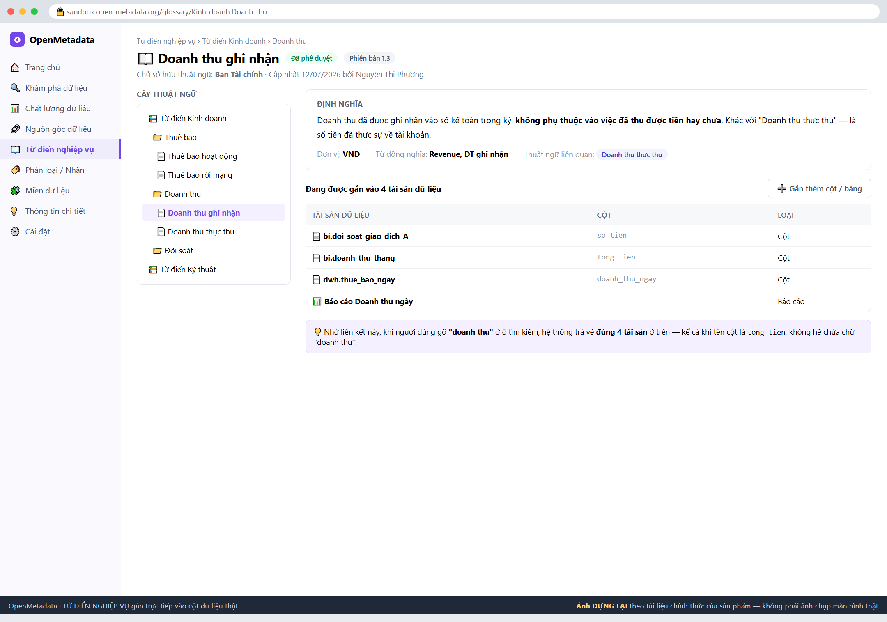

**Màn này để làm gì**

> Để **thống nhất cách hiểu các khái niệm nghiệp vụ trong toàn công ty**, và quan trọng hơn: **nối khái niệm đó với dữ liệu thật**.

**Trên màn có gì**

- **Cây thuật ngữ** bên trái, chia theo từ điển và nhóm
- **Khối định nghĩa** ở giữa — định nghĩa, đơn vị tính, từ đồng nghĩa, thuật ngữ liên quan
- **Nhãn trạng thái** cạnh tên — Đã phê duyệt / Nháp, kèm số phiên bản
- **Bảng "Đang được gắn vào 4 tài sản dữ liệu"** — danh sách bảng và cột cụ thể
- **Ô tím giải thích giá trị**: tìm "doanh thu" ra đúng 4 tài sản, **kể cả khi tên cột là `tong_tien`, không hề chứa chữ "doanh thu"**

**Kết quả nhận được**

- Người dùng tìm bằng **ngôn ngữ nghiệp vụ** vẫn ra đúng cột kỹ thuật
- Hết tình trạng mỗi ban hiểu "doanh thu" một kiểu

**Đối chiếu với SQLWF**

| SQLWF hiện tại | Nếu xây thêm thì được gì |
|---|---|
| 🟢 **Có từ điển nghiệp vụ, thậm chí có phiên bản và góp ý — nhỉnh hơn nhiều tool thị trường.** 🔴 Nhưng **chưa gắn thuật ngữ vào cột thật** → từ điển đang là quyển sách nằm riêng | **Công sức nhỏ, giá trị lớn.** Chỉ cần thêm quan hệ "thuật ngữ ↔ cột" và đưa thuật ngữ vào chỉ mục tìm kiếm. Đây là ví dụ điển hình của việc **nối cái đã có** |

#### Màn 10 — Form thêm thuật ngữ nghiệp vụ

<b>Xem màn 10 — FORM</b>

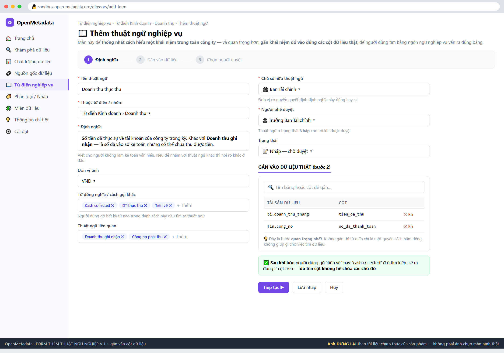

**Màn này để làm gì**

> Để **định nghĩa một khái niệm nghiệp vụ và gắn nó vào đúng các cột dữ liệu thật**.

**Trên màn có gì**

- **Thanh 3 bước**: Định nghĩa → Gắn vào dữ liệu → Chọn người duyệt
- **Cột trái** — nhóm trường định nghĩa
- **Cột phải** — nhóm trường quản trị + **khối gắn vào dữ liệu thật** có ô tìm kiếm bảng/cột và bảng danh sách đã gắn
- **Ô xanh dưới cùng** — nói rõ hiệu quả sau khi lưu

**Các trường phải khai**

| Trường | Bắt buộc | Kiểu nhập | Khai để làm gì |
|---|:---:|---|---|
| Tên thuật ngữ | ✅ | Chữ | Tên chính thức |
| Thuộc từ điển / nhóm | ✅ | Chọn từ cây | Sắp xếp theo lĩnh vực |
| Định nghĩa | ✅ | Đoạn văn | **Viết cho người không làm chuyên môn vẫn hiểu.** Nếu dễ nhầm với thuật ngữ khác thì nói rõ khác ở đâu |
| Đơn vị tính | — | Chọn | Tránh nhầm đơn vị |
| Từ đồng nghĩa / cách gọi khác | — | Nhập nhiều | **Người dùng gõ bất kỳ từ nào trong danh sách này đều tìm ra** |
| Thuật ngữ liên quan | — | Chọn nhiều | Nối các khái niệm dễ nhầm với nhau |
| Chủ sở hữu thuật ngữ | ✅ | Chọn đơn vị | Đơn vị có quyền quyết định định nghĩa đúng hay sai |
| Người phê duyệt | ✅ | Chọn người | Thuật ngữ ở trạng thái **Nháp** cho tới khi được duyệt |
| **Gắn vào cột nào** | — | Chọn nhiều bảng/cột | **Bước quan trọng nhất** — không gắn thì từ điển vô dụng |

**Kết quả nhận được**

- Sau khi lưu, người dùng gõ *"tiền về"* hay *"cash collected"* ở ô tìm kiếm sẽ ra đúng các cột đã gắn — **dù tên cột không hề chứa các chữ đó**

**Đối chiếu với SQLWF**

| SQLWF hiện tại | Nếu xây thêm thì được gì |
|---|---|
| 🟢 Đã có form tạo thuật ngữ, có phiên bản và góp ý. 🔴 Thiếu đúng **một trường**: gắn vào cột nào. Và thiếu việc **đưa thuật ngữ vào chỉ mục tìm kiếm** | Thêm một quan hệ dữ liệu + đưa vào tìm kiếm là toàn bộ giá trị mở ra. **Đây là đề xuất rẻ nhất trong toàn báo cáo** |

---

## B2. DataHub — hợp đồng dữ liệu & phân tích ảnh hưởng

#### Màn 11 — Hợp đồng dữ liệu của một bảng

<b>Xem màn 11</b>

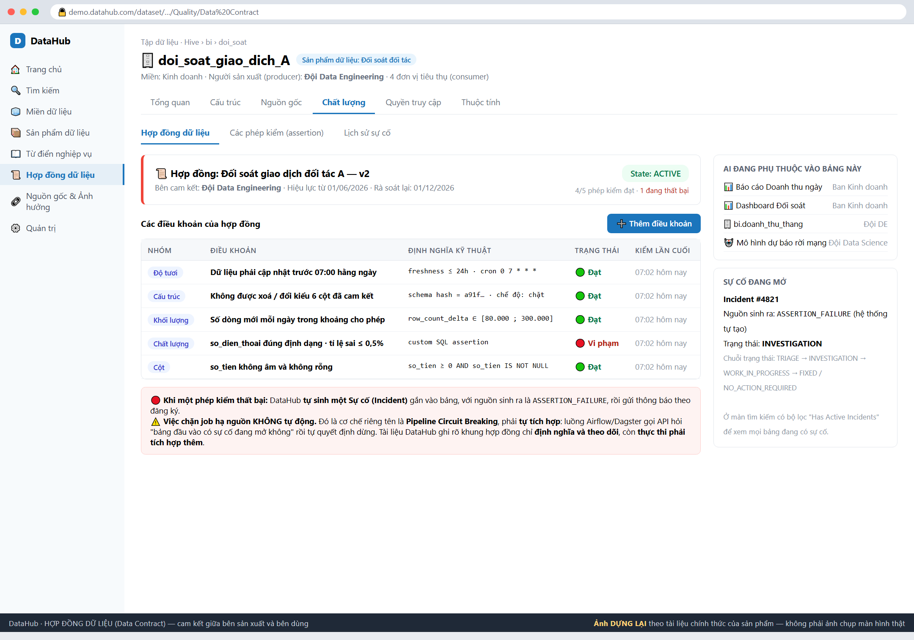

**Màn này để làm gì**

> **Hợp đồng dữ liệu** là văn bản cam kết: bên tạo bảng cam kết với các bên đang dùng bảng về **độ tươi, cấu trúc, khối lượng, chất lượng**. Cam kết này được **máy kiểm tự động mỗi ngày**, không phải văn bản để trong tủ.

**Trên màn có gì**

- **Thẻ hợp đồng** ở trên với **State** của hợp đồng — theo lược đồ dữ liệu của DataHub chỉ có 2 giá trị: **ACTIVE** (đang có hiệu lực) và **PENDING** (chờ triển khai). Hợp đồng vẫn ACTIVE kể cả khi có phép kiểm đang thất bại
- **Bảng các điều khoản** — 5 nhóm: Độ tươi · Cấu trúc · Khối lượng · Chất lượng · Cột. Mỗi điều khoản có định nghĩa kỹ thuật, trạng thái, thời điểm kiểm lần cuối
- **Cột phải** — 2 khối:
  - **Ai đang phụ thuộc vào bảng này** — danh sách báo cáo, bảng, mô hình, kèm đơn vị chủ quản
  - **Sự cố đang mở** — kèm nguồn sinh ra và trạng thái
- **Ô đỏ dưới cùng** — nói rõ hệ thống tự làm gì và **không tự làm gì**

**Kết quả nhận được — cần phân biệt rõ cái tự động và cái không**

| Việc | Có tự động không |
|---|---|
| Sinh **Sự cố (Incident)** gắn vào bảng, với nguồn sinh ra là `ASSERTION_FAILURE` | ✅ Tự động |
| Gửi thông báo theo đăng ký | ✅ Tự động |
| Xem mọi bảng đang có sự cố qua bộ lọc **"Has Active Incidents"** ở màn tìm kiếm | ✅ Có sẵn |
| **Chặn / tạm dừng job hạ nguồn** | 🔴 **KHÔNG tự động** |

> ⚠️ *Đính chính điều tôi từng viết sai: DataHub **không tự dừng job hạ nguồn**. Việc đó là một cơ chế
> riêng tên **Pipeline Circuit Breaking**, và **phải tự tích hợp**: luồng Airflow/Dagster/Prefect gọi API
> hỏi "bảng đầu vào có sự cố đang mở không" rồi tự quyết định dừng. Tài liệu DataHub nói rõ khung hợp đồng
> chỉ **định nghĩa và theo dõi**, còn **thực thi cần tích hợp thêm** vào hạ tầng của mình.*
>
> *Sự cố trong DataHub đi qua 5 trạng thái: **TRIAGE → INVESTIGATION → WORK_IN_PROGRESS → FIXED /
> NO_ACTION_REQUIRED** — khác với chuỗi 4 trạng thái của OpenMetadata.*

**Đối chiếu với SQLWF**

| SQLWF hiện tại | Nếu xây thêm thì được gì |
|---|---|
| 🔴 Chưa có khái niệm này. SQLWF có cảnh báo khi chất lượng lỗi, nhưng: không có danh sách "ai đang dùng bảng này" · không có cam kết ghi thành văn bản · không có sự cố có vòng đời | Giải quyết đúng vấn đề tổ chức hiện nay: **khi bảng lỗi, các đội hạ nguồn vẫn dùng số sai vì không ai báo**. 💡 Riêng phần "chặn job hạ nguồn" thì **SQLWF có lợi thế hơn DataHub**: Pentaho đang điều phối job ngay trong hệ thống, nên **về lý thuyết làm được thật** chứ không phải đi tích hợp ngoài |

#### Màn 12 — Form tạo hợp đồng dữ liệu

<b>Xem màn 12 — FORM</b>

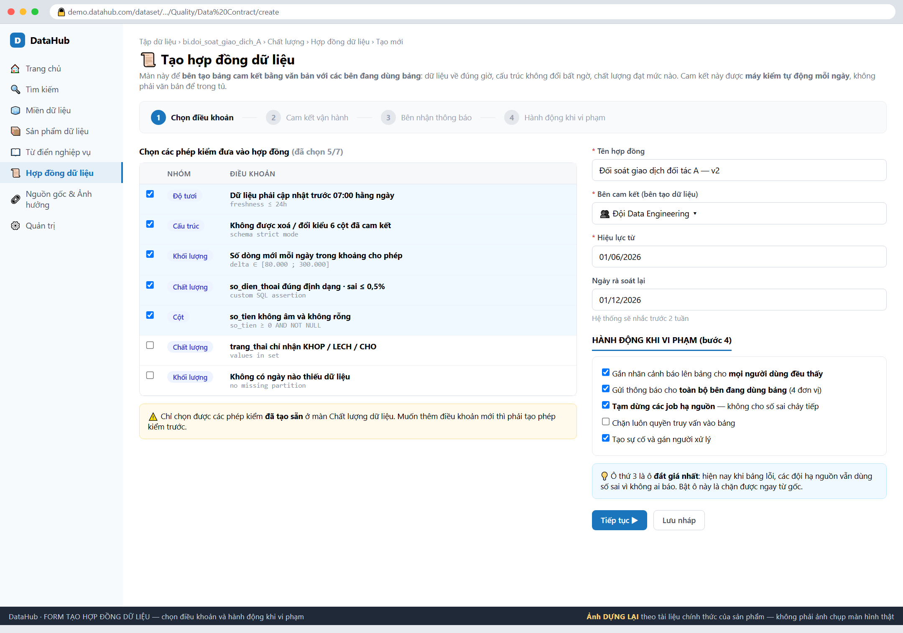

**Màn này để làm gì**

> Để **bên tạo bảng khai cam kết của mình thành các điều khoản kiểm được bằng máy**, và chọn **hệ thống phải làm gì khi cam kết bị vi phạm**.

**Trên màn có gì**

- **Thanh 4 bước**: Chọn điều khoản → Cam kết vận hành → Bên nhận thông báo → Hành động khi vi phạm
- **Bảng chọn điều khoản** — danh sách các phép kiểm **đã tạo sẵn**, tích chọn cái nào đưa vào hợp đồng
- **Ô vàng cảnh báo** — chỉ chọn được phép kiểm đã tạo trước ở màn Chất lượng dữ liệu
- **Cột phải** — các trường thông tin hợp đồng
- **Ô xanh** — ghi chú phân biệt phần DataHub làm sẵn và phần phải tự tích hợp

**Các trường phải khai**

| Trường | Bắt buộc | Kiểu nhập | Ghi chú |
|---|:---:|---|---|
| Các điều khoản đưa vào hợp đồng | ✅ | Tích chọn nhiều | Chỉ chọn được phép kiểm **đã tạo sẵn** |
| Tên hợp đồng | ✅ | Chữ | Nên có số phiên bản |
| Bên cam kết | ✅ | Chọn đơn vị | Đơn vị chịu trách nhiệm giữ cam kết |
| Hiệu lực từ | ✅ | Ngày | |
| Ngày rà soát lại | — | Ngày | Hệ thống nhắc trước 2 tuần |
| State của hợp đồng | ✅ | Chọn 1 | **ACTIVE** (có hiệu lực) hoặc **PENDING** (chờ triển khai) |

**Kết quả nhận được**

- Cam kết được ghi thành văn bản và **kiểm tự động theo lịch của từng phép kiểm**
- Khi có phép kiểm thất bại, hệ thống **tự sinh sự cố** và gửi thông báo

> ⚠️ *Khối "hành động khi vi phạm" gồm 5 ô tích mà tôi từng vẽ ở màn này **không có trong DataHub** —
> đã bỏ. Cái duy nhất DataHub làm sẵn là **sinh sự cố + gửi thông báo**.*

**Đối chiếu với SQLWF**

| SQLWF hiện tại | Nếu xây thêm thì được gì |
|---|---|
| 🔴 Chưa có. Nhưng **hai nguyên liệu đã có**: SQLWF đã có cơ chế cảnh báo đa kênh, và Pentaho đang điều phối job | Việc **chặn job hạ nguồn khi bảng nguồn lỗi** là thứ đáng làm nhất — và ta **ở vị thế tốt hơn DataHub** để làm, vì cả phần kiểm chất lượng lẫn phần điều phối job đều nằm trong cùng một hệ thống |

#### Màn 13 — Phân tích ảnh hưởng

<b>Xem màn 13</b>

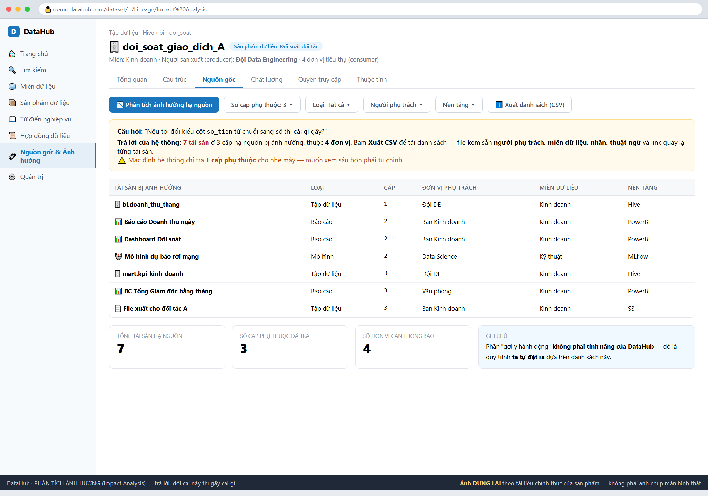

**Màn này để làm gì**

> Để trả lời câu hỏi **"tôi định đổi cột này, vậy phải báo trước cho những ai?"** — bằng một danh sách xuất được ra file.

**Trên màn có gì**

- **Thanh công cụ**: chọn **số cấp phụ thuộc** · lọc theo **loại tài sản · người phụ trách · nền tảng**
- **Nút Export** — tải kết quả ra **CSV**, file kèm sẵn **người phụ trách, miền dữ liệu, nhãn, thuật ngữ** và link quay lại từng tài sản
- **Bảng danh sách tài sản bị ảnh hưởng** — mỗi dòng có: tên · loại · cấp · đơn vị phụ trách · miền dữ liệu · nền tảng
- **4 thẻ tổng kết** ở dưới

> ⚠️ *Cột **"mức rủi ro Cao / Trung bình / Thấp"** ở phiên bản trước là **tôi tự nghĩ ra**, DataHub không có —
> đã bỏ. Các cột hiện tại đều là những chiều dữ liệu mà tài liệu DataHub nêu đích danh.*
>
> *Một chi tiết vận hành quan trọng: **mặc định hệ thống chỉ tra 1 cấp phụ thuộc** để đỡ nặng máy.
> Muốn xem sâu hơn phải tự chỉnh — nếu không sẽ tưởng ít tài sản bị ảnh hưởng hơn thực tế.*

**Người dùng thao tác**

1. Mở màn từ hồ sơ bảng hoặc từ sơ đồ nguồn gốc
2. **Đổi số cấp phụ thuộc** (mặc định chỉ 1 cấp)
3. Lọc theo loại tài sản / người phụ trách / nền tảng nếu cần
4. Bấm **Export** để tải CSV
5. Gửi thông báo cho các đơn vị trong danh sách trước khi thay đổi

**Kết quả nhận được**

- Danh sách tài sản hạ nguồn kèm **người phụ trách** — đủ để biết phải báo cho ai
- *(Việc xếp thứ tự ưu tiên báo cho ai trước là **quy trình ta tự đặt**, không phải tính năng của DataHub)*

**Đối chiếu với SQLWF**

| SQLWF hiện tại | Nếu xây thêm thì được gì |
|---|---|
| 🟠 Có đồ thị nguồn gốc mức bảng ở Neo4j — nhưng chưa có màn phân tích ảnh hưởng, chưa có mức độ sử dụng, chưa xuất được danh sách người cần thông báo | **Chi phí xây màn hình thấp** — dữ liệu đồ thị đã có sẵn, chủ yếu là thêm một màn và một truy vấn nhiều cấp. Giảm hẳn sự cố kiểu *"đổi bảng xong mới biết báo cáo của Ban khác gãy"* |

> *⚠️ **Lưu ý quan trọng:** màn phân tích ảnh hưởng **chỉ chính xác bằng đúng độ đầy đủ của sơ đồ nguồn gốc**. Với 6 lỗ hổng đã nêu ở [màn 5](#màn-5--nguồn-gốc-dữ-liệu-mức-cột), nếu xây màn này trước khi vá độ phủ thì kết quả sẽ **thiếu sót một cách âm thầm** — báo "3 tài sản bị ảnh hưởng" trong khi thực tế là 9. Vì vậy màn này **phải luôn hiển thị kèm chỉ số độ phủ** và câu cảnh báo "danh sách này chưa bao gồm các job chưa bật quét lineage và các đường dữ liệu ra ngoài SQLWF".*

---

## B3. Soda — luật chất lượng viết bằng câu dễ hiểu

#### Màn 14 — Bảng điều khiển luật kiểm tra toàn hệ thống

<b>Xem màn 14</b>

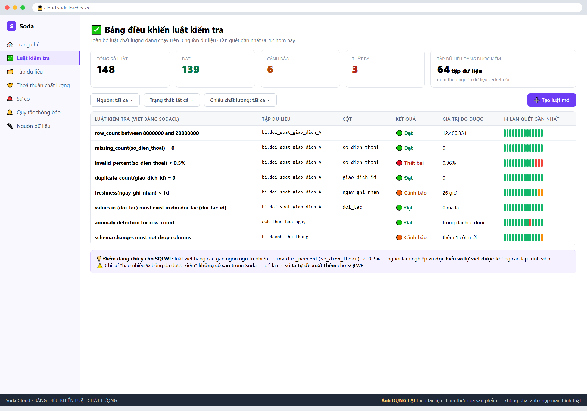

**Màn này để làm gì**

> Để **nhìn toàn cảnh chất lượng dữ liệu của cả hệ thống** — không phải từng bảng một. Đây là màn dành cho người quản lý.

**Trên màn có gì**

- **5 thẻ tổng**: tổng số luật · đạt · cảnh báo · thất bại · số tập dữ liệu đang được kiểm
- **Bộ lọc**: theo nguồn · theo trạng thái · theo chiều chất lượng
- **Bảng danh sách luật**, cột đầu tiên chính là **câu luật viết bằng cú pháp gần ngôn ngữ tự nhiên** — ví dụ `invalid_percent(so_dien_thoai) < 0.5%`
- Mỗi dòng kèm **dải 14 lần quét gần nhất** để nhìn ra xu hướng

**Kết quả nhận được**

- Người quản lý biết ngay: hệ thống có bao nhiêu luật, đang hỏng bao nhiêu, và **bao nhiêu phần trăm dữ liệu đang thực sự được kiểm**

**Đối chiếu với SQLWF**

| SQLWF hiện tại | Nếu xây thêm thì được gì |
|---|---|
| 🔴 Chưa có bảng điều khiển toàn cảnh chất lượng | Một màn nhìn được toàn cảnh: bao nhiêu luật đang chạy, đang hỏng ở đâu, xu hướng ra sao |

> 💡 *Chỉ số **"bao nhiêu % bảng đã được kiểm chất lượng"** là **đề xuất của tôi**, không phải tính năng
> có sẵn của Soda — tôi ghi rõ để không gây hiểu nhầm. Nhưng tôi vẫn giữ đề xuất này, vì đây là **con số
> tốt nhất để báo cáo tiến độ hằng quý với lãnh đạo**: "quý này nâng độ phủ kiểm chất lượng từ 5% lên
> 100% với nhóm bảng quan trọng nhất". SQLWF tính được con số này dễ dàng vì đã có danh sách bảng.*

#### Màn 15 — Form soạn bộ luật cho một bảng

<b>Xem màn 15 — FORM</b>

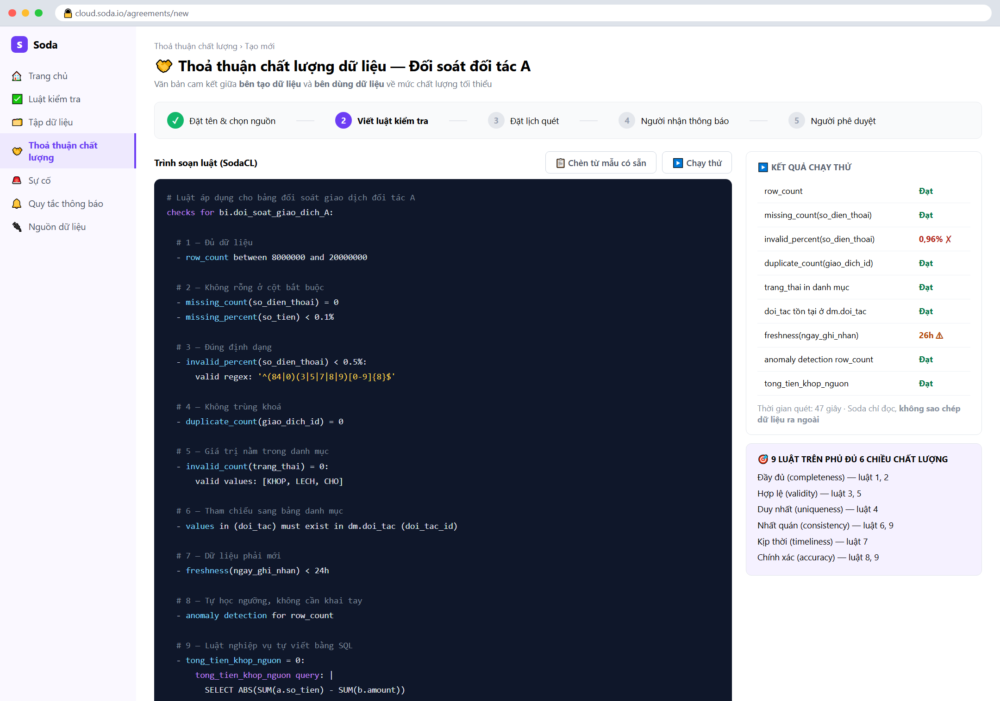

**Màn này để làm gì**

> Để **soạn cả bộ luật cho một bảng trong một lần**, và **chạy thử ngay** để xem luật nào đạt luật nào không trước khi lưu.

**Trên màn có gì**

- **Thanh 5 bước**: Đặt tên & chọn nguồn → **Viết luật kiểm tra** → Đặt lịch quét → Người nhận thông báo → Người phê duyệt
- **Ô soạn luật** ở giữa với 9 luật mẫu, mỗi luật có chú thích tiếng Việt ở trên
- **Khối kết quả chạy thử** ở cột phải — từng luật một, kèm giá trị đo được
- **Khối "9 luật trên phủ đủ 6 chiều chất lượng"** — ánh xạ từng luật vào chiều tương ứng
- 2 nút: **Chèn từ mẫu có sẵn** · **Chạy thử**

**Danh mục 9 loại luật — đây là phần đáng lấy về làm yêu cầu cho SQLWF**

| # | Loại luật | Ví dụ | SQLWF có chưa |
|:---:|---|---|:---:|
| 1 | Đủ số dòng | `row_count between 8000000 and 20000000` | ✅ |
| 2 | Không rỗng (đếm và %) | `missing_count(so_dien_thoai) = 0` | 🟠 chỉ có đếm |
| 3 | **Đúng định dạng (regex)** | `invalid_percent(so_dien_thoai) < 0.5%` | 🔴 |
| 4 | Không trùng khoá | `duplicate_count(giao_dich_id) = 0` | ✅ |
| 5 | **Nằm trong danh mục giá trị** | `valid values: [KHOP, LECH, CHO]` | 🔴 |
| 6 | **Tham chiếu sang bảng danh mục** | `values in (doi_tac) must exist in dm.doi_tac` | 🔴 |
| 7 | Đủ tươi | `freshness(ngay_ghi_nhan) < 24h` | ✅ |
| 8 | **Tự học ngưỡng** ⚠️ | `anomaly detection for row_count` — *cần tối thiểu 4 lần đo mới chạy được; trang tài liệu của loại luật này đang được đánh dấu deprecated, cần kiểm tra lại trước khi dùng* | 🟠 chưa rõ |
| 9 | **Luật nghiệp vụ tự viết bằng SQL** | So tổng tiền với bảng nguồn, lệch ≤ 0,01% | 🟠 có trường `dqExpr` chưa dùng |

**Kết quả nhận được**

- Cả bộ luật của một bảng được khai một lần, có kết quả chạy thử ngay
- Hệ thống chỉ ra bộ luật đã phủ đủ 6 chiều chất lượng hay chưa

**Đối chiếu với SQLWF**

| SQLWF hiện tại | Nếu xây thêm thì được gì |
|---|---|
| 🟠 SQLWF **đã có sẵn khung 6 chiều chất lượng** nhưng **2/6 chiều đang rỗng**. Thiếu các loại luật 3, 5, 6, 9 | Luật **6** (tham chiếu danh mục) và **9** (SQL tự viết) giải quyết trực tiếp **bài toán đối soát mà phòng ta đang làm thủ công**. Riêng luật 9 gần như đã có nền: SQLWF có cỗ máy chạy SQL và trường `dqExpr` chưa dùng |

---

## B4. Nhóm công cụ Data Observability — hệ thống tự học ngưỡng

> ⚠️ **Khác với 4 mục trên, đây KHÔNG phải tên một sản phẩm.**
>
> - **OpenMetadata · DataHub · Soda · Apache Ranger** là **tên sản phẩm cụ thể** — có thể tải về, cài, dùng thử.
> - **"Data Observability"** là **tên một NHÓM sản phẩm**, cùng cấp với "Data Catalog" hay "Data Quality". Các sản phẩm thật thuộc nhóm này: **Monte Carlo · Metaplane · Sifflet · Anomalo · Elementary** (Soda cũng có một phần tính năng này).
> - Vì vậy màn 16 dưới đây là **ảnh minh hoạ khái niệm chung của cả nhóm**, **không dựng theo một sản phẩm cụ thể nào** — khác với 18 màn còn lại là dựng theo tài liệu của đúng sản phẩm đó. Ảnh cũng ghi rõ điều này ở thanh địa chỉ và dải chú thích.
> - Cả nhóm này đều là **sản phẩm thương mại phải trả tiền**, phần lớn phải liên hệ bán hàng mới dùng thử được — nên trong tài liệu này ta **chỉ học ý tưởng**, không đề xuất mua.

#### Màn 16 — Phát hiện bất thường tự động

<b>Xem màn 16</b>

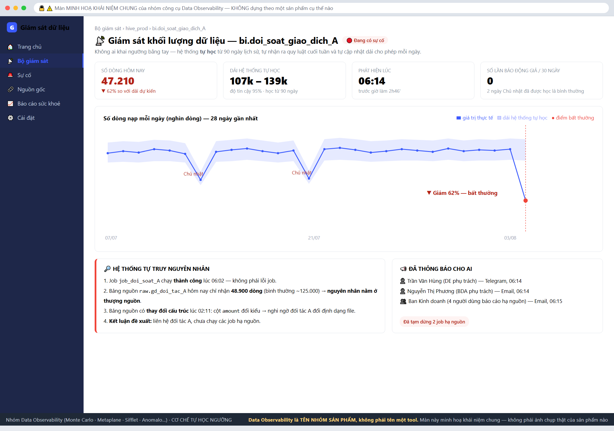

**Màn này để làm gì**

> Khác hẳn màn 14–15: ở đó **người khai luật, máy kiểm**. Ở đây **máy tự học từ lịch sử, tự vẽ dải cho phép, tự báo khi lệch** — **không ai phải khai ngưỡng**.

**Trên màn có gì**

- **4 thẻ tóm tắt**: số dòng hôm nay · **dải hệ thống tự học** · thời điểm phát hiện · **số lần báo động giả trong 30 ngày**
- **Biểu đồ số dòng nạp mỗi ngày** với:
  - Đường xanh là giá trị thực tế
  - **Dải xanh nhạt là ngưỡng hệ thống tự học** — dải này tự co giãn theo ngày
  - Hai ngày Chủ nhật tụt sâu nhưng **không bị báo động** vì hệ thống đã học được quy luật cuối tuần
  - Ngày cuối tụt 62% → chấm đỏ, báo động
- **Khối "Hệ thống tự truy nguyên nhân"** — 4 bước suy luận đi ngược theo nguồn gốc dữ liệu
- **Khối "Đã thông báo cho ai"** — danh sách người đã nhận, kênh nào, lúc mấy giờ

**Chi tiết đắt giá nhất**

> Thẻ **"Số lần báo động giả / 30 ngày: 0"** — đây là chỉ số quyết định người dùng có tin hệ thống hay không. Một hệ thống báo động giả liên tục sẽ bị người dùng tắt thông báo.

**Đối chiếu với SQLWF**

| SQLWF hiện tại | Nếu xây thêm thì được gì |
|---|---|
| 🟠 SQLWF **bắt người dùng khai tay từng ngưỡng min/max**. Có trường `dqComparedCycle` (so sánh theo chu kỳ) nhưng ⚠️ **chưa rõ đã dùng tới đâu — cần hỏi đội phát triển** | Giải quyết đúng câu hỏi của người dùng: *"tôi biết khai ngưỡng bao nhiêu bây giờ?"*. Với 1.284 bảng thì **không ai khai tay nổi** — tự học ngưỡng là cách duy nhất để phủ rộng |

> ⚠️ **Lưu ý khi trình bày:** đây là tính năng **khó nhất** trong báo cáo này — cần lịch sử tối thiểu 90 ngày và mô hình thống kê. **Không đề xuất làm trong năm nay.** Nêu ra để lãnh đạo thấy đích đến.

---

## B5. Apache Ranger — bảo mật mức cột và mức dòng

<b>Cách Ranger tổ chức giao diện — cần nắm trước khi xem 6 màn</b>

Ranger có bố cục khác hẳn 4 công cụ trên:

- **Thanh xanh lá nằm ngang trên cùng**, không có menu dọc bên trái. Trên thanh đó có 4 mục: **Access Manager ▾ · Audit · Security Zone · Settings ▾**
- **Access Manager** xổ ra 3 mục con: **Resource Based Policies · Tag Based Policies · Reports**
- **Service Manager** là trang chủ — bày các ô theo từng loại kho: HDFS · HBASE · HIVE · YARN · KNOX · STORM · SOLR · KAFKA · NIFI · ATLAS…
- Bấm vào một service (ví dụ `jumanji_hive`) mới vào trang chính sách của service đó. Ở đây có **3 tab**: **Access · Masking · Row Level Filter**

> ⚠️ **Điểm tôi từng hiểu sai:** *Masking* và *Row Level Filter* **không phải mục menu riêng** — chúng là **tab bên trong trang chính sách của một service**. Bố cục ở 6 màn dưới đã dựng lại theo đúng giao diện thật.

#### Màn 17 — Danh sách chính sách của một service

<b>Xem màn 17</b>

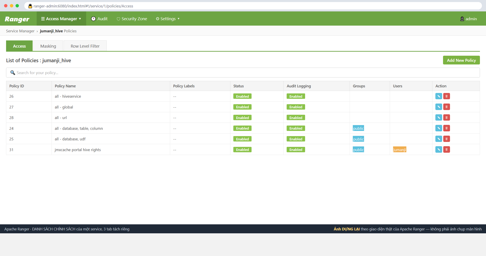

**Màn này để làm gì**

> Xem toàn bộ chính sách đang áp trên một kho dữ liệu, và là **cửa vào để tạo chính sách mới**.

**Trên màn có gì**

- Đường dẫn: `Service Manager › jumanji_hive Policies`
- **3 tab**: Access · Masking · Row Level Filter — mỗi tab là một loại chính sách riêng
- Ô tìm kiếm chính sách
- Nút **Add New Policy** (xanh lá, góc phải)
- Bảng chính sách với các cột: **Policy ID · Policy Name · Policy Labels · Status · Audit Logging · Groups · Users · Action**
- Cột Status và Audit Logging là nhãn **Enabled** màu xanh
- Cột Action có nút sửa (xanh) và xoá (đỏ)

**Đối chiếu với SQLWF**

| SQLWF hiện tại | Nếu xây thêm thì được gì |
|---|---|
| 🟠 Có màn phân quyền nhưng **chỉ một loại quyền** (cho xem / không cho xem cả bảng). Không có khái niệm tách loại chính sách | Việc tách thành 3 loại (truy cập · che dữ liệu · lọc dòng) là **mô hình đáng học** — mỗi loại giải một bài toán khác nhau, không nhét chung một màn |

#### Màn 18 — Tab Masking: form tạo chính sách che dữ liệu

<b>Xem màn 18 — FORM</b>

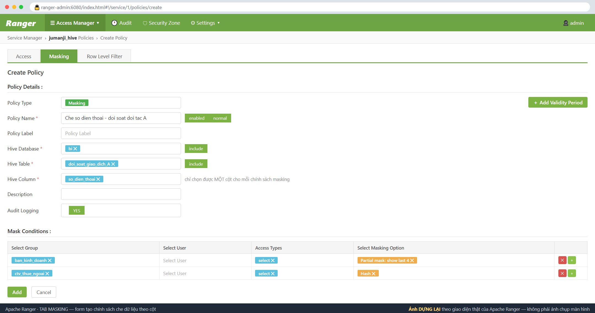

**Màn này để làm gì**

> Để **cùng một bảng nhưng mỗi nhóm người dùng nhìn thấy một kiểu** — người ngoài vẫn dùng được dữ liệu mà không đọc được thông tin cá nhân.

**Các trường trong phần Policy Details**

| Trường | Bắt buộc | Ghi chú |
|---|:---:|---|
| Policy Type | — | Hiện sẵn nhãn **Masking** |
| Policy Name | ✅ | Kèm 2 công tắc: **enabled** và **normal** |
| Policy Label | — | Nhãn để gom nhóm chính sách |
| Hive Database | ✅ | Kèm công tắc **include** |
| Hive Table | ✅ | Kèm công tắc **include** |
| **Hive Column** | ✅ | ⚠️ **Mỗi chính sách masking chỉ áp cho MỘT cột** |
| Description | — | |
| Audit Logging | — | Công tắc **YES / NO** |
| *(nút bên phải)* | — | **Add Validity Period** — đặt thời hạn hiệu lực cho chính sách |

**Phần Mask Conditions** — bảng 4 cột:

| Cột | Nhập gì |
|---|---|
| Select Group | Nhóm áp dụng |
| Select User | Người dùng cụ thể |
| Access Types | Loại thao tác (select…) |
| **Select Masking Option** | Chọn kiểu che |

**Các kiểu che Ranger có sẵn** *(theo wiki chính thức của Apache Ranger)*

| Kiểu che | Kết quả người dùng thấy |
|---|---|
| Redact | Thay chữ bằng `x`, số bằng `n` |
| Partial mask: show last 4 | `xxxxxx5678` |
| Partial mask: show first 4 | `0912xxxxxx` |
| **Hash** | Thay bằng chuỗi băm — ⭐ **vẫn join và đếm được nhưng không đọc được** |
| Nullify | Trả về `NULL` |
| Unmasked | Giữ nguyên giá trị gốc |
| Date: show only year | Chỉ hiện năm, ngày/tháng mặc định 01/01 |
| Custom | Tự viết biểu thức, dùng hàm Hive, với `{col}` là tham chiếu tới cột |

**Cơ chế**

> Ranger **viết lại câu truy vấn trước khi chạy**. Dữ liệu gốc **không bị sửa, không bị sao chép**.

**Đối chiếu với SQLWF**

| SQLWF hiện tại | Nếu xây thêm thì được gì |
|---|---|
| 🔴 Chưa có che dữ liệu, chưa có quyền mức cột. Quyền dừng ở mức bảng: cho xem cả bảng hoặc không cho xem gì | Đây là **rủi ro tuân thủ cao nhất hiện nay**. Kiểu **Hash** đáng làm trước vì vẫn giữ được khả năng đối soát |

> ⚠️ **Điểm phải nêu khi báo cáo:** wiki Apache Ranger ghi rõ người có quyền `ALTER` trên bảng **có thể vượt qua** chính sách che dữ liệu → **phải siết quyền `ALTER` song song**.

#### Màn 19 — Tab Row Level Filter: form lọc theo dòng

<b>Xem màn 19 — FORM</b>

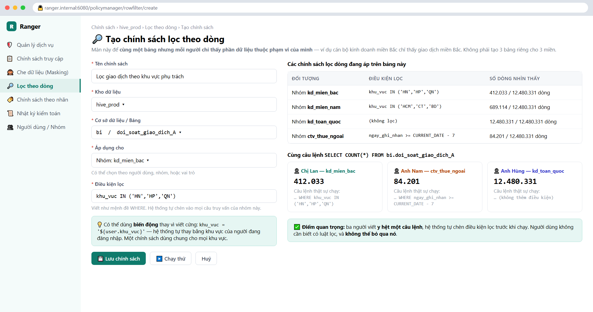

**Màn này để làm gì**

> Để **mỗi người chỉ thấy phần dữ liệu thuộc phạm vi của mình** — cán bộ miền Bắc chỉ thấy giao dịch miền Bắc. **Không phải tạo 3 bảng riêng cho 3 miền.**

**Khác biệt so với form Masking**

- **Không có ô chọn cột** — Row Level Filter chỉ tới **mức bảng**
- Phần điều kiện tên là **Row Filter Conditions**, cột cuối là **Row Level Filter** thay vì Select Masking Option
- Nội dung nhập vào ô đó là **một mệnh đề điều kiện** kiểu `WHERE`, ví dụ `khu_vuc IN ('HN','HP','QN')`

**Đối chiếu với SQLWF**

| SQLWF hiện tại | Nếu xây thêm thì được gì |
|---|---|
| 🔴 Chưa có. Muốn giới hạn phạm vi phải **tạo bảng hoặc view riêng cho từng đơn vị** — tốn dung lượng, khó đồng bộ | Bỏ được toàn bộ bảng/view sao chép theo đơn vị. Một bảng duy nhất, mỗi người thấy phần của mình |

#### Màn 20 — Tag Based Policies: chính sách theo nhãn

<b>Xem màn 20</b>

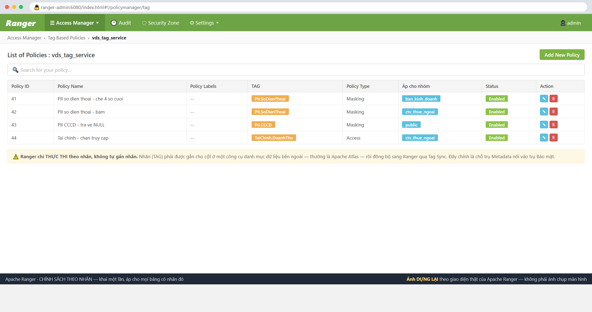

**Màn này để làm gì**

> Thay vì viết chính sách cho **từng cột**, viết chính sách **theo NHÃN**. Mọi cột mang nhãn đó tự động được bảo vệ, kể cả cột mới thêm sau này.

**Trên màn có gì**

- Vào từ **Access Manager › Tag Based Policies**, rồi chọn tag service
- Bảng chính sách có thêm cột **TAG** — đây là điểm khác so với chính sách theo tài nguyên
- Một nhãn (ví dụ `PII.SoDienThoai`) có thể có nhiều chính sách cho nhiều nhóm khác nhau

**Con số so sánh khối lượng công việc**

| Cách làm | Số chính sách phải tạo | Khi thêm bảng mới |
|---|---|---|
| ❌ Khai thủ công từng cột | 43 cột × 3 nhóm = **129 chính sách** | Phải nhớ tạo thêm, ai quên thì dữ liệu lộ mà không ai biết |
| ✅ Khai theo nhãn | 43 cột được gắn nhãn (1 lần) + **5 chính sách** | Chỉ cần gắn nhãn cho cột mới |

> ⚠️ **Đính chính một điểm tôi từng viết sai:** **Ranger KHÔNG tự dò và gắn nhãn dữ liệu nhạy cảm.** Ranger chỉ **thực thi** theo nhãn. Nhãn phải được gắn ở một **công cụ danh mục dữ liệu bên ngoài** — trong hệ sinh thái Hadoop thường là **Apache Atlas** — rồi đồng bộ sang Ranger.
>
> Chính vì vậy đây mới là **mối nối giữa trụ Metadata và trụ Bảo mật**: nhãn gắn ở danh mục ([màn 4](#màn-4--form-gắn-nhãn-phân-loại-cho-cột)), chính sách thực thi ở Ranger. Thiếu một trong hai thì không chạy được.

**Đối chiếu với SQLWF**

| SQLWF hiện tại | Nếu xây thêm thì được gì |
|---|---|
| 🔴 Chưa có nhãn phân loại mức cột · chưa có chính sách theo nhãn | **Đây là tính năng nên chọn nếu chỉ được làm một việc cho trụ Bảo mật** — vừa giải vấn đề quy mô, vừa tạo mối nối giữa 2 trụ. Nhưng **phải làm nhãn cột trước** |

#### Màn 21 — Nhật ký kiểm toán

<b>Xem màn 21</b>

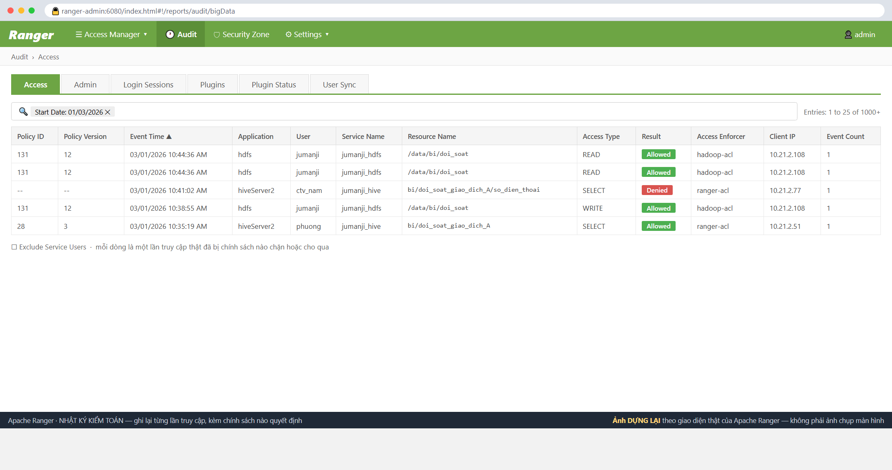

**Màn này để làm gì**

> Ghi lại **từng lần truy cập thật** vào dữ liệu, kèm **chính sách nào đã quyết định** cho qua hay chặn.

**Trên màn có gì**

- **6 tab**: Access · Admin · Login Sessions · Plugins · Plugin Status · User Sync
- Ô lọc theo khoảng thời gian, hiển thị dạng chip
- Ô đếm: `Entries: 1 to 25 of 1000+`
- Bảng với các cột: **Policy ID · Policy Version · Event Time · Application · User · Service Name · Resource Name · Access Type · Result · Access Enforcer · Client IP · Cluster Name · Zone Name · Event Count · Tags**
- Cột **Result** là nhãn màu: **Allowed** (xanh) / **Denied** (đỏ)
- Ô tick **Exclude Service Users** để lọc bỏ các tài khoản hệ thống

**Điểm đáng chú ý**

> Cột **Policy ID** cho biết **chính xác chính sách nào** đã quyết định. Khi có tranh cãi *"vì sao người này xem được / không xem được"*, đây là bằng chứng.

**Đối chiếu với SQLWF**

| SQLWF hiện tại | Nếu xây thêm thì được gì |
|---|---|
| 🟢 **Đã có nhật ký kiểm toán chi tiết** (ghi giá trị cũ → mới, IP) — ngang bằng | 🟠 Nhưng chưa có **phân tích hành vi** từ nhật ký, và chưa gắn được "chính sách nào đã quyết định" vào từng dòng log |

#### Màn 22 — Báo cáo quyền truy cập

<b>Xem màn 22</b>

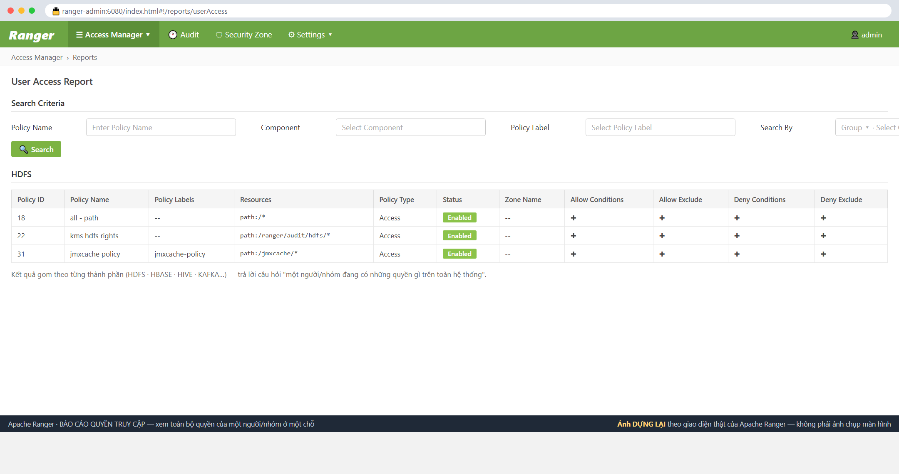

**Màn này để làm gì**

> Trả lời câu hỏi **"một người / một nhóm đang có những quyền gì trên toàn hệ thống"** — không phải mở từng service ra xem.

**Trên màn có gì**

- Vào từ **Access Manager › Reports**
- Khối **Search Criteria** với các ô lọc: Policy Name · Policy Type · Component · Resource · Policy Label · Zone Name · **Search By (Group / User)**
- Kết quả **gom theo từng thành phần**: HDFS · HBASE · HIVE · KAFKA…
- Mỗi bảng có cột: **Policy ID · Policy Name · Policy Labels · Resources · Policy Type · Status · Zone Name · Allow Conditions · Allow Exclude · Deny Conditions · Deny Exclude**
- Có nút **Export** để tải kết quả ra file

**Đối chiếu với SQLWF**

| SQLWF hiện tại | Nếu xây thêm thì được gì |
|---|---|
| 🔴 **Chưa có một nơi duy nhất xem toàn bộ quyền của một người.** Muốn biết anh A có quyền gì phải mở từng màn kiểm tra thủ công | Phục vụ trực tiếp cho **kiểm toán nội bộ** và cho việc rà quyền định kỳ. Dữ liệu quyền **đã có sẵn** trong MariaDB — chủ yếu là thêm một màn tổng hợp và một truy vấn |

---

# PHẦN C — ĐỐI CHIẾU & ĐỀ XUẤT

## 4. Bảng đối chiếu 24 tính năng: thị trường ↔ SQLWF

<b>Trụ Ⓐ — Danh mục & Metadata (12 tính năng)</b>

Ký hiệu: ✅ có và đủ dùng · 🟠 có nhưng yếu / rời rạc · 🔴 chưa có · 🟢 **ta nhỉnh hơn thị trường**

| # | Tính năng thị trường có | Xem ở màn | SQLWF | Giá trị nếu xây |
|:---:|---|:---:|:---:|---|
| 1 | Tìm kiếm theo tên cột / mô tả / thuật ngữ | [1](#màn-1--khám-phá-dữ-liệu) | 🟠 | Người dùng tự tìm được bảng, giảm hỏi qua chat |
| 2 | Bộ lọc nhiều tầng kèm số đếm | [1](#màn-1--khám-phá-dữ-liệu) | 🔴 | Thu hẹp từ 1.284 bảng xuống vài bảng trong 3 cú bấm |
| 3 | Hồ sơ bảng hợp nhất trên 1 màn | [2](#màn-2--hồ-sơ-một-bảng) | 🟠 | Trả lời "bảng này dùng được không" trong vài giây |
| 4 | Trường mức độ quan trọng (Tier) | [3](#màn-3--form-khai-báo-thông-tin-bảng) | 🔴 | Biết bảng nào hỏng thì phải xử lý trước |
| 5 | Trường chu kỳ cập nhật cam kết | [3](#màn-3--form-khai-báo-thông-tin-bảng) | 🔴 | Mở khoá tính năng cảnh báo độ tươi |
| 6 | Nhãn phân loại mức cột | [4](#màn-4--form-gắn-nhãn-phân-loại-cho-cột) | 🔴 | Nền móng cho toàn bộ trụ bảo mật |
| 7 | Bộ dò dữ liệu nhạy cảm tự động | [4](#màn-4--form-gắn-nhãn-phân-loại-cho-cột) | 🔴 | Không phải rà tay 1.284 bảng |
| 8 | Thuật ngữ nghiệp vụ gắn vào cột | [9](#màn-9--từ-điển-nghiệp-vụ), [10](#màn-10--form-thêm-thuật-ngữ-nghiệp-vụ) | 🟠 | Tìm bằng ngôn ngữ nghiệp vụ ra đúng cột kỹ thuật |
| 9 | Nguồn gốc dữ liệu mức **cột** | [5](#màn-5--nguồn-gốc-dữ-liệu-mức-cột) | 🔴 | Trả lời "số này lấy từ đâu" |
| 10 | Nguồn gốc nối tới báo cáo / dashboard | [5](#màn-5--nguồn-gốc-dữ-liệu-mức-cột) | 🔴 | Biết ai thực sự bị ảnh hưởng |
| 11 | Màn phân tích ảnh hưởng + xuất danh sách | [13](#màn-13--phân-tích-ảnh-hưởng) | 🔴 | Hết cảnh "đổi xong mới biết Ban khác gãy" |
| 12 | Độ tươi + mức độ sử dụng hiển thị trên hồ sơ bảng | [1](#màn-1--khám-phá-dữ-liệu), [2](#màn-2--hồ-sơ-một-bảng) | 🔴 | Người dùng tự biết số liệu đã cũ; biết bảng nào đáng đầu tư quản trị |
| — | Từ điển có phiên bản + góp ý | [9](#màn-9--từ-điển-nghiệp-vụ) | 🟢 | **Giữ nguyên — đưa vào báo cáo như điểm mạnh** |

<b>Trụ Ⓑ — Chất lượng & Giám sát (10 tính năng)</b>

| # | Tính năng thị trường có | Xem ở màn | SQLWF | Giá trị nếu xây |
|:---:|---|:---:|:---:|---|
| 13 | Luật đúng định dạng (regex) | [7](#màn-7--form-tạo-luật-kiểm-tra), [15](#màn-15--form-soạn-bộ-luật-cho-một-bảng) | 🔴 | Bắt được số điện thoại / mã sai định dạng |
| 14 | Luật nằm trong danh mục giá trị | [15](#màn-15--form-soạn-bộ-luật-cho-một-bảng) | 🔴 | Bắt được trạng thái, mã lạ |
| 15 | Luật tham chiếu sang bảng danh mục | [15](#màn-15--form-soạn-bộ-luật-cho-một-bảng) | 🔴 | **Đúng bài toán đối soát của phòng ta** |
| 16 | Luật nghiệp vụ tự viết bằng SQL | [15](#màn-15--form-soạn-bộ-luật-cho-một-bảng) | 🟠 | Kiểm mọi quy tắc nghiệp vụ đặc thù |
| 17 | Form tạo luật không cần code + **chạy thử** | [7](#màn-7--form-tạo-luật-kiểm-tra) | 🔴 | Chuyển việc khai luật sang người nghiệp vụ |
| 18 | Lưu mẫu dòng dữ liệu sai | [8](#màn-8--xem-chi-tiết-một-luật-đang-hỏng) | 🔴 | Cảnh báo có bằng chứng, quy trách nhiệm được |
| 19 | Điểm chất lượng + mức độ nghiêm trọng | [6](#màn-6--bảng-theo-dõi-chất-lượng-của-một-bảng) | 🔴 | Một con số để báo cáo và theo dõi theo quý |
| 20 | Chỉ số **độ phủ** kiểm chất lượng | [14](#màn-14--bảng-điều-khiển-luật-kiểm-tra-toàn-hệ-thống) | 🔴 | Con số tốt nhất để báo cáo tiến độ với lãnh đạo |
| 21 | Quy trình xử lý sự cố (Mới → Ghi nhận → Xử lý) | [8](#màn-8--xem-chi-tiết-một-luật-đang-hỏng) | 🔴 | Cảnh báo có người chịu trách nhiệm, không trôi |
| 22 | Hợp đồng dữ liệu + tự dừng job hạ nguồn | [11](#màn-11--hợp-đồng-dữ-liệu-của-một-bảng), [12](#màn-12--form-tạo-hợp-đồng-dữ-liệu) | 🔴 | Hết cảnh dùng số sai vì không ai báo |
| — | Tự học ngưỡng / phát hiện bất thường | [16](#màn-16--phát-hiện-bất-thường-tự-động) | 🟠 | Phủ được 1.284 bảng mà không phải khai tay |
| — | Cảnh báo đa kênh + cấu hình chu kỳ chi tiết | — | 🟢 | **Giữ nguyên — điểm mạnh** |

<b>Trụ Ⓒ — Bảo mật & Quyền (3 tính năng)</b>

| # | Tính năng thị trường có | Xem ở màn | SQLWF | Giá trị nếu xây |
|:---:|---|:---:|:---:|---|
| 23 | Che dữ liệu theo cột (masking) | [17](#màn-18--tab-masking-form-tạo-chính-sách-che-dữ-liệu) | 🔴 | Cho người ngoài dùng dữ liệu mà không lộ thông tin cá nhân |
| 24 | Lọc theo dòng | [18](#màn-19--tab-row-level-filter-form-lọc-theo-dòng) | 🔴 | Bỏ được các bảng / view sao chép theo đơn vị |
| — | Chính sách theo nhãn | [19](#màn-20--tag-based-policies-chính-sách-theo-nhãn) | 🔴 | 5 chính sách thay cho 129; cột mới tự được bảo vệ |
| — | Kiểm soát theo IP cho dữ liệu nhạy cảm | — | 🟢 | **Rất ít tool thị trường có** |
| — | Chặn hàm SQL theo nhãn người dùng | — | 🟢 | **Hiếm tool có** |

---

## 5. Tám đề xuất xây thêm, xếp theo giá trị / công sức

<b>Xem 8 đề xuất kèm căn cứ và mức công sức</b>

> **Nguyên tắc xếp:** ưu tiên việc **"nối cái đã có"** trước việc **"xây cái mới"**. SQLWF đã có rất nhiều nguyên liệu — phần lớn giá trị nằm ở chỗ ghép chúng lại.

| Ưu tiên | Đề xuất | Xem ở màn | Công sức | Vì sao xếp ở vị trí này |
|:---:|---|:---:|:---:|---|
| **1** | **Tìm kiếm & khám phá dữ liệu** — tìm theo tên cột / mô tả / thuật ngữ, bộ lọc nhiều tầng có số đếm | [1](#màn-1--khám-phá-dữ-liệu) | Thấp | Dữ liệu **đã có sẵn** trong hệ thống, chỉ thiếu chỉ mục tìm kiếm và màn hình. Thấy giá trị ngay từ ngày đầu |
| **2** | **Gắn thuật ngữ nghiệp vụ vào cột** + đưa thuật ngữ vào tìm kiếm | [9](#màn-9--từ-điển-nghiệp-vụ), [10](#màn-10--form-thêm-thuật-ngữ-nghiệp-vụ) | Thấp | Từ điển **đã có và còn tốt hơn thị trường** — chỉ thiếu **một quan hệ dữ liệu**. Đây là "nối cái đã có" đúng nghĩa |
| **3** | **Nhãn phân loại mức cột** + bộ dò tự động | [4](#màn-4--form-gắn-nhãn-phân-loại-cho-cột) | Trung bình | Là **nền móng** cho đề xuất 6, 7, 8. Không có nhãn thì không làm được che dữ liệu theo nhãn. Càng để lâu càng tốn công gắn ngược |
| **4** | **Bộ luật chất lượng thật** — regex · danh mục giá trị · tham chiếu bảng · SQL tự viết + form tạo luật có chạy thử + lưu mẫu dòng sai | [6](#màn-6--bảng-theo-dõi-chất-lượng-của-một-bảng), [7](#màn-7--form-tạo-luật-kiểm-tra), [8](#màn-8--xem-chi-tiết-một-luật-đang-hỏng), [15](#màn-15--form-soạn-bộ-luật-cho-một-bảng) | Trung bình–Cao | **Khoảng cách lớn nhất với thị trường.** SQLWF đã có cỗ máy chạy SQL (TaskUtil) và trường `dqExpr` chưa dùng — phần nền đã có |
| **0** | **Bật "Quét lineage" cho toàn bộ job** + đổi mặc định thành bật + hiển thị **chỉ số độ phủ nguồn gốc** | [5](#màn-5--nguồn-gốc-dữ-liệu-mức-cột) | Rất thấp | ⚡ **Làm được ngay trong tuần.** Sơ đồ nguồn gốc hiện có thể đang thiếu nhiều **không phải vì thiếu tính năng mà vì chưa ai bật ô tick**. Không tốn công phát triển, chỉ là rà soát vận hành |
| **5** | **Nguồn gốc mức cột** — thay bộ quét chuỗi `${...}` bằng **bộ phân tích câu SQL thật**, cộng thêm lineage từ cấu hình 4 cửa nạp còn lại | [5](#màn-5--nguồn-gốc-dữ-liệu-mức-cột) | Trung bình | ⭐ **Lợi thế riêng của ta**: SQLWF đã lưu sẵn câu SQL của mọi bước job. Việc này vừa mở ra mức cột, vừa **vá 4 trong 6 lỗ hổng độ phủ** đang có. Ngoài ra TaskUtil chạy Spark, có thể bật chuẩn OpenLineage |
| **6** | **Màn phân tích ảnh hưởng** + xuất danh sách người cần thông báo | [13](#màn-13--phân-tích-ảnh-hưởng) | Thấp–Trung bình | Đồ thị nguồn gốc **đã có sẵn** — chủ yếu thêm một màn và một truy vấn nhiều cấp |
| **7** | **Che dữ liệu theo cột** — làm trước kiểu băm (hash) và hiện 4 ký tự cuối | [17](#màn-18--tab-masking-form-tạo-chính-sách-che-dữ-liệu), [19](#màn-20--tag-based-policies-chính-sách-theo-nhãn) | Cao | Rủi ro tuân thủ cao nhất hiện nay, nhưng đụng vào tầng thực thi truy vấn nên công sức lớn. **Cần đề xuất 3 xong trước** |
| **8** | **Hợp đồng dữ liệu + quy trình xử lý sự cố** | [11](#màn-11--hợp-đồng-dữ-liệu-của-một-bảng), [12](#màn-12--form-tạo-hợp-đồng-dữ-liệu) | Cao | Cần đề xuất 4 và 5 làm nền. Đây là đích đến của cả lộ trình |
| — | *Tự học ngưỡng / phát hiện bất thường* | [16](#màn-16--phát-hiện-bất-thường-tự-động) | Rất cao | ⚠️ **Chưa đề xuất làm.** Nêu để lãnh đạo thấy đích đến — cần tối thiểu 90 ngày lịch sử và mô hình thống kê |

### Ba việc nếu chỉ được chọn ba

1. **Tìm kiếm & khám phá dữ liệu** *(đề xuất 1)* — rẻ nhất, thấy giá trị sớm nhất, tạo đà cho các việc sau.
2. **Bộ luật chất lượng thật** *(đề xuất 4)* — vá đúng khoảng cách lớn nhất với thị trường.
3. **Nhãn phân loại mức cột** *(đề xuất 3)* — nền móng bắt buộc, càng để lâu càng đắt.

---

## P4 — Bảng xác thực: khẳng định nào có trong tài liệu chính thức

<b>Cách đọc bảng xác thực</b>

Mọi khẳng định trong tài liệu này được gắn một trong bốn mức:

| Ký hiệu | Nghĩa |
|:---:|---|
| ✅ | **Có trong tài liệu chính thức** của sản phẩm — kiểm chứng được, link ở [P3](#p3--nguồn-tham-khảo) |
| 🟡 | **Suy ra từ tài liệu.** Tài liệu mô tả tính năng và liệt kê các trường, nhưng không kèm ảnh màn hình → tôi dựng lại bố cục dựa trên các trường đó |
| 🔵 | **Do tôi đề xuất cho SQLWF — KHÔNG phải tính năng của tool.** Giữ lại vì hữu ích, nhưng không được nói với lãnh đạo là "thị trường có sẵn" |
| 🔴 | **Đã gỡ bỏ** khỏi tài liệu vì không tìm được căn cứ |

<b>OpenMetadata — 10 màn</b>

| Khẳng định | Mức | Căn cứ / ghi chú |
|---|:---:|---|
| Bộ lọc màn Explore: Owner · Tag · Tier · Service · Database · Schema · Column | ✅ | Trang *Data discovery* và *Advanced Search* |
| Sắp xếp theo Relevance · Last Updated · Weekly Usage | ✅ | Trang *Data discovery* |
| Tìm kiếm nâng cao dạng query builder, ghép điều kiện AND/OR | ✅ | Trang *Advanced Search* |
| Các tab của hồ sơ bảng: Schema · Activity Feeds & Tasks · Sample Data · Queries · Profiler & Data Quality *(đổi tên thành Data Observability từ 1.8)* · Lineage · Custom Properties | ✅ | Trang *Overview of Data Assets* |
| Khối **Frequently Joined Tables** trên tab Schema | ✅ | Trang *Overview of Data Assets* |
| Lineage mức cột, chỉnh số cấp thượng/hạ nguồn, sửa lineage thủ công bằng trình no-code | ✅ | Trang *Detailed View of the Data Assets* |
| Khái niệm **Tier** để phân loại mức quan trọng | ✅ | Trang *Data discovery* |
| Tên các test definition: `columnValuesToBeNotNull` · `columnValuesToBeUnique` · `columnValuesToMatchRegex` · `columnValuesToBeInSet` · `columnValuesToBeBetween` · `tableRowCountToBeBetween` · `tableCustomSQLQuery` · `tableDataToBeFresh` | ✅ | Trang *Test Definitions Reference* |
| Luồng tạo test: tab Data Observability → nút **Add Test** → chọn Table/Column → Name · Description · Column · Parameters → **Submit** → trang **Schedule for Ingestion** (múi giờ UTC, chọn None để chạy ngoài) | ✅ | Trang *Adding Test Cases to an Entity* |
| Ba trường `computePassedFailedRowCount` · `failedRowsSample` · `inspectionQuery`, mặc định **tắt** | ✅ | Lược đồ *TestCase* |
| Vòng đời sự cố **New → Ack → Assigned → Resolved**; đóng sự cố phải chọn lý do từ **Duplicates · False Positive · Missing Data · Out of Bounds · Other** | ✅ | Trang *Incident Manager — workflow* |
| Severity được **hệ thống tự gán cho sự cố**, người dùng sửa lại được | ✅ | Trang *Incident Manager* |
| Tab Data Quality hiển thị **tổng số test + Success / Aborted / Failed** | ✅ | Trang *Data Quality Tab* |
| Health dashboard ở mức bảng và mức toàn tổ chức | ✅ | Trang *Data Quality* |
| Từ điển nghiệp vụ gắn vào cột, có phiên bản và quy trình duyệt | ✅ | Tài liệu Glossary |
| **Bố cục cụ thể** của từng form (thứ tự trường, chia nhóm, màu sắc) | 🟡 | Tài liệu liệt kê các trường nhưng không kèm ảnh — tôi dựng lại theo các trường được nêu |
| Bộ dò tự động gợi ý nhãn PII kèm **độ tin cậy %** ở màn 4 | 🟡 | OpenMetadata **có** tính năng auto-classification, nhưng con số độ tin cậy và cách bày trên màn là tôi dựng |
| Các trường ở màn 3: Tên hiển thị · Chu kỳ cập nhật · Thời gian lưu trữ · Được phép chia sẻ ra ngoài | 🔵 | Đây là **các trường tôi đề xuất cho SQLWF**, gộp vào một form cho dễ hình dung. OpenMetadata có Custom Properties nhưng không có sẵn đúng bộ trường này |
| ~~Điểm chất lượng dạng số 0–100 (kiểu "88/100")~~ | 🔴 | **Đã gỡ.** Tài liệu chỉ có health dashboard và bộ đếm Success/Aborted/Failed |
| ~~Nút "chạy thử / xem trước kết quả" trong form tạo test~~ | 🔴 | **Đã gỡ.** Không có bước này trong luồng tài liệu mô tả |
| ~~Trường "mức độ nghiêm trọng" trong form tạo test~~ | 🔴 | **Đã gỡ.** Severity nằm ở sự cố, không ở form tạo test |
| ~~Tên test `tableFreshnessCheck`~~ | 🔴 | **Đã sửa** thành `tableDataToBeFresh` |

<b>DataHub — 3 màn</b>

| Khẳng định | Mức | Căn cứ / ghi chú |
|---|:---:|---|
| Tạo hợp đồng từ trang tập dữ liệu, vào tab **Quality › Data Contracts**, bấm Create rồi chọn các assertion | ✅ | Trang *Data Contracts Monitoring* |
| Phải tạo assertion **trước**, hợp đồng chỉ gom các assertion đã có | ✅ | Trang *Data Contracts Monitoring* |
| 5 nhóm assertion: Freshness · Volume · Schema · Column · Custom (SQL) | ✅ | Trang *Assertions* |
| Hợp đồng có 2 trạng thái **ACTIVE / PENDING** | ✅ | Lược đồ *Data Contract* |
| Assertion thất bại → hệ thống **tự sinh Incident** với nguồn `ASSERTION_FAILURE` | ✅ | Trang *Incidents* |
| Vòng đời sự cố: **TRIAGE → INVESTIGATION → WORK_IN_PROGRESS → FIXED / NO_ACTION_REQUIRED** | ✅ | Trang *Incidents* |
| Bộ lọc **"Has Active Incidents"** ở màn tìm kiếm | ✅ | Trang *Incidents* |
| **Pipeline Circuit Breaking phải tự tích hợp** qua API vào Airflow/Dagster/Prefect — không tự động | ✅ | Trang *Incidents* — mục Circuit Breaking |
| Impact Analysis: xuất **CSV** kèm ownership, domain, tag, glossary term và link quay lại tài sản | ✅ | Trang *Impact Analysis* |
| **Mặc định chỉ tra 1 cấp phụ thuộc** để giảm tải hệ thống | ✅ | Trang *Impact Analysis* |
| Lọc kết quả theo Entity Type · Platform · Owner | ✅ | Trang *Impact Analysis* |
| Bố cục cụ thể của form tạo hợp đồng | 🟡 | Tài liệu mô tả các bước và thành phần, không kèm ảnh |
| ~~Cột "mức rủi ro Cao / Trung bình / Thấp" trong kết quả Impact Analysis~~ | 🔴 | **Đã gỡ.** Không có trong tài liệu |
| ~~Thẻ "tỉ lệ tuân thủ hợp đồng 30 ngày"~~ | 🔴 | **Đã gỡ.** Không có trong tài liệu |
| ~~5 ô tích "hành động khi vi phạm" (gắn nhãn, thông báo, tạm dừng job, chặn truy vấn, tạo sự cố)~~ | 🔴 | **Đã gỡ.** DataHub chỉ tự sinh sự cố và gửi thông báo |
| ~~"Hệ thống tự tạm dừng job hạ nguồn khi hợp đồng vi phạm"~~ | 🔴 | **Đã sửa.** Đó là Circuit Breaking, phải tự tích hợp |

<b>Soda — 2 màn</b>

| Khẳng định | Mức | Căn cứ / ghi chú |
|---|:---:|---|
| Cú pháp `row_count between … and …` · `missing_count(col) = 0` · `missing_percent(col) < …` · `duplicate_count(col) = 0` · `invalid_percent(col) < …` với `valid regex:` · `valid values: [...]` | ✅ | Trang *SodaCL metrics and checks* |
| Reference check: `values in (col) must exist in <bảng khác> (col)` | ✅ | Trang *Reference checks* |
| Freshness check: `freshness(col) < 2d 12h` | ✅ | Trang *SodaCL metrics and checks* |
| Anomaly detection: `anomaly detection for row_count` | ✅ | Trang *Anomaly Detection Checks* |
| ⚠️ Anomaly detection **cần tối thiểu 4 lần đo**; trang tài liệu của loại luật này đang **được đánh dấu deprecated** | ✅ | Trang *Anomaly detection checks (deprecated)* — **cần kiểm tra lại trước khi dùng** |
| Tham số `collect failed rows` để thu mẫu dòng lỗi | ✅ | Trang *Reference checks* |
| Soda **chỉ đọc, không sao chép dữ liệu ra ngoài** | ✅ | Trang *Soda architecture* |
| Luồng tạo Agreement qua các bước có hướng dẫn | ✅ | Tài liệu Agreements |
| Bố cục cụ thể của bảng điều khiển và trình soạn luật | 🟡 | Tài liệu mô tả thành phần, không kèm ảnh |
| Ánh xạ 9 luật vào 6 chiều chất lượng | 🔵 | **Tôi tự ánh xạ** để nối với khung 6 chiều sẵn có của SQLWF |
| Chỉ số **"bao nhiêu % bảng đã được kiểm chất lượng"** | 🔵 | **Tôi tự đề xuất** — Soda không có sẵn. Vẫn giữ vì là con số tốt để báo cáo tiến độ |

<b>Apache Ranger — 6 màn</b>

| Khẳng định | Mức | Căn cứ / ghi chú |
|---|:---:|---|
| Bố cục: thanh xanh ngang trên cùng với **Access Manager ▾ · Audit · Security Zone · Settings ▾** | ✅ | **Đã đối chiếu với ảnh chụp giao diện thật** |
| Access Manager xổ ra: **Resource Based Policies · Tag Based Policies · Reports** | ✅ | Ảnh chụp thật |
| Service Manager bày ô theo loại kho: HDFS · HBASE · HIVE · YARN · KNOX · STORM · SOLR · KAFKA · NIFI · ATLAS | ✅ | Ảnh chụp thật |
| Trang policy của service có **3 tab: Access · Masking · Row Level Filter** | ✅ | Ảnh chụp thật |
| Cột bảng chính sách: Policy ID · Policy Name · Policy Labels · Status · Audit Logging · Groups · Users · Action | ✅ | Ảnh chụp thật |
| Form Create Policy: Policy Type · Policy Name (+ enabled/normal) · Policy Label · database · table · column (+ include) · Description · Audit Logging · nút **Add Validity Period** | ✅ | Ảnh chụp thật |
| Các khối điều kiện: Allow · **Exclude from Allow** · Deny · **Exclude from Deny**, mỗi khối có Select Group · Select User · Permissions · Delegate Admin | ✅ | Ảnh chụp thật |
| 8 kiểu che: Redact · Partial mask show last 4 · Partial mask show first 4 · Hash · Nullify · Unmasked · Date show only year · Custom (dùng `{col}`) | ✅ | Wiki Apache Ranger |
| Ranger **viết lại câu truy vấn**, không sửa dữ liệu gốc | ✅ | Wiki Apache Ranger |
| Người có quyền `ALTER` **có thể vượt qua** chính sách masking và row filter | ✅ | Wiki Apache Ranger |
| Tab Audit có 6 tab con: Access · Admin · Login Sessions · Plugins · Plugin Status · User Sync; bảng có cột Policy ID · Event Time · Application · User · Resource · Access Type · **Result (Allowed/Denied)** · Access Enforcer · Client IP · Zone Name · Tags | ✅ | Ảnh chụp thật |
| Reports có khối Search Criteria và kết quả gom theo từng thành phần | ✅ | Ảnh chụp thật |
| Chính sách theo nhãn (Tag Based Policies) | ✅ | Wiki Apache Ranger — *Tag-Based Policy Management* |
| **Ranger KHÔNG tự dò và gắn nhãn**; nhãn phải gắn ở công cụ danh mục bên ngoài (thường là Apache Atlas) rồi đồng bộ sang | ✅ | Mô hình chính sách của Ranger |
| Con số so sánh **129 chính sách thủ công vs 5 chính sách theo nhãn** | 🔵 | **Tôi tự tính** dựa trên giả định 43 cột × 3 nhóm — là ví dụ minh hoạ, không phải số liệu của Ranger |
| ~~Bộ dò tự động gợi ý nhãn PII nằm trong Ranger~~ | 🔴 | **Đã sửa.** Đó là chức năng của công cụ danh mục (Atlas / OpenMetadata), không phải Ranger |
| ~~Bố cục menu dọc bên trái~~ | 🔴 | **Đã dựng lại toàn bộ.** Ranger dùng thanh ngang trên cùng |

<b>Nhóm Data Observability — 1 màn</b>

| Khẳng định | Mức | Căn cứ / ghi chú |
|---|:---:|---|
| "Data Observability" là **tên một nhóm sản phẩm**, không phải tên tool | ✅ | Nhiều bài phân tích thị trường 2026 |
| Các sản phẩm thật trong nhóm: Monte Carlo · Metaplane · Sifflet · Anomalo · Elementary | ✅ | Các bài so sánh thị trường |
| 5 chiều giám sát: freshness · volume · schema · distribution · lineage | ✅ | Các bài so sánh thị trường |
| Cơ chế **tự học ngưỡng từ lịch sử** thay cho khai tay | ✅ | Tài liệu Monte Carlo, Metaplane |
| **Toàn bộ bố cục màn 16** | 🟡 | **Minh hoạ khái niệm chung của cả nhóm**, không dựng theo sản phẩm nào |
| Chỉ số "số lần báo động giả / 30 ngày = 0" và khối "tự truy nguyên nhân 4 bước" | 🔵 | **Tôi tự dựng** để minh hoạ ý tưởng — không phải màn hình có thật của sản phẩm nào |
| ⚠️ Chủ sở hữu hiện tại của **Metaplane** | ❓ | Các nguồn **mâu thuẫn nhau** (dbt Labs / Datadog) — **cần xác minh trực tiếp** nếu định đánh giá sản phẩm này |
| ~~Logo "Observe" và địa chỉ `app.observe-demo.io`~~ | 🔴 | **Đã gỡ.** Tên này tôi bịa ra, và còn trùng tên một công ty có thật ở mảng khác |

<b>Tổng kết đợt rà soát</b>

| Nhóm | Số lượng |
|---|:---:|
| ✅ Có căn cứ trong tài liệu chính thức | **48 khẳng định** |
| 🟡 Suy ra từ tài liệu *(bố cục màn hình do tôi dựng theo các trường được nêu)* | 6 |
| 🔵 Do tôi đề xuất cho SQLWF, không phải tính năng của tool | 5 |
| 🔴 **Đã gỡ bỏ / sửa lại vì không có căn cứ** | **11** |
| ❓ Nguồn mâu thuẫn, cần xác minh trực tiếp | 1 |

**11 chỗ đã sửa:**

1. Logo và tên miền "Observe" — bịa tên sản phẩm
2. Toàn bộ bố cục Apache Ranger — dựng sai kiểu menu dọc
3. Bộ dò nhãn PII tự động gán cho Ranger — thực ra là của Atlas / OpenMetadata
4. Điểm chất lượng 0–100 của OpenMetadata — không tồn tại
5. Nút "chạy thử" trong form tạo test của OpenMetadata — không có
6. Trường "mức độ nghiêm trọng" trong form tạo test — nằm ở sự cố, không ở form
7. Tên test `tableFreshnessCheck` — tên đúng là `tableDataToBeFresh`
8. Vòng đời sự cố OpenMetadata 3 trạng thái — thực tế **4 trạng thái**
9. DataHub "tự tạm dừng job hạ nguồn" — thực tế phải **tự tích hợp** Circuit Breaking
10. Cột "mức rủi ro" và thẻ "tỉ lệ tuân thủ 30 ngày" của DataHub — không tồn tại
11. Chỉ số "độ phủ kiểm chất lượng" của Soda — là **đề xuất của tôi**, đã ghi rõ

---

## P3 — Nguồn tham khảo

<b>Xem danh sách nguồn</b>

**OpenMetadata**
- [Adding test suites through the UI](https://docs.open-metadata.org/latest/how-to-guides/data-quality-observability/quality/adding-test-suites) — luồng tạo luật chất lượng qua giao diện
- [Data Quality — Quality Management Guide](https://docs.open-metadata.org/v1.12.x/how-to-guides/data-quality-observability/quality) — khung chất lượng, trạng thái sự cố Mới / Đã ghi nhận / Đã xử lý
- [Overview of Data Assets — các tab của hồ sơ bảng](https://docs.open-metadata.org/v1.12.x/how-to-guides/guide-for-data-users/data-asset-tabs)
- [Detailed View of the Data Assets](https://docs.open-metadata.org/v1.8.x/how-to-guides/data-discovery/details) — nguồn gốc mức cột, cấu hình số cấp
- [Data discovery — bộ lọc màn Explore](https://docs.open-metadata.org/v1.3.x/how-to-guides/data-discovery/discover) · [Advanced Search](https://docs.open-metadata.org/v1.12.x/how-to-guides/data-discovery/advanced)
- [GitHub OpenMetadata](https://github.com/open-metadata/OpenMetadata) · [Sandbox Quickstart](https://docs.open-metadata.org/v1.12.x/quick-start/sandbox)

**DataHub**
- [Data Contracts Monitoring](https://docs.datahub.com/docs/managed-datahub/observe/data-contract) — tạo hợp đồng qua tab Quality › Data Contracts
- [Assertions](https://docs.datahub.com/docs/managed-datahub/observe/assertions) — 5 nhóm phép kiểm: cấu trúc, độ tươi, khối lượng, cột, SQL tự viết
- [Data Contract metamodel](https://docs.datahub.com/docs/generated/metamodel/entities/datacontract)
- [About DataHub Lineage](https://docs.datahub.com/docs/features/feature-guides/lineage) — Lineage Explorer và Impact Analysis
- [What is DataHub](https://docs.datahub.com/docs/features)

**Soda**
- [Write SodaCL checks](https://docs.soda.io/soda-documentation/soda-v3/soda-cl-overview) · [SodaCL tutorial](https://docs.soda.io/soda-documentation/soda-v3/soda-cl-overview/quick-start-sodacl)
- [SodaCL metrics and checks](https://docs.soda.io/soda-documentation/soda-v3/sodacl-reference/metrics-and-checks) — danh mục đầy đủ các loại luật
- [Soda architecture](https://docs.soda.io/soda-documentation/soda-v3/learning-resources/soda-cloud-architecture) — cơ chế không sao chép dữ liệu ra ngoài

**Data Observability**
- [Data Observability in 2026: Monte Carlo vs Great Expectations vs Soda](https://medium.com/@aidelearning/data-observability-in-2026-monte-carlo-vs-great-expectations-vs-soda-a-data-engineers-honest-7c8cab1b68f1)
- [The 2026 Data Quality and Data Observability Commercial Software Landscape](https://datakitchen.io/the-2026-data-quality-and-data-observability-commercial-software-landscape/)
- [Data Observability Tools: Key Features & Top Solutions in 2026](https://dagster.io/learn/data-observability-tools)
- ⚠️ Các nguồn **mâu thuẫn nhau về chủ sở hữu hiện tại của Metaplane** (một số nói dbt Labs, một số nói Datadog) — cần xác minh trực tiếp nếu định đánh giá sản phẩm này

**Apache Ranger**
- [Row-level filtering and column-masking using Apache Ranger policies in Apache Hive](https://cwiki.apache.org/confluence/display/RANGER/Row-level+filtering+and+column-masking+using+Apache+Ranger+policies+in+Apache+Hive) — có ảnh chụp thật từng bước tạo chính sách
- [Apache Ranger Policy Model](https://ranger.apache.org/blogs/policy_model.html) — mô hình chính sách theo nhãn
- [Row-level filtering and column masking in Hive — Cloudera](https://docs.cloudera.com/runtime/7.3.1/security-ranger-authorization/topics/security-ranger-row-level-filtering-and-column-masking-in-hive.html)

**dbt** *(tham khảo cho hướng gắn kiểm chất lượng vào quy trình biến đổi)*
- [View documentation — dbt](https://docs.getdbt.com/docs/build/view-documentation) · [Discover data with Catalog](https://docs.getdbt.com/docs/explore/explore-projects)

---

**Hết tài liệu.**
