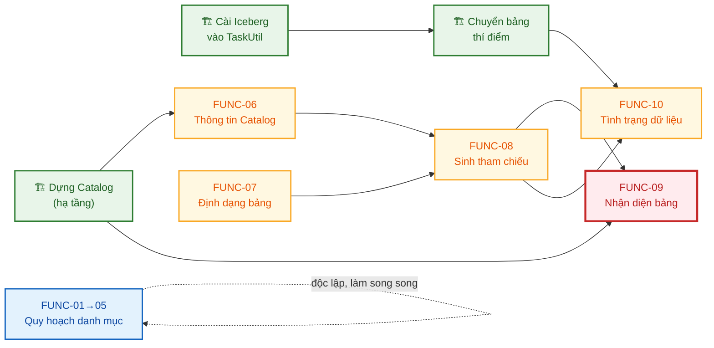
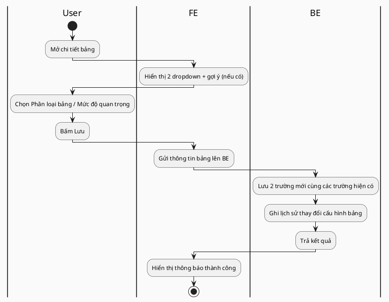
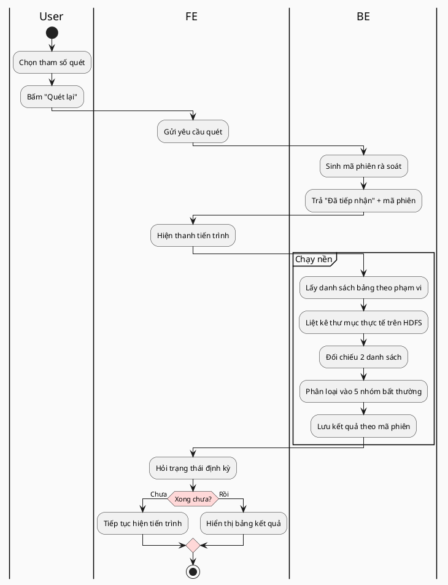
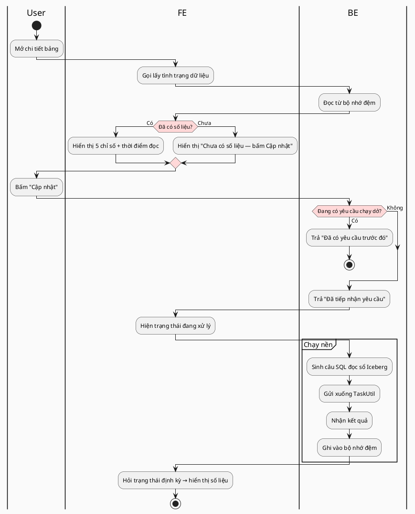

# SOFTWARE REQUIREMENTS SPECIFICATION (SRS)
# Module: Data Management — Giai đoạn 1 "Dọn nền" (FR-DM1)

---

> **Phiên bản:** 1.0 — **Ngày tạo:** 03/08/2026
> **Người tạo:** Khôi (IT BA)
> **Hệ thống:** SQL Workflow (SQLWF)
> **Tài liệu nền:** [Đề xuất Kiến trúc Data Management](./SQLWF-De-xuat-Kien-truc-Data-Management.md) · [Chi tiết tính năng theo giai đoạn](./SQLWF-Chi-tiet-tinh-nang-theo-giai-doan.md) · [Ví dụ chuyển đổi bảng sang Iceberg](./SQLWF-Vi-du-chuyen-doi-bang-sang-Iceberg.md)
> **SRS liên quan:** [SRS Metadata bảng v3.8](../metadata-bang/SRS_metadata_bang.md)

**BẢNG GHI NHẬN THAY ĐỔI**

\*A – Tạo mới, M – Sửa đổi, D – Xóa bỏ

| Ngày thay đổi | Vị trí thay đổi | A\* M, D | Nguồn gốc | Phiên bản cũ | Mô tả thay đổi | Phiên bản mới |
|---|---|---|---|---|---|---|
| 03/08/2026 | Toàn bộ | A | Đề xuất Kiến trúc DM + khảo sát mã nguồn `sqlwf-be` / `sqlwf-fe` | — | Tạo mới SRS Giai đoạn 1 (FUNC-01 → FUNC-10) | 1.0 |

---

## 🔶 QUY ƯỚC ĐÁNH DẤU

- `🆕` chức năng hoàn toàn mới · `🔧` mở rộng chức năng đã có · `⚙️` chỉ backend, không có giao diện
- `⚠️ NEED INFO [NI-xx]` — điểm chưa chốt, xem [§11](#11-need-info--gap-analysis)
- **Tên control** trong tài liệu là **nhãn hiển thị trên UI**, không phải tên biến trong mã nguồn.
- Nguồn: `[Code]` xác minh trên mã nguồn `sqlwf-be` / `sqlwf-fe` · `[KT]` tài liệu Đề xuất Kiến trúc · `[BA]` đề xuất của BA cần chốt

---

# MỤC LỤC

- [1. Tổng quan](#1-tổng-quan)
- [2. Thuật ngữ & Viết tắt](#2-thuật-ngữ--viết-tắt)
- [3. Phạm vi & phân bổ hệ thống](#3-phạm-vi--phân-bổ-hệ-thống)
- [4. Mô hình dữ liệu](#4-mô-hình-dữ-liệu)
- [5. Danh sách chức năng](#5-danh-sách-chức-năng)
- [6. Mô tả chi tiết chức năng](#6-mô-tả-chi-tiết-chức-năng)
- [7. Quy tắc nghiệp vụ & Kiểm tra hợp lệ](#7-quy-tắc-nghiệp-vụ--kiểm-tra-hợp-lệ)
- [8. Phân rã công việc theo vai trò](#8-phân-rã-công-việc-theo-vai-trò)
- [9. Kịch bản kiểm thử trọng yếu](#9-kịch-bản-kiểm-thử-trọng-yếu)
- [10. Phạm vi Giai đoạn 2 & 3](#10-phạm-vi-giai-đoạn-2--3)
- [11. Need Info & Gap Analysis](#11-need-info--gap-analysis)
- [12. Lịch sử thay đổi](#12-lịch-sử-thay-đổi)

---
---

# 1. Tổng quan

| Thuộc tính | Mô tả |
|---|---|
| **Mô tả chung / Mục đích** | Bổ sung nền tảng quản trị dữ liệu cho SQLWF: (1) khai báo & rà soát **phân loại bảng** phục vụ quy hoạch ~11.000 bảng, (2) đưa **định dạng bảng** ra giao diện và cho phép hệ thống làm việc với bảng Iceberg, (3) hiển thị **tình trạng dữ liệu** đọc từ tầng lưu trữ. Gồm 10 chức năng (FUNC-01 → FUNC-10). |
| **Loại chức năng** | `Webapp` (giao diện nội bộ) + `Backend` (2 chức năng không có giao diện) |
| **Đối tượng sử dụng** | • **BDA** — khai báo phân loại, mức độ quan trọng, rà soát danh mục<br>• **DE** — khai báo định dạng bảng, xử lý kết quả rà soát<br>• **BA / quản trị dữ liệu** — theo dõi tiến độ quy hoạch |
| **Kênh áp dụng** | Web SQL Workflow (nội bộ). Không có Mobile App. |
| **Đường dẫn chức năng** | Home > **Quản lý bảng** (danh sách + chi tiết bảng) · Home > **Quản lý bảng** > **Rà soát danh mục bảng** *(menu mới)* |
| **Pre-condition** | • Người dùng đã đăng nhập<br>• Được phân quyền truy cập menu Quản lý bảng (giữ nguyên nghiệp vụ cũ)<br>• Với FUNC-06/07/10: hạ tầng đã dựng Catalog và nạp thư viện Iceberg vào TaskUtil |
| **Post-condition** | • Mỗi bảng có phân loại + mức độ quan trọng, làm đầu vào cho Data Quality ở GĐ 2<br>• Bảng Iceberg truy vấn được qua mọi kênh hiện có của SQLWF<br>• Người dùng xem được tình trạng dữ liệu của bảng ngay trên màn chi tiết |
| **Ngoài phạm vi** | • Engine Data Quality (đứng riêng, GĐ 2)<br>• Dựng Catalog và cài Iceberg (đội hạ tầng)<br>• Chuyển đổi dữ liệu bảng sang Iceberg (đội hạ tầng/DE, chạy script) |

---

# 2. Thuật ngữ & Viết tắt

| Thuật ngữ | Mô tả |
|---|---|
| **BDA** | Business Data Analyst — người khai báo & tra cứu metadata |
| **DE** | Data Engineer — người vận hành job sinh ra bảng |
| **Catalog** | Danh mục bảng dùng chung — một nơi duy nhất định danh bảng bằng tên có cấu trúc `{namespace}.{tên bảng}` thay vì bằng đường dẫn thư mục |
| **Namespace** | Không gian tên trong Catalog, tương đương khái niệm "database" |
| **Iceberg** | Định dạng bảng có quản lý — ghi thêm một lớp "sổ" (thư mục `metadata/`) bên cạnh file dữ liệu |
| **Snapshot** | "Ảnh chụp" trạng thái bảng tại một thời điểm ghi. Mỗi lần ghi dữ liệu sinh 1 snapshot |
| **Tham chiếu bảng** | Chuỗi mà SQLWF sinh ra để thay thế bí danh `${TÊN_BẢNG}` trước khi gửi câu SQL xuống TaskUtil |
| **TaskUtil** | Dịch vụ chạy SQL thật (nền Spark) — SQLWF gửi câu lệnh sang đây |
| **Bảng "ma"** | Có khai báo trong SQLWF nhưng không tìm thấy thư mục dữ liệu trên HDFS |
| **Dữ liệu "mồ côi"** | Có thư mục dữ liệu trên HDFS nhưng không có bảng nào khai báo |
| **Bảng chết** | Có khai báo, có thư mục, nhưng không có dữ liệu mới quá N ngày |

---

# 3. Phạm vi & phân bổ hệ thống

## 3.1 Xây ở đâu

| Hạng mục | Hệ thống | Đội thực hiện |
|---|---|---|
| **FUNC-01 → FUNC-10** (toàn bộ SRS này) | 🔵 **SQLWF** | Team tool SQLWF |
| Dựng Catalog | 🏗️ Hạ tầng dùng chung | Đội hạ tầng |
| Nạp thư viện Iceberg vào TaskUtil | 🏗️ Hạ tầng | Đội hạ tầng |
| Chuyển đổi dữ liệu bảng thí điểm sang Iceberg | 🏗️ Hạ tầng | Đội hạ tầng + DE |
| Engine Data Quality (29 loại kiểm tra) | 🟡 **Tool DQ đứng riêng** | Team tool DQ — **GĐ 2** |

> **Nguyên tắc đã chốt ở tài liệu Kiến trúc:** engine DQ đứng riêng vì nặng và phục vụ nhiều nơi, nhưng **kết quả phải hiện trong SQLWF** — chỗ người dùng vốn đã vào hằng ngày. Giai đoạn 1 **không đụng gì đến tool DQ**.

## 3.2 Thứ tự phụ thuộc



| Nhận xét | Nội dung |
|---|---|
| **Nhóm quy hoạch (FUNC-01→05)** | ✅ **Không phụ thuộc hạ tầng** — làm được ngay, song song với việc dựng Catalog |
| **Nhóm Iceberg (FUNC-06→08, 10)** | ⏳ Phải chờ hạ tầng dựng Catalog xong |
| **FUNC-09** | 🔴 **Bắt buộc làm cùng đợt với FUNC-08**, không được để sau — xem [§6.9](#69-func-09-nhận-diện-bảng-qua-catalog-cho-cảnh-báo--phân-quyền--lineage) |

---

# 4. Mô hình dữ liệu

> Mô tả ở **mức nghiệp vụ**. Cấu trúc lưu trữ & kiểu dữ liệu cụ thể do dev/TSD quyết.

## 4.1 Thay đổi trên thông tin bảng hiện có

Bổ sung 4 thuộc tính vào thông tin bảng (`tbl_table_info`), mở rộng 1 thuộc tính đã có:

| Thông tin | Kiểu nhập | Require | Mặc định | Mô tả |
|---|---|---|---|---|
| 🆕 **Phân loại bảng** | Dropdown | Không | Trống = *chưa phân loại* | `Bảng chính thức` · `Bảng tạm` · `Bảng sao chép / backup` · `Bảng ngừng sử dụng` |
| 🆕 **Mức độ quan trọng** | Dropdown | Không | Trống = *chưa phân loại* | `Trọng yếu` · `Quan trọng` · `Thông thường` · `Không giám sát` |
| 🆕 **Không gian tên (Namespace)** | Text, **chỉ đọc** | — | Rỗng | Hệ thống sinh khi bảng được đăng ký Catalog |
| 🆕 **Tên bảng trong Catalog** | Text, **chỉ đọc** | — | Rỗng | nt. VD `bi.doi_soat_doi_tac_a` |
| 🔧 **Định dạng bảng** | Dropdown | **Có** | `Parquet` | **Thuộc tính đã tồn tại** (`type`, giá trị `parquet`/`csv`) nhưng chưa hiện trên UI và đang bị gán cứng `"parquet"` lúc tạo bảng. Mở rộng thành 4 giá trị: `Parquet` · `CSV` · `Iceberg` · `Hudi` [Code] |

> ⚠️ **Lưu ý cho dev:** giá trị `type` hiện đang lưu chữ thường (`parquet`, `csv`) và **được ghép trực tiếp vào chuỗi tham chiếu bảng**. Mở rộng tập giá trị phải giữ tương thích ngược tuyệt đối với dữ liệu cũ.

## 4.2 Thực thể mới

### Entity: Tình trạng dữ liệu bảng *(bộ nhớ đệm)*

Lưu kết quả lần đọc "sổ" Iceberg gần nhất của mỗi bảng. Thiết kế theo đúng mẫu bộ nhớ đệm dữ liệu mẫu (`tbl_table_sample_data`) đang chạy [Code].

| Thông tin | Kiểu | Mô tả |
|---|---|---|
| Tên bảng | Text | Khóa tra cứu |
| Thời điểm ghi dữ liệu gần nhất | Datetime | "Cập nhật lần cuối" |
| Số dòng | Số | |
| Dung lượng | Số (bytes) | |
| Số lần ghi trong ngày | Số | |
| Thao tác ghi gần nhất | Text | `Ghi thêm` / `Ghi đè` / `Xoá` |
| Số dòng thay đổi ở lần ghi gần nhất | Số | |
| Thời điểm đọc sổ | Datetime | Để hiển thị *"Số liệu đọc lúc ..."* |
| Trạng thái | Enum | `Đang xử lý` · `Thành công` · `Thất bại` |
| Nội dung lỗi | Text | Khi thất bại |

### Entity: Kết quả rà soát danh mục bảng

| Thông tin | Kiểu | Mô tả |
|---|---|---|
| Mã phiên rà soát | Text | Mỗi lần bấm Quét lại sinh 1 phiên |
| Thời điểm quét | Datetime | |
| Người thực hiện | Text | |
| Tham số | Text | Ngưỡng ngày "bảng chết", phạm vi domain |
| Tên bảng / đường dẫn | Text | |
| Nhóm bất thường | Enum | `Bảng ma` · `Dữ liệu mồ côi` · `Bảng chết` · `Chưa có người phụ trách` · `Chưa phân loại` |
| Thông tin bổ trợ | Text | Lần ghi cuối, BDA/DE phụ trách… |
| Trạng thái xử lý | Enum | `Chưa xử lý` · `Đã xử lý` · `Bỏ qua` |

## 4.3 Danh sách API *(mức nghiệp vụ)*

| # | Mục đích | Loại | Ghi chú |
|---|---|---|---|
| 1 | Lấy / lưu thông tin bảng | 🔧 Mở rộng API đã có | Thêm 4 trường mới |
| 2 | Danh sách bảng (tìm kiếm, lọc) | 🔧 Mở rộng API đã có | Thêm điều kiện lọc theo phân loại / mức độ / định dạng |
| 3 | Import Table | 🔧 Mở rộng API đã có | Nhận thêm 2 cột phân loại |
| 4 | Download Metadata bảng | 🔧 Mở rộng API đã có | Xuất thêm 3 cột (2 phân loại + định dạng) |
| 5 | Cập nhật hàng loạt | 🆕 | Nhận danh sách bảng + trường cần gán |
| 6 | Chạy rà soát danh mục | 🆕 | Chạy nền, trả mã phiên |
| 7 | Lấy kết quả rà soát | 🆕 | Có phân trang, lọc theo nhóm bất thường |
| 8 | Yêu cầu cập nhật tình trạng dữ liệu | 🆕 | Chạy nền, trả "đã tiếp nhận" |
| 9 | Lấy tình trạng dữ liệu | 🆕 | Đọc từ bộ nhớ đệm |
| 10 | Thống kê tiến độ quy hoạch | 🆕 | Trả số đã phân loại / tổng |

---

# 5. Danh sách chức năng

| Mã | Tên chức năng | Loại | Khu vực màn hình | Phụ thuộc hạ tầng |
|---|---|---|---|---|
| **FUNC-01** | Khai báo Phân loại bảng & Mức độ quan trọng | 🆕 | Chi tiết bảng → Thông tin chung | Không |
| **FUNC-02** | Import / Download 2 trường phân loại | 🔧 | Chi tiết bảng → Quản lý upload · Thông tin chung | Không |
| **FUNC-03** | Lọc & hiển thị phân loại trên danh sách bảng | 🔧 | Quản lý bảng → danh sách | Không |
| **FUNC-04** | Rà soát danh mục bảng | 🆕 | Menu mới | Không |
| **FUNC-05** | Gán hàng loạt | 🆕 | Danh sách bảng + màn Rà soát | Không |
| **FUNC-06** | Hiển thị thông tin Catalog | 🆕 | Chi tiết bảng → Thông tin chung | ✅ Cần Catalog |
| **FUNC-07** | Khai báo Định dạng bảng | 🔧 | Chi tiết bảng → Thông tin chung · danh sách | ✅ Cần Catalog |
| **FUNC-08** | Sinh tham chiếu bảng theo định dạng | ⚙️ | *Không có giao diện* | ✅ Cần Catalog |
| **FUNC-09** | Nhận diện bảng qua Catalog cho cảnh báo / phân quyền / lineage | ⚙️ | *Không có giao diện* | ✅ Cần Catalog |
| **FUNC-10** | Khối "Tình trạng dữ liệu" | 🆕 | Chi tiết bảng | ✅ Cần Iceberg |

---
---

# 6. Mô tả chi tiết chức năng

## 6.1. FUNC-01: Khai báo Phân loại bảng & Mức độ quan trọng

### 6.1.1 Thông tin chung

| Thuộc tính | Mô tả |
|---|---|
| Mã chức năng | FUNC-01 · 🆕 |
| Actor | BDA (Mức độ quan trọng) · DE (Phân loại bảng) |
| Khu vực | Chi tiết bảng → mục **Thông tin chung** |
| Mô tả | Khai báo 2 thuộc tính quy hoạch cho từng bảng, làm đầu vào để Data Quality ở GĐ 2 biết bảng nào cần giám sát và giám sát ở mức nào |
| Pre-condition | Bảng đã tồn tại |

### 6.1.2 Mô tả màn hình

| STT | Tên control | Loại | Require | Mặc định | Mô tả chi tiết |
|---|---|---|---|---|---|
| 1 | **Phân loại bảng** | Dropdown | Không | *(trống)* | 4 lựa chọn + lựa chọn trống:<br>• `Bảng chính thức` — bảng nghiệp vụ thật, cần quản trị<br>• `Bảng tạm` — bảng trung gian, `_TMP`, staging<br>• `Bảng sao chép / backup`<br>• `Bảng ngừng sử dụng`<br>Có tooltip giải thích từng lựa chọn |
| 2 | **Mức độ quan trọng** | Dropdown | Không | *(trống)* | 4 lựa chọn + lựa chọn trống:<br>• `Trọng yếu` — chạy đủ bộ kiểm tra chất lượng<br>• `Quan trọng`<br>• `Thông thường` — chỉ kiểm tra mức nông<br>• `Không giám sát`<br>Có tooltip |
| 3 | Gợi ý phân loại | Label | — | — | Khi trường Phân loại bảng đang trống **và** bảng có cờ "thuộc template", hiện gợi ý: *"Hệ thống nhận thấy đây là bảng sinh từ luồng import — có thể là Bảng tạm"*. **Chỉ gợi ý, không tự điền** [Code: cờ `isTemplateTable` đã có] |

### 6.1.3 Luồng nghiệp vụ



### 6.1.4 Quy tắc

| Mã | Quy tắc |
|---|---|
| BR-DM1-01 | Cả 2 trường **không bắt buộc** — cho phép để trống, hiểu là *chưa phân loại* |
| BR-DM1-02 | Trường trống **không** đồng nghĩa với bất kỳ giá trị cụ thể nào. Không được mặc định `Bảng chính thức` cho dữ liệu cũ |
| BR-DM1-03 | Mọi thay đổi 2 trường này phải ghi vào **lịch sử thay đổi cấu hình bảng** đang có [Code] |

---

## 6.2. FUNC-02: Import / Download 2 trường phân loại

### 6.2.1 Thông tin chung

| Thuộc tính | Mô tả |
|---|---|
| Mã chức năng | FUNC-02 · 🔧 mở rộng FUNC-02 & FUNC-07 của [SRS Metadata bảng](../metadata-bang/SRS_metadata_bang.md) |
| Actor | BDA |
| Khu vực | Chi tiết bảng → nút **Download Metadata bảng** · tab **Quản lý upload** → **Import Table** |
| Mô tả | Đưa 2 trường phân loại vào luồng Import/Download đã có, để quy hoạch hàng loạt bằng Excel |

> 🔴 **Đây là chức năng quan trọng nhất của nhóm quy hoạch.** Với ~11.000 bảng, không ai sửa tay từng bảng qua FUNC-01. FUNC-01 chỉ dùng để sửa lẻ; **khối lượng thật đi qua FUNC-02**.

### 6.2.2 Thay đổi trên template

| Template | Thay đổi |
|---|---|
| **Download Metadata bảng** — Phần A (Thông tin bảng) | Thêm 3 cột: `Phân loại bảng` · `Mức độ quan trọng` · `Định dạng bảng` |
| **Import Table** | Thêm 2 cột: `Phân loại bảng` · `Mức độ quan trọng`.<br>⚠️ Cột `Định dạng bảng` **chỉ có ở Download, KHÔNG có ở Import** — xem BR-DM1-05 |

### 6.2.3 Luồng làm việc thực tế

```
① Lọc danh sách bảng theo Domain (VD nhóm đối soát ~200 bảng)
        ↓
② Download Metadata → file Excel 200 dòng, có sẵn tên bảng, mô tả, BDA/DE phụ trách
        ↓
③ Gửi đơn vị nghiệp vụ điền 2 cột phân loại
        ↓
④ Import Table → ghi vào 200 bảng một lần
        ↓
⑤ Lọc "Chưa phân loại" (FUNC-03) để biết còn sót bảng nào
```

### 6.2.4 Quy tắc

| Mã | Quy tắc | Lý do |
|---|---|---|
| **BR-DM1-04** | 🔴 Với 2 cột phân loại, ô trống trong file import **KHÔNG xoá giá trị cũ** (ứng xử kiểu PATCH) | Nếu ghi đè: một lần import vì việc khác (VD sửa mô tả) sẽ **xoá sạch kết quả phân loại** đã làm nhiều tháng. Đây là ứng xử đã áp dụng cho Import Schema [Code: VAL-MTD-11] |
| **BR-DM1-05** | Cột `Định dạng bảng` chỉ xuất ở Download, **không nhận từ Import** | Đổi định dạng bảng phải đi kèm chuyển đổi dữ liệu thật. Cho import = có thể đổi hàng loạt định dạng của bảng đang có dữ liệu → hỏng truy vấn |
| **BR-DM1-06** | Giá trị không thuộc danh sách cho phép → báo lỗi dòng đó, **không chặn cả file** | Giữ đúng ứng xử import hiện tại |

### 6.2.5 Validation

| Mã lỗi | Trường | Điều kiện | Message |
|---|---|---|---|
| VAL-DM1-01 | Phân loại bảng | Giá trị không thuộc 4 lựa chọn | `Dòng {n}: Phân loại bảng không hợp lệ. Chỉ chấp nhận: Bảng chính thức / Bảng tạm / Bảng sao chép - backup / Bảng ngừng sử dụng` |
| VAL-DM1-02 | Mức độ quan trọng | Giá trị không thuộc 4 lựa chọn | `Dòng {n}: Mức độ quan trọng không hợp lệ. Chỉ chấp nhận: Trọng yếu / Quan trọng / Thông thường / Không giám sát` |

---

## 6.3. FUNC-03: Lọc & hiển thị phân loại trên danh sách bảng

### 6.3.1 Thông tin chung

| Thuộc tính | Mô tả |
|---|---|
| Mã chức năng | FUNC-03 · 🔧 |
| Actor | BDA · DE · BA |
| Khu vực | Quản lý bảng → màn danh sách |
| Mô tả | Cho phép lọc và nhìn nhanh tình trạng phân loại; theo dõi tiến độ quy hoạch |

### 6.3.2 Mô tả màn hình

**A. Vùng điều kiện tìm kiếm — thêm 3 ô lọc**

| STT | Tên control | Loại | Mô tả |
|---|---|---|---|
| 1 | **Phân loại bảng** | Dropdown | 4 lựa chọn + **`Chưa phân loại`** (lọc bảng có trường trống) |
| 2 | **Mức độ quan trọng** | Dropdown | 4 lựa chọn + **`Chưa phân loại`** |
| 3 | **Định dạng bảng** | Dropdown | `Parquet` · `CSV` · `Iceberg` · `Hudi` |

**B. Bảng kết quả — thêm 3 cột**

| Cột | Hiển thị |
|---|---|
| Phân loại bảng | Nhãn màu. Trống → hiện `—` màu xám nhạt |
| Mức độ quan trọng | Nhãn màu: `Trọng yếu` đỏ · `Quan trọng` cam · `Thông thường` xám · `Không giám sát` xám nhạt |
| Định dạng | Nhãn: `Iceberg` xanh · `Parquet`/`CSV` xám |

**C. Dòng chỉ số tiến độ — đặt ngay trên bảng kết quả**

```
  Đã phân loại: 3.204 / 11.087 bảng (28,9%)   ·   Đã chuyển Iceberg: 48 bảng
```

| Quy tắc | Nội dung |
|---|---|
| Phạm vi tính | Tính trên **kết quả lọc hiện tại**, không phải toàn hệ thống — để theo dõi tiến độ từng domain |
| "Đã phân loại" | Bảng có **cả 2** trường khác trống |

> **Vì sao cần chỉ số này:** quy hoạch 11.000 bảng kéo dài nhiều tháng qua nhiều đơn vị. Không có con số thì không ai biết đang ở đâu và lãnh đạo không có gì để theo dõi.

---

## 6.4. FUNC-04: Rà soát danh mục bảng

### 6.4.1 Thông tin chung

| Thuộc tính | Mô tả |
|---|---|
| Mã chức năng | FUNC-04 · 🆕 |
| Actor | BA · DE |
| Khu vực | **Menu mới** trong nhóm Quản lý bảng |
| Mô tả | Đối chiếu khai báo trong SQLWF với thực tế trên HDFS, liệt kê những chỗ lệch để xử lý |
| Tần suất dùng | Định kỳ — đề xuất hằng tuần trong giai đoạn quy hoạch |

### 6.4.2 Mô tả màn hình

**A. Vùng tham số**

| STT | Tên control | Loại | Mặc định | Mô tả |
|---|---|---|---|---|
| 1 | Domain / Sub domain | Dropdown | Tất cả | Giới hạn phạm vi quét |
| 2 | Ngưỡng "bảng chết" | Số (ngày) | 30 | Không có dữ liệu mới quá N ngày thì coi là bảng chết |
| 3 | Nhóm bất thường | Multi-select | Tất cả | Chọn nhóm muốn quét |
| 4 | Nút **Quét lại** | Button | — | Chạy nền, hiện thanh tiến trình |

**B. Bảng kết quả**

| Cột | Mô tả |
|---|---|
| Chọn | Checkbox — phục vụ gán hàng loạt (FUNC-05) |
| Tên bảng | Link mở chi tiết bảng ở tab mới |
| Nhóm bất thường | Nhãn màu |
| Đường dẫn | Đường dẫn HDFS |
| Lần ghi cuối | ⚠️ Bảng Iceberg: lấy chính xác từ nhật ký ghi. Bảng Parquet: suy đoán từ thư mục phân vùng mới nhất — **hiện kèm dấu ⚠️ "ước lượng"** |
| BDA / DE phụ trách | Trống thì hiện `—` màu đỏ |
| Trạng thái xử lý | `Chưa xử lý` / `Đã xử lý` / `Bỏ qua` |

**C. Nút chức năng**

| Nút | Hành vi |
|---|---|
| **Xuất Excel** | Xuất danh sách kết quả để gửi đơn vị nghiệp vụ |
| **Gán hàng loạt** | Mở dialog FUNC-05 cho các dòng đã chọn |
| **Đánh dấu đã xử lý / bỏ qua** | Đổi trạng thái các dòng đã chọn |

### 6.4.3 Định nghĩa 5 nhóm bất thường

| Nhóm | Điều kiện phát hiện | Việc cần làm |
|---|---|---|
| **Bảng "ma"** | Có bản ghi bảng, đang hoạt động, nhưng đường dẫn HDFS **không tồn tại** | Xoá khai báo hoặc chuyển sang `Bảng ngừng sử dụng` |
| **Dữ liệu "mồ côi"** | Có thư mục trên HDFS trong vùng lưu trữ đã khai, nhưng **không bảng nào trỏ tới** | Khai báo bổ sung hoặc dọn dẹp |
| **Bảng chết** | Có khai báo, có thư mục, **không có dữ liệu mới quá N ngày** | Xác nhận còn dùng không |
| **Chưa có người phụ trách** | Trống BDA phụ trách **hoặc** DE phụ trách | Gán người phụ trách |
| **Chưa phân loại** | Trống Phân loại bảng **hoặc** Mức độ quan trọng | Phân loại tiếp (FUNC-01/02/05) |

### 6.4.4 Luồng nghiệp vụ



### 6.4.5 Quy tắc

| Mã | Quy tắc |
|---|---|
| BR-DM1-07 | Quét chạy **bất đồng bộ**, không để người dùng chờ. Quét toàn hệ thống ~11.000 bảng có thể mất nhiều phút |
| BR-DM1-08 | Đang có phiên quét chạy dở mà bấm Quét lại → báo *"Đã có phiên rà soát đang chạy"*, không tạo phiên mới |
| BR-DM1-09 | Kết quả **lưu lại theo phiên**, mở lại màn hiện kết quả phiên gần nhất kèm thời điểm quét |
| BR-DM1-10 | Với bảng Parquet, "Lần ghi cuối" là **ước lượng** — phải hiển thị rõ, không để người dùng hiểu là con số chính xác |

---

## 6.5. FUNC-05: Gán hàng loạt

### 6.5.1 Thông tin chung

| Thuộc tính | Mô tả |
|---|---|
| Mã chức năng | FUNC-05 · 🆕 |
| Actor | BDA · DE |
| Khu vực | Danh sách bảng (FUNC-03) **và** màn Rà soát (FUNC-04) |
| Mô tả | Chọn nhiều bảng → gán cùng một giá trị cho một hoặc nhiều trường |

### 6.5.2 Mô tả dialog

| STT | Control | Loại | Mô tả |
|---|---|---|---|
| 1 | Số bảng đã chọn | Label | *"Đang gán cho 42 bảng"* |
| 2 | Phân loại bảng | Dropdown + checkbox "Cập nhật trường này" | Chỉ ghi khi tick checkbox |
| 3 | Mức độ quan trọng | Dropdown + checkbox | nt |
| 4 | BDA phụ trách | Ô nhập | nt |
| 5 | DE phụ trách | Ô nhập | nt |
| 6 | Nút **Xác nhận** | Button | Disabled khi chưa tick trường nào |

### 6.5.3 Quy tắc

| Mã | Quy tắc |
|---|---|
| BR-DM1-11 | **Chỉ ghi những trường đã tick.** Trường không tick giữ nguyên giá trị cũ của từng bảng |
| BR-DM1-12 | Giới hạn số bảng mỗi lần gán ⚠️ NEED INFO [NI-03] |
| BR-DM1-13 | Kết quả trả về theo dạng *"Thành công 40 / Thất bại 2"* kèm danh sách bảng lỗi và lý do |
| BR-DM1-14 | Mọi thay đổi ghi vào lịch sử thay đổi cấu hình bảng, đánh dấu nguồn `Gán hàng loạt` |

---

## 6.6. FUNC-06: Hiển thị thông tin Catalog

### 6.6.1 Thông tin chung

| Thuộc tính | Mô tả |
|---|---|
| Mã chức năng | FUNC-06 · 🆕 |
| Actor | BDA · DE |
| Khu vực | Chi tiết bảng → Thông tin chung |
| Mô tả | Hiển thị tên định danh của bảng trong Catalog, phục vụ tra cứu và đối chiếu |
| Pre-condition | Hạ tầng đã dựng Catalog |

### 6.6.2 Mô tả màn hình

| STT | Control | Loại | Điều kiện hiển thị | Mô tả |
|---|---|---|---|---|
| 1 | **Không gian tên (Namespace)** | Text **chỉ đọc** | Bảng đã đăng ký Catalog | VD `bi` |
| 2 | **Tên bảng trong Catalog** | Text **chỉ đọc**, có nút sao chép | nt | VD `bi.doi_soat_doi_tac_a` |
| 3 | Thông báo chưa đăng ký | Label | Bảng chưa đăng ký Catalog | *"Chưa đăng ký Catalog"* |

### 6.6.3 Quy tắc

| Mã | Quy tắc | Lý do |
|---|---|---|
| BR-DM1-15 | 2 trường này **chỉ đọc tuyệt đối** — không cho sửa qua UI, qua Import, qua API | Tên trong Catalog phải khớp tuyệt đối với tên đã đăng ký ở hạ tầng. Lệch kiểu này **không báo lỗi ngay** mà chỉ làm câu SQL chạy sai về sau |
| BR-DM1-16 | Người dùng **không phải học gõ tên catalog** — vẫn chọn bảng từ danh sách, vẫn viết SQL bằng bí danh `${TÊN_BẢNG}` | Tên catalog là thông tin tra cứu, không phải thứ phải nhập |

---

## 6.7. FUNC-07: Khai báo Định dạng bảng

### 6.7.1 Thông tin chung

| Thuộc tính | Mô tả |
|---|---|
| Mã chức năng | FUNC-07 · 🔧 |
| Actor | DE (chủ yếu) · BDA |
| Khu vực | Chi tiết bảng → Thông tin chung · danh sách bảng |
| Mô tả | Đưa thuộc tính định dạng bảng (đã có trong dữ liệu nhưng chưa hiện trên UI) ra giao diện, mở rộng tập giá trị để hỗ trợ Iceberg |

### 6.7.2 Mô tả màn hình

| STT | Control | Loại | Require | Mặc định | Mô tả |
|---|---|---|---|---|---|
| 1 | **Định dạng bảng** | Dropdown | Có | `Parquet` | 4 giá trị: `Parquet` · `CSV` · `Iceberg` · `Hudi`.<br>🔶 **Giai đoạn đầu chỉ mở 3 giá trị đầu**; `Hudi` hiện nhưng **khoá (xám)** kèm tooltip *"Chưa triển khai"* |

### 6.7.3 Quy tắc hiển thị & cho sửa

| Tình huống | Ứng xử |
|---|---|
| **Tạo bảng mới** | Cho chọn tự do trong các giá trị đang mở |
| **Sửa bảng chưa có dữ liệu** | Cho sửa |
| **Sửa bảng đã có dữ liệu** | 🔴 **Khoá, chỉ đọc** + chú thích *"Đổi định dạng phải thực hiện qua quy trình chuyển đổi dữ liệu, liên hệ DE"* |
| **Chọn `Iceberg` khi bảng chưa đăng ký Catalog** | Chặn lưu, báo lỗi VAL-DM1-03 |

### 6.7.4 Validation

| Mã lỗi | Điều kiện | Message | Loại |
|---|---|---|---|
| VAL-DM1-03 | Chọn `Iceberg` nhưng bảng chưa có tên trong Catalog | `Bảng chưa đăng ký Catalog, chưa thể dùng định dạng Iceberg` | Inline |
| VAL-DM1-04 | Chọn `Hudi` | `Định dạng Hudi chưa được triển khai` | Inline |

### 6.7.5 Quy tắc

| Mã | Quy tắc | Lý do |
|---|---|---|
| **BR-DM1-17** | 🔴 Đổi trường này **KHÔNG chuyển đổi dữ liệu** — nó chỉ đổi cách hệ thống sinh câu SQL | Người dùng đổi nhầm = tool đọc bảng bằng cách sai, **không báo lỗi rõ ràng**. Đây là loại lỗi rất khó truy |
| BR-DM1-18 | Dữ liệu cũ (giá trị `parquet`/`csv` đang lưu) phải hiển thị đúng, **không được migrate hay chuẩn hoá lại giá trị** | Giá trị này đang được ghép trực tiếp vào chuỗi tham chiếu bảng [Code] |

---

## 6.8. FUNC-08: Sinh tham chiếu bảng theo định dạng

### 6.8.1 Thông tin chung

| Thuộc tính | Mô tả |
|---|---|
| Mã chức năng | FUNC-08 · ⚙️ **Backend, không có giao diện** |
| Actor | Hệ thống |
| Mô tả | Khi cần đọc dữ liệu một bảng, hệ thống sinh chuỗi tham chiếu để thay cho bí danh `${TÊN_BẢNG}` trước khi gửi câu SQL xuống TaskUtil. Chức năng này **rẽ nhánh theo định dạng bảng** |

### 6.8.2 Hiện trạng

Hệ thống đang ghép **3 mảnh** thành một chuỗi duy nhất, không rẽ nhánh [Code]:

```
   {định dạng} . `{đường dẫn vùng lưu trữ}/{đường dẫn bảng}`
   ↓
   parquet.`/storage/business_zone/bi/doi_soat_A`
```

### 6.8.3 Yêu cầu sau khi sửa

| Định dạng bảng | Tham chiếu sinh ra | Ghi chú |
|---|---|---|
| `Parquet` / `CSV` | `` {định dạng}.`{đường dẫn}` `` | **Y nguyên như hiện tại** — tuyệt đối không đổi |
| `Iceberg` | `{catalog}.{namespace}.{tên bảng}` | Mới — lấy từ 2 trường ở FUNC-06 |

### 6.8.4 Phạm vi ảnh hưởng

| Chức năng gọi tới | Ứng xử sau khi sửa |
|---|---|
| Xem dữ liệu mẫu (Sample data) | ✅ Tự đúng — vốn đã dùng bí danh [Code] |
| SQL Query người dùng gõ | ✅ Tự đúng — cùng cơ chế bí danh |
| Export / Delivery | ✅ Tự đúng |
| Job ETL | ✅ Tự đúng **nếu job viết bằng bí danh**<br>⚠️ **Sai nếu job gán cứng đường dẫn** — cần rà, xem [NI-04](#11-need-info--gap-analysis) |

### 6.8.5 Quy tắc

| Mã | Quy tắc |
|---|---|
| **BR-DM1-19** | 🔴 **Không hồi quy** là tiêu chí số 1. Mọi bảng `Parquet`/`CSV` phải sinh ra chuỗi **giống hệt** trước khi sửa |
| BR-DM1-20 | Bảng khai `Iceberg` nhưng thiếu thông tin Catalog → **ném lỗi rõ ràng**, không được âm thầm rơi về cách cũ |

---

## 6.9. FUNC-09: Nhận diện bảng qua Catalog cho cảnh báo / phân quyền / lineage

### 6.9.1 Thông tin chung

| Thuộc tính | Mô tả |
|---|---|
| Mã chức năng | FUNC-09 · ⚙️ **Backend, không có giao diện** |
| Actor | Hệ thống |
| Mô tả | Sửa cơ chế nhận diện bảng trong câu SQL: chuyển từ **so khớp chuỗi đường dẫn** sang **tra danh mục bảng** |
| Mức rủi ro | 🔴 **CAO NHẤT trong toàn bộ GĐ 1** |

### 6.9.2 Vì sao bắt buộc phải làm cùng đợt với FUNC-08

Ba tính năng đang hoạt động bằng cách **so khớp chuỗi đường dẫn** trong câu SQL. Khi bảng chuyển sang Iceberg, câu SQL không còn chứa đường dẫn → **cả ba âm thầm ngừng hoạt động**:

| # | Tính năng | Hiện tượng khi hỏng | Có báo lỗi không |
|---|---|---|---|
| 1 | **Cảnh báo SQL ảnh hưởng** | Không nhận ra bảng nào bị ảnh hưởng → **không cảnh báo ai cả** | ❌ Không |
| 2 | **Phân quyền theo mẫu đường dẫn** | Luật không khớp → hoặc chặn oan, hoặc 🔴 **cho qua cái đáng lẽ phải chặn** | ❌ Không |
| 3 | **Data Lineage** | Bảng Iceberg không được nhận ra → **đứt mắt xích sơ đồ** | ❌ Không |

> 🔴 **Đặc điểm nguy hiểm:** cả 3 đều **không báo lỗi**. Hệ thống vẫn chạy, vẫn trả kết quả, chỉ là không còn làm đúng việc. Nếu để sau, đến lúc phát hiện thì đã chạy sai nhiều tháng.

### 6.9.3 Yêu cầu

| Yêu cầu | Nội dung |
|---|---|
| Cơ chế mới | Việc nhận diện bảng trong câu SQL phải **tra danh mục bảng** — hỏi hệ thống *"chuỗi này ứng với bảng nào"* — thay vì tự đoán bằng cách so văn bản |
| Phạm vi nhận diện | Nhận ra bảng bất kể được viết dưới dạng **đường dẫn** (`` parquet.`/storage/...` ``) hay **tên catalog** (`bi.doi_soat_A`) hay **bí danh** (`${DOI_SOAT_A}`) |
| Không hồi quy | Các bảng Parquet/CSV phải được nhận diện y như trước |

### 6.9.4 Quy tắc

| Mã | Quy tắc |
|---|---|
| **BR-DM1-21** | 🔴 FUNC-09 **phải lên production cùng lúc hoặc trước** FUNC-08. Không được để bảng Iceberg chạy trong khi cơ chế nhận diện chưa sửa |
| BR-DM1-22 | Phải có bộ test hồi quy riêng cho 3 tính năng này — xem [§9](#9-kịch-bản-kiểm-thử-trọng-yếu) |

---

## 6.10. FUNC-10: Khối "Tình trạng dữ liệu"

### 6.10.1 Thông tin chung

| Thuộc tính | Mô tả |
|---|---|
| Mã chức năng | FUNC-10 · 🆕 |
| Actor | Mọi người dùng có quyền xem chi tiết bảng |
| Khu vực | Chi tiết bảng → khối mới, đặt ngay dưới mục Thông tin chung |
| Mô tả | Hiển thị 5 chỉ số về tình trạng dữ liệu, đọc từ "sổ" Iceberg |
| Pre-condition | Bảng có định dạng `Iceberg` |

> **Đây là tính năng đầu tiên người dùng nhìn thấy được từ toàn bộ GĐ 1** — quan trọng về mặt chứng minh việc dọn nền có sản phẩm.

### 6.10.2 Mô tả màn hình

```
  ┌────────────────────────────────────────────────────────────────┐
  │  📊  TÌNH TRẠNG DỮ LIỆU                    [🔄 Cập nhật]        │
  ├────────────────────────────────────────────────────────────────┤
  │  Cập nhật lần cuối    06:15 hôm nay  (2 giờ trước)              │
  │  Số dòng              1.204.331                                 │
  │  Dung lượng           842 MB                                    │
  │  Số lần ghi hôm nay   3 lần                                     │
  │  Thao tác gần nhất    Ghi thêm — 12.043 dòng                    │
  ├────────────────────────────────────────────────────────────────┤
  │  Số liệu đọc lúc 08:20 · 03/08/2026                             │
  └────────────────────────────────────────────────────────────────┘
```

| STT | Control | Loại | Mô tả |
|---|---|---|---|
| 1 | Cập nhật lần cuối | Label | Thời điểm ghi dữ liệu gần nhất + khoảng cách tương đối *(2 giờ trước)* |
| 2 | Số dòng | Label | Định dạng có dấu phân cách nghìn |
| 3 | Dung lượng | Label | Quy đổi đơn vị dễ đọc |
| 4 | Số lần ghi hôm nay | Label | Phát hiện job chạy lặp |
| 5 | Thao tác gần nhất | Label | `Ghi thêm` / `Ghi đè` / `Xoá` + số dòng thay đổi |
| 6 | Thời điểm đọc sổ | Label | *"Số liệu đọc lúc ..."* — luôn hiển thị |
| 7 | Nút **Cập nhật** | Button | Yêu cầu đọc lại sổ |

### 6.10.3 Luồng nghiệp vụ



### 6.10.4 Điều kiện hiển thị theo định dạng bảng

| Định dạng | Hiển thị |
|---|---|
| **Iceberg** | Hiện đầy đủ 5 chỉ số + nút Cập nhật |
| **Parquet / CSV** | Hiện khối kèm dòng: *"Bảng chưa chuyển sang định dạng có quản lý — chưa lấy được tình trạng dữ liệu"*. Nút Cập nhật ẩn |

> **Vì sao không ẩn hẳn:** người dùng nhìn thấy sự khác biệt giữa bảng đã chuyển và chưa chuyển sẽ tạo động lực chuyển đổi. Ẩn hẳn thì không ai biết là có tính năng này. ⚠️ NEED INFO [NI-05]

### 6.10.5 Quy tắc

| Mã | Quy tắc | Lý do |
|---|---|---|
| BR-DM1-23 | Chạy **bất đồng bộ**, trả "đã tiếp nhận" ngay | Không để người dùng ngồi chờ |
| BR-DM1-24 | Có **bộ nhớ đệm** — mở lại màn bảng hiện ngay số liệu lần trước | Tránh chạy lại mỗi lần mở màn |
| BR-DM1-25 | **Chặn bấm trùng** — đang chạy mà bấm nữa → *"Đã có yêu cầu trước đó"* | Giữ đúng ứng xử của Sample data hiện tại [Code] |
| BR-DM1-26 | **Luôn hiển thị thời điểm đọc sổ** | Người dùng phải biết số liệu đang xem cũ hay mới |
| BR-DM1-27 | 5 chỉ số này **không được quét dữ liệu để tính** — chỉ đọc metadata | Bảng 1,2 triệu dòng phải trả về gần như tức thì. Quét dữ liệu = sai thiết kế |

---
---

# 7. Quy tắc nghiệp vụ & Kiểm tra hợp lệ

## 7.1 Tổng hợp quy tắc nghiệp vụ

| Mã | FUNC | Quy tắc | Mức |
|---|---|---|---|
| BR-DM1-01 | 01 | 2 trường phân loại không bắt buộc | Thường |
| BR-DM1-02 | 01 | Trường trống ≠ giá trị mặc định nào | Thường |
| BR-DM1-03 | 01 | Ghi lịch sử thay đổi cấu hình | Thường |
| **BR-DM1-04** | 02 | Import ô trống **không xoá** giá trị phân loại cũ | 🔴 **Trọng yếu** |
| BR-DM1-05 | 02 | Định dạng bảng chỉ Download, không Import | Cao |
| BR-DM1-06 | 02 | Lỗi giá trị → báo dòng, không chặn cả file | Thường |
| BR-DM1-07 | 04 | Quét chạy bất đồng bộ | Cao |
| BR-DM1-08 | 04 | Chặn quét trùng phiên | Thường |
| BR-DM1-09 | 04 | Lưu kết quả theo phiên | Thường |
| BR-DM1-10 | 04 | "Lần ghi cuối" của bảng Parquet là ước lượng — phải ghi rõ | Cao |
| BR-DM1-11 | 05 | Gán hàng loạt chỉ ghi trường đã tick | 🔴 **Trọng yếu** |
| BR-DM1-12 | 05 | Giới hạn số bảng mỗi lần gán | Thường |
| BR-DM1-13 | 05 | Trả kết quả thành công/thất bại từng bảng | Thường |
| BR-DM1-14 | 05 | Ghi lịch sử, đánh dấu nguồn "Gán hàng loạt" | Thường |
| BR-DM1-15 | 06 | Thông tin Catalog chỉ đọc tuyệt đối | 🔴 **Trọng yếu** |
| BR-DM1-16 | 06 | Người dùng không phải gõ tên catalog | Thường |
| **BR-DM1-17** | 07 | Đổi định dạng KHÔNG chuyển đổi dữ liệu → phải khoá khi bảng có dữ liệu | 🔴 **Trọng yếu** |
| BR-DM1-18 | 07 | Không migrate giá trị định dạng cũ | Cao |
| **BR-DM1-19** | 08 | Không hồi quy với bảng Parquet/CSV | 🔴 **Trọng yếu** |
| BR-DM1-20 | 08 | Bảng Iceberg thiếu Catalog → lỗi rõ ràng | Cao |
| **BR-DM1-21** | 09 | FUNC-09 lên production cùng hoặc trước FUNC-08 | 🔴 **Trọng yếu** |
| BR-DM1-22 | 09 | Bắt buộc có bộ test hồi quy riêng | 🔴 **Trọng yếu** |
| BR-DM1-23 | 10 | Chạy bất đồng bộ | Cao |
| BR-DM1-24 | 10 | Có bộ nhớ đệm | Thường |
| BR-DM1-25 | 10 | Chặn bấm trùng | Thường |
| BR-DM1-26 | 10 | Luôn hiển thị thời điểm đọc sổ | Cao |
| BR-DM1-27 | 10 | Không quét dữ liệu để tính 5 chỉ số | 🔴 **Trọng yếu** |

## 7.2 Tổng hợp kiểm tra hợp lệ

| Mã | FUNC | Trường | Điều kiện | Message |
|---|---|---|---|---|
| VAL-DM1-01 | 02 | Phân loại bảng | Giá trị ngoài danh sách | `Dòng {n}: Phân loại bảng không hợp lệ...` |
| VAL-DM1-02 | 02 | Mức độ quan trọng | Giá trị ngoài danh sách | `Dòng {n}: Mức độ quan trọng không hợp lệ...` |
| VAL-DM1-03 | 07 | Định dạng bảng | Chọn Iceberg khi chưa có Catalog | `Bảng chưa đăng ký Catalog, chưa thể dùng định dạng Iceberg` |
| VAL-DM1-04 | 07 | Định dạng bảng | Chọn Hudi | `Định dạng Hudi chưa được triển khai` |
| VAL-DM1-05 | 04 | Ngưỡng bảng chết | Không phải số nguyên dương | `Số ngày phải là số nguyên lớn hơn 0` |
| VAL-DM1-06 | 05 | Gán hàng loạt | Chưa tick trường nào | `Vui lòng chọn ít nhất một trường cần cập nhật` |

## 7.3 Xử lý lỗi

| Tình huống | Ứng xử |
|---|---|
| TaskUtil không phản hồi khi đọc sổ (FUNC-10) | Ghi trạng thái `Thất bại` + nội dung lỗi; FE hiện *"Không lấy được tình trạng dữ liệu — thử lại sau"*, giữ nguyên số liệu cũ trong bộ nhớ đệm |
| HDFS không truy cập được khi rà soát (FUNC-04) | Dừng phiên quét, ghi lỗi, FE hiện thông báo. **Không** kết luận toàn bộ bảng là "bảng ma" |
| Catalog không phản hồi (FUNC-08/09) | 🔴 **Ném lỗi rõ ràng**, tuyệt đối **không** âm thầm rơi về cách nhận diện cũ |

---
---

# 8. Phân rã công việc theo vai trò

## 8.1 Ma trận công việc

| FUNC | BA | Dev FE | Dev BE | QC | Hạ tầng |
|---|---|---|---|---|---|
| **01** Phân loại bảng | Chốt danh sách giá trị + tooltip | 2 dropdown + gợi ý | 2 trường mới, ghi lịch sử | Test nhập/sửa/để trống | — |
| **02** Import/Download | **Cập nhật 2 file template Excel** | — | Mở rộng parse + xuất; **ứng xử PATCH** | 🔴 Test ô trống không xoá dữ liệu cũ | — |
| **03** Danh sách bảng | Chốt màu nhãn, công thức tiến độ | 3 ô lọc, 3 cột, dòng tiến độ | Mở rộng điều kiện lọc + API thống kê | Test lọc, test "Chưa phân loại" | — |
| **04** Rà soát danh mục | **Chốt định nghĩa 5 nhóm bất thường** | Màn mới: tham số, tiến trình, bảng KQ | Quét bất đồng bộ, đối chiếu HDFS, lưu phiên | Test 5 nhóm, test quét trùng | Cấp quyền đọc thư mục HDFS |
| **05** Gán hàng loạt | Chốt giới hạn số bảng | Dialog + checkbox từng trường | API cập nhật hàng loạt | 🔴 Test chỉ ghi trường đã tick | — |
| **06** Thông tin Catalog | — | 2 trường chỉ đọc + nút sao chép | Đọc tên catalog, chặn mọi đường ghi | Test chỉ đọc qua UI/Import/API | **Dựng Catalog** |
| **07** Định dạng bảng | Chốt điều kiện khoá sửa | Dropdown + logic khoá + cột danh sách | Mở rộng tập giá trị, validate | Test khoá khi có dữ liệu | — |
| **08** Sinh tham chiếu | — | — | 🔴 **Rẽ nhánh sinh chuỗi tham chiếu** | 🔴 **Test hồi quy toàn bộ kênh truy vấn** | Nạp Iceberg vào TaskUtil |
| **09** Nhận diện bảng | Liệt kê kịch bản nghiệp vụ cần bảo toàn | — | 🔴 **Đổi cơ chế nhận diện bảng** | 🔴 **Test 3 tính năng: cảnh báo, phân quyền, lineage** | — |
| **10** Tình trạng dữ liệu | Chốt 5 chỉ số + cách hiển thị | Khối mới + nút Cập nhật + trạng thái | Đọc sổ qua TaskUtil, bộ nhớ đệm | Test bất đồng bộ, bấm trùng, lỗi | Chuyển bảng thí điểm |

## 8.2 Việc của BA — chi tiết

| # | Việc | Đầu ra | Thời điểm |
|---|---|---|---|
| 1 | Chốt danh sách giá trị 2 trường phân loại + nội dung tooltip | Bảng giá trị chốt | Trước khi dev bắt đầu |
| 2 | **Cập nhật 2 file template Excel** (Download Metadata, Import Table) | 2 file `.xlsx` mới | Trước FUNC-02 |
| 3 | Chốt định nghĩa chính xác 5 nhóm bất thường của màn Rà soát | Bảng định nghĩa + điều kiện | Trước FUNC-04 |
| 4 | **Liệt kê kịch bản nghiệp vụ cần bảo toàn cho FUNC-09** | Danh sách kịch bản test | Trước FUNC-09 |
| 5 | Chốt 8 điểm NEED INFO ở §11 | Biên bản chốt | Trong quá trình |
| 6 | Viết hướng dẫn sử dụng cho đơn vị nghiệp vụ (luồng Download → điền → Import) | Tài liệu HDSD | Trước UAT |
| 7 | Điều phối việc quy hoạch với các đơn vị nghiệp vụ | Kế hoạch theo domain | Song song dev |

## 8.3 Thứ tự triển khai đề xuất

```
ĐỢT 1 — Không phụ thuộc hạ tầng, làm ngay
  FUNC-01 → FUNC-02 → FUNC-03 → FUNC-05 → FUNC-04
  ⇒ BA bắt đầu quy hoạch danh mục được ngay, không chờ Catalog

ĐỢT 2 — Sau khi hạ tầng dựng xong Catalog
  FUNC-06 → FUNC-07 → FUNC-08 + FUNC-09  ← BẮT BUỘC ĐI CÙNG NHAU
  ⇒ Test hồi quy kỹ trước khi lên production

ĐỢT 3 — Sau khi có bảng Iceberg thí điểm
  FUNC-10
  ⇒ Tính năng đầu tiên người dùng nhìn thấy được
```

> 🔴 **Điểm bắt buộc:** FUNC-08 và FUNC-09 **không được tách ra 2 đợt release**. Lên FUNC-08 trước mà chưa có FUNC-09 = cảnh báo SQL, phân quyền và lineage ngừng hoạt động trên bảng Iceberg mà không ai biết.

---
---

# 9. Kịch bản kiểm thử trọng yếu

> Ngoài test chức năng thông thường, 3 nhóm dưới đây **bắt buộc phải có** vì rủi ro cao và lỗi không tự lộ ra.

## 9.1 Nhóm A — Không hồi quy khi sinh tham chiếu bảng (FUNC-08)

| # | Kịch bản | Kết quả mong đợi |
|---|---|---|
| A1 | Bảng Parquet: xem dữ liệu mẫu | Ra kết quả **giống hệt** trước khi sửa |
| A2 | Bảng Parquet: chạy SQL Query có JOIN 2 bảng | Ra kết quả giống hệt |
| A3 | Bảng CSV: xem dữ liệu, export | Ra kết quả giống hệt |
| A4 | Bảng Parquet: chạy job ETL theo lịch | Job chạy thành công như trước |
| A5 | Bảng Iceberg: xem dữ liệu mẫu | Ra kết quả đúng |
| A6 | Bảng Iceberg: SQL Query, export | Ra kết quả đúng |
| A7 | Bảng khai Iceberg nhưng thiếu thông tin Catalog | **Báo lỗi rõ ràng**, không âm thầm chạy sai |

## 9.2 Nhóm B — Ba tính năng dễ "âm thầm chết" (FUNC-09)

> 🔴 **Đây là nhóm test quan trọng nhất của cả GĐ 1.**

| # | Kịch bản | Kết quả mong đợi |
|---|---|---|
| B1 | Chạy câu lệnh động tới **bảng Parquet** | Cảnh báo SQL nhận ra bảng, bắn cảnh báo đúng người |
| B2 | Chạy câu lệnh động tới **bảng Iceberg** viết bằng bí danh | Cảnh báo SQL nhận ra bảng |
| B3 | Chạy câu lệnh động tới **bảng Iceberg** viết bằng tên catalog | Cảnh báo SQL nhận ra bảng |
| B4 | Người dùng **không có quyền** truy vấn bảng Parquet | Bị chặn như trước |
| B5 | Người dùng **không có quyền** truy vấn bảng Iceberg | 🔴 **Phải bị chặn** — đây là kịch bản nguy hiểm nhất |
| B6 | Người dùng **có quyền** truy vấn bảng Iceberg | Không bị chặn oan |
| B7 | Job ghi từ bảng Iceberg sang bảng khác | Lineage vẽ đúng quan hệ nguồn → đích |
| B8 | Lineage của bảng Parquet | Giữ nguyên như trước |

## 9.3 Nhóm C — Bảo toàn dữ liệu quy hoạch (FUNC-02, FUNC-05)

| # | Kịch bản | Kết quả mong đợi |
|---|---|---|
| C1 | Bảng đã có phân loại → Import Table file **để trống 2 cột phân loại** | 🔴 **Giá trị cũ được giữ nguyên**, không bị xoá |
| C2 | Import file có giá trị mới ở 2 cột | Ghi đè bằng giá trị mới |
| C3 | Import file có 1 dòng giá trị sai | Dòng đó báo lỗi, các dòng còn lại vẫn được ghi |
| C4 | Gán hàng loạt 10 bảng, chỉ tick trường Mức độ quan trọng | Chỉ trường đó bị ghi; Phân loại bảng và người phụ trách **giữ nguyên** |
| C5 | Gán hàng loạt, 2 bảng lỗi | Trả `Thành công 8 / Thất bại 2` + lý do; 8 bảng kia vẫn được ghi |
| C6 | Sau mọi thao tác trên | Lịch sử thay đổi cấu hình ghi đủ, đúng nguồn |

## 9.4 Nhóm D — Bất đồng bộ & bộ nhớ đệm (FUNC-04, FUNC-10)

| # | Kịch bản | Kết quả mong đợi |
|---|---|---|
| D1 | Bấm Cập nhật tình trạng dữ liệu 2 lần liên tiếp | Lần 2 báo *"Đã có yêu cầu trước đó"* |
| D2 | TaskUtil lỗi khi đọc sổ | Hiện thông báo lỗi, **giữ nguyên số liệu cũ** trong bộ nhớ đệm |
| D3 | Mở lại màn bảng sau khi đã cập nhật | Hiện ngay số liệu cũ + thời điểm đọc, không chạy lại |
| D4 | Bảng Parquet | Hiện dòng "chưa chuyển định dạng", nút Cập nhật ẩn |
| D5 | Chạy rà soát trong khi đang có phiên chạy dở | Báo *"Đã có phiên rà soát đang chạy"* |
| D6 | HDFS lỗi giữa chừng khi rà soát | Dừng phiên, báo lỗi, **không** kết luận hàng loạt "bảng ma" |

---
---

# 10. Phạm vi Giai đoạn 2 & 3

> Chưa đặc tả chi tiết vì còn cách xa và phụ thuộc kết quả GĐ 1. Liệt kê để thấy bức tranh tổng thể và phân bổ hệ thống.

## 10.1 Giai đoạn 2 — Bật Data Quality

| Hạng mục | Hệ thống | Đội làm | Ghi chú |
|---|---|---|---|
| Nhãn Tầng 0 / Tầng 1 cho 29 loại kiểm tra | 🟡 Tool DQ | Team DQ | |
| Bổ sung tầng "chỉ đọc metadata" cho 8 loại kiểm tra | 🟡 Tool DQ | Team DQ | Dựa trên Iceberg từ GĐ 1 |
| Triển khai DQ theo phân loại bảng | 🟡 Tool DQ | Team DQ | **Đầu vào là kết quả FUNC-01/02** |
| **Khối điểm chất lượng trên màn bảng** | 🔵 SQLWF | Team SQLWF | Cần mở chiều dữ liệu ngược từ DQ về SQLWF |
| **Tab "Lịch sử phiên bản dữ liệu"** | 🔵 SQLWF | Team SQLWF | Xem lại số liệu quá khứ |
| Kết quả đối soát → chỉ số chất lượng | 🟡 Tool DQ | Team DQ | |
| Quy trình xử lý sau cảnh báo | 📋 Vận hành | BA + vận hành | Không phải tính năng |

## 10.2 Giai đoạn 3 — Nối ba trụ

| Hạng mục | Hệ thống | Đội làm |
|---|---|---|
| Màn "Hồ sơ bảng dữ liệu" | 🔵 SQLWF | Team SQLWF |
| Nhãn phân loại mức cột | 🔵 SQLWF | Team SQLWF |
| Che dữ liệu theo cột | 🔵 SQLWF + hạ tầng | Team SQLWF + hạ tầng |
| Lineage mức cột | 🔵 SQLWF | Team SQLWF |
| Màn "Quyền của người dùng" | 🔵 SQLWF | Team SQLWF |
| Chặn dữ liệu xấu tại cửa nạp | 🔵 SQLWF + 🟡 DQ | Cả hai |
| Gắn thuật ngữ nghiệp vụ vào cột | 🔵 SQLWF | Team SQLWF |

---
---

# 11. Need Info & Gap Analysis

| Mã | Nội dung cần làm rõ | Ảnh hưởng | Hỏi ai | Đề xuất của BA |
|---|---|---|---|---|
| **NI-01** | Hạ tầng đã có sẵn **Hive Metastore** chưa, hay phải dựng Catalog mới? | 🔴 Ảnh hưởng trực tiếp khối lượng và thời gian ĐỢT 2 | Đội hạ tầng | Ưu tiên tận dụng nếu đã có |
| **NI-02** | Ma trận quyền cho các chức năng mới — ai được sửa phân loại, ai được chạy rà soát, ai được gán hàng loạt? | Ảnh hưởng FUNC-01/04/05 | PO + quản trị hệ thống | Theo quyền menu Quản lý bảng hiện có; riêng Gán hàng loạt nên giới hạn hẹp hơn |
| **NI-03** | Giới hạn số bảng mỗi lần gán hàng loạt là bao nhiêu? | FUNC-05 | PO + dev | Đề xuất 500 |
| **NI-04** | Có bao nhiêu job ETL đang **gán cứng đường dẫn** thay vì dùng bí danh? | 🔴 Ảnh hưởng FUNC-08 — job gán cứng sẽ hỏng khi bảng chuyển Iceberg | Đội DE | Cần rà soát và thống kê trước ĐỢT 2 |
| **NI-05** | Khối "Tình trạng dữ liệu" với bảng chưa phải Iceberg: **ẩn hẳn** hay **hiện kèm chú thích**? | FUNC-10 | PO | Hiện kèm chú thích — tạo động lực chuyển đổi |
| **NI-06** | Bảng đã có dữ liệu thì khoá không cho sửa Định dạng bảng — nhưng "đã có dữ liệu" xác định thế nào? | FUNC-07 | Dev + BA | Đề xuất: bảng đã lưu schema **hoặc** đã có bản ghi upload |
| **NI-07** | Rà soát danh mục: quét toàn bộ ~11.000 bảng mất bao lâu, có ảnh hưởng hiệu năng HDFS không? | FUNC-04 | Đội hạ tầng | Nếu nặng thì giới hạn bắt buộc quét theo domain |
| **NI-08** | Có cần **lịch chạy tự động** cho rà soát danh mục không, hay chỉ chạy tay? | FUNC-04 | PO | GĐ 1 chỉ chạy tay; cân nhắc đặt lịch ở GĐ 2 |

---

# 12. Lịch sử thay đổi

| Phiên bản | Ngày | Người thực hiện | Nội dung |
|---|---|---|---|
| 1.0 | 03/08/2026 | Khôi (IT BA) | Tạo mới — SRS Giai đoạn 1 "Dọn nền": 10 chức năng, 27 quy tắc nghiệp vụ, 6 quy tắc kiểm tra hợp lệ, phân rã công việc theo vai trò, 4 nhóm kịch bản kiểm thử trọng yếu, 8 điểm Need Info |

---

> **Tài liệu này dựa trên khảo sát trực tiếp mã nguồn SQLWF (backend Java + frontend Angular) tháng 07–08/2026.**
> Mọi mục đánh ⚠️ cần xác nhận trước khi đưa vào kế hoạch chính thức.
