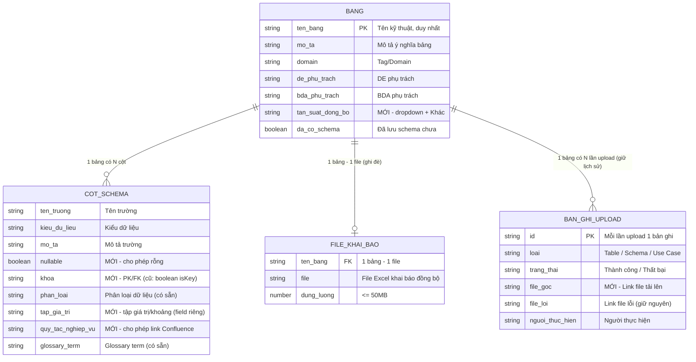
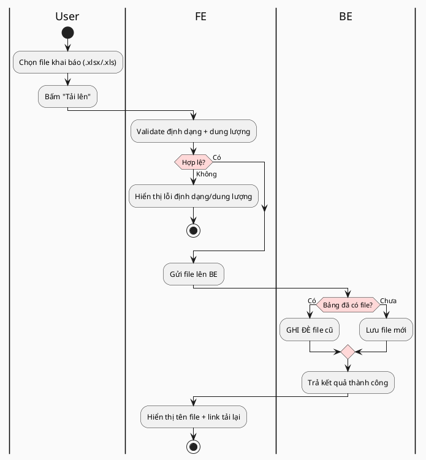
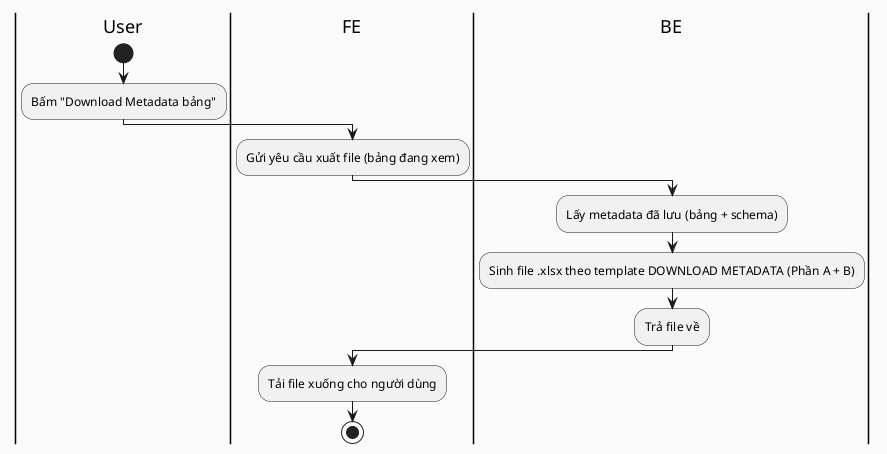
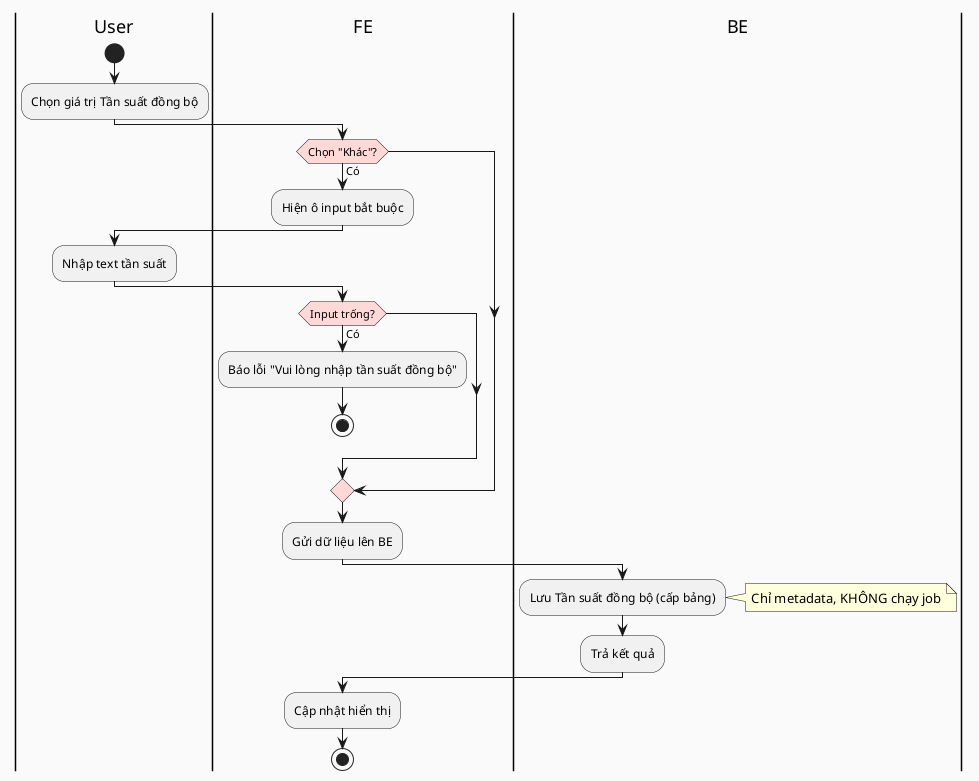
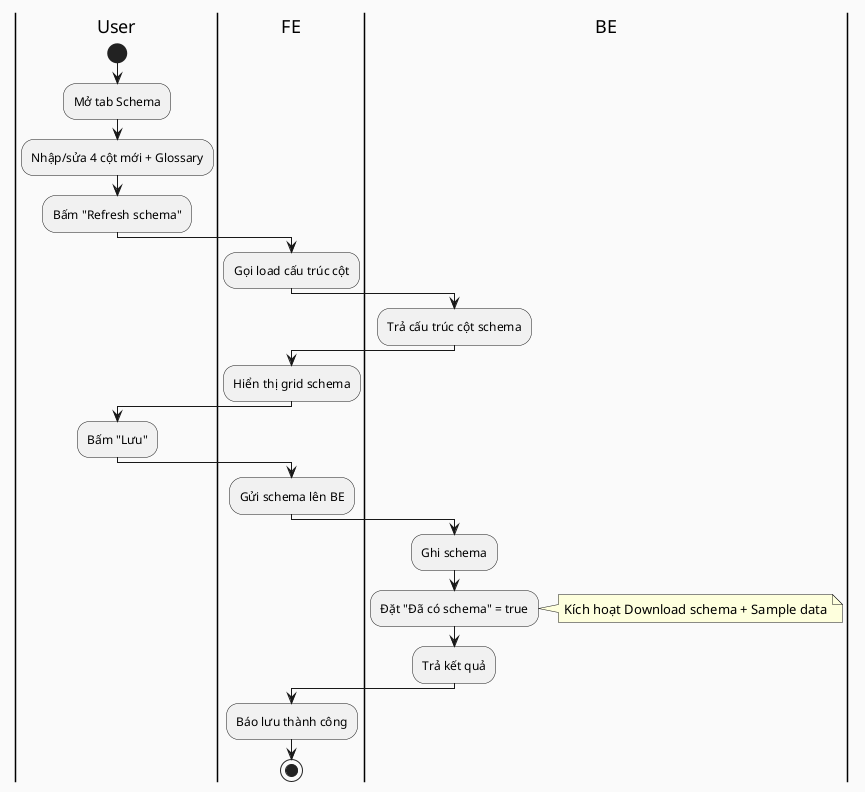
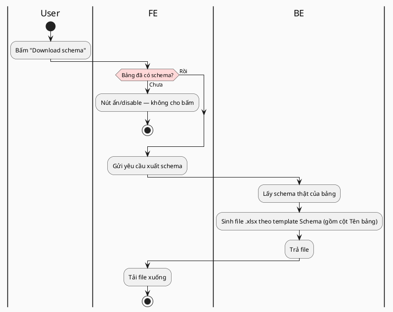
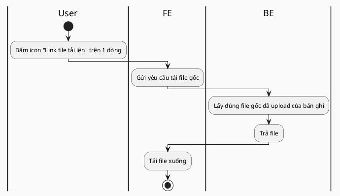
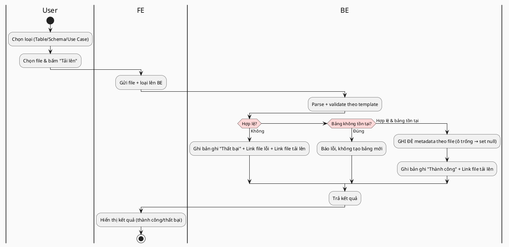
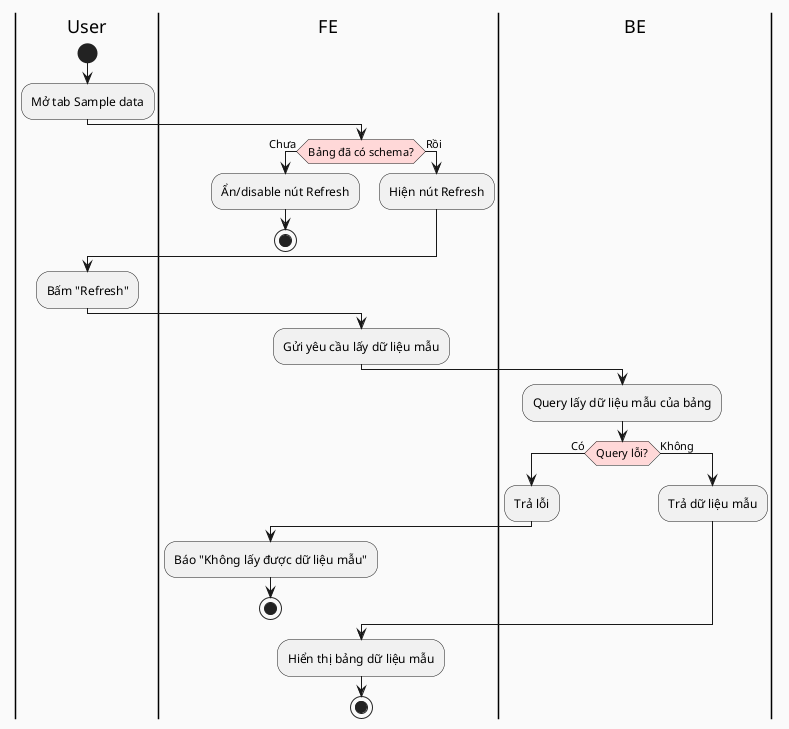
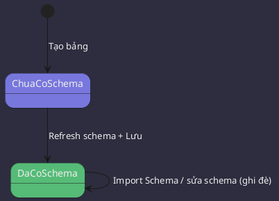

# SOFTWARE REQUIREMENTS SPECIFICATION (SRS)
# Module: Quản lý bảng — Bổ sung thông tin đồng bộ & Metadata bảng dữ liệu (FR-MTD)

---

> **Phiên bản hiện tại:** 3.8 — cập nhật 30/07/2026 (xem [§9 Lịch sử thay đổi](#9-lịch-sử-thay-đổi))
> **Phiên bản gốc:** 3.0 — **Ngày tạo:** 22/06/2026
> **Người tạo:** BA 
> **Hệ thống:** SQL Workflow

**BẢNG GHI NHẬN THAY ĐỔI**

\*A – Tạo mới, M – Sửa đổi, D – Xóa bỏ

| Ngày thay đổi | Vị trí thay đổi | A\* M, D | Nguồn gốc | Phiên bản cũ | Mô tả thay đổi | Phiên bản mới |
| ----- | ----- | ----- | ----- | ----- | ----- | ----- |
| 22/06/2026 | Toàn bộ | A | Functional Spec F1–F7 + chốt PO | — | Tạo mới SRS Quản lý bảng (FR-MTD-01 → FR-MTD-08). | 3.0 |
| 17/07/2026 | §5.9, §7.1, §7.3 | A | Chốt BA 17/07 | 3.5 | 🔶 **YÊU CẦU MỚI:** thêm **4 cột** (Tên job, Link nghiệp vụ, Sub domain, Datamart) vào template **Import Table** + file **Download**; sửa bug hardcode `dataMart=true`; validate Sub domain theo Domain cùng dòng (VAL-MTD-10). | 3.6 |
| 24/07/2026 | §5.10 (FUNC-09) | A | Chốt BA 24/07 | 3.6 | 🔶 **YÊU CẦU MỚI:** Import Schema kiểu **PATCH** (ô trống KHÔNG xóa giá trị cũ, VAL-MTD-11) + **Preview "Trước → Sau"** trước khi áp dụng. | 3.7 |
| 30/07/2026 | §5.10.3, §5.7.7, §6.5, §5.9.6, §5.10.4 (mới) | M, A | Chốt BA 30/07 + rà soát code `new-cluster` | 3.7 | 🔶 **CHỐT & BỔ SUNG:** (1) Chốt UX **Preview** (chọn bảng theo cột Tên bảng; chỉ 2 trạng thái **Cập nhật/Giữ nguyên**; hiển thị **đủ 8 thuộc tính**/trường; diff-based + lọc; bắt buộc Preview; xác nhận = đẩy vào). (2) 🔧 **Đính chính:** validate header/sai-template **ĐÃ CÓ sẵn** trong code (`isNotMatchHeader` — chặn cả file), **dev không phải làm mới**. (3) 🔶 **YÊU CẦU MỚI:** chặn **file đúng header nhưng 0 dòng dữ liệu** (VAL-MTD-12). (4) Cập nhật **trạng thái code đã implement** (§5.9.6, §5.10.4). | 3.8 |

---

## 🔶 QUY ƯỚC ĐÁNH DẤU

- `🔶 [MỚI]` — control/cột/trường/mục **mới hoặc thay đổi** so với hệ thống hiện tại.
- `⚠️ NEED INFO [NI-xx]` — điểm chưa chốt, cần Business/PO/BE xác nhận (xem §8).
- Nguồn: `[Spec Fx]` Functional Spec · `[PO]` chốt với Product Owner 22/06/2026 · `[Code]` xác minh trên source `sqlwf-be`/`sqlwf-fe` (branch new-cluster) · `[Template]` 3 file Excel template.
- **Tên control** trong tài liệu là **nhãn hiển thị trên UI** (không phải tên biến trong source code).

### Tóm tắt thay đổi so với hệ thống hiện tại

| # | Hạng mục thay đổi | Vị trí / FUNC |
|---|---|---|
| 1 | Thêm mục **Business Metadata**: Upload + **tải lại** file khai báo đồng bộ (cùng 1 file vật lý) | FUNC-01 |
| 2 | Mục **Thông tin chung**: thêm trường **Tần suất đồng bộ** + nút **Download Metadata bảng** (export) | FUNC-03, FUNC-02 |
| 3 | Schema cấp cột: thêm **NULLABLE, Tập giá trị/Khoảng, Quy tắc nghiệp vụ**; nâng đánh dấu khóa (Boolean) → **PK/FK**; **bỏ "Giá trị mẫu"** | FUNC-04 |
| 4 | Tab Schema: gỡ nút **Import lỗi**; đổi "Tải file mẫu" → **Download schema** | FUNC-04, FUNC-05 |
| 5 | Tab Quản lý upload: thêm cột **Link file tải lên** (tải lại file gốc) | FUNC-06 |
| 6 | Import: **template mới** + quy tắc **ghi đè** (gồm ghi đè ô trống → null) | FUNC-07 |
| 7 | Tab **Sample data**: thêm điều kiện hiển thị nút Refresh theo trạng thái schema | FUNC-08 |
| 8 | 🔶 **[BỔ SUNG 17/07]** Thêm **4 cột** (Tên job, Link nghiệp vụ, Sub domain, Datamart) vào template **Import Table** + file **Download** (+ sửa bug hardcode `dataMart=true`) | **[§5.9](#59--bổ-sung-17072026-mở-rộng-4-trường-metadata-nghiệp-vụ-cấp-bảng-import-table--download)** |
| 9 | 🔶 **[BỔ SUNG 24/07]** Import **Schema** kiểu **PATCH** (ô trống không xóa giá trị cũ) + **Preview "Trước → Sau"** trước khi áp dụng | **[§5.10](#510--bổ-sung-24072026-func-09-import-metadata-kiểu-patch--preview)** |
| 10 | 🔶 **[BỔ SUNG 30/07]** Chặn **file đúng header nhưng 0 dòng dữ liệu** (VAL-MTD-12). *(Validate sai-template/header đã có sẵn — không phải mới.)* | §5.7.7, §6.5 |

---

# MỤC LỤC

- [1. Tổng quan](#1-tổng-quan)
- [2. Thuật ngữ & Viết tắt](#2-thuật-ngữ--viết-tắt)
- [3. Mô hình dữ liệu](#3-mô-hình-dữ-liệu)
- [4. Danh sách chức năng](#4-danh-sách-chức-năng)
- [5. Mô tả chi tiết chức năng](#5-mô-tả-chi-tiết-chức-năng)
- [6. Quy tắc nghiệp vụ chung & Import/Export](#6-quy-tắc-nghiệp-vụ-chung--importexport)
- [7. Phụ lục - Templates](#7-phụ-lục---templates)
- [8. Need Info & Gap Analysis](#8-need-info--gap-analysis)
- [9. Lịch sử thay đổi](#9-lịch-sử-thay-đổi)

---

# 1. Tổng quan

| Thuộc tính | Mô tả |
|------------|-------|
| **Mô tả chung / Mục đích** | Bổ sung khả năng khai báo, nhập liệu, import/export và lưu trữ **metadata bảng dữ liệu** (cấp bảng + cấp cột) trên menu **Quản lý bảng** của SQL Workflow, phục vụ chủ yếu cho **BDA**. Gồm 8 chức năng (FUNC-01 → FUNC-08) trên 4 khu vực màn hình. |
| **Loại chức năng** | `Webapp` (giao diện nội bộ). |
| **Đối tượng sử dụng** | • BDA (khai báo/tra cứu metadata, import/download, upload, xem sample data) • DE (theo phân quyền cũ) • Người dùng tra cứu nội bộ ⚠️ NEED INFO [NI-02] ma trận quyền chi tiết |
| **Kênh áp dụng** | Web SQL Workflow (nội bộ). Không có Mobile App. |
| **Đường dẫn chức năng** | Home > **Quản lý bảng** > Chi tiết bảng → (A) mục **Business Metadata** · (B) mục **Thông tin chung** · (C) tab **Cấu trúc bảng và thông tin khác** (tab Schema + tab Sample data) · (D) tab **Quản lý upload** |
| **Pre-condition** | • Người dùng đã đăng nhập thành công • Người dùng được phân quyền truy cập menu Quản lý bảng (giữ nguyên nghiệp vụ cũ) • Bảng dữ liệu đã được tạo trên hệ thống |
| **Post-condition** | • Metadata bảng/cột được lưu • File khai báo đồng bộ & file import gốc được lưu trữ và tải lại được • Template import/download phản ánh đúng tập trường mới |

---

# 2. Thuật ngữ & Viết tắt

| Thuật ngữ / Viết tắt | Mô tả |
|----------------------|-------|
| BDA | Business Data Analyst — đối tượng dùng chính của metadata |
| DE | Data Engineer — kỹ sư dữ liệu phụ trách bảng |
| Metadata bảng | Thông tin mô tả bảng dữ liệu (cấp bảng + cấp cột/schema) |
| Schema | Cấu trúc cột của bảng (tên trường, kiểu dữ liệu, thuộc tính) |
| Business Metadata | Mục (trong chi tiết bảng) để **upload** và **tải lại** file khai báo đồng bộ (cùng 1 file vật lý; chỉ lưu trữ, không bóc tách) |
| Tần suất đồng bộ | Chu kỳ dữ liệu được xử lý & ghi xuống HDFS (chỉ là metadata, không kích hoạt job) |
| Glossary term | Thuật ngữ nghiệp vụ gắn với trường dữ liệu (có sẵn từ data governance) |
| Phân loại dữ liệu | Phân loại trường (nhạy cảm/cơ bản) — có sẵn từ data governance |
| NULLABLE | Cột cho phép giá trị NULL hay không |
| PK / FK | Primary Key / Foreign Key — Khóa chính / Khóa ngoại |
| Round-trip | Tải file về → sửa → import lại bằng cùng 1 template, không lệch cột |
| HDFS | Hadoop Distributed File System — nơi lưu dữ liệu phân tán |
| Use Case (UC) | Loại template import thứ 3 (giữ nguyên nghiệp vụ cũ) |

---

# 3. Mô hình dữ liệu

> Mô tả ở **mức nghiệp vụ** (thông tin gì, ý nghĩa, bắt buộc, kiểu nhập). **Cấu trúc lưu trữ & kiểu DB cụ thể do dev/TSD quyết.**

## 3.1. ERD (quan hệ thông tin nghiệp vụ)

## 3.2. Data Dictionary (mức nghiệp vụ)

### Thông tin cấp bảng

| Thông tin | Kiểu nhập | Require | Mặc định | Mô tả chi tiết |
|-----------|-----------|---------|----------|----------------|
| Tên bảng | Text | Có | — | Tên kỹ thuật, **duy nhất** (khóa map import/download). VD `L1_COREPAY_PAYMENT`. [Code: đã có] |
| Mô tả | Text | Có | Rỗng | Mô tả ý nghĩa bảng. **Maxlength 255**. [Code: đã có] |
| Domain (Tag) | Dropdown | Không | Rỗng | Chọn từ **danh mục Domain + Subdomain có sẵn** trong hệ thống (2 dropdown). [Code: đã có] |
| DE phụ trách | (đã có) | Không | Rỗng | Box "DE phụ trách" sẵn có; **Download chỉ lấy ra hiển thị**; Import: nhập text, validate theo luồng cũ. [Code: đã có] |
| BDA phụ trách | (đã có) | Không | Rỗng | Box "BDA phụ trách" sẵn có; **Download chỉ lấy ra hiển thị**; Import: nhập text, validate theo luồng cũ. [Code: đã có] |
| 🔶 **Tần suất đồng bộ** | Dropdown + ô "Khác" | Không | Rỗng | `Hàng giờ` / `Hàng ngày` / `Hàng tuần` / `Hàng tháng` / `Khác`. Ô "Khác" **maxlength 255**. Chỉ là metadata, **không chạy job**. [Spec F2][PO] |
| Đã có schema | Boolean (hệ thống tự set) | — | `false` | Cờ đánh dấu bảng đã lưu schema — điều kiện hiển thị Download schema & Sample data. |

### Thông tin cấp cột (Schema) — thứ tự cột chuẩn

Thứ tự hiển thị: `STT · Tên trường · Kiểu dữ liệu · Mô tả · NULLABLE · Khóa chính/Khóa phụ · Phân loại dữ liệu · Tập giá trị/Khoảng · Quy tắc nghiệp vụ · Glossary term`.

| Thông tin | Kiểu nhập | Require | Mặc định (dữ liệu cũ) | Mô tả chi tiết |
|-----------|-----------|---------|-----------------------|----------------|
| Tên trường | Text | Có | — | Nhập tay/import (KHÔNG auto sinh từ HDFS). **Maxlength 255**. [Code: đã có] |
| Kiểu dữ liệu | Text (free text) | Không | Rỗng | **Nhập tự do**: string, double, float, int, date, timestamp… [Code: đã có] |
| Mô tả | Text | Không | Rỗng | Mô tả ý nghĩa cột. **Maxlength 255**. [Code: đã có] |
| 🔶 **Cho phép rỗng (NULLABLE)** | Checkbox | Không | **Bỏ tick = chưa khai báo** | Tick = YES (cho null); bỏ tick = **chưa khai báo** (KHÔNG đồng nghĩa NO). Dữ liệu cũ → bỏ tick; khi Download/Export **để trống** ô NULLABLE (không ghi YES/NO) cho tới khi user khai báo. [Spec F3][PO 22/06] |
| 🔶 **Khóa chính/Khóa phụ** | Dropdown | Không | **Trống** | `(trống)` / `PK – Khóa chính` / `FK – Khóa ngoại`. Hệ thống cũ lưu khóa dạng Boolean (có/không) → nâng thành PK/FK; **dữ liệu cũ (kể cả "khóa = có") để TRỐNG**, user tự chọn lại PK/FK. [Code: isKey Boolean][PO 22/06] |
| Phân loại dữ liệu | Dropdown | Không | Giữ giá trị cũ | 3 giá trị: `PD_BASIC` · `PD_SENSITIVE` · `DATA_GENERAL` (tái sử dụng từ governance). [Code: đã có][PO 22/06] |
| 🔶 **Tập giá trị/Khoảng giá trị** | Text (textarea) | Không | Rỗng | **Field riêng**, KHÔNG dùng chung ràng buộc DQ (dqMin/dqMax/dqEnum) sẵn có. **Maxlength 500**. VD `status: [success, cancelled]`. [Code: tách khỏi DQ][PO] |
| 🔶 **Quy tắc nghiệp vụ** | Text (textarea) | Không | Rỗng | Cách tính/điều kiện cập nhật; cho phép dán link Confluence. **Maxlength 1000**. [Spec F3][PO] |
| Glossary term | Text (free text) | Không | Giữ giá trị cũ | **Nhập tự do**; đồng bộ UI ↔ template (download + import). [Code: đã có][PO] |
| 🔶 ~~Giá trị mẫu~~ | — | — | — | **ĐÃ BỎ** khỏi UI + template (chốt theo SPEC). **Dữ liệu "Giá trị mẫu" cũ đã nhập → XÓA LUÔN** [PO 22/06]. |

### Hồ sơ & lịch sử upload

| Thông tin | Kiểu | Require | Mô tả |
|-----------|------|---------|-------|
| File khai báo đồng bộ | File Excel | — | 1 bảng – 1 file; upload lại **ghi đè**; tool **không bóc tách** nội dung. |
| Bản ghi upload — Tên file | Text | Có | Tên file đã upload |
| Bản ghi upload — Loại | Enum | Có | `Table` / `Schema` / `Use Case` (cột "Dữ liệu upload") |
| Bản ghi upload — Trạng thái | Enum | Có | `Thành công` / `Thất bại` |
| Bản ghi upload — Người thực hiện | Text | Có | |
| 🔶 Bản ghi upload — Link file tải lên (file gốc) | Link | Có | **MỚI** — file gốc đã upload, cho **mọi** bản ghi |
| Bản ghi upload — Link file lỗi | Link | Không | Giữ nguyên — file mô tả lỗi |

---

# 4. Danh sách chức năng

| Mã | Tên chức năng | Khu vực màn hình | Mô tả | Chi tiết |
|----|---------------|------------------|-------|----------|
| FUNC-01 | Upload & tải lại file khai báo đồng bộ | (A) Business Metadata | Đính kèm + tải lại **cùng 1 file** Excel khai báo (lưu trữ, không bóc tách) | [5.1](#51-func-01-upload--tải-lại-file-khai-báo-đồng-bộ) |
| FUNC-02 | Download Metadata bảng | (B) Thông tin chung | Export toàn bộ metadata bảng (Thông tin bảng + Schema) ra Excel theo template DOWNLOAD METADATA | [5.2](#52-func-02-download-metadata-bảng) |
| FUNC-03 | Khai báo Tần suất đồng bộ | (B) Thông tin chung | Khai báo chu kỳ đồng bộ cấp bảng (dropdown + "Khác") | [5.3](#53-func-03-khai-báo-tần-suất-đồng-bộ) |
| FUNC-04 | Khai báo Schema (4 cột mới + Glossary) | (C) Tab Schema | Nhập/sửa schema cấp cột, Refresh schema, Lưu | [5.4](#54-func-04-khai-báo-schema) |
| FUNC-05 | Download schema | (C) Tab Schema | Tải schema bảng hiện tại theo template Schema (round-trip với import) | [5.5](#55-func-05-download-schema) |
| FUNC-06 | Tải lại file gốc đã upload | (D) Quản lý upload | Tải lại đúng file gốc người dùng đã upload | [5.6](#56-func-06-tải-lại-file-gốc-đã-upload) |
| FUNC-07 | Import Table/Schema/Use Case | (D) Quản lý upload | Import hàng loạt metadata (parse + validate + ghi đè) | [5.7](#57-func-07-import-tableschemause-case) |
| FUNC-08 | Xem dữ liệu mẫu (Refresh) | (C) Tab Sample data | Query & hiển thị dữ liệu mẫu của bảng | [5.8](#58-func-08-xem-dữ-liệu-mẫu-refresh) |
| FUNC-09 | 🔶 **[BỔ SUNG 24/07]** Import metadata kiểu **PATCH** + **Preview** | (D) Quản lý upload | Nâng cấp FUNC-07: ô trống KHÔNG xóa giá trị cũ; xem trước "Trước → Sau" rồi mới áp dụng | [5.10](#510--bổ-sung-24072026-func-09-import-metadata-kiểu-patch--preview) |

> **Hiện trạng (rà soát code):** FUNC-03 (Mới) · FUNC-01/02/05/06 (Mới hoặc mở rộng khu vực đã có) · FUNC-04/07 (Mở rộng chức năng đã có) · **FUNC-08 đã tồn tại trên hệ thống** — đợt này chỉ bổ sung điều kiện hiển thị.

---

# 5. Mô tả chi tiết chức năng

> **Screenshot/Figma:** ⚠️ NEED INFO [NI-01] — chưa có Figma cho toàn bộ màn hình; mô tả control dựa trên Functional Spec + chốt PO, cần đối chiếu khi có design.
> **Quy ước:** Tên control = nhãn hiển thị trên UI. Activity diagram dùng 3 lane: **User – FE – BE**.

---

## 5.1. FUNC-01: Upload & tải lại file khai báo đồng bộ

### 5.1.1. Thông tin chung

| Thuộc tính | Mô tả |
|------------|-------|
| Tên chức năng | Upload & tải lại file khai báo đồng bộ (Business Metadata) |
| Mã chức năng | FUNC-01 |
| Actor | BDA |
| Khu vực | (A) Mục **Business Metadata** trong chi tiết bảng (riêng biệt, KHÁC tab Quản lý upload) |
| Mô tả | Đính kèm **01 file Excel** khai báo đồng bộ cho mỗi bảng (lưu làm hồ sơ) và **tải lại đúng file đó** khi cần. Tool **không đọc/không bóc tách** nội dung file. Đây KHÔNG phải "Download Metadata bảng" (export) — xem FUNC-02. |
| Pre-condition | • Bảng đã tồn tại • BDA mở chi tiết bảng → mục Business Metadata |

### 5.1.2. Mô tả màn hình — Mục Business Metadata

| STT | Tên control (trên UI) | Loại | Require | Maxlength | Mặc định | Mô tả chi tiết |
|-----|------------------------|------|---------|-----------|----------|----------------|
| 1 | Chọn file khai báo | FileUpload | Không | — | — | • **Định dạng cho phép:** `.xlsx`, `.xls` • **Dung lượng:** ≤ 50MB • **Số file:** tối đa 1 • Lỗi định dạng: "Chỉ chấp nhận file Excel (.xlsx, .xls)" • Lỗi dung lượng: "Dung lượng file vượt quá 50MB" • **KHÔNG** kiểm tra template/cấu trúc cột [Spec F1][PO] |
| 2 | Nút "Tải lên" | Button | — | — | — | • **Hành vi:** Tải file lên; nếu bảng đã có file → **ghi đè** (không tạo file thứ 2) • Disabled khi chưa chọn file |
| 3 | Tên file đính kèm | Label | — | — | — | • Hiển thị tên file đang đính kèm (nếu có) • Khi chưa có file: hiển thị "Chưa có file khai báo" |
| 4 | Link "Tải lại" | Link | — | — | — | • Tải về **đúng file khai báo đã upload** (chính file vật lý đó, không phải file hệ thống sinh) • Chỉ hiển thị khi đã có file |

### 5.1.3. Luồng nghiệp vụ

#### Mô tả chi tiết các bước

| Bước | Đối tượng | Mô tả chi tiết | Ghi chú |
|------|-----------|----------------|---------|
| 1 | User | Chọn file `.xlsx/.xls` rồi bấm "Tải lên" | — |
| 2 | FE | Validate: định dạng Excel + dung lượng ≤ 50MB | Sai → lỗi inline, dừng (BR-MTD-01) |
| 3 | FE | Gửi file lên BE | — |
| 4 | BE | Lưu file gốc; bảng đã có file → ghi đè | 1 bảng – 1 file; **không** bóc tách nội dung |
| 5 | FE | Hiển thị tên file + link tải lại | — |

### 5.1.4. Validation

| Mã lỗi | Trường | Điều kiện | Message | Loại |
|--------|--------|-----------|---------|------|
| VAL-MTD-01 | Chọn file khai báo | Không phải `.xlsx/.xls` | Chỉ chấp nhận file Excel (.xlsx, .xls) | Inline/Toast |
| VAL-MTD-02 | Chọn file khai báo | > 50MB | Dung lượng file vượt quá 50MB | Inline/Toast |

---

## 5.2. FUNC-02: Download Metadata bảng

### 5.2.1. Thông tin chung

| Thuộc tính | Mô tả |
|------------|-------|
| Tên chức năng | Download Metadata bảng |
| Mã chức năng | FUNC-02 |
| Actor | BDA |
| Khu vực | (B) Mục **Thông tin chung** (đầu màn Thêm/Sửa bảng) [PO 22/06/2026: đặt ở Thông tin chung, như Spec F4] |
| Mô tả | **Export** (hệ thống tự sinh) **toàn bộ metadata** của bảng đang xem (Thông tin bảng + Schema) ra file Excel theo template `DOWNLOAD METADATA BẢNG TRÊN HỆ THỐNG SQL WORKFLOW.xlsx`. KHÔNG liên quan file khai báo ở FUNC-01. |
| Pre-condition | • Bảng đã tồn tại |

### 5.2.2. Mô tả màn hình

| STT | Tên control (trên UI) | Loại | Điều kiện hiển thị | Mô tả chi tiết |
|-----|------------------------|------|--------------------|----------------|
| 1 | Nút "Download Metadata bảng" | Button | Luôn hiển thị | • **Hành vi:** sinh file `.xlsx` theo template DOWNLOAD METADATA, đổ dữ liệu thật của bảng đang xem • Gồm **Phần A – Thông tin bảng** + **Phần B – Schema** |

### 5.2.3. Nội dung file xuất (template DOWNLOAD METADATA BẢNG)

**Phần A – Thông tin bảng:** `Tên bảng trên SQL workflow · Mô tả ý nghĩa bảng · Domain · Tần suất đồng bộ`. [Template]

**Phần B – Thông tin schema:** `STT · Tên cột · Kiểu dữ liệu · Mô tả ý nghĩa cột · Cho phép rỗng (NULLABLE) · Khóa chính/Khóa phụ · Phân loại cột dữ liệu · Tập giá trị/Khoảng giá trị · Quy tắc nghiệp vụ · Glossary term`. [Template]

> 🔶 **[MỚI] Theo SPEC (đã chốt):** file template hiện tại **còn cột "Giá trị mẫu"** ở Phần B → **phải BỎ** khi cập nhật template. ⚠️ NEED INFO [NI-05] cập nhật lại file template.

### 5.2.4. Luồng nghiệp vụ

#### Mô tả chi tiết các bước

| Bước | Đối tượng | Mô tả chi tiết | Ghi chú |
|------|-----------|----------------|---------|
| 1 | User | Bấm "Download Metadata bảng" | |
| 2 | FE | Gửi yêu cầu xuất file của bảng đang xem | |
| 3 | BE | Lấy metadata (bảng + schema), sinh file `.xlsx` theo template (Phần A + B) | Dữ liệu khớp đang hiển thị trên tool |
| 4 | FE | Tải file về cho người dùng | |

---

## 5.3. FUNC-03: Khai báo Tần suất đồng bộ

### 5.3.1. Thông tin chung

| Thuộc tính | Mô tả |
|------------|-------|
| Tên chức năng | Khai báo "Tần suất đồng bộ" cấp bảng |
| Mã chức năng | FUNC-03 |
| Actor | BDA |
| Khu vực | (B) Mục **Thông tin chung** (màn Thêm/Sửa bảng) |
| Mô tả | Khai báo chu kỳ dữ liệu được xử lý & ghi xuống HDFS. Chỉ là **metadata**, không kích hoạt job nào. |

### 5.3.2. Mô tả màn hình — Thông tin chung

| STT | Tên control (trên UI) | Loại | Require | Mặc định | Mô tả chi tiết |
|-----|------------------------|------|---------|----------|----------------|
| 1 | Dropdown "Tần suất đồng bộ" 🔶 | Dropdown | Không | Rỗng | • **Các giá trị:**   • `Hàng giờ`   • `Hàng ngày`   • `Hàng tuần`   • `Hàng tháng`   • `Khác` • Chọn nhiều: Không |
| 2 | Ô nhập "Tần suất khác" 🔶 | Text Input | **Có (khi chọn "Khác")** | Rỗng | • **Hiển thị:** chỉ khi Dropdown = "Khác" • **Bắt buộc** khi đã chọn "Khác"; để trống → lỗi • Free text; **maxlength 255** (cho phép liệt kê nhiều tần suất, VD "2 lần/tuần vào T3, T6") • Không ràng buộc định dạng |

### 5.3.3. Luồng nghiệp vụ

#### Mô tả chi tiết các bước

| Bước | Đối tượng | Mô tả chi tiết | Ghi chú |
|------|-----------|----------------|---------|
| 1 | User | Chọn 1 trong 5 giá trị dropdown | |
| 2 | FE | Nếu "Khác" → hiện ô input bắt buộc; validate không để trống | |
| 3 | User | (nếu "Khác") nhập text tần suất | Free text |
| 4 | BE | Lưu giá trị (dropdown hoặc text "Khác") cấp bảng | Hiển thị trong template Table + Download Metadata |

### 5.3.4. Validation

| Mã lỗi | Trường | Điều kiện | Message | Loại |
|--------|--------|-----------|---------|------|
| VAL-MTD-03 | Ô nhập "Tần suất khác" | Chọn "Khác" nhưng để trống input | Vui lòng nhập tần suất đồng bộ | Inline |

---

## 5.4. FUNC-04: Khai báo Schema

### 5.4.1. Thông tin chung

| Thuộc tính | Mô tả |
|------------|-------|
| Tên chức năng | Khai báo schema (4 cột mới + Glossary) |
| Mã chức năng | FUNC-04 |
| Actor | BDA |
| Khu vực | (C) Tab **Schema** (trong "Cấu trúc bảng và thông tin khác") |
| Mô tả | Mở rộng khai báo cấp cột để BDA hiểu rõ ý nghĩa/nghiệp vụ từng trường. |

### 5.4.2. Mô tả màn hình — Tab Schema

**Thứ tự cột grid:** `STT · Tên trường · Kiểu dữ liệu · Mô tả · NULLABLE · Khóa chính/Khóa phụ · Phân loại dữ liệu · Tập giá trị/Khoảng · Quy tắc nghiệp vụ · Glossary term`.

| STT | Tên control / cột (trên UI) | Loại | Require | Mặc định (dữ liệu cũ) | Mô tả chi tiết |
|-----|------------------------------|------|---------|-----------------------|----------------|
| 1 | Cột "Cho phép rỗng (NULLABLE)" 🔶 | Checkbox | Không | **Bỏ tick = chưa khai báo** | • Tick = YES (cho phép null) • Bỏ tick = **chưa khai báo** (không phải NO); khi Export để trống • Không validate nội dung |
| 2 | Cột "Khóa chính/Khóa phụ" 🔶 | Dropdown | Không | **Trống** | • Giá trị: `(trống)` / `PK – Khóa chính` / `FK – Khóa ngoại` • Hệ thống cũ lưu khóa dạng có/không → nâng PK/FK; **dữ liệu cũ (kể cả "khóa = có") để trống, user chọn lại** |
| 3 | Cột "Tập giá trị/Khoảng giá trị" 🔶 | Text (textarea) | Không | Rỗng | • **Field riêng**, không liên quan ràng buộc DQ sẵn có • **Maxlength 500** • VD `status: [success, cancelled]` • Không validate |
| 4 | Cột "Quy tắc nghiệp vụ" 🔶 | Text (textarea) | Không | Rỗng | • Cách tính/điều kiện cập nhật; cho phép dán link Confluence • **Maxlength 1000** • Không validate |
| 5 | Cột "Glossary term" | Text (có sẵn) | Không | Giữ giá trị cũ | • Đồng bộ với template (download + import) |
| 6 | Nút "Refresh schema" | Button | — | — | • Load lại cấu trúc cột schema của bảng |
| 7 | Nút "Lưu" | Button | — | — | • Ghi schema; đặt **"Đã có schema" = true** → kích hoạt Download schema (FUNC-05) & Sample data (FUNC-08) |

> 🔶 **[MỚI]** Đã **bỏ cột "Giá trị mẫu"** khỏi grid (chốt theo SPEC). Tên trường + Kiểu dữ liệu **nhập tay/import** (không auto sinh từ HDFS). 4 cột mới **không validate nội dung** (thông tin tham khảo cho BDA) [BR-MTD-03].
>
> **Grid Schema cho phép THÊM TỪNG DÒNG cột** (theo hiện trạng code) [Code]. *(Sửa/xóa dòng + ràng buộc tên trường: xem B-mục Edge case bên dưới khi chốt.)*

### 5.4.3. Luồng nghiệp vụ

#### Mô tả chi tiết các bước

| Bước | Đối tượng | Mô tả chi tiết | Ghi chú |
|------|-----------|----------------|---------|
| 1 | User | Nhập/sửa 4 cột mới + Glossary, bấm "Refresh schema" | Không validate nội dung 4 cột mới |
| 2 | FE → BE | Gọi load cấu trúc cột; BE trả về | |
| 3 | FE | Hiển thị grid schema | |
| 4 | User | Bấm "Lưu" | |
| 5 | BE | Ghi schema, đặt "Đã có schema" = true | Kích hoạt FUNC-05 & FUNC-08 |

### 5.4.4. Validation & hiện trạng (giữ nguyên theo code)

| Mã lỗi | Trường | Điều kiện | Message | Nguồn |
|--------|--------|-----------|---------|-------|
| VAL-MTD-07 | Tên trường | Để trống (khi rời ô / Lưu) | "Tên trường không được để trống" | [Code][B2.3] |
| VAL-MTD-08 | Tên trường | **Trùng tên** trong cùng bảng | "Trường {tên} đã tồn tại" | [Code][B2.1] |
| VAL-MTD-09 | "Loại dữ liệu" (mỗi dòng) | Để trống khi Lưu | "Loại dữ liệu không được để trống" | [Code] ⚠️ NI-11 |

**Hành vi khác — giữ nguyên hiện trạng code:**
- **Thêm dòng cột:** nút **"Thêm trường"** cho thêm từng dòng schema [B1.1].
- **Lưu schema 0 cột:** code **KHÔNG chặn** → hiện cho phép lưu schema rỗng [B2.2].
- **Refresh schema khi đang sửa chưa lưu:** code **KHÔNG có popup xác nhận** → nạp lại (ghi đè) trực tiếp, không cảnh báo [B1.2].

---

## 5.5. FUNC-05: Download schema

### 5.5.1. Thông tin chung

| Thuộc tính | Mô tả |
|------------|-------|
| Tên chức năng | Download schema |
| Mã chức năng | FUNC-05 |
| Actor | BDA |
| Khu vực | (C) Tab **Schema** — nút **đổi từ "Tải file mẫu"** thành "Download schema" |
| Mô tả | Tải về schema **của bảng hiện tại** theo template Schema (`File_upload_schema_information_update_202606.xlsx`), đổ sẵn dữ liệu schema thật → user sửa rồi import lại ở tab Quản lý upload (**round-trip**). |

### 5.5.2. Mô tả màn hình

| STT | Tên control (trên UI) | Loại | Điều kiện hiển thị | Mô tả chi tiết |
|-----|------------------------|------|--------------------|----------------|
| 1 | Nút "Download schema" 🔶 | Button | **Chỉ khi bảng đã có schema** (đã Lưu) | • Bảng chưa có schema → **ẩn/disable** (có tooltip giải thích) • Tải `.xlsx` theo template Schema, **gồm cột "Tên bảng"**, đổ dữ liệu schema thật của bảng hiện tại (không phải file mẫu rỗng) |
| 2 | Nút "Import file" / "Chọn tập tin" 🔶 | — | — | **GỠ HẲN** (đang lỗi, không dùng). Không còn import tại tab này. [Spec F4] |

### 5.5.3. Nội dung file Download schema (template Schema)

Cột (đúng thứ tự, round-trip với import Schema): `Tên bảng · Tên trường · Mô tả trường · Kiểu dữ liệu · NULLABLE · Khóa chính/Khóa phụ · Phân loại trường · Tập giá trị/Khoảng · Quy tắc nghiệp vụ · Glossary term`. [Template]

> 🔶 **[MỚI] Theo SPEC (đã chốt):** template `File_upload_schema_information_update_202606.xlsx` hiện **còn cột "Giá trị mẫu"** → **phải BỎ**; đồng thời đảm bảo đủ "Kiểu dữ liệu" + "Glossary term". ⚠️ NEED INFO [NI-05] cập nhật lại file template trước khi dev dùng.

### 5.5.4. Luồng & ngoại lệ

| Mã | Điều kiện | Hành vi |
|----|-----------|---------|
| EX-MTD-05 | Bảng chưa có schema | Nút "Download schema" ẩn/disable — không cho bấm, không lỗi |

---

## 5.6. FUNC-06: Tải lại file gốc đã upload

### 5.6.1. Thông tin chung

| Thuộc tính | Mô tả |
|------------|-------|
| Tên chức năng | Tải lại file gốc đã upload |
| Mã chức năng | FUNC-06 |
| Actor | BDA |
| Khu vực | (D) Tab **Quản lý upload** |
| Mô tả | Cho phép tải lại **đúng file gốc** người dùng đã upload, áp dụng cho **mọi** bản ghi (thành công & thất bại). |

### 5.6.2. Mô tả màn hình — Danh sách Quản lý upload

**Cột danh sách:** `STT · Tên file · Dữ liệu upload · Trạng thái · Người thực hiện · Link file lỗi · [Link file tải lên] 🔶 · Hành động`.

| STT | Tên control / cột (trên UI) | Loại | Mô tả chi tiết |
|-----|------------------------------|------|----------------|
| 1 | Cột "Link file tải lên" 🔶 | Link/icon download | • **MỚI** — tải lại **file gốc** đã upload • Hiển thị cho **cả bản ghi Thành công lẫn Thất bại** |
| 2 | Cột "Link file lỗi" | Link | • Giữ nguyên — file mô tả lỗi (chỉ bản ghi Thất bại) |
| 3 | Nút "File mẫu" | Button + Dropdown | • Table / Schema / Use Case — dùng template **đã cập nhật** |
| 4 | Nút "Tải lên" | Button | • Mở luồng Import (FUNC-07) |

### 5.6.3. Luồng nghiệp vụ

#### Mô tả chi tiết các bước

| Bước | Đối tượng | Mô tả chi tiết | Ghi chú |
|------|-----------|----------------|---------|
| 1 | User | Bấm icon "Link file tải lên" trên 1 dòng | Mọi trạng thái (thành công/thất bại) |
| 2 | BE | Trả về đúng file gốc đã upload | |

> Mỗi lần upload tạo **1 bản ghi mới** (giữ lịch sử, không ghi đè danh sách). Nơi lưu file vật lý: ⚠️ NEED INFO [NI-07].

---

## 5.7. FUNC-07: Import Table/Schema/Use Case

### 5.7.1. Thông tin chung

| Thuộc tính | Mô tả |
|------------|-------|
| Tên chức năng | Import Table/Schema/Use Case theo template mới |
| Mã chức năng | FUNC-07 |
| Actor | BDA |
| Khu vực | (D) Tab **Quản lý upload** — 1 nút "Tải lên" + dropdown chọn loại |
| Mô tả | Import hàng loạt metadata cấp bảng/cấp cột; **có parse + validate** (khác hẳn FUNC-01). |
| Pre-condition | • Bảng đích **đã tồn tại** |

### 5.7.2. Mô tả màn hình

| STT | Tên control (trên UI) | Loại | Mô tả chi tiết |
|-----|------------------------|------|----------------|
| 1 | Dropdown "Loại upload" | Dropdown | • `Table` / `Schema` / `Use Case` |
| 2 | Chọn file import | FileUpload | • Định dạng `.xlsx/.xls`; **dung lượng ≤ 50MB**; theo template tương ứng loại đã chọn |
| 3 | Nút "Tải lên" | Button | • Disabled khi chưa chọn file • Hành vi: Upload → Validate → Import |

### 5.7.3. Quy tắc xử lý Import

| Thuộc tính | Mô tả |
|------------|-------|
| **Khóa map** | **Tên bảng** = khóa định danh. Bảng không tồn tại → **báo lỗi**, KHÔNG tạo bảng mới [BR-MTD-07-01] |
| **Ghi đè** | Import **ghi đè** metadata của bảng theo file [BR-MTD-07-02]. ⚠️ Note dev: kiểm tra code production xem nghiệp vụ ghi đè đã có chưa; nếu chưa → implement theo hướng ghi đè theo file [Spec F6] |
| 🔶 **Ô (cột) để trống trong file** | **GHI ĐÈ field cũ thành rỗng/null** — ô trống trong file = xóa giá trị cũ (set null) [PO 22/06/2026]. *(File import phản ánh đúng 100% trạng thái sau import.)* |
| **Xử lý lỗi** | File sai template/thiếu cột bắt buộc → bản ghi "Thất bại" + Link file lỗi + Link file tải lên |
| **Use Case** | Template & logic **giữ nguyên**, không đổi [BR-MTD-07-05] |

### 5.7.4. Mapping kiểu dữ liệu khi import

| Cột trong file | Giá trị file | Kết quả trong hệ thống |
|----------------|--------------|------------------------|
| NULLABLE | `YES` | Tick (cho phép null) |
| NULLABLE | `NO` / trống | Bỏ tick *(theo quy tắc ghi đè null ở 5.7.3, ô trống → set về "bỏ tick")* |
| Khóa chính/Khóa phụ | `PK` | "PK – Khóa chính" |
| Khóa chính/Khóa phụ | `FK` | "FK – Khóa ngoại" |
| Khóa chính/Khóa phụ | trống | Trống |

### 5.7.5. Luồng nghiệp vụ

#### Mô tả chi tiết các bước

| Bước | Đối tượng | Mô tả chi tiết | Ghi chú |
|------|-----------|----------------|---------|
| 1 | User | Chọn loại + chọn file, bấm "Tải lên" | 1 nút Tải lên + dropdown loại |
| 2 | FE | Gửi file + loại lên BE | |
| 3 | BE | Parse + validate theo template (giữ logic cũ) | Sai → "Thất bại" + file lỗi |
| 4 | BE | Map theo Tên bảng; bảng không tồn tại → lỗi | Không tạo bảng mới |
| 5 | BE | **Ghi đè** metadata theo file (ô trống → set null); ghi bản ghi upload + lưu file gốc | BR-MTD-07-02/03 |
| 6 | FE | Hiển thị kết quả | |

### 5.7.6. Validation

| Mã lỗi | Điều kiện | Message | Loại |
|--------|-----------|---------|------|
| VAL-MTD-04 | Sai template / thiếu cột bắt buộc | File không đúng template / thiếu cột bắt buộc | Bản ghi "Thất bại" + Link file lỗi |
| VAL-MTD-05 | Tên bảng không tồn tại | Tên bảng không tồn tại trên hệ thống | Bản ghi "Thất bại" |

### 5.7.7. Hiện trạng xử lý Import (giữ nguyên theo code)

> Giữ đúng **logic import hiện hành** — dev không đổi nghiệp vụ, chỉ mở rộng tập cột template.

- **Xử lý bất đồng bộ:** mỗi lần upload tạo 1 bản ghi, chạy nền theo hàng đợi: `PENDING → PROCESSING → SUCCESS / COMPLETED / FAILED`. [Code]
- **[B3.1] Lỗi theo DÒNG (partial):** dòng hợp lệ vẫn được import; dòng sai gom vào **file lỗi** (tải qua "Link file lỗi"). Trạng thái: `SUCCESS` = không dòng lỗi · `COMPLETED` = có dòng lỗi (vẫn import phần đúng) · `FAILED` = sai header template / lỗi hệ thống. [Code]
- **Header phải khớp template (ĐÃ CÓ trong code — không phải làm mới):** ngay khi upload, BE đối chiếu **toàn bộ header (tên + THỨ TỰ cột)** với template bằng `ApachePOIUtils.isNotMatchHeader` (so khớp tuyệt đối). Lệch/đảo/thiếu/thừa cột, đổi tên cột, sai file, file rỗng-không-header → **chặn cả file** ngay (`INVALID_FILE_FORMAT` / VAL-MTD-04), **chưa lưu gì**. Nhờ vậy **không xảy ra lưu nhầm cột âm thầm**. [Code: `MetadataInformationUploadServiceImpl.request()`]
- 🔶 **[MỚI 30/07] Chặn file rỗng dữ liệu (VAL-MTD-12):** trường hợp file **đúng header nhưng KHÔNG có dòng dữ liệu nào** — trước đây trả `SUCCESS` no-op (do `validateDataUploadEmpty` chưa được gọi trong luồng metadata). Nay **gọi bổ sung** trong `processing()` → file rỗng dữ liệu báo lỗi rõ (`file-data-empty`) thay vì im lặng. [Code: đã bổ sung `new-cluster`]
- **[B6.3] Trùng tên file:** **cho phép**; hệ thống tự đánh số thứ tự trùng (numberWhenDuplicate), giữ lịch sử. [Code]
- **[B4.1] cột vắng hẳn / [B5.1] biến thể NULLABLE / [B5.2] biến thể PK-FK / [B5.3] map Tên bảng (hoa-thường, trim):** **theo logic parse hiện hành** của từng processor template (Table/Schema/Use Case) — giữ nguyên code. ⚠️ NI-12 dev cung cấp chi tiết quy tắc parse khi viết case biên.

---

## 5.8. FUNC-08: Xem dữ liệu mẫu (Refresh)

### 5.8.1. Thông tin chung

| Thuộc tính | Mô tả |
|------------|-------|
| Tên chức năng | Xem dữ liệu mẫu (Refresh) |
| Mã chức năng | FUNC-08 |
| Actor | BDA / Người dùng tra cứu |
| Khu vực | (C) Tab **Sample data** (kế tab Schema) |
| Mô tả | Cho người dùng xem **dữ liệu mẫu** thực tế của bảng. |
| **Hiện trạng** | **ĐÃ TỒN TẠI trên hệ thống** [Code] — đợt này chủ yếu bổ sung **điều kiện hiển thị** nút Refresh theo trạng thái schema + đặt đúng vị trí tab. |

### 5.8.2. Mô tả màn hình — Tab Sample data

| STT | Tên control (trên UI) | Loại | Điều kiện hiển thị | Mô tả chi tiết |
|-----|------------------------|------|--------------------|----------------|
| 1 | Nút "Refresh" 🔶 | Button | **Chỉ khi bảng đã có schema** | • Bấm → hệ thống query lấy dữ liệu mẫu & hiển thị • Bảng chưa có schema → ẩn/disable |
| 2 | Bảng dữ liệu mẫu | Table/Grid | — | • Hiển thị các dòng dữ liệu mẫu • **Giới hạn số dòng: theo cơ chế hiện hành** [PO 22/06] (dev giữ nguyên giới hạn đang dùng) • Nguồn dữ liệu (HDFS/DB): ⚠️ NEED INFO [NI-06] dev xác nhận |

### 5.8.3. Luồng nghiệp vụ

#### Mô tả chi tiết các bước

| Bước | Đối tượng | Mô tả chi tiết | Ghi chú |
|------|-----------|----------------|---------|
| 1 | FE | Kiểm tra "Đã có schema" → quyết định hiện/ẩn nút Refresh | BR-MTD-08-01 |
| 2 | User | Bấm "Refresh" (chỉ khi điều kiện đạt) | |
| 3 | BE | Query lấy dữ liệu mẫu & trả về | Nguồn/giới hạn: NI-06 |
| 4 | FE | Hiển thị dữ liệu mẫu | |

### 5.8.4. Validation / Ngoại lệ

| Mã | Điều kiện | Hành vi |
|----|-----------|---------|
| EX-MTD-08 | Bảng chưa có schema | Nút Refresh ẩn/disable |
| VAL-MTD-06 | Query sample data lỗi | "Không lấy được dữ liệu mẫu, vui lòng thử lại" |

---

## 5.9. 🔶 [BỔ SUNG 17/07/2026] Mở rộng 4 trường metadata nghiệp vụ cấp bảng (Import Table + Download)

> **TÍNH CHẤT MỤC NÀY:** Là **YÊU CẦU MỚI** đợt 17/07/2026 — bổ sung **4 cột** vào template **Import Table** và các file **Download** (Metadata / Table) để BDA khai báo 4 trường này **qua file** (hiện chỉ nhập được thủ công trên màn).
>
> **⚠️ PHẠM VI (đọc kỹ, tránh hiểu nhầm):** Cả 4 trường **ĐÃ TỒN TẠI** trên màn Thêm/Sửa bảng (mục "Thông tin chung") và trong dữ liệu bảng (`TableInfo`: `jobName`, `businessLink`, `subDomainIds/subDomainNames`, `dataMart`). Đợt này **KHÔNG thêm trường dữ liệu mới, KHÔNG đổi màn** — chỉ **mở rộng template + luồng Import/Export** để đọc/ghi 4 trường đã có.

### 5.9.1. 4 trường bổ sung — Data Dictionary

| # | Nhãn cột (trong file) | Trường hệ thống | Kiểu nhập | Require | Quy tắc import (ghi về bảng) |
|---|---|---|---|:--:|---|
| 1 | 🔶 **Tên job** | `jobName` | Text tự do | Không | Ghi thẳng vào `jobName`. Ô trống → null (theo BR-MTD-07-03). |
| 2 | 🔶 **Link nghiệp vụ** | `businessLink` | Text tự do (URL/link Confluence) | Không | Ghi thẳng vào `businessLink`. Ô trống → null. Không validate định dạng URL. |
| 3 | 🔶 **Sub domain** | `subDomainIds` / `subDomainNames` | Text — **tên sub domain** (nhiều giá trị: cùng quy ước phân tách với Domain/DE/BDA) | Không | Đối chiếu tên sub domain **trong phạm vi Domain (Tag) khai ở CÙNG DÒNG** → resolve ra ID (giống cách xử lý Domain hiện tại). Không tồn tại/không thuộc Domain → **lỗi dòng** (VAL-MTD-10). Ô trống → xóa (null). |
| 4 | 🔶 **Datamart** | `dataMart` | Text: `Có` / `Không` | Không | `Có` → true; `Không` / để trống → false. |

> **Sub domain — làm rõ (chốt với BA 17/07):** người dùng nhập **tên** sub domain; hệ thống kiểm tra tên đó có nằm trong danh mục sub domain **thuộc Domain khai ở cùng dòng** không. Có → lấy ID lưu vào `subDomainIds`. Không → báo lỗi dòng. (Cách này an toàn cả khi 2 Domain khác nhau có sub domain trùng tên.)
> ⚠️ Ký tự **phân tách nhiều giá trị** cho Sub domain: dùng **đúng ký tự đang dùng cho Domain/DE/BDA** trong template Table hiện hành — dev xác nhận (NI-17).

### 5.9.2. Template Table mới — `File_upload_table_information.xlsx` (10 cột)

Thứ tự cột chuẩn (dòng 1 = tiêu đề · dòng 2 = hướng dẫn/ví dụ):

| STT | Tiêu đề cột | Bắt buộc | Hướng dẫn (dòng 2 trong file) |
|---|---|:--:|---|
| 1 | Tên bảng * | Có | Tên kỹ thuật, duy nhất trong hệ thống. VD: L1_COREPAY_PAYMENT |
| 2 | Mô tả * | Có | Mô tả mục đích nghiệp vụ & nội dung dữ liệu của bảng |
| 3 | 🔶 Tên job | Không | Tên job tạo ra bảng |
| 4 | 🔶 Link nghiệp vụ | Không | Link nghiệp vụ tổng hợp ra bảng |
| 5 | Tag (Domain) | Không | Lĩnh vực nghiệp vụ mà bảng thuộc về. VD: thuê bao, giao dịch |
| 6 | 🔶 Sub domain | Không | Lĩnh vực con thuộc Domain. VD: Giao dịch (Domain) - Giao dịch tài chính (sub domain) |
| 7 | 🔶 Datamart | Không | Có phải bảng datamart hay không? Điền "Có" hoặc "Không" |
| 8 | DE phụ trách | Không | Username DE phụ trách |
| 9 | BDA phụ trách | Không | Username BDA phụ trách |
| 10 | Tần suất đồng bộ | Không | Chu kỳ dữ liệu được xử lý & ghi xuống HDFS. VD: Hàng ngày, ngày 1 hàng tháng… |

> File mẫu đã dựng đúng 10 cột: **`File_upload_table_information (1).xlsx`**. Cần cập nhật **đồng bộ** template dùng trong BE: `sqlwf-be/src/main/resources/templates/metadatainformation/Template_file_upload_table_information.xlsx`.

### 5.9.3. Quy tắc xử lý Import (bổ sung vào FUNC-07 — giữ nguyên logic cũ)

- Giữ nguyên toàn bộ logic FUNC-07 (bảng phải tồn tại, ghi đè theo file, ô trống → null, async, lỗi theo dòng).
- **Bổ sung** trong `TableInformationUploadProcessor` (+ thêm field vào DTO `TableInformation`): đọc & set `jobName`, `businessLink`, `subDomain`(→ resolve ID), `dataMart`.
- ⚠️ **BUG cần sửa:** hiện `saveTableInformation()` hardcode `tableInfo.setDataMart(true)` (luôn true) → **sửa đọc từ cột Datamart** (`Có`→true / `Không`|trống→false).
- **Validate Sub domain (mới):** resolve theo Domain cùng dòng; không tồn tại / không thuộc Domain → bản ghi "Thất bại" + file lỗi (VAL-MTD-10).

### 5.9.4. Round-trip — Download phải thêm 4 cột (nếu không sẽ lệch cột)

- **Download Metadata bảng (FUNC-02) – Phần A (Thông tin bảng):** thêm **Tên job · Link nghiệp vụ · Sub domain · Datamart**.
- **Download Table template / nút "File mẫu" (FUNC-05/06):** dùng chính template 10 cột ở §5.9.2 → tải-về-sửa-import không lệch.

### 5.9.5. Validation mới

| Mã | Trường | Điều kiện | Message | Loại |
|---|---|---|---|---|
| VAL-MTD-10 | Sub domain | Tên không tồn tại **hoặc** không thuộc Domain khai ở cùng dòng | "Sub domain không tồn tại hoặc không thuộc Domain đã khai" | Bản ghi "Thất bại" |

### 5.9.6. 🧭 Ghi chú cho DEV — ĐÃ CÓ vs CẦN LÀM (đọc kỹ)

| Hạng mục | Trạng thái code (new-cluster) | Việc cần làm |
|---|---|---|
| 4 trường trên **màn Thêm/Sửa bảng** (jobName/businessLink/subDomainIds/dataMart) | ✅ **Đã có** (form + entity + API create/update) | Giữ nguyên, không đụng |
| Import Table map: Mô tả, Domain (name→id), DE, BDA, Tần suất | ✅ **Đã có** | Giữ nguyên |
| Import Table map: **Tên job, Link nghiệp vụ, Sub domain** | ✅ **Đã code (30/07, nhánh làm việc)** | DTO `TableInformation` +4 field (đúng thứ tự cột); `saveTableInformation` set jobName/businessLink + resolve subDomain; `validateSubDomainExistence` (VAL-MTD-10) + message vi/en. **Chờ dev review.** |
| Import Table: **Datamart** | ✅ **Đã sửa bug (30/07)** | Bỏ hardcode `true` → `parseDataMart` đọc cột ("Có"→true / "Không"\|trống→false). |
| Template **Upload Table** `.xlsx` (10 cột) | ✅ **Đã thay (30/07)** | Đặt file 10 cột (`File_upload_table_information (1).xlsx`) vào `resources/.../Template_file_upload_table_information.xlsx`. Thứ tự cột khớp DTO. Gỡ blocker `isNotMatchHeader`. |
| Download export (FUNC-02) — code | ✅ **Đã code (30/07)** | `TableMetadataDto` +4 field; `TableServiceImpl.downloadMetadata` set jobName/businessLink/subDomainNamesStr/dataMartDisplay. |
| Template **Download Metadata** `.xlsx` (Phần A +4 trường) | ✅ **Đã thay (30/07)** | Thêm 8 ô (nhãn + marker JXLS `${tableInfo.jobName/businessLink/subDomainNamesStr/dataMartDisplay}`) vào cột C–D hàng 2–5. ⚠️ **Cần render-test trên môi trường dev** (chưa chạy JXLS thật ở local). |
| Template **File lỗi Table** `.xlsx` (+4 cột) | ⏳ **Tùy chọn — làm trong Excel** | File lỗi dùng JXLS named-expression, vùng lặp `jx:each lastCell="G3"` (7 cột). Muốn echo 4 trường mới: chèn cột + thêm marker `${data.jobName}`, `${data.businessLink}`, `${data.getJoinedList(data.subDomainNames)}`, `${data.dataMart}` và **đổi `lastCell` trong `xl/comments1.xml`**. Không sửa nhị phân ở đây (không render-test JXLS được ở local) → làm trong Excel an toàn hơn. Không chặn nghiệp vụ (file lỗi vẫn hiện dòng lỗi + lý do). |

### 5.9.7. [ĐỒNG BỘ MÔ TẢ VỚI CODE — KHÔNG PHẢI YÊU CẦU MỚI] Import Schema: Glossary & Phân loại

> Mục này **chỉ mô tả lại hiện trạng code đã deploy** (theo trao đổi với dev) — **KHÔNG phải tính năng mới, dev KHÔNG cần code lại**:
> - **Glossary term** khi import Schema: người dùng nhập **tên**; hệ thống validate tồn tại trong `tbl_data_glossaries` (bản chưa xóa) rồi lưu **ID** (map name→id). Tên không tồn tại → bản ghi "Thất bại" (`glossary-term-not-exist`). *(Glossary name đã unique nên nhập tên là đủ định danh.)*
> - **Phân loại dữ liệu** khi import Schema: **bắt buộc**; validate giá trị thuộc tập cho phép (`PD_BASIC` / `PD_SENSITIVE` / `DATA_GENERAL`); giá trị lạ → "Thất bại" (`data-category-not-exist`).

---

# 6. Quy tắc nghiệp vụ chung & Import/Export

## 6.1. Business Rules

| Mã | Nội dung | Nguồn | FUNC |
|----|----------|-------|------|
| BR-MTD-00-01 | UI nhập tay và Import ghi về **cùng một nguồn** → Download & Sample data đọc nhất quán. | Kiến trúc | Tất cả |
| BR-MTD-00-02 | **Tên bảng = khóa định danh** duy nhất khi map import/download. | [PO] | FUNC-02/05/07 |
| BR-MTD-00-03 | **HDFS auto-schema ngoài scope** — Tên trường + Kiểu dữ liệu nhập tay/import. | [PO] | FUNC-04/07 |
| BR-MTD-01 | File khai báo: chỉ Excel `.xlsx/.xls`, ≤ 50MB, 1 bảng – 1 file (upload lại ghi đè), không bóc tách nội dung. | [Spec F1][PO] | FUNC-01 |
| BR-MTD-02 | "Tần suất đồng bộ" là metadata, không kích hoạt job; chọn "Khác" → bắt buộc nhập text. | [Spec F2][PO] | FUNC-03 |
| BR-MTD-03 | 4 cột schema mới (NULLABLE, Khóa, Tập giá trị, Quy tắc) **không validate nội dung**; "Tập giá trị/Khoảng" là **field riêng**, không dùng ràng buộc DQ sẵn có. | [PO][Code] | FUNC-04 |
| BR-MTD-04 | Dữ liệu cũ chưa có trường mới → để **trống** (NULLABLE bỏ tick, Khóa trống, Tập giá trị/Quy tắc rỗng). | [PO] | FUNC-04 |
| BR-MTD-05 | Cột **"Giá trị mẫu" đã BỎ** khỏi UI + cả 3 template (theo SPEC). | [PO] | FUNC-02/04/05/07 |
| BR-MTD-06-01 | "Download schema" chỉ khả dụng khi bảng đã có schema. | [Spec F4] | FUNC-05 |
| BR-MTD-06-02 | Download schema dùng **chung template** với import Schema (gồm cột Tên bảng) → round-trip không lệch cột. | [Spec F4] | FUNC-05/07 |
| BR-MTD-07-01 | Import chỉ áp **bảng đã tồn tại**; tên bảng không tồn tại → báo lỗi, không tạo bảng mới. | [Spec F6][PO] | FUNC-07 |
| BR-MTD-07-02 | Import **ghi đè** metadata theo file. | [Spec F6][PO] | FUNC-07 |
| BR-MTD-07-03 | 🔶 **Ô (cột) để trống trong file import → GHI ĐÈ field cũ thành rỗng/null.** | [PO 22/06/2026] | FUNC-07 |
| BR-MTD-07-04 | "Link file tải lên" có cho **mọi** bản ghi (thành công & thất bại); giữ nguyên Link file lỗi & logic validate cũ. | [Spec F5][PO] | FUNC-06/07 |
| BR-MTD-07-05 | Use Case template & logic **giữ nguyên**. | [Spec F6] | FUNC-07 |
| BR-MTD-07-06 | File import ≤ **50MB** (dùng chung giới hạn với FUNC-01). | [PO 23/06] | FUNC-07 |
| BR-MTD-08-01 | Refresh sample data chỉ khả dụng khi bảng đã có schema. | [Spec F7] | FUNC-08 |

## 6.2. Trả lời câu hỏi nghiệp vụ trọng tâm

| # | Câu hỏi | Quyết định (chốt 22/06/2026) |
|---|---------|------------------------------|
| Q1 | Cột để trống trong file import có ghi đè field cũ thành null không? | **CÓ — ghi đè thành rỗng/null** (BR-MTD-07-03). Ô trống = xóa giá trị cũ. |
| Q2 | Trường mới mà schema cũ chưa có → mặc định là gì? | **Để trống hết** cho dữ liệu cũ; user nhập dần (BR-MTD-04): • NULLABLE: **bỏ tick = chưa khai báo** (không phải NO); Export để trống • Khóa chính/phụ: **trống** — kể cả cột cũ "là khóa" cũng để trống, user chọn lại PK/FK • Tập giá trị/Khoảng, Quy tắc nghiệp vụ: **rỗng** |

## 6.3. Quyết định trạng thái nút (Decision Matrix)

| Nút | Bảng đã có schema? | Hiển thị/Active |
|-----|--------------------|-----------------|
| Download schema (Tab Schema) | Có | ✅ |
| Download schema (Tab Schema) | Chưa | ❌ ẩn/disable |
| Refresh Sample data | Có | ✅ |
| Refresh Sample data | Chưa | ❌ ẩn/disable |
| Download Metadata bảng (Thông tin chung) | Bất kỳ | ✅ |
| Upload / Tải lại file khai báo (Business Metadata) | Bất kỳ | ✅ |

## 6.4. State Model — Trạng thái schema của bảng

## 6.5. Error Handling (tổng hợp)

| STT | FUNC | Trường hợp | Mã lỗi | Message |
|-----|------|-----------|--------|---------|
| 1 | FUNC-01 | Sai định dạng/dung lượng file khai báo | VAL-MTD-01/02 | "Chỉ chấp nhận file Excel (.xlsx, .xls)" / "Dung lượng file vượt quá 50MB" |
| 2 | FUNC-03 | "Khác" để trống | VAL-MTD-03 | "Vui lòng nhập tần suất đồng bộ" |
| 3 | FUNC-04 | Tên trường để trống | VAL-MTD-07 | "Tên trường không được để trống" |
| 4 | FUNC-04 | Tên trường trùng (cùng bảng) | VAL-MTD-08 | "Trường {tên} đã tồn tại" |
| 5 | FUNC-04 | "Loại dữ liệu" (dòng) để trống khi Lưu | VAL-MTD-09 | "Loại dữ liệu không được để trống" |
| 6 | FUNC-07 | Sai template/thiếu cột | VAL-MTD-04 | "File không đúng template / thiếu cột bắt buộc" |
| 7 | FUNC-07 | Tên bảng không tồn tại | VAL-MTD-05 | "Tên bảng không tồn tại trên hệ thống" |
| 8 | FUNC-08 | Query sample data lỗi | VAL-MTD-06 | "Không lấy được dữ liệu mẫu, vui lòng thử lại" |
| 9 | 🔶 FUNC-07/§5.9 | Sub domain không tồn tại/không thuộc Domain cùng dòng | VAL-MTD-10 | "Sub domain không tồn tại hoặc không thuộc Domain đã khai" |
| 10 | 🔶 FUNC-09/§5.10 | Import Schema áp dụng patch skip-blank (ô trống không ghi đè) | VAL-MTD-11 | *(quy tắc ghi, không phải message lỗi — xem §5.10.2)* |
| 11 | 🔶 FUNC-07/§5.7 | File đúng header nhưng **0 dòng dữ liệu** | VAL-MTD-12 | "File không có dữ liệu" (`file-data-empty`) |
| 12 | General | Server error | ERR-MTD-500 | "Hệ thống đang bận, vui lòng thử lại sau" |

---

# 7. Phụ lục - Templates

> **Trạng thái template:** 3 file `*_update_202606` / `DOWNLOAD METADATA…` hiện **chưa khớp SPEC đã chốt** (còn "Giá trị mẫu"; file Table còn ghi "Tần suất tổng hợp dữ liệu"). **Phải cập nhật lại** theo bảng dưới — ⚠️ NEED INFO [NI-05].

## 7.1. Template Table — `File_upload_table_information.xlsx` (🔶 cập nhật 17/07: **10 cột**)

File chuẩn mới: **`File_upload_table_information (1).xlsx`** (chi tiết §5.9.2).

| STT | Cột | Bắt buộc | Ghi chú so với file cũ (6 cột) |
|-----|-----|:--:|---|
| 1 | Tên bảng \* | Có | giữ |
| 2 | Mô tả \* | Có | giữ |
| 3 | 🔶 Tên job | Không | **THÊM** |
| 4 | 🔶 Link nghiệp vụ | Không | **THÊM** |
| 5 | Tag (Domain) | Không | giữ |
| 6 | 🔶 Sub domain | Không | **THÊM** (resolve theo Domain cùng dòng) |
| 7 | 🔶 Datamart | Không | **THÊM** ("Có"/"Không"; + sửa bug hardcode) |
| 8 | DE phụ trách | Không | giữ |
| 9 | BDA phụ trách | Không | giữ |
| 10 | Tần suất đồng bộ | Không | giữ (đã đổi từ "Tần suất tổng hợp dữ liệu") |

## 7.2. Template Schema — `File_upload_schema_information_update_202606.xlsx`

Cột chuẩn (theo SPEC): `Tên bảng* · Tên trường* · Kiểu dữ liệu · Mô tả trường · Cho phép rỗng (NULLABLE) · Khóa chính/Khóa phụ · Phân loại trường dữ liệu · Tập giá trị/Khoảng giá trị · Quy tắc nghiệp vụ · Glossary term`.

| So với file hiện tại | Hành động |
|----------------------|-----------|
| Còn cột "Giá trị mẫu" | 🔶 **BỎ** |
| Các cột khác | Giữ, đảm bảo đủ "Kiểu dữ liệu" + "Glossary term" |

> Dùng **chung** cho FUNC-05 (Download schema) và FUNC-07 (Import Schema) → round-trip.

## 7.3. Template Download Metadata — `DOWNLOAD METADATA BẢNG TRÊN HỆ THỐNG SQL WORKFLOW.xlsx`

| Phần | Cột | 🔶 Cần sửa |
|------|-----|-----------|
| A – Thông tin bảng | Tên bảng · Mô tả · **🔶 Tên job · 🔶 Link nghiệp vụ** · Domain · **🔶 Sub domain · 🔶 Datamart** · DE phụ trách · BDA phụ trách · **Tần suất đồng bộ** | 🔶 **[17/07] THÊM 4 cột** (Tên job, Link nghiệp vụ, Sub domain, Datamart) để round-trip với Import Table |
| B – Schema | STT · Tên cột · Kiểu dữ liệu · Mô tả · NULLABLE · Khóa chính/Khóa phụ · Phân loại cột · Tập giá trị/Khoảng · ~~Giá trị mẫu~~ · Quy tắc nghiệp vụ · Glossary term | **BỎ "Giá trị mẫu"** |

---

# 8. Need Info & Gap Analysis

| Mã | Loại | Mô tả | Đề xuất xử lý |
|----|------|-------|---------------|
| NI-01 | Thiếu Figma | Toàn bộ 5 màn hình chưa có design | UX cung cấp Figma |
| NI-02 | Phân quyền | Ma trận quyền upload/download/xóa (giữ nghiệp vụ cũ) | Lấy từ nghiệp vụ cũ, xác nhận với PO/BE |
| NI-05 | Template | 3 file template 202606 chưa khớp SPEC (còn "Giá trị mẫu"; Table còn "Tần suất tổng hợp") | Cập nhật lại file template theo §7 trước khi dev dùng |
| NI-06 | Sample data | **Nguồn** lấy dữ liệu mẫu (HDFS/DB) — *giới hạn số dòng đã chốt "theo cơ chế hiện hành"* | Dev xác nhận nguồn theo hệ thống thật |
| NI-07 | Lưu trữ | Nơi lưu file vật lý (MinIO?) cho file khai báo & file import gốc | BE/DevOps chốt |
| NI-09 | Metric | Business metric định lượng (độ đầy đủ metadata) chưa có | PO bổ sung |
| NI-11 | Schema validate | Code yêu cầu mỗi dòng có "Loại dữ liệu" khi Lưu (field `tagIds`) — xác nhận map vào UI "Kiểu dữ liệu" hay "Phân loại dữ liệu" | BA/dev xác nhận |
| NI-12 | Import parse | Chi tiết quy tắc parse biến thể import (NULLABLE, PK/FK, map Tên bảng hoa-thường/trim, cột vắng hẳn) — theo processor code | Dev cung cấp khi viết case biên |
| NI-17 | Import Table (§5.9) | Ký tự **phân tách nhiều giá trị** cho cột **Sub domain** (và Domain/DE/BDA) trong file — dùng đúng ký tự đang parse hiện hành | Dev xác nhận ký tự phân tách hiện tại |

### Đã chốt (closed) — 22/06/2026

| Mã cũ | Nội dung | Quyết định |
|-------|----------|-----------|
| NI-03 | NULLABLE cho dữ liệu cũ | Bỏ tick = **chưa khai báo** (không phải NO); Export để trống |
| NI-04 | Map khóa cũ (Boolean) sang PK/FK | **Để trống**, user chọn lại (kể cả cột "là khóa") |
| NI-08 | Dữ liệu "Giá trị mẫu" cũ | **Xóa luôn** |
| (NI-06 phần dòng) | Giới hạn số dòng sample data | **Theo cơ chế hiện hành** |

## 8.1. Chức năng ảnh hưởng

| STT | Khu vực | Chức năng hiện có | Ảnh hưởng |
|-----|---------|-------------------|-----------|
| 1 | Tab Quản lý upload | Import + validate sẵn có | Mở rộng template (thêm/bớt cột) — giữ logic validate cũ |
| 2 | Tab Schema | Hiển thị schema cấp cột | Thêm 4 cột, bỏ "Giá trị mẫu", nâng khóa → PK/FK, đổi nút Download |
| 3 | Tab Sample data | Refresh dữ liệu mẫu (đã có) | Thêm điều kiện hiển thị theo trạng thái schema |
| 4 | Data governance | Glossary term, Phân loại dữ liệu | Tái sử dụng, không tạo mới |
| 5 | Data Quality | dqMin/dqMax/dqEnum | KHÔNG đụng — "Tập giá trị/Khoảng" là field riêng |

## 8.2. Edge case & độ phủ — trạng thái chốt

| # | Nội dung | Trạng thái |
|---|----------|-----------|
| B6.1 | File bất thường (0 byte, hỏng, có mật khẩu, sai MIME thật) | Theo code: file không đọc được / sai header template → bản ghi `FAILED`. Chi tiết từng loại: ⚠️ NI-13 dev xác nhận |
| B6.2 | Giới hạn dung lượng file import (FUNC-07) | **50MB** (dùng chung như FUNC-01) [PO 23/06] |
| B7.3 | Sample data: cột hiển thị + timeout | Theo cơ chế hiện hành (gắn NI-06) |
| B7.4 | Sample data 0 dòng (empty) vs query lỗi | Empty → hiển thị "Không có dữ liệu mẫu"; lỗi → VAL-MTD-06. ⚠️ NI-14 xác nhận empty-state |
| B8.1 | Tên file tải về (Download schema / Metadata) | **Theo code hiện tại** |
| C1 | Timeout mạng / mất kết nối khi upload / 2 user sửa đồng thời | ⚠️ NI-15 (chưa đặc tả) |
| C2 | Cờ "Đã có schema" quay lại 'chưa có' | **Theo code hiện tại** (không đặc tả riêng) |
| C3 | Audit log (ai sửa metadata, khi nào) | Theo code: đã lưu `createdUser`/`updatedUser`/`createdDate`/`updatedDate` [Code] |
| C5 | Formula/CSV injection (ô bắt đầu `= + - @`) khi import/export | ⚠️ NI-16 (bảo mật/dev quyết) |

---

## 5.10. 🔶 [BỔ SUNG 24/07/2026] FUNC-09: Import metadata kiểu PATCH + Preview

### 5.10.1. Bối cảnh (hiện trạng code cần khắc phục)

Rà soát code `SchemaInformationUploadProcessor.saveSchemaInformation` — Import hiện tại (FUNC-07) ghi kiểu **GHI ĐÈ TRỌN theo trường**:

- Trường KHÔNG có trong file → **giữ nguyên** ✅ (đã đúng).
- Trường CÓ trong file → **set đè MỌI thuộc tính** của trường đó theo file, **không có null-guard**:
  - ⇒ Ô để **trống** trong file sẽ **xóa** giá trị cũ (mô tả, glossary, business rule, value range...) của trường đó.
- ⚠️ **Rủi ro:**
  - **R1 – Mất metadata do sơ ý:** điền vài cột rồi upload → các cột bỏ trống bị xóa.
  - **R2 – Lost update:** upload file cũ đè mất chỉnh sửa mới của người khác (Import metadata **không có bước duyệt**).
  - **R3 – Đè lên chỉnh sửa trên UI.**

### 5.10.2. Yêu cầu A — PATCH (đã chốt)

Đổi ngữ nghĩa ghi của Import Schema (cân nhắc áp cả Table/Use Case):

| Tình huống | Hành vi MỚI |
|---|---|
| Trường KHÔNG có trong file | Giữ nguyên (như hiện tại) |
| Trường CÓ trong file, ô **có giá trị** | Cập nhật thuộc tính đó |
| Trường CÓ trong file, ô để **TRỐNG** | ✅ **GIỮ NGUYÊN** giá trị cũ (KHÔNG xóa) ← thay đổi so với hiện tại |
| Trường **lạ** (chưa có trong bảng) | Vẫn loại: "Trường chưa tồn tại trong bảng" |
| Cột bắt buộc (Tên bảng, Tên trường, Phân loại) | Vẫn bắt buộc |

- **VAL-MTD-11 (mới):** Import metadata áp dụng **patch skip-blank** — ô trống không ghi đè.
- Kỹ thuật gợi ý cho dev: thêm null/blank-guard cho từng `field.setX(...)` (chỉ set khi `data.getX()` khác trống); giữ nguyên phần "trường vắng mặt → không đụng"; giữ audit log old/new.

### 5.10.3. Yêu cầu B — PREVIEW (🔶 **ĐÃ CHỐT 30/07/2026**)

Import Schema **2 bước bắt buộc**: **Chọn file → Parse + Validate + tính Diff → màn Preview "Hiện tại → Sau khi áp dụng" → bấm "Xác nhận áp dụng" mới ghi vào hệ thống.**

#### a) Cấu trúc màn Preview (đã chốt)

Vì 1 lần upload có thể chứa **nhiều bảng**, mỗi bảng **nhiều trường**, mỗi trường **8 thuộc tính metadata** → Preview trình bày:

| Thành phần | Mô tả (đã chốt) |
|---|---|
| **Chọn bảng** | Dropdown "Bảng" — đọc danh sách từ **cột "Tên bảng" (cột A)** trong file. Chọn bảng nào → xem diff của bảng đó. |
| **Bảng diff** | Mỗi dòng = **1 (Trường × 1 thuộc tính)**. Cột: `STT · Trường · Thuộc tính metadata · Hiện tại · Sau khi áp dụng · Trạng thái`. |
| **8 thuộc tính/trường** | Kiểu dữ liệu · Mô tả trường · Cho phép rỗng (NULLABLE) · Khóa chính/Khóa phụ · Phân loại trường dữ liệu · Tập giá trị/Khoảng giá trị · Quy tắc nghiệp vụ · Glossary term. |
| **Trạng thái — CHỈ 2 loại** | 🔶 **Cập nhật** (giá trị đổi, gồm cả điền vào ô đang trống) · **Giữ nguyên** (không đổi, hoặc ô file để trống → giữ theo patch). **KHÔNG có "Bị loại"/"Bổ sung"** — vì Import Schema chỉ cập nhật **trường đã tồn tại**. |
| **Bộ đếm + lọc** | Chip "Cập nhật: n / Giữ nguyên: n" (theo bảng đang chọn) + checkbox **"Chỉ xem dòng thay đổi"** (diff-based). |
| **Nút** | "Xác nhận áp dụng" (đẩy metadata vào hệ thống) · "Huỷ". |

> **Trường lỗi/không hợp lệ KHÔNG hiện trong bảng diff** (trường lạ không tồn tại, tag/glossary sai…): các dòng này được BE tách sang **file lỗi** (partial-success, §5.7.7), không phải "trạng thái" trong Preview.

#### b) Các điểm NI-18 — kết quả chốt (30/07/2026)

| # | Câu hỏi | 🔶 **Quyết định chốt** |
|---|---|---|
| 1 | Phạm vi áp dụng | **Schema trước** (đợt này). Table/Use Case cân nhắc sau. |
| 2 | **Xóa có chủ đích** một giá trị (vì trống = giữ) | **Xóa qua UI tab Schema** (không dùng ký hiệu `<clear>` trong file để tránh nhầm). |
| 3 | Diff-based hay Presence-based | **Diff-based** — mặc định hiện đủ, có checkbox "Chỉ xem dòng thay đổi". |
| 4 | Bắt buộc Preview hay "Áp dụng nhanh" | **Bắt buộc Preview** — **bỏ** áp-dụng-nhanh. |
| 5 | Cảnh báo **lost-update** | ⏳ **Chưa làm đợt này** — ghi nhận, cân nhắc bổ sung sau (cảnh báo mềm). |
| 6 | Import đang **async**; Preview cần **dry-run đồng bộ** | Preview = **dry-run đồng bộ** (parse + diff, KHÔNG ghi). "Xác nhận áp dụng" mới đẩy vào luồng ghi. Dev đánh giá endpoint dry-run. |

### 5.10.4. 🧭 Trạng thái triển khai code (tính đến 30/07/2026) — cho DEV review

> BA đã dựng prototype trên nhánh làm việc để chốt UX + đối chiếu code. Bảng dưới phân định **đã code / còn lại**.

| Hạng mục | Lớp | Trạng thái | Ghi chú |
|---|---|---|---|
| **PATCH skip-blank** (ô trống không ghi đè) — Yêu cầu A | BE | ✅ **Đã code** | `SchemaInformationUploadProcessor.saveSchemaInformation`: mỗi `field.setX(...)` bọc guard `isNotBlank`/`!isEmpty`. VAL-MTD-11. |
| **Chặn file rỗng dữ liệu** (VAL-MTD-12) | BE | ✅ **Đã code** | Gọi `validateDataUploadEmpty` trong `processing()`. |
| **Endpoint DRY-RUN** `POST /api/metadata-information/upload/preview-schema` | BE | ✅ **Đã code (30/07)** | `MetadataInformationUploadController.previewSchema` → service → `SchemaInformationUploadProcessor.previewSchema(bytes)`: validate header + parse + tính diff theo PATCH, trả `SchemaPreviewResponse{rows,errors}`. **KHÔNG ghi HDFS/DB.** Có tra ngược id→name cho tag & glossary. |
| **Preview UI thật** (chọn bảng theo cột Tên bảng, 8 thuộc tính, 2 trạng thái, lọc, bảng "Dòng bị loại") | FE | ✅ **Đã code (30/07)** | `upload-management`: chọn "Tải lên → Schema" → gọi `previewSchema` → render dialog từ dữ liệu BE. Bỏ hẳn mock. |
| **Apply** — "Xác nhận áp dụng" | FE | ✅ **Đã code (30/07)** | Gọi `uploadMetadata` (luồng ghi PATCH thật) — **bước ghi duy nhất**; Huỷ/đóng = không ghi gì. |
| Cảnh báo lost-update (NI-18 #5) | — | ⏳ Hoãn | Không thuộc đợt này. |

> ⚠️ **Chưa test end-to-end** (BE không chạy được ở local): cần dev **build + chạy thử** endpoint preview + apply trên môi trường dev. Diff là **advisory** (so khớp hiển thị); nguồn ghi thật vẫn là luồng upload PATCH.

---

# 9. Lịch sử thay đổi

| Phiên bản | Ngày | Người thực hiện | Nội dung thay đổi |
|-----------|------|-----------------|-------------------|
| 3.0 | 22/06/2026 | BA | Tạo mới SRS theo template chuẩn, dựa trên rà soát source thật + chốt 4 quyết định nghiệp vụ với PO |
| 3.1 | 22/06/2026 | BA | Tách Business Metadata (file khai báo) ↔ Download Metadata (Thông tin chung); chốt & đóng NI-03/04/06/08 |
| 3.2 | 22/06/2026 | BA | Bổ sung chi tiết test (từ CLARIFICATION): A4 maxlength các ô text; A5 kiểu nhập & enum (Phân loại=PD_BASIC/PD_SENSITIVE/DATA_GENERAL, Domain=dropdown, Kiểu dữ liệu/Glossary=free text); B1.1 grid Schema cho thêm dòng |
| 3.3 | 22/06/2026 | BA | B1.2/B2.1/B2.2/B2.3 — ghi nhận hiện trạng code (Tab Schema): tên trường bắt buộc & không trùng; cho lưu 0 cột; Refresh không popup; thêm VAL-MTD-07/08/09 + NI-11 |
| 3.4 | 23/06/2026 | BA | Import (FUNC-07) §5.7.7 theo code hiện tại: async PENDING→…→SUCCESS/COMPLETED/FAILED; lỗi theo dòng (partial); trùng tên file cho phép; B4.1/B5.1/B5.2/B5.3 giữ logic parse hiện hành + NI-12 |
| 3.5 | 23/06/2026 | BA | Chốt B6.2 (import ≤50MB) + §8.2 Edge case (B6.1/B7.3/B7.4/B8.1/C1/C2/C3/C5) theo code hiện tại / NI-13..16. Hoàn tất bổ sung từ CLARIFICATION |
| 3.6 | 17/07/2026 | BA | 🔶 **[BỔ SUNG]** §5.9 — Mở rộng **4 cột** metadata cấp bảng (Tên job, Link nghiệp vụ, Sub domain, Datamart) vào template Import Table + Download; sửa bug hardcode `dataMart=true`; validate Sub domain theo Domain cùng dòng (VAL-MTD-10, NI-17). Đồng bộ mô tả hiện trạng code Import Schema (glossary/phân loại — không phải mới). Cập nhật §7.1/§7.3. |
| 3.7 | 24/07/2026 | BA | 🔶 **[BỔ SUNG]** §5.10 (FUNC-09) — Import metadata kiểu **PATCH** (ô trống KHÔNG xóa giá trị cũ, VAL-MTD-11) + **Preview "Trước → Sau"** trước khi áp dụng. Ghi nhận rủi ro ghi-đè-trọn hiện tại (R1 sơ ý / R2 lost-update / R3 đè UI). Các điểm preview cần chốt: NI-18. |
| 3.8 | 30/07/2026 | BA | 🔶 **[CHỐT & BỔ SUNG]** (1) **Chốt UX Preview** §5.10.3: chọn bảng theo cột "Tên bảng"; hiển thị đủ **8 thuộc tính**/trường; **chỉ 2 trạng thái** Cập nhật/Giữ nguyên (bỏ Bị loại/Bổ sung); diff-based + lọc; **bắt buộc** Preview; xác nhận = đẩy vào. Đóng NI-18 (#1-4,6 chốt; #5 hoãn). (2) 🔧 **Đính chính** §5.7.7: validate header/sai-template **đã có sẵn** (`isNotMatchHeader`) — dev không làm mới. (3) 🔶 **MỚI** VAL-MTD-12: chặn file đúng header nhưng **0 dòng dữ liệu**. (4) Thêm §5.10.4 + cập nhật §5.9.6 — **trạng thái code đã implement** (PATCH, VAL-MTD-12, §5.9 map 4 trường + fix dataMart đã code; template .xlsx + diff thật + apply còn lại). |
| 3.9 | 30/07/2026 | BA/Dev-BA | 🔧 **[TRIỂN KHAI]** Hoàn thiện code trọn vẹn (chờ dev build + test dev): **§5.9** — thay template **Upload Table 10 cột** + **Download Metadata** (marker JXLS 4 trường) + code export (`TableMetadataDto`/`downloadMetadata`). **§5.10** — thêm **endpoint DRY-RUN** `POST /preview-schema` (`SchemaPreviewResponse` + `previewSchema` ở processor/service/controller) + **FE Preview thật** (bỏ mock, gọi API, "Xác nhận" = upload PATCH thật, bảng "Dòng bị loại"). Cập nhật §5.10.4. Còn lại **tùy chọn**: template File lỗi Table (+4 cột) làm trong Excel. |

---

> **Ghi chú cuối tài liệu:**
> - Tài liệu **nghiệp vụ** — thiết kế kỹ thuật (DB schema, API, kiến trúc) do dev/TSD đảm nhiệm.
> - Cần review bởi: **Product Owner, Tech Lead BE/FE** trước Test Design / Sprint Planning.
> - Các điểm **NEED INFO còn mở: NI-01, 02, 05, 06, 07, 09, 11, 12, 13, 14, 15, 16** (§8 + §8.2) cần chốt trước khi dev bắt đầu (NI-03/04/06-dòng/08 đã đóng). Phần lớn thuộc UX/dev/bảo mật.
